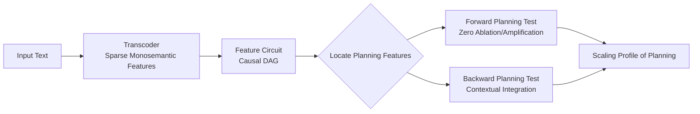

# Latent Planning Emerges with Scale

**Conference**: ICLR 2026  
**OpenReview**: [https://openreview.net/forum?id=H0B7pDTT0M](https://openreview.net/forum?id=H0B7pDTT0M)  
**Code**: [https://github.com/hannamw/model-planning-public](https://github.com/hannamw/model-planning-public)  
**Area**: Interpretability / Mechanistic Interpretability  
**Keywords**: Latent planning, feature circuits, Transcoder, Qwen-3, scaling effects, AI safety  

## TL;DR
The authors provide a **causally verifiable** definition of "LLM latent planning" (forward planning + backward planning) and conduct experiments on the Qwen-3 (0.6B–14B) family using transcoder feature circuits. They find that planning capability emerges with model scale: simple grammatical consistency tasks (a/an) only succeed stably at 14B, while in rhyme couplet tasks, models exhibit forward planning but almost no backward planning.

## Background & Motivation
**Background**: LLMs can write coherent stories and generate correct code, tasks that seemingly require "planning"—reasoning about steps to achieve a goal—without the model explicitly stating the plan. If such "latent planning" exists, it poses AI safety risks: models might "calculate secretly" without alerting external monitoring.

**Limitations of Prior Work**: Previous evidence for latent planning has been largely **observational**. Researchers used probes or Patchscopes to decode "future tokens/text attributes" from model activations, equating "decodability" with "planning." However, probes are known to decode information the model does not actually use—a model outputting fixed tokens or sequences like 0, 2, 4, 6 can have its future tokens predicted by probes, yet this clearly does not require planning.

**Key Challenge**: **Decodability $\neq$ Causal Usage**. To prove planning, causal evidence must be provided rather than mere correlation. Previously, only Lindsey et al. (2025) provided causal evidence on closed-source models, while mechanistic evidence on open-source models remains extremely limited.

**Goal**: (1) Establish a rigorous, causally testable definition of latent planning; (2) Quantify how planning capability changes with scale on a controlled open-source model family and identify the underlying mechanisms.

**Core Idea**: **[Definition as Contribution]** Planning is decomposed into two causal conditions that must hold simultaneously: *forward planning* (an internal representation causally leads the model to output a target token $t$ at a future position) and *backward planning* (the representation also causally leads the model to generate a context that "connects" to $t$). **[Mechanistic Evidence]** These conditions are mapped onto intervenable and observable specific features using transcoder feature circuits. Scanning across five sizes of Qwen-3 provides a mechanistic profile of "planning emerging with scale."

## Method

### Overall Architecture
The method consists of three steps: first, use **transcoders** to decompose dense polysemantic MLP activations into sparse monosemantic features; then, construct **feature circuits** for individual inputs—weighted directed acyclic graphs characterizing the causal direct effects between inputs, features, and logits; finally, in three types of tasks (simple syntax consistency, rhyme couplets, and controlled prose steering), locate "planning features" using the circuits and perform ablation/amplification interventions to verify if they satisfy the forward and backward planning conditions.

### Key Designs

**1. Redefining "planning" as two causal conditions: moving from decodability to intervenability.** The authors argue against equating "future tokens decodable by probes" with planning. Instead, they require that an internal representation for a target token or concept simultaneously satisfies: Condition 1 (Forward Planning)—it *causally leads* the model to output a specific token $t$ at position $n+k, k>1$, which is stronger than being "predictable"; Condition 2 (Backward Planning)—it *causally leads* the model to produce a context that accommodates $t$. A key example is "The capital of Texas is Austin": the model might have an Austin representation at "Texas," and ablating it might stop the output of "Austin" (satisfying forward planning). However, this only counts as backward planning if the Austin representation also causes the model to output "is"—since "is" can be predicted without knowing "Austin," this is not true backward planning. This definition tightens "planning" from a loose correlational label to a mechanistic claim that must be confirmed via intervention.

**2. Mapping abstract conditions to intervenable nodes using transcoder feature circuits.** A Transcoder is an auxiliary model replacing the MLP: it takes MLP activations $h \in \mathbb{R}^d$, computes sparse representations $z=f(W_{\text{enc}}h+b_{\text{enc}})$, and reconstructs the MLP output $\tilde{h}'=W_{\text{dec}}z+b_{\text{dec}}$. It is trained for sparsity and monosemanticity, facilitating the mapping of concepts like "the model is thinking about accountant" to specific features. Feature circuits constructed on top are weighted DAGs where edge weights are the **exact direct effects** of source nodes on target nodes (calculable given attention patterns and LayerNorm denominators). Thus, "which feature causally boosts the correct token" becomes a readable, intervenable subgraph—In Figure 1, the *accounting* feature of Qwen-3 14B boosts the *accountant* feature, which in turn boosts the article *an*, making the entire chain explicit. This step serves as the bridge for executing the causal definition.

**3. Designing simple grammatical consistency tasks as a minimal controlled testbed for planning.** The authors construct three task types (a/an, is/are, el/la), where each input forces the model to output a specific content word preceded by a functional word that must "agree" with it. The form of the functional word is determined by the subsequent content word—e.g., "Someone who handles financial records is __ accountant" must be *an* because *accountant* starts with a vowel. These tasks are chosen for their prevalence in pre-training and because they compress "whether to plan" into a binary functional word prediction, allowing causal intervention effects (ablation decreasing $p(\text{correct})$, amplification increasing it) to be cleanly measured. It is the minimal carrier for validating the two conditions and the starting point for observing scaling emergence.

**4. Bidirectional intervention + direct effect isolation to separate "true planning" from "shortcuts."** To confirm that planning features truly drive predictions, the authors perform two types of interventions: **zero ablation** of planning features in successful samples (which should degrade performance) and **5x amplification** in failed samples (which should improve performance). Results show these interventions primarily affect the minority class *an* (where the model must work against priors), as expected. However, this is insufficient—an *accountant* feature might simply have high cosine similarity with the *an* unembedding, boosting the logit via direct effect without real planning. To counter this, the authors perform **direct effect intervention**: amplifying the planning feature while freezing others to block second-order effects. The effect significantly weakens (amplification hurts as often as it helps), indicating that the planning feature's role cannot be explained by direct effects alone and must act through intermediary features like "say a/an"—proving the existence of a true forward+backward planning chain rather than a vocabulary shortcut.

## Key Experimental Results

### Main Results: Planning Emerges with Scale

| Task | Phenomenon | Emergence Scale |
|------|------------|-----------------|
| a/an (Grammar) | All models achieve >0.8 recall for majority class *a*; >0.8 recall for minority *an* is only reached by Qwen-3 14B; mid-size models show smooth improvement; 0.6–1.7B always predict majority. | Prototype at ~4B–8B, stable success at 14B |
| Rhyme couplets | Large model perfect rhyme accuracy 50%+, 14B ~60%; loosening to assonance (vowels only), 8B >70%, 14B reaches 0.8. | Rhyming ability increases with scale |
| Controlled prose (say X) | Steering the *say X* feature often makes the model output X; within coherent outputs containing X, larger models rewrite context into full phrases like "in the night". | Backward planning weakly appears at 8B–14B |

### Ablation Study / Interventions

| Intervention | Effect on a/an Task | Conclusion |
|--------------|---------------------|------------|
| Zero ablation of planning features | Damages performance, but almost exclusively for the minority class *an*. | Planning features are critical for "anti-prior" samples. |
| 5x amplification of planning features | Significantly improves *an* accuracy, slightly more in larger models; almost no effect on *a*. | Causally relevant, and 4B/8B use similar mechanisms to 14B. |
| Direct effect only intervention | Effect significantly weakens; amplification sometimes counterproductive. | Planning cannot be explained by direct effects; requires "say a/an" intermediaries. |
| Rhyme feature steering (first line x-3, new rhyme x7) | 8B–14B models change output to the new rhyme (forward planning holds, accuracy ~40%, same magnitude as 60% baseline). | Forward planning holds with scale. |
| Rhyme backward planning test | Model accuracy in predicting the new rhyme is nearly identical given "steered context" vs. "original context." | Steered context does not better "accommodate" the new rhyme → **Backward planning is largely missing.** |

### Key Findings
- **Forward planning develops faster than backward planning**: At 4B–8B, planning-related features exist for simple tasks (even if overall performance is poor). In rhyme tasks, large models can forward-plan to change the rhyme, but almost never rewrite previous context to accommodate it.
- **Planning is "modularly emergent" rather than a unified mechanism**: Whether planning occurs depends on model capacity $\times$ task complexity $\times$ task frequency/importance in training, leading to scattered capabilities rather than a single unified planning engine.
- **Root cause of mid-size model failure**: 4B/8B activate far fewer planning features during *an* failures than successes; small models almost never activate them; 14B activates large numbers of planning features in both success and failure cases.

## Highlights & Insights
- **Methodological Correction**: Explicitly states that "probe decodability $\neq$ model planning," anchoring planning to two conditions verifiable only through causal intervention, setting a stricter evidentiary bar for future research.
- **Largest Scale Feature Circuit Study on Open Models**: Systematically runs feature circuits on five Qwen-3 sizes, quantifying how mechanisms grow with scale for the first time in an open-source family.
- **Granular Portrait of "Emergence"**: Instead of a vague claim that "large models can plan," it distinguishes between forward/backward and simple/long-range planning, noting different developmental speeds and modular assembly.

## Limitations & Future Work
- **Negative evidence for backward planning**: Backward planning was largely unobserved in rhyme tasks; whether long-range planning mechanisms truly exist or are just stronger forward planning remains unsettled.
- **Tasks are relatively simple and common**: Syntax consistency tasks were intentionally selected for their high frequency in pre-training; generalizability to complex, low-frequency tasks (multi-step code, long-form narrative structure) is unclear.
- **Local planning features are rare and sensitive**: *say X* style local planning features appear only in a minority of couplets, and their effects are sensitive to steering hyperparameters.
- **Dependence on Transcoder quality and circuit assumptions**: Conclusions rely on Transcoder monosemanticity and the assumption of exact direct effects in circuits; the reliability of mechanistic interpretations is bounded by these tools.

## Related Work & Insights
- Extends the causal planning evidence found by **Lindsey et al. (2025)** in Claude Haiku rhyme couplets to the open Qwen-3 family; differentiates from observational works like Pal et al. (2023), Pochinkov (2025), and Dong et al. (2025).
- Technical stack built on transcoders (Dunefsky et al., 2024) and feature circuits (Marks et al., 2025; Ameisen et al., 2025), using the `circuit-tracer` library for discovery and intervention.
- Echoes concurrent work: Nainani et al. (2025) on code planning circuits in Gemma-2 and Maar et al. (2025) on cross-model poetry via probes, while advancing further in "causal evidence + scaling scan."
- **Insight**: Regarding AI safety monitoring, the finding that "models exhibit forward planning but weak backward planning" suggests current models struggle with complex "covert plotting" that requires rewriting context to hide intent, but this capability may emerge with scale, warranting proactive mechanistic monitoring.

## Rating
- **Novelty**: ⭐⭐⭐⭐⭐ — Redefines implicit planning from "decodability" to "causally intervenable forward + backward conditions" and performs the first scaling scan on an open model family; high conceptual value.
- **Experimental Thoroughness**: ⭐⭐⭐⭐ — Three task types + bidirectional intervention + direct effect isolation + five sizes; solid chain of evidence. Backward planning results are negative but reported honestly.
- **Writing Quality**: ⭐⭐⭐⭐⭐ — Clear definitions, powerful counter-examples (Austin/Texas), intuitive diagrams, and rigorous logical progression.
- **Value**: ⭐⭐⭐⭐ — Establishes stricter standards for planning research and provides mechanistic scaling trends for AI safety.

<!-- RELATED:START -->

## Related Papers

- [\[ICML 2026\] Where's the Plan? Locating Latent Planning in Language Models with Lightweight Mechanistic Interventions](../../ICML2026/interpretability/wheres_the_plan_locating_latent_planning_in_language_models_with_lightweight_mec.md)
- [\[ICLR 2026\] Latent Thinking Optimization: Your Latent Reasoning Language Model Secretly Encodes Reward Signals in Its Latent Thoughts](latent_thinking_optimization_your_latent_reasoning_language_model_secretly_encod.md)
- [\[ICLR 2026\] Emergent Discrete Controller Modules for Symbolic Planning in Transformers](emergent_discrete_controller_modules_for_symbolic_planning_in_transformers.md)
- [\[ICLR 2026\] Internal Planning in Language Models: Characterizing Horizon and Branch Awareness](internal_planning_in_language_models_characterizing_horizon_and_branch_awareness.md)
- [\[ICLR 2026\] Path Channels and Plan Extension Kernels: A Mechanistic Description of Planning in a Sokoban RNN](path_channels_and_plan_extension_kernels_a_mechanistic_description_of_planning_i.md)

<!-- RELATED:END -->
