# Latent Thinking Optimization: Your Latent Reasoning Language Model Secretly Encodes Reward Signals in Its Latent Thoughts

**Conference**: ICLR 2026  
**OpenReview**: [https://openreview.net/forum?id=2jkAk3EP0v](https://openreview.net/forum?id=2jkAk3EP0v)  
**Code**: To be confirmed  
**Area**: Interpretability / Latent Reasoning / Test-time Optimization  
**Keywords**: latent reasoning, Huginn-3.5B, reward model, test-time scaling, interpretability, process reward  

## TL;DR
This paper systematically dissects the "latent thinking" process of the latent reasoning language model Huginn-3.5B. It discovers that correct and incorrect latent thinking trajectories are highly separable in the latent space. Consequently, the authors train a lightweight classifier as a "Latent Reward Model (LRM)" and propose Latent Thinking Optimization (LTO)—a probabilistic algorithm using acceptance-rejection sampling to select high-reward trajectories in the latent space, directly bringing reward modeling and test-time scaling into the latent domain.

## Background & Motivation
**Background**: Mainstream reasoning LLMs rely on generating natural language chain-of-thought (CoT) to "think," where each step can be inspected and scored by a Process Reward Model (PRM). However, a new class of latent reasoning architectures has recently emerged. Huginn-3.5B represents intermediate reasoning steps as a sequence of latent states ($h_{1:T}$), using a recurrent block to iteratively evolve an initial Gaussian noise $h_0$ into $h_T$ (default $T=32$ steps), from which a lightweight decoder generates the answer. This approach is efficient, avoids verbose verbatim reasoning, and is naturally suited for abstract logic that is difficult to verbalize.

**Limitations of Prior Work**: Latent thinking is a double-edged sword—it is hidden within uninterpretable latent states, **making it neither human-readable nor supervisable**. In natural language CoT, every step can be reviewed and scored by a PRM, whereas latent thinking trajectories consist entirely of internal hidden states, leaving no entry point for intervention. Worse, these models are trained unsupervised, with no signals indicating what constitutes "good" latent thinking, leading to a fundamental question: has the model actually learned to reason in latent space, or is it merely memorizing answers within its parameters?

**Key Challenge**: The efficiency advantage of latent reasoning vs. its complete loss of interpretability and supervisability. Performing reward modeling or error correction for latent thoughts seems impossible, as all error correction/verification methods designed for natural language reasoning are inapplicable to the latent space.

**Goal**: To understand how Huginn-3.5B actually "thinks" in the latent space and whether external supervisory signals can improve its latent thinking process.

**Core Idea**: **Latent thinking itself secretly encodes correctness signals**. The authors find that correct vs. incorrect latent trajectories exhibit significantly different patterns in terms of structure, information content, and geometry. Therefore, a lightweight classifier can reliably predict answer correctness directly from latent thoughts—this classifier serves as the **Latent Reward Model (LRM)**. The improvement of latent thinking is then formalized as a reward optimization problem in latent space, using probabilistic sampling instead of parameter updates to approach the optimal latent policy.

## Method

### Overall Architecture
The method consists of two main parts: first, a **"dissection"**—using visualization, representation quality metrics, and probing classifiers to prove that latent thoughts are separable and their correctness is predictable; second, an **"optimization"**—treating the classifier as an LRM and proposing LTO with a KL-regularized policy optimization objective. LTO uses acceptance-rejection sampling to sample trajectories that approximate the optimal distribution without explicitly computing policy probabilities. The entire pipeline keeps the base model parameters frozen, filtering a batch of candidate trajectories only at test time.

```mermaid
flowchart TD
    A[Question x] --> B[Huginn Reference Policy πref<br/>Sample N Latent Trajectories z]
    B --> C[LRM r&#40;x,z&#41;<br/>Latent Classifier Scoring]
    C --> D[Acceptance-Rejection Sampling<br/>ϕ=exp&#40;&#40;r-rmax&#41;/β&#41;]
    D --> E[Collect M High-Reward Trajectories C]
    E --> F[Decode to Generate Answer y]
    G[Training Set Sample Trajectories + Correctness Labels] -.Training.-> C
```

### Key Designs

**1. Three layers of evidence proving "latent thoughts secretly encode correctness": from visualization to separability.** This is the foundation of the paper. First, the authors use PCA to project latent trajectories into 3D visualizations, observing that correct trajectories are **compact and converge toward a consistent solution path**, while incorrect trajectories **diverge and lack stable patterns**. Dynamically, different thinking stages vary: early steps show sharp jumps (exploration/backtracking), middle steps are smooth (iterative refinement), and final steps converge (reaching a conclusion). Second, four representation quality metrics quantify this: correct trajectories have **higher entropy and lower effective rank** (richer information, less noise, echoing the "language modeling as compression" view), and **higher anisotropy and intrinsic dimensionality** (more complex geometric structure and expressivity), while incorrect trajectories collapse into flatter, disordered structures. Finally, a sequence classifier is trained as a probe to predict correctness from the first $t$ steps of the trajectory $h_{1:t}$: ROC-AUC approaches 1.0 on SVAMP and ~0.8 on MBPP, with performance rising steadily before plateauing as thinking steps increase—proving the correctness signal is encoded in the evolution dynamics of the entire trajectory, not just a single step.

**2. Formalizing latent thinking improvement as a KL-regularized reward optimization problem.** Let the binary variable $O$ denote whether trajectory $z$ is correct. The goal is to find the optimal latent policy $\pi^*(z|x)=\arg\max_{\pi} \mathbb{E}_{z\sim\pi}\,p(O=1|x,z)$. Since the classifier from the first part predicts $p(O=1|x,z)$, it is reused as the latent reward model $r(x,z)$. To prevent the optimized policy from collapsing into a degenerate solution far from the original, a KL penalty with weight $\beta$ is added, changing the objective to $\pi^*(z|x)=\arg\max_{\pi}\,\mathbb{E}_{z\sim\pi}[r(x,z)]-\beta D_{\mathrm{KL}}(\pi(z|x)\,\|\,\pi_{\mathrm{ref}}(z|x))$. The authors argue for the necessity of KL: if $\beta\to0$, LTO degrades to best-of-N sampling in latent space—this only works if the LRM is nearly perfect. Since real LRMs have errors, LTO without regularization would **exploit LRM loopholes** by selecting suboptimal trajectories, while the KL penalty constrains the policy, maintains sampling diversity, and mitigates overfitting to reward noise.

**3. Closed-form solution + Acceptance-rejection sampling for parameter-free optimization.** Optimizing the latent policy directly is difficult. The authors approximate $\pi(z|x)$ using $N$ sampled trajectories $\{z_i\}$ and prove a closed-form solution (Theorem 1): $\pi_r(z_i|x)=\dfrac{\pi_{\mathrm{ref}}(z_i|x)\exp(\frac{1}{\beta}r(x,z_i))}{\sum_j \pi_{\mathrm{ref}}(z_j|x)\exp(\frac{1}{\beta}r(x,z_j))}$. However, direct sampling from $\pi_r$ is still challenging as it requires precise estimation of each $\pi_{\mathrm{ref}}(z_i|x)$. Thus, Algorithm 1 is designed using acceptance-rejection sampling: sample $N$ candidates from the reference policy, record the maximum reward $r_{\max}$, and for each candidate, decide to accept or reject with probability $\phi_i=\exp((r(z_i,x)-r_{\max})/\beta)$ until $M$ are collected. Theorem 2 guarantees that the accepted samples follow $\pi_r(z|x)$, the closed-form optimal distribution—the entire process requires no explicit policy probability calculation and no parameter updates.

**4. Generalizing from Huginn to standard LLMs and universal reward modeling.** A key observation is that although standard LLMs (OLMo / Llama / Mistral) do not explicitly perform latent thinking, their intermediate hidden representations across layers can be interpreted as a "latent chain-of-thought." Thus, LRM and LTO can be applied directly—training an LRM on the hidden representations of standard LLMs similarly classifies correctness. Furthermore, natural language PRMs are often restricted to narrow domains like math due to their dependence on domain-specific formats. In contrast, latent thoughts share a unified representation format, making them **naturally easier to transfer across domains**. The authors verify this cross-domain transferability by using an LRM trained on one dataset to optimize another, and even training a "Universal LRM" on mixed data. Theoretically (Appendix F.3), they prove that improving LRM accuracy directly translates to higher expected accuracy—improving thinking only requires scaling or refining the LRM, rather than expensive fine-tuning of the base model.

## Key Experimental Results

The datasets cover three domains: Mathematics (GSM8K / SVAMP / GSM-Symbolic), Commonsense Reasoning (CommonsenseQA), and Code Generation (MBPP).

### Main Results: Comparison of Correction Methods on Huginn-3.5B (Accuracy)

| Method | GSM8K | GSM-Symbolic | SVAMP | CommonsenseQA | MBPP |
|---|---|---|---|---|---|
| Base Model | 0.326 | 0.265 | 0.517 | 0.500 | 0.278 |
| Majority Voting | 0.333 | 0.269 | 0.511 | 0.504 | 0.288 |
| Self-Correction w. Confidence | 0.342 | 0.281 | 0.524 | 0.507 | 0.288 |
| Self-Correction w. Verbal Eval | 0.262 | 0.193 | 0.518 | 0.505 | 0.226 |
| Latent Correction w. CoE-R | 0.330 | 0.259 | 0.510 | 0.504 | 0.276 |
| Latent Correction w. CoE-C | 0.324 | 0.256 | 0.516 | 0.507 | 0.280 |
| Weighted Majority Voting w. LRM | 0.375* | 0.301* | 0.537* | 0.509 | 0.295* |
| **Ours (LTO w. LRM)** | **0.385*** | **0.305*** | **0.538*** | **0.517*** | **0.299*** |

LTO consistently outperforms the base model and strongest baselines across all datasets. Correction methods designed for natural language reasoning (especially Verbal Evaluation) often degrade performance, proving they are ill-suited for the latent space.

### Ablation Study / Extension: LTO Applied to General LLMs (Selected)

| Model | Method | GSM8K | SVAMP | CommonsenseQA | MBPP |
|---|---|---|---|---|---|
| OLMo-7B | Base | 0.124 | 0.297 | 0.464 | 0.244 |
| OLMo-7B | **Ours (LTO)** | **0.252*** | **0.552*** | **0.602*** | **0.308*** |
| Llama-2-13B | Base | 0.306 | 0.521 | 0.398 | 0.247 |
| Llama-2-13B | **Ours (LTO)** | **0.534*** | **0.791*** | **0.650*** | **0.322*** |
| Mistral-7B | Base | 0.368 | 0.548 | 0.671 | 0.315 |
| Mistral-7B | **Ours (LTO)** | **0.565*** | **0.771*** | **0.708*** | **0.388*** |

Even with a small sampling budget of $N=20$, LTO provides relative gains of up to **103%** for general LLMs.

### Key Findings
- **LRM is exceptionally good at detecting incorrect latent thoughts**: Standard majority voting yields almost no gain, but using LRM rewards as weights for weighted majority voting results in significant improvements, indicating LRM provides reliable correctness estimates.
- **Cross-domain transferability**: LRMs trained on CommonsenseQA still improve performance on math tasks (GSM8K/SVAMP); even with large cross-domain gaps, they remain effective. The Universal LRM performs on par with domain-specific LRMs, pointing toward the possibility of a general reward model in latent space.
- **Early prediction for efficiency**: Just a few initial steps of latent thinking are sufficient to distinguish correctness with high ROC-AUC, suggesting that early stopping can save computation.

## Highlights & Insights
- **Novel and consistent perspective**: Applying "language modeling as compression" to latent thinking analysis—where correct thinking equals high entropy (information richness) + low effective rank (denoising)—provides a quantifiable and interpretable characterization of "good thinking."
- **Moving reward modeling to latent space**: Traditional PRMs are trapped by domain-specific text formats. This paper proves that because latent spaces have unified representations, they are naturally easier to transfer across domains—an interesting inverse argument to current test-time scaling paradigms.
- **Zero parameter updates + theoretical guarantees**: LTO relies purely on sample filtering, backed by Theorem 1 and 2 to ensure sampling from the closed-form optimal distribution. Improvements in LRM accuracy translate directly into correctness gains, making it light on engineering.
- **Solid KL necessity analysis**: The analysis of $\beta\to0$ degrading to latent best-of-N clearly explains "why regularization is needed," preventing reward hacking.

## Limitations & Future Work
- **Absolute accuracy remains low**: The base Huginn-3.5B is relatively weak (0.326 on GSM8K). While the LTO improvement to 0.385 is significant, it is far from practical, with gains being more meaningful in a relative sense than an absolute one.
- **Dependency on sampling diversity**: LTO is fundamentally a filter for candidates from the original policy. If the original policy fails to sample any correct trajectories, even the best LRM cannot help—it corrects rather than creates.
- **Incomplete cross-domain transfer**: The authors acknowledge they have not yet achieved complete transfer across all tasks; the Universal LRM is currently just "potential."
- **Strong assumption on general LLMs**: Interpreting multi-layer hidden states as a latent CoT is borrowed from other works; its physical meaning is not strictly equivalent to Huginn's explicit latent reasoning, making the theoretical foundation slightly loose here.
- Future work: Building truly universal latent-space reward models, combining LTO with training-time optimization, and scaling to more powerful latent reasoning architectures.

## Related Work & Insights
- **Latent Reasoning Architectures**: Huginn-3.5B (Geiping et al., 2025) is the object of dissection and starting point, representing attempts to move reasoning from token space to latent space.
- **Process Reward Models (PRM)**: The LRM in this paper can be viewed as a latent-space version of a PRM, inheriting concepts from Wang et al. (2024) and Lu et al. (2024), but removing the dependency on natural language step annotations.
- **KL-regularized Policy Optimization**: The objective function is related to DPO/RLHF (Rafailov et al. 2023, Ziegler et al. 2019), migrating the KL-regularization paradigm to latent-space policies.
- **Acceptance-Rejection Sampling**: Algorithm 1 draws from classical sampling theory (Flury 1990, Grover et al. 2018), cleverly bypassing the need for explicit policy probability estimation.
- **Insights**: Interpretability research need not stop at "understanding." Once understood, one can construct supervisory signals to optimize—the "dissection $\to$ modeling $\to$ optimization" loop is equally applicable to other black-box modules like intermediate steps in diffusion or MoE routing.

## Rating
- **Novelty**: ⭐⭐⭐⭐⭐ Completely moves reward modeling and test-time scaling to the latent space, backed by three layers of evidence (visualization + metrics + probes) and theoretical guarantees. The perspective is original and self-consistent.
- **Experimental Thoroughness**: ⭐⭐⭐⭐ Covers 3 domains, 5 datasets, and 4 general LLMs with cross-domain transfer and multiple baseline comparisons; however, absolute accuracy is low and verification on larger-scale latent models is missing.
- **Writing Quality**: ⭐⭐⭐⭐ Logical progression from research questions to method derivation. The necessity of KL and the sampling theorems are explained clearly; notation is standard.
- **Value**: ⭐⭐⭐⭐ Provides a supervisable and optimizable path for uninterpretable latent reasoning, offering strong inspiration for the emerging field of latent reasoning.

<!-- RELATED:START -->

## Related Papers

- [\[ICLR 2026\] Latent Concept Disentanglement in Transformer-based Language Models](latent_concept_disentanglement_in_transformer-based_language_models.md)
- [\[ICLR 2026\] Latent Planning Emerges with Scale](latent_planning_emerges_with_scale.md)
- [\[ICLR 2026\] Your VAR Model is Secretly an Efficient and Explainable Generative Classifier](your_var_model_is_secretly_an_efficient_and_explainable_generative_classifier.md)
- [\[ICLR 2026\] Hedonic Neurons: A Mechanistic Mapping of Latent Coalitions in Transformer MLPs](hedonic_neurons_a_mechanistic_mapping_of_latent_coalitions_in_transformer_mlps.md)
- [\[ICLR 2026\] The Shape of Adversarial Influence: Characterizing LLM Latent Spaces with Persistent Homology](the_shape_of_adversarial_influence_characterizing_llm_latent_spaces_with_persist.md)

<!-- RELATED:END -->
