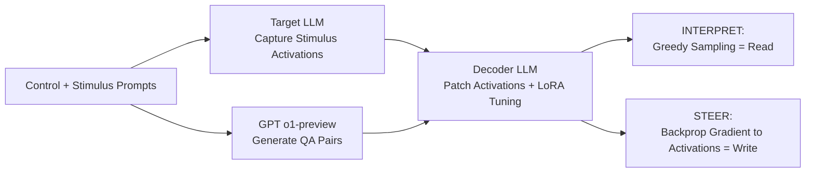

# LatentQA: Teaching LLMs to Decode Activations Into Natural Language

**Conference**: ICLR 2026  
**Code**: https://latentqa.github.io  
**Area**: Interpretability / Representation Probing  
**Keywords**: LatentQA, Activation Decoding, Representation Probing, Model Steering, Interpretability, instruction tuning  

## TL;DR
This paper reframes "understanding model activations" as an open-ended question-answering task, LatentQA. Given an activation and a natural language question, a fine-tuned decoder LLM answers directly in natural language. This enables both "reading" activations (monitoring) and "writing" to activations (steering) using gradients backpropagated from natural language-described losses.

## Background & Motivation
**Background**: Top-down transparency primarily relies on two types of tools—probes for reading activations and steering vectors for writing to activations. Monitoring probes typically output only a scalar (e.g., the strength of a concept) or a single token (e.g., logit lens), while steering methods depend on in-context examples or task-specific data.

**Limitations of Prior Work**: Scalar or single-token outputs severely limit the range of expressible behaviors—one can only detect pre-defined concepts and cannot answer open-ended questions like "What bias does the model hold against the user in this activation?" Methods like SelfIE and Patchscopes, which directly patch activations into an LLM copy to leverage its decoding capability, are often fragile and generalize poorly due to the distribution shift between activation and embedding spaces.

**Key Challenge**: There is a need for LLM-level linguistic expressivity to describe complex behaviors, combined with a decoder robust to real activation distributions. Training-free patching methods offer expressivity but lacks robustness, while linear probes are robust but lack expressivity.

**Goal**: To train a decoder capable of reliably performing LatentQA, outperforming strong probing baselines on interpretation tasks with known answers, and achieving precision sufficient to steer the target model toward behaviors never seen during training.

**Core Idea**: **[Activation interpretation as instruction tuning]** Inspired by how Visual Instruction Tuning uses GPT to convert image-text pairs into VisualQA datasets, this paper constructs an (activation, QA pair) dataset and uses Latent Interpretation Tuning (LIT) to fine-tune a decoder LLM. This teaches the model to translate activations into natural language, eliminating distribution shifts while preserving linguistic priors.

## Method

### Overall Architecture
The method consists of two steps: First, a strong LLM (o1-preview) is used to synthesize the LatentQA dataset—feeding "control prompts + stimulus prompts" to the target model, capturing activations from the stimulus portion, and having GPT describe the qualitative attributes of the dialogue to generate QA pairs. Second, a decoder (a copy of the target model) is fine-tuned using LIT via activation patching and cross-entropy training on the QA pairs. The trained decoder supports two purposes: "reading" (INTERPRET) via greedy sampling of the answer, and "writing" (STEER) by computing the gradient of the QA pair log-probability with respect to the activation.

### Key Designs

**1. Creating interpretable qualitative behavior with control prompts:** Capturing activations from arbitrary prompts is often ineffective—prompts like "What color is the sky" only trigger the model's default style, with no qualitative attributes worth describing. This paper prepends a **control prompt** (e.g., "Pretend you are a pirate") to each stimulus prompt to make the target model generate completions with distinct qualitative behaviors. GPT then describes the dialogue as QA pairs (e.g., "Q: How will the assistant speak? A: Like a pirate"). The resulting triplets are (prompt = control + stimulus, completion, QA), with activations captured from the prompt or stimulus. Data is generated by o1-preview in three stages (creating control examples, expanding to dialogues, writing QA), distinguishing between descriptive QA (predicting the control itself) and inductive QA (predicting the latent effects of the control), totaling 16,732 items.

**2. Activation masking to prevent shortcuts:** If the decoder sees activations for both control and stimulus tokens, it might cheat by "reading" the control token embeddings in the residual stream rather than truly understanding the activation semantics. To prevent this, the paper occasionally **masks the control activations and provides only stimulus activations**. While this seemingly makes the task impossible, stimulus token activations retain control information through the attention mechanism, forcing the decoder to infer rather than copy.

**3. Coverage via three types of data augmentation:** To ensure the system handles diverse inputs, the training mix includes: control (decoding attributes explicitly specified in the prompt), stimulus (predicting attributes from activations), and stimulus + completion (activations containing both prompt and completion). The first two contain only prompt activations, while the last contains paired activations, together covering all LatentQA tasks evaluated.

**4. LIT training and dual-use of Read/Write:** Given a triplet, the activation from layer $k$ (set to $k=15$ for rich semantics) of the target LLM is patched into layer $\ell$ (set to $\ell=0$ for maximum processing steps) of the decoder. The decoder is trained to maximize the answer log-probability $\log p(\text{answer} \mid [\text{Act}] + \text{question})$. For reading, $\text{INTERPRET}([\text{Act}], q)$ is defined as greedy sampling from $[\text{Act}]+q$. For steering, $\text{STEER}([\text{Act}], c)$ is defined as the gradient of the log-probability of the control QA pair with respect to $[\text{Act}]$. This gradient is iteratively used to update activations toward the target described in natural language—in practice, the gradient is backpropagated to the target model weights.

## Key Experimental Results

### Main Results (Relational Information Extraction, Llama-3-8B-Instruct, Mean Accuracy % over top 15 layers)

| Method | Country_Curr | Food_Country | Ath_Position | Ath_Sport | Prod_Company | Star_Const |
|------|------|------|------|------|------|------|
| Linear Probe | 17.7 | 5.1 | 75.9 | 53.8 | 58.9 | 17.5 |
| Patchscope | 24.3 | 36.2 | 51.0 | 28.9 | 28.0 | 24.6 |
| **LIT (ours)** | **86.9** | **68.9** | 65.2 | **90.4** | **71.5** | **39.2** |

LIT outperforms linear probes by 32.2% and Patchscope by 38.2% on average (relational queries were not in the training set, indicating the decoder generalizes using linguistic priors). In the task of revealing hidden system prompts using only user message activations, LIT outperformed GPT-4 (which had access to both user and assistant messages) by 18.7% (hard) / 2.7% (easy), and outperformed SelfIE by 76–77%.

### Ablation Study (CrowS Pairs Debiasing, Lower Log-Likelihood Difference is Better)

| Method | Mean ΔLLD | Stereotype % |
|------|------|------|
| No control | 4.05 | 64.3 |
| Prompting | 3.95 | 67.9 |
| RepE | 4.38 | 61.5 |
| SFT | 4.61 | 64.5 |
| DPO | 3.82 | 61.7 |
| **LIT (ours)** | **3.70** | **60.9** |

LIT is the only method to significantly reduce bias across both metrics. RepE actually increased ΔLLD (overshooting the parity point); the authors hypothesize that concepts like bias are non-linearly represented, which linear steering cannot handle.

### Key Findings
- **Generalization to Unseen Behavior**: Using only natural language losses, LIT can steer models into specialized personas (e.g., "Golden Gate Claude") or elicit harmful knowledge from safety-aligned models, despite these behaviors being absent from training.
- **Scalability**: LIT improves consistently with data and model scale, supporting the direction of "using LLMs to understand LLMs scalably."
- **Sample Efficiency**: In difficult persona inference tasks, LIT is more sample-efficient than direct prompting of GPT-4.

## Highlights & Insights
- **Unified Read/Write**: The same decoder performs "reading" via forward sampling and "writing" via gradient computation. Both capabilities originate from a single training objective, ensuring elegance and self-consistency.
- **Paradigm Shift**: Porting the "GPT data synthesis + instruction tuning" recipe from Visual Instruction Tuning to activation interpretation demonstrates that activation decoding is essentially an open-ended generation task solvable by instruction tuning.
- **Eliminating Distribution Shift via Training**: Compared to training-free Patchscope/SelfIE, the "heavy" choice of training a decoder provides robustness, as evidenced by LIT's 76%+ lead over SelfIE in persona tasks.
- **Insight into Masking**: The control activation masking trick reveals how information permeates into stimulus tokens via attention and forces the decoder toward true semantic understanding rather than simple shortcutting.

## Limitations & Future Work
- **Dependency on Strong LLMs**: The dataset is synthesized by o1-preview; thus, data quality and coverage are limited by the generator model, which may introduce its own biases.
- **Focus on Qualitative Attributes**: Currently, the model focuses on predicting the qualitative attributes of future completions. Decoding capabilities for precise facts or numerical data have not been fully verified.
- **Weight Modification for Control**: STEER actually backpropagates to the target model weights, effectively performing a fine-tuning step rather than pure activation editing. Deployment costs and reversibility require consideration.
- **Future Work**: Training LatentQA systems on more diverse data, such as hierarchical instruction following, could enable new applications like evaluating whether models follow user instructions or improving long-context instruction following.

## Related Work & Insights
- **Decoding Representations**: Linear probes, SAE, logit lens, and single-neuron explanations (Bills et al.) can only output predefined concepts or limited tokens. SelfIE and Patchscopes patch activations directly but are fragile. LIT resolves these limitations through training.
- **Behavioral Control**: Unlike SFT/RLHF which lack fine-grained internal control, or RepE/ActAdd which are restricted to linear steering, LatentQA achieves non-linear, describable control using natural language losses.
- **Inspiration**: Treating "internal model states" as a modality queryable by natural language is a promising path for scalable self-understanding of LLMs. Any "scalar/single-token" probe task is worth re-evaluating as a potential open-ended QA task.

## Rating
- Novelty: ⭐⭐⭐⭐⭐ Reframing activation interpretation as open-ended QA + instruction tuning is a clean and imaginative paradigm shift.
- Experimental Thoroughness: ⭐⭐⭐⭐ Covers multiple scenarios in reading (system prompts, relation extraction) and control (debiasing, unseen personas) with scaling verification; quantitative control experiments are slightly limited.
- Writing Quality: ⭐⭐⭐⭐⭐ Clear motivations for design decisions, elegant narrative on unified read/write, and intuitive illustrations.
- Value: ⭐⭐⭐⭐⭐ Provides a powerful, robust, and unified tool for monitoring, auditing, and safety steering with significant potential for extension.

<!-- RELATED:START -->

## Related Papers

- [\[ICLR 2026\] REAL: Reading Out Transformer Activations for Precise Localization in Language Model Steering](real_reading_out_transformer_activations_for_precise_localization_in_language_mo.md)
- [\[ICLR 2026\] Fresh in Memory: Training-order Recency is Linearly Encoded in Language Model Activations](fresh_in_memory_training-order_recency_is_linearly_encoded_in_language_model_act.md)
- [\[ICLR 2026\] Negative Pre-activations Differentiate Syntax](negative_pre-activations_differentiate_syntax.md)
- [\[ICLR 2026\] Sparling: End-to-End Spatial Concept Learning via Extremely Sparse Activations](sparling_end-to-end_spatial_concept_learning_via_extremely_sparse_activations.md)
- [\[ACL 2026\] Similarity-Distance-Magnitude Activations](../../ACL2026/interpretability/similarity-distance-magnitude_activations.md)

<!-- RELATED:END -->
