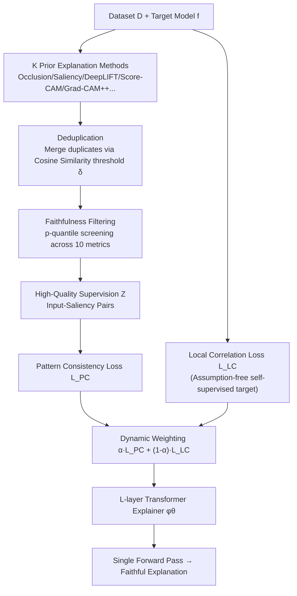

# Learning for Highly Faithful Explainability

**Conference**: ICLR 2026  
**OpenReview**: [https://openreview.net/forum?id=bLgkkEGgBy](https://openreview.net/forum?id=bLgkkEGgBy)  
**Code**: Open sourced (Paper GitHub Repository)  
**Area**: Explainable AI / Faithful Explanations  
**Keywords**: Learning to Explain, Amortized Explainer, Faithfulness, Self-supervised, Dynamic Joint Optimization  

## TL;DR
This paper proposes DeepFaith: a self-supervised objective derived from ten faithfulness metrics that makes no assumptions about the target model or task. It aggregates multiple prior explanation methods into high-quality supervision signals through "deduplication + faithfulness filtering" and employs dynamic weighting for joint optimization. This trains an amortized explainer capable of generating more faithful explanations than all prior methods in a single forward pass.

## Background & Motivation
**Background**: A rising paradigm in Explainable AI is Learning to Explain (also known as amortized explanation)—training a neural network as an "explainer" that generates explanations for a target model during a single inference pass. This shifts the computational burden of repeated interactions with the target model to the training phase, significantly reducing inference costs. There are two primary approaches: self-supervised optimization (interacting directly with the target model to minimize a quality loss) and prior-explanation-driven (training the explainer to fit the "input $\to$ explanation" mapping from existing XAI algorithms).

**Limitations of Prior Work**: The authors identify three critical challenges. First, self-supervised objectives are almost exclusively built on idealized assumptions about the target model or task—VerT assumes features are strictly divided into signal and noise, L2X assumes clearly separable features, and CXPlain assumes input features capture all predictors. In reality, deep models encode high-order interactions and unobservable confounders, limiting generalization. Second, it is difficult for prior-driven methods to guarantee supervision quality; the performance is capped by the quality of the XAI labels being imitated. Third, neither route succeeds in isolation: self-supervised objectives struggle to converge on high-dimensional/complex models, while fitting prior explanations cannot transcend the quality of the labels.

**Key Challenge**: Amortized explainers seek both the high ceiling of self-supervised potential (transcending priors) and the stable baseline of prior supervision (steady convergence). however, these objectives often have different local/global optima and conflicting gradient directions, leading to mutual interference during simple joint optimization.

**Goal**: Introduce "faithfulness"—a quantifiable XAI metric—into the Learning to Explain framework to systematically resolve the three challenges, enabling amortized explainers to produce more faithful explanations than all prior methods even for complex, high-dimensional models.

**Key Insight**: **Faithfulness serves as both a theoretical yardstick and an engineering filter.** On one hand, ten faithfulness metrics are formally unified to prove the existence of an optimal explanation mapping across all of them, leading to an assumption-free self-supervised objective. On the other hand, faithfulness scores are used to filter prior explanations, securing high-quality supervision signals. Finally, a dynamic weighting strategy smoothly transitions between "fitting supervision for fast convergence" and "approaching the theoretical optimal mapping for quality enhancement."

## Method

### Overall Architecture
DeepFaith instantiates the explainer as an $L$-layer Transformer Encoder $\phi_\theta: \mathcal{X} \to [0,1]^n$, which encodes image patches, text tokens, or tabular rows to output $n$-dimensional saliency explanations. Training is driven by two losses: the theoretical Local Correlation loss $\mathcal{L}_{LC}$ (self-supervised, corresponding to the derived optimal faithfulness goal) and the empirical Pattern Consistency loss $\mathcal{L}_{PC}$ (fitting filtered high-quality supervision). The supervision signals are generated via an independent offline pipeline: $K$ off-the-shelf explanation methods generate saliency maps for each sample, which are then cleaned through deduplication and faithfulness filtering. A dynamic weight $\alpha$ joins the losses, switching dominance based on training dynamics.

### Key Designs
**1. Unified Faithfulness Formalization and Optimal Mapping: Proving the mathematical essence of ten metrics.** The authors distinguish between saliency explanations $S_f: \mathcal{X} \to [0,1]^n$ (importance scores) and permutation explanations $\Pi_f: \mathcal{X} \to S_n$ (importance rankings), which are interconvertible via $P(s)=\text{argsort}_\downarrow\{s\}$ and $\Sigma(\pi)_i=(n-\pi(i)+1)/n$. By breaking down ten metrics (FC, FE, INF, MC for saliency; DEL, INS, NEG, POS, RP, IROF for permutation) into shared components—input perturbation $x\setminus I$, perturbation effect $\Delta$, and correlation $\tau$—Proposition 1 proves that a saliency mapping $S_f^*=\arg\max_{S_f}\tau\big[(\sum_{j\in I_i}S_f(x)_j)_{i=1}^N, (\Delta[f(x),f(x\setminus I_i)])_{i=1}^N\big]$ is simultaneously optimal for FC/FE/INF/MC. Theorem 1 further proves its induced permutation mapping $\Pi_f^*=P[S_f^*]$ is optimal for the other six metrics. Thus, these diverse metrics share a single optimal objective.

**2. Local Correlation Loss: Turning the theoretical optimum into an optimizable self-supervised loss.** Since $S_f^*$ is intractable, DeepFaith uses Monte Carlo approximation. For a dataset $D$, $\mathcal{L}_{LC}(\phi_\theta;D,f)=\tfrac{1}{2}-\tfrac{1}{2|D|}\sum_{x\in D}\tau\big[(\sum_{i\in I_j}\phi_\theta(x)_i)_{j=1}^k, (\Delta[f(x),f(x\setminus I_j)])_{j=1}^k\big]$, where perturbation indices $I_j\sim P([n])$ are randomly sampled. Crucially, this loss stems solely from the definition of faithfulness without assuming anything about the model—addressing Challenge 1.

**3. High-Faithfulness Supervision Generation: Purifying prior explanations.** To address Challenge 2, $K$ prior saliency explanations are generated for each sample $x^{(i)}$ and undergo two steps. Deduplication: Highly similar explanations (by cosine similarity $\delta$) are grouped, keeping only the first from each to maintain diversity and avoid bias. Filtering: Each remaining explanation is scored against all ten faithfulness metrics. For each metric, a $p$-quantile threshold is calculated across the $K_{dedup}^{(i)}$ candidates. Only explanations satisfying $\forall j, r_j\ge\bar r_j$ (or $\le$) are kept, forming the supervision set $Z$. The explainer then minimizes $\mathcal{L}_{PC}(\phi_\theta;Z)=\tfrac{1}{|Z|}\sum_{(x,s)\in Z}(1-\tau[\phi_\theta(x),s])$.

**4. Dynamic Joint Optimization: Variance-monitored transition.** Because the optima of the two losses conflict, the total objective is $\mathcal{L}_{OBJ}=\alpha\mathcal{L}_{PC}+(1-\alpha)\mathcal{L}_{LC}$ with a dynamic $\alpha$. Initially $\alpha=1$ to let the explainer gain basic capability through fitting. The variance $\sigma^2_{PC}$ of $\mathcal{L}_{PC}$ is monitored over $e$ iterations; if it drops below $\epsilon$, $\alpha$ decays via $\alpha\leftarrow 1-\tfrac{1}{1+\exp(-(t-t_0)/C)}$, allowing $\mathcal{L}_{LC}$ to refine quality. If $\sigma^2_{PC}$ exceeds $C\epsilon$, $\alpha$ resets to 1 to restore stability. This addresses the convergence issues of self-supervision (Challenge 3).

## Key Experimental Results
The study covers 12 tasks across Image (ImageNet, OCT; explaining ResNet50/EfficientNet/DeiT), Text (IMDb, AGNews; explaining LSTM/Transformer), and Tabular (NAP, WCD; explaining MLP). Supervision comes from 14 methods in Captum. Hardware: 8×A6000.

### Main Results: 12 Tasks vs. Prior Methods (Mean Rank, lower is better)

| Method | OCT+DeiT | ImageNet+DeiT | IMDb+LSTM | AGNews+Trans | NAP+MLP | WCD+MLP |
|------|----------|---------------|-----------|--------------|---------|---------|
| **DeepFaith (Ours)** | **3.4** | **4.4** | **2.3** | **2.7** | **1.8** | **1.8** |
| Integrated Grads | 7.8 | 6.4 | 3.3 | 5.9 | 2.8 | 5.2 |
| DeepLIFT | 5.8 | 7.0 | 6.1 | 5.9 | 4.4 | 2.3 |
| Saliency | 13.2 | 10.7 | 5.2 | 5.8 | 2.8 | 4.9 |

DeepFaith achieves the best average rank across all tasks and metrics, proving the explainer can transcend its prior training signals.

### Comparison with other Learning to Explain methods (Mean Rank on test set)

| Task | Explainer | FC↑ | INS↑ | DEL↓ | NEG↑ | IROF↑ | Mean Rank |
|------|-----------|-----|------|------|------|-------|-----------|
| NAP+MLP | **DeepFaith** | **0.788** | 0.844 | **0.031** | 0.770 | **0.844** | **1.3** |
| | VerT | 0.772 | 0.564 | 0.467 | 0.518 | 0.603 | 2.8 |
| | FastSHAP | 0.071 | 0.849 | 0.714 | 0.837 | 0.126 | 3.7 |
| ImageNet+DeiT | **DeepFaith** | **0.026** | **0.568** | **0.127** | **0.417** | **0.672** | **1.6** |
| | VerT | 0.005 | 0.363 | 0.323 | 0.365 | 0.588 | 2.7 |
| | L2X | 0.004 | 0.486 | 0.526 | 0.520 | 0.385 | 3.9 |

DeepFaith outperforms VerT, L2X, CXPlain, and FastSHAP in average ranking across all tasks.

### Ablation Study (OCT+DeiT)

| Configuration | FC↑ | INS↑ | DEL↓ | NEG↑ | IROF↑ |
|------|-----|------|------|------|-------|
| $\mathcal{L}_{OBJ}$ (Full Loss) | **0.217** | **0.944** | **0.356** | **0.917** | **0.638** |
| $\mathcal{L}_{PC}$ only | 0.032 | 0.913 | 0.463 | 0.904 | 0.534 |
| $\mathcal{L}_{LC}$ only | 0.101 | 0.763 | 0.830 | 0.809 | 0.162 |
| $\mathcal{L}^d_{OBJ}$ (Dedup only) | 0.097 | 0.923 | 0.447 | 0.906 | 0.552 |

### Key Findings
- The full $\mathcal{L}_{OBJ}$ is optimal; $\mathcal{L}_{LC}$ alone fails to converge, confirming the necessity of dynamic joint optimization.
- Both deduplication and filtering are essential; removing faithfulness filtering results in a significant performance drop.
- Training curves show $\mathcal{L}_{PC}$ provides a stable foundation while $\mathcal{L}_{LC}$ drives quality refinement without the oscillations seen in isolated optimization.

## Highlights & Insights
- **Unified Optimal Mapping**: The realization that ten disparate faithfulness metrics share a mathematical core is a major insight. This provides a theoretical basis for self-supervision and explains why one explainer can dominate across all metrics.
- **Dual Role of Faithfulness**: Using faithfulness as both a loss function and a data filter creates a coherent pipeline that addresses theoretical and practical bottlenecks.
- **Variance-Based Dynamic Weighting**: Using $\mathcal{L}_{PC}$ variance as a signal to manage conflicting gradients makes the transition from supervised to self-supervised learning robust and self-correcting.

## Limitations & Future Work
- Generating supervision requires running $K$ (up to 14) prior XAI methods and 10 metrics per sample, incurring significant offline preprocessing costs for large datasets.
- The method introduces several hyperparameters ($\delta, p, \epsilon, C, e$), and while sensitivity studies were performed, cross-task tuning remains a burden.
- The gap between the theoretical $S_f^*$ and the Monte Carlo approximation, as well as the choice of correlation measure $\tau$, warrants further investigation.

## Related Work & Insights
DeepFaith builds upon the Learning to Explain line (FastSHAP, VerT, L2X, CXPlain) but differentiates itself by making the explainer generation "amortized" (single forward pass) while ensuring high faithfulness. The "metrics as objectives" paradigm—formalizing a suite of evaluations into a unified training target—is a transferable framework for other fields like generative LLM alignment or retrieval systems.

## Rating
- **Novelty**: ⭐⭐⭐⭐⭐ First to unify faithfulness as a training yardstick for amortized explainers with a proven optimal mapping.
- **Experimental Thoroughness**: ⭐⭐⭐⭐ Solid multi-modal coverage and comparisons; missing a systematic evaluation of inference overhead and large-scale model scaling.
- **Writing Quality**: ⭐⭐⭐⭐ Clear structure; the mathematical notation is dense but consistent.
- **Value**: ⭐⭐⭐⭐ Offers a high-fidelity, low-cost explanation training paradigm applicable to real-world XAI deployments.

<!-- RELATED:START -->

## Related Papers

- [\[ICLR 2026\] Toward Faithful Retrieval-Augmented Generation with Sparse Autoencoders](toward_faithful_retrieval-augmented_generation_with_sparse_autoencoders.md)
- [\[ICLR 2026\] Bridging Explainability and Embeddings: BEE Aware of Spuriousness](bridging_explainability_and_embeddings_bee_aware_of_spuriousness.md)
- [\[ACL 2026\] Interpreto: An Explainability Library for Transformers](../../ACL2026/interpretability/interpreto_an_explainability_library_for_transformers.md)
- [\[ICLR 2026\] Temporal Geometry of Deep Networks: Hyperbolic Representations of Training Dynamics for Intrinsic Explainability](temporal_geometry_of_deep_networks_hyperbolic_representations_of_training_dynami.md)
- [\[ICLR 2026\] Towards Cognitively-Faithful Decision-Making Models to Improve AI Alignment](towards_cognitively-faithful_decision-making_models_to_improve_ai_alignment.md)

<!-- RELATED:END -->
