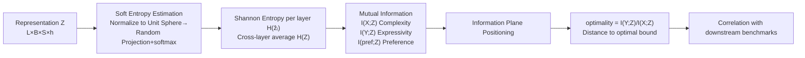

# Learning is Forgetting: LLM Training As Lossy Compression

**Conference**: ICLR 2026  
**OpenReview**: [https://openreview.net/forum?id=tvDlQj0GZB](https://openreview.net/forum?id=tvDlQj0GZB)  
**Code**: TBD (Paper promises open source)  
**Area**: Interpretability / Representation Learning Theory  
**Keywords**: Information Bottleneck, Rate Distortion Theory, Representation Compression, Pre-training Dynamics, Interpretability  

## TL;DR
LLM pre-training is interpreted as "lossy compression." By using Rate Distortion Theory and the Information Bottleneck (IB) principle, the study characterizes how models first expand and then compress representations during training. It demonstrates that "how close a model compresses to the theoretical optimum" and "what information remains after compression" directly predict downstream benchmark performance.

## Background & Motivation
**Background**: Knowledge of how LLM representation spaces are organized remains limited. Existing interpretability work generally falls into two categories: behavioral/probing methods (treating the model as a psycholinguistic subject or training linear classifiers to detect specific information in latent representations) and mechanistic interpretability (e.g., using Sparse Auto-Encoders to identify monosemantic neurons or specific circuits). These methods either distance themselves from the representation itself by focusing on downstream behavior or focus on "local parts" like individual circuits.

**Limitations of Prior Work**: While interpretability methods can be applied to large models, they are often disconnected from existing theories of learning and generalization. Conversely, deep learning theories (Information Bottleneck, Rate Distortion) have primarily been validated in toy settings like MNIST or small feed-forward networks; their scalability to complex sequence tasks like Transformers with trillions of tokens has remained an open question. Shwartz-Ziv & Tishby confirmed IB's "two-phase" prediction on MNIST, but subsequent work questioned its universality, suggesting the compression phase might be an artifact of non-linear activations and not necessarily a prerequisite for generalization.

**Key Challenge**: Distributed systems like neural networks observe the principle that "the whole is not equal to the sum of its parts." Focusing on individual circuits fails to explain why models perform so strongly across diverse tasks. However, providing an explanatory framework at the whole-model scale that is both theoretically grounded and produces actionable insights has not been achieved previously.

**Goal**: To "operationalize" Rate Distortion Theory at the LLM scale to answer three questions: Do LLMs optimally compress representations? What information survives after compression? What representational structures drive performance?

**Core Idea**: **[Training as Compression]** The essence of learning is "forgetting"—the model retains only the target-relevant information from the training data and discards the rest to save space, analogous to how MP3 discards frequencies inaudible to the human ear or JPEG discards imperceptible chromatic aberrations. **[Whole-Model Perspective]** Instead of explaining individual components, the framework uses information theory to quantify the entire model's position on the information plane, directly linking "representation structure" to "model behavior."

## Method

### Overall Architecture
The method consists of three steps: first, a **soft entropy estimator** capable of running at LLM scale quantifies high-dimensional representations and estimates the Shannon entropy of each layer; second, this is used to calculate the **mutual information** between representation $Z$ and input features $X$, output $Y$, and preference labels, placing the model on the information plane (Complexity $I(X;Z)$ on the x-axis, Expressivity $I(Y;Z)$ on the y-axis); finally, a scalar **optimality** metric measures how close the model is to the "optimal compression bound" and correlates this with downstream performance.

### Key Designs
**1. Soft Entropy Estimator: Making the information plane computable at LLM scale.** To calculate mutual information using Shannon entropy (rather than differential entropy), traditional methods discretize continuous representation $Z$ into $n$ bins. This binning approach is computationally infeasible for LLMs. This paper adopts the differentiable soft quantization from Conklin (2025): each representation vector is normalized to a unit sphere $\bar Z = Z/\|Z\|$, then $n$ random directions $\{w_i\}$ are uniformly sampled from the sphere. The cosine similarity between each vector and these directions is calculated and passed through a softmax (controlled by temperature $\epsilon$) to obtain a probability vector $\check Z_{l,b,s,:}=\mathrm{softmax}(\bar Z_{l,b,s,:}W/\epsilon)$. Averaging across batch and sequence dimensions yields a distribution $\hat z_l$ of length $n$ for each layer, allowing the direct calculation of Shannon entropy $H(\hat z_l)=-\sum_j \hat z_{l,j}\log\hat z_{l,j}$. This estimates the probability that a layer's representation falls within a certain angle relative to the origin. This is normalized into "efficiency" by dividing by $\log n$, compressing the entropy into a $0–1$ range to facilitate cross-dimensional comparison. While not the creator of this estimator, the authors are the **first to apply it to LLM analysis via a Rate Distortion lens**.

**2. n-gram back-off: Decomposing context compression.** LLM inputs are previous tokens and outputs are subsequent tokens. Calculating $P(Z\mid X)$ requires maintaining conditional estimates for every possible context window, which is combinatorially impossible as many contexts appear only once. Borrowing from Katz back-off in language modeling, the paper approximates $P(Z\mid X)$ using limited-width contexts: from tokens, bigrams, and trigrams up to quad-grams (beyond which $n$-grams become too sparse and $I(X;Z)$ begins to converge). Since teacher forcing allows the model to receive gradients from the entire subsequent sequence $Y$, the back-off weights for the input side $P(Z\mid X)$ and output side $P(Z\mid Y)$ are synchronized. Calculating conditional mutual information across different back-off levels quantifies the proportion of information in the model encoding various levels of local context.

**3. Optimality scalar: A cross-model metric for compression efficiency.** 
$$\text{Optimality} = \frac{\text{Expressivity}}{\text{Complexity}} = \frac{I(Y;Z)}{I(X;Z)}$$
This value approaches $1.0$ as the representation system nears the IB bound, regardless of its position $\beta$ on that bound—essentially representing "how many bits of expressivity are gained for every bit of complexity." This compresses the proximity to the optimal bound into a relative value independent of specific models or hyperparameters, allowing dozens of models from different families to be compared on the same scale.

**4. Preference information probes: Quantifying alignment information post-compression.** Beyond input/output labels, the study uses preference data (a prompt with "preferred" and "rejected" completions) as a conditional label $X$ to calculate $I(Z;\text{preferred})$. This quantifies how well the model representation distinguishes human preferences, providing a computable proxy for what information survives compression and serving as a strong predictor of downstream performance.

## Key Experimental Results
The analysis uses the OLMo2 family (1B/7B/32B, focusing on 7B) for training dynamics and a cross-comparison of dozens of open-source models at their final states. Entropy and mutual information are based on 10,000 samples from C4 (10,000 from Tulu for preference) with a maximum context of 512.

### Main Results: Representation Structure vs. Downstream Performance (47 models, 6 benchmarks)
Benchmarks: MMLU Pro / BBH / Math LVL5 / IFEval / GPQA / MuSR (token back-off)

| Representation Metric | Correlation with Performance | Significance |
|---|---|---|
| Complexity $I(X;Z)$ alone | $r=-0.38$ (Lower is better) | $p=0.006$ ✓ |
| Expressivity $I(Y;Z)$ alone | $r=0.08$ | $p=0.575$ ✗ |
| **Optimality** $I(Y;Z)/I(X;Z)$ | $r=0.52$ | $p<0.001$ ✓ |
| **Preference Info** $I(Z;\text{pref})$ | $r=0.76$ | $p<0.001$ ✓ |

Key point: Expressivity alone does not predict performance, but **compression optimality and the amount of retained preference information are highly correlated**, indicating that both the optimality of compression and the content of what remains are critical.

### Training Dynamics and Scaling Effects

| Model | Completion of Expansion Phase | Meaningful Compression Achieved |
|---|---|---:|
| OLMo2 7B / 32B | Yes | Yes, tracking the IB bound |
| OLMo2 1B | Yes ($I(Y;Z)$ increases) | No, oscillates outside the bound |

- **Two-phase trajectory confirmed**: The 7B model first increases output mutual information $I(Y;Z)$ (fitting phase) and then, as next-token loss saturates, compresses input information $I(X;Z)$ to approach the optimal bound. This provides the first validation of IB theory predictions at the LLM scale.
- **Scale threshold**: The 1B model fails to compress efficiently, consistent with scaling laws—meaning a certain parameter threshold is required for optimal compression given data complexity.

## Key Findings
- **Universal Convergence**: Models from 6 different families with varied hyperparameters and training recipes all cluster near the **same point** on the optimal bound at the end of training. Compression is an inherent property of the model-data-objective triad, not an accident of specific trajectories.
- **Local Context Dominance**: Most encoded information pertains to local context (token to quadgram), reflecting the local nature of natural language information. 1B models encode more token-level information and less context.
- **Post-training Information Retention**: In the Llama family, post-training increases preference information with minimal changes to complexity, suggesting **pre-training handles "generalized compression" while post-training "edits what information is retained."**

## Highlights & Insights
- **Bridge between Theory and Practice**: Successfully operationalizes Rate Distortion and Information Bottleneck theories—previously limited to toy tasks—on trillion-token LLMs, addressing long-standing critiques of IB universality.
- **Holistic vs. Component View**: Counter to mechanistic interpretability's focus on individual neurons, this treats the model as a unified compression system, providing holistic metrics deployable at any scale.
- **Actionable Training Insights**: Optimality and preference info can serve as **early-stopping or checkpoint selection criteria** (stopping when proximity to the bound plateaus), which is significantly cheaper than running complete benchmark suites.

## Limitations & Future Work
- **Relative Entropy Estimation**: High-dimensional entropy estimation typically underestimates true entropy. The authors do not claim to find the absolute true entropy of latent distributions, and cross-dataset conclusions should be handled with care.
- **n-gram Limit**: Back-off is limited to quadgrams; finer-grained context within a 512-token window remains as "residual" information and cannot be precisely attributed.
- **Practical Implementation**: The use of these metrics for early-stopping or checkpoint selection remains a "potential use" based on correlations and requires further empirical validation.
- **Causality**: The link between optimality/preference information and performance is correlational (even with partial correlation controls); a causal mechanism is not definitively proven.

## Related Work & Insights
- **IB Theory of Deep Learning** (Tishby & Zaslavsky 2015): This work serves as its "final exam" at the LLM scale.
- **Mechanistic Interpretability**: Provides a complementary "top-down" view to the "bottom-up" approach of finding circuits.
- **Insight**: Pre-training can be viewed as the process of building an optimal compression engine, while alignment/post-training refines the filter for what data is deemed "valuable" to keep within that compressed state.

## Rating
- **Novelty**: ⭐⭐⭐⭐⭐ 
- **Experimental Thoroughness**: ⭐⭐⭐⭐ 
- **Writing Quality**: ⭐⭐⭐⭐⭐ 
- **Value**: ⭐⭐⭐⭐ 

<!-- RELATED:START -->

## Related Papers

- [\[ICLR 2026\] Learning to See Before Seeing: Demystifying LLM Visual Priors from Language Pre-training](learning_to_see_before_seeing_demystifying_llm_visual_priors_from_language_pre-t.md)
- [\[ICLR 2026\] Learning to Weight Parameters for Training Data Attribution](learning_to_weight_parameters_for_training_data_attribution.md)
- [\[ICLR 2026\] From Tokens to Thoughts: How LLMs and Humans Trade Compression for Meaning](from_tokens_to_thoughts_how_llms_and_humans_trade_compression_for_meaning.md)
- [\[ICLR 2026\] Why Low-Precision Transformer Training Fails: An Analysis on Flash Attention](why_low-precision_transformer_training_fails_an_analysis_on_flash_attention.md)
- [\[AAAI 2026\] LLM Circuit Analyses Are Consistent Across Training and Scale](../../AAAI2026/interpretability/llm_circuit_analyses_consistent_across_training_and_scale.md)

<!-- RELATED:END -->
