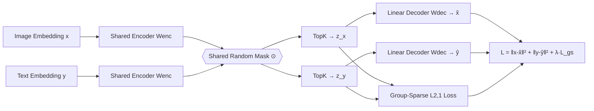

# Learning Multimodal Dictionary Decompositions with Group-Sparse Autoencoders

**Conference**: ICLR 2026  
**OpenReview**: [https://openreview.net/forum?id=ZJlVXZ5dmK](https://openreview.net/forum?id=ZJlVXZ5dmK)  
**Code**: To be confirmed  
**Area**: Interpretability / Multimodal Representations / Sparse Dictionary Learning  
**Keywords**: Sparse Autoencoders, Multimodal Alignment, Dictionary Learning, Group Sparsity, CLIP, CLAP, Conceptual Interpretability  

## TL;DR
Standard Sparse Autoencoders (SAEs) learned on aligned multimodal embeddings (like CLIP/CLAP) produce "split dictionaries"—where most concepts activate for only a single modality. This paper uses **cross-modal random masking + group-sparse regularization** to force paired samples to share a sparse support, learning truly multimodal concept dictionaries while reducing dead neurons and improving semanticity and cross-modal zero-shot performance.

## Background & Motivation

**Background**: The Linear Representation Hypothesis (LRH) suggests that neural network embeddings can be decomposed into an overcomplete sum of linear directions corresponding to high-level concepts. Based on this, Sparse Autoencoders (SAEs) have become a mainstream tool for interpretability, decomposing embeddings into sparse combinations of dictionary vectors that correspond to human-understandable semantic concepts for explanation, steering, and control.

**Limitations of Prior Work**: When applying SAEs to "aligned" multimodal embedding spaces such as CLIP or SigLIP, researchers consistently observe the **split dictionary** phenomenon—the majority of sparse features activate for only one modality (either image or text). Paired samples that are well-aligned in the embedding space (e.g., an image and its description) are mapped to sparse codes with **disjoint support sets** after passing through the SAE. This undermines cross-modal tasks (retrieval, generation, control): using a text concept to manipulate an image/audio output fails because they do not share the same conceptual neurons.

**Key Challenge**: There is a tension between monosemanticity (purity of concepts for interpretability) and modality alignment (sharing concepts across modalities). Ordinary SAEs, optimizing only reconstruction loss, possess an implicit bias that naturally leads to dictionary splitting.

**Goal**: To mitigate this trade-off and learn multimodal concept dictionaries shared across modalities without sacrificing semanticity.

**Core Idea**: (1) Theoretically prove that a split dictionary can always be transformed into a better-aligned non-split dictionary—demonstrating that splitting is a training bias rather than an inherent flaw of LRH; (2) Use **group-sparse loss + cross-modal masking** to alter the implicit bias of the SAE, forcing paired samples to share sparse supports.

## Method

### Overall Architecture
The method trains an SAE with **shared weights** on **paired multimodal samples** (e.g., image-text, music-text). Embeddings from both modalities first subtract learnable biases, pass through an encoder, and are then subjected to the **same random mask**. Subsequently, TopK sparsification and linear decoding for reconstruction are applied. The training loss includes the reconstruction loss for both modalities plus a **group-sparse regularization** ($L_{2,1}$ norm), the latter of which forces the two sparse codes to have the same support structure.

### Key Designs

**1. Multimodal Monosemanticity Score (MMS): A quantifiable metric for multimodal semantics.** To improve multimodal dictionaries, one must first measure "how semantic a concept is in a cross-modal sense." This paper generalizes the unimodal semantic score by Pach et al. to **any pair of modalities** $(m,n)$: for a specific neuron, activation values $a^{(m)}, a^{(n)}$ for all samples in the validation set are collected. A cosine similarity matrix $S$ is computed using **another independent encoder**, and the score is computed as a weighted sum using normalized co-activation weights $\tilde{A}_{ij}$: $\mathrm{MMS}(m,n)=\sum_{i,j}\tilde{A}_{ij}S_{ij}$. Intuition: If a neuron is activated by semantically similar inputs, it is more monosemantic. When $m \neq n$, this score directly characterizes the multimodality of the concept—a completely split dictionary has no cross-modal co-activation, resulting in an MMS of 0. A positive score indicates that semantically similar samples from different modalities indeed co-activate the neuron.

**2. Existence Theorem: Split dictionaries can always be refined to be more aligned.** The paper proves a first-principles result (Theorem 1): Given $n$ pairs of aligned unit vector embeddings $\{(x^{(i)},y^{(i)})\}$, if (a) the pairs are aligned such that $\langle x^{(i)},y^{(i)}\rangle>c>0$, and (b) there exists a $K$-sparse split dictionary $W$ that decomposes all embeddings, then there **must exist** a new dictionary $\tilde{W}$ of size $p+n$ that can decompose all $2n$ embeddings with $(K{+}1)$-sparse codes, such that the **inner product of sparse codes for all pairs is strictly positive** (i.e., cross-modal alignment is strictly improved). This implies that modality splitting is an **implicit bias** of standard SAE training rather than a fundamental limitation.

**3. Group-Sparse Loss: Binding paired samples into "concept groups" via L2,1 norm.** Inspired by group LASSO and multi-task learning, the paper applies an $L_{2,1}$ norm penalty to paired sparse codes $z$ and $w$: $L_{gs}(z,w)=\left\|\begin{smallmatrix}z^\top\\ w^\top\end{smallmatrix}\right\|_{2,1}=\sum_{i=1}^{p}\sqrt{z_i^2+w_i^2}$. This convex loss encourages the coordinates of $z$ and $w$ to be **jointly sparse**—they are either zero together or active together, thus sharing support. The total loss is $L=\|x-\hat{x}\|_2^2+\|y-\hat{y}\|_2^2+\lambda L_{gs}(z_x,z_y)$, where weights are shared across modalities, except for modality-specific initial biases $b_0, b_1$.

**4. Cross-modal Random Mask: Solving dead neurons + enforcing multimodality.** Group sparsity alone may not prevent TopK from selecting different top coordinates for the two modalities. This paper applies the **same** random mask with probability $p$ to both modalities before the TopK operation, forcing TopK to select from the same subset of coordinates. This has two effects: first, it forces both modalities to share activations in the unmasked dimensions; second, rotating the masked dimensions allows more neurons to be activated, significantly reducing **dead neurons**. The combination of group sparsity (GSAE) + masking (MGSAE) constitutes the full method.

## Key Experimental Results

Three variants are compared: **SAE** (Standard TopK SAE), **GSAE** (Group-sparse, no mask), and **MGSAE** (Full: mask + group-sparse). Models are trained on CLIP ViT-B/16 (CC3M image-text pairs) and LAION CLAP (JamendoMaxCaps music-text pairs). $K=32$, and dictionary size $p=16d$ ($d=512$).

### Main Results: Zero-shot Cross-modal Tasks

Image-Text (CLIP, Classification Accuracy):

| Model | CIFAR-10 | CIFAR-100 | ImageNet |
|---|---|---|---|
| SAE - TopK | 0.657 | 0.418 | 0.303 |
| BatchTopK SAE | 0.657 | 0.277 | 0.178 |
| Matryoshka SAE | 0.587 | 0.166 | 0.185 |
| **GSAE (Ours)** | 0.808 | 0.526 | 0.354 |
| **MGSAE (Ours)** | **0.842** | **0.554** | **0.373** |
| CLIP ViT-B/16 (Original Dense) | 0.916* | 0.687* | 0.686* |

Music-Text (CLAP, Accuracy / MRR for FMACaps):

| Model | GTZAN Genres | NSynth Instruments | FMACaps Retrieval |
|---|---|---|---|
| SAE - TopK | 0.376 | 0.265 | 0.023 |
| **GSAE (Ours)** | **0.705** | 0.303 | 0.050 |
| **MGSAE (Ours)** | 0.672 | **0.354** | **0.061** |
| LAION CLAP (Original Dense) | 0.710* | 0.339 | 0.075 |

### Ablation Study

| Design Component | Primary Gain |
|---|---|
| Reconstruction Only (Standard SAE) | Baseline, many dead neurons + split dictionary |
| + Group Sparsity (GSAE) | Major increase in cross-modal co-activation, MMS rises significantly |
| + Cross-modal Mask (MGSAE) | Highest multimodal activation, fewest dead neurons, further score improvement |

### Key Findings
- **GSAE/MGSAE improved image-text zero-shot performance by ~20% (CIFAR-10), ~15% (CIFAR-100), and ~7% (ImageNet)** compared to standard SAEs. Recent variants like BatchTopK and Matryoshka trailed significantly.
- **On music-text, sparse codes nearly matched or exceeded original dense CLAP** (e.g., MGSAE 0.354 vs. CLAP 0.339 on NSynth) while being 16x sparser and more semantic.
- GSAE and MGSAE **dramatically increased cross-modal co-activation and reduced dead neurons**, with a higher proportion of high-MMS neurons compared to standard SAE.
- Case studies (CelebA "blonde" linear probes) showed that MGSAE's top concepts are truly cross-modal and readable (e.g., "beautiful blonde / blond girl"), validating their utility for downstream explanation.

## Highlights & Insights
- **The theoretical proof regarding split dictionaries** is a highlight: by proving that a better-aligned dictionary always exists, the paper shifts the problem from "is the hypothesis flawed" to "how to correct the training bias."
- **Elegant combination of Group Sparsity + Masking**: Without complex cross-modal transformations or extra paired data for probes, the method purely modifies implicit bias via loss and masking. It is easily applicable to any SAE variant (ReLU, JumpReLU, BatchTopK).
- **First SAE semantic analysis on music-text joint space**, extending multimodal interpretability from image-text to audio.
- **MMS as a standalone contribution**: This single-neuron level metric, which does not require paired labels and is generalizable, provides a practical benchmark for multimodal SAEs.

## Limitations & Future Work
- The theory provides **existence** rather than a guarantee that SAE training will converge to such a dictionary; there remains a gap between induction and guarantee.
- Sparse codes still lag significantly behind original dense embeddings in image-text zero-shot tasks (ImageNet 0.373 vs. 0.686).
- Sensitivity to hyperparameters (mask probability $p$, regularization coefficient $\lambda$) and scalability to larger dictionaries or more modalities (>2) require further exploration.
- MMS depends on an "independent encoder" to calculate semantic similarity, making the metric sensitive to the quality of that reference encoder.

## Related Work & Insights
- **Dictionary Learning / Sparse Coding**: Concepts like MOD, K-SVD, and group sparsity ($L_{2,1}$) have long histories; the innovation here is defining "groups" via **cross-modal paired samples**.
- **SAE Interpretability**: Works by Cunningham and Gao on TopK SAE; the proposed method is orthogonal and can be superimposed on these variants.
- **Multimodal Embedding Decomposition**: Unlike post-hoc pairing or architectural changes (e.g., BridgeScore), this work corrects splitting bias from a first-principles perspective.
- **Insight**: Incorporating "prior structure" into the SAE loss (beyond just reconstruction) is a generalizable approach to modifying implicit bias for interpretability in other "paired/grouped" scenarios like temporal, hierarchical, or multi-view data.

## Rating
- **Novelty**: ⭐⭐⭐⭐ Group-sparse + masking is a simple but precise solution to split dictionaries; the existence theorem provides clean theoretical support.
- **Experimental Thoroughness**: ⭐⭐⭐⭐ Covers CLIP/CLAP, multiple baselines, and various evaluations (zero-shot, semanticity, case studies).
- **Writing Quality**: ⭐⭐⭐⭐ Clear motivation, logical flow from theorem to method, and intuitive figures.
- **Value**: ⭐⭐⭐⭐ Provides a plug-and-play training modification for multimodal interpretability and control.

<!-- RELATED:START -->

## Related Papers

- [\[ICLR 2026\] AbsTopK: Rethinking Sparse Autoencoders For Bidirectional Features](abstopk_rethinking_sparse_autoencoders_for_bidirectional_features.md)
- [\[ICLR 2026\] Toward Faithful Retrieval-Augmented Generation with Sparse Autoencoders](toward_faithful_retrieval-augmented_generation_with_sparse_autoencoders.md)
- [\[ICLR 2026\] On the Limits of Sparse Autoencoders: A Theoretical Framework and Reweighted Remedy](on_the_limits_of_sparse_autoencoders_a_theoretical_framework_and_reweighted_reme.md)
- [\[ICLR 2026\] Sparse Autoencoders Trained on the Same Data Learn Different Features](sparse_autoencoders_trained_on_the_same_data_learn_different_features.md)
- [\[ICML 2026\] Ensembling Sparse Autoencoders](../../ICML2026/interpretability/ensembling_sparse_autoencoders.md)

<!-- RELATED:END -->
