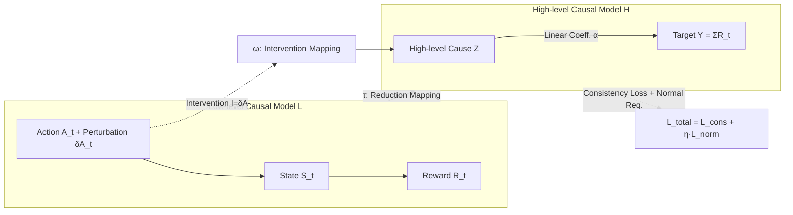

# Learning Nonlinear Causal Reductions to Explain Reinforcement Learning Policies

**Conference**: ICLR 2026  
**Code**: [https://github.com/akekic/targeted-causal-reduction.git](https://github.com/akekic/targeted-causal-reduction.git)  
**Area**: Interpretability / Causal Inference / Reinforcement Learning  
**Keywords**: Explainable RL, Policy-level explanation, Causal model reduction, Interventional consistency, Nonlinear TCR  

## TL;DR
The paper models the question "why an RL policy succeeds or fails" as a causal model reduction problem. By injecting random perturbations into actions as interventions, it learns a simplified causal model consisting of only two variables: "high-level cause $Z$ → high-level target $Y$." Using **Nonlinear Targeted Causal Reduction (nTCR)**, it distills state/action patterns that truly influence cumulative rewards, providing global, causal, and interpretable explanations of policy behavior.

## Background & Motivation
**Background**: As RL is deployed in high-stakes scenarios such as autonomous driving, recommendation systems, and robotics, understanding "what behavior a trained policy has actually learned" has become a critical requirement for safety and trust. In the taxonomy of XRL (Explainable RL), Milani et al. categorize methods into feature importance, learning process analysis, and **Policy-Level Explanation (PLE)**. PLE focuses on whether the overall behavior aligns with human expectations. When a policy trained in simulation is transferred to the real world, operators must first agree with its "overall strategy," which single-step explanations fail to provide.

**Limitations of Prior Work**: Policy-level explanations are extremely difficult to obtain. RL uses large-scale neural networks to map high-dimensional observations to sequential actions, making the impact of single-step actions on final outcomes indirect and counter-intuitive. Worse is the **credit assignment problem**: dynamic dependencies between states and actions create **spurious correlations** with outcomes, causing some features to be "predictive but not causative." Direct correlation analysis on trajectories is often misled by these spurious correlations.

**Key Challenge**: To explain global behavior, causality rather than correlation is required. However, most existing causal abstraction theories only provide formal conditions for "what constitutes a valid abstraction" and rarely address "how to **learn** this abstraction" from complex low-level systems. Prior work on Linear TCR provided a learnable objective function but restricted $\tau$ and $\omega$ mappings to be linear, failing to capture the nonlinear relationships prevalent in RL.

**Goal**: Extend TCR to the nonlinear case while maintaining interpretability and causal consistency, providing theoretical guarantees that the learned explanations reflect "true causal patterns" rather than overfitting products.

**Core Idea**: **[Causal Perspective]** Treat an entire RL trajectory (states, actions, rewards) as variables in a low-level causal model. **[Active Intervention]** Inject random perturbations $\delta A_t$ into actions during execution as shift interventions. **[Model Reduction]** Learn a mapping $\tau$ that compresses the low-level model into a two-variable model ("high-level cause $Z$ → target $Y$ (cumulative reward)"), ensuring its response under intervention is **approximately consistent** with the original system (interventional consistency). Finally, use interpretable $\tau$ and $\omega$ to answer "which state/action patterns at which moments most affect success or failure."

## Method

### Overall Architecture
nTCR formalizes "policy explanation" as Causal Model Reduction. The low level is the complete "action-environment-reward" causal chain, while the high level retains only the learned scalar cause $Z=\tau_1(X_{\pi(1)})$ and the predefined target $Y=\tau_0(X_{\pi(0)})=\sum_t R_t$. The training signal ensures that the two paths—"intervene at the low level then map to the high level" and "map to the high level then intervene"—result in approximately equal distributions (the approximate commutative diagram in Fig 1b), forcing the explanation of "what causes reward changes" to flow through the high-level cause $Z$.

### Key Designs

**1. Translating RL trajectories into intervenable causal reduction: Action perturbations as shift interventions.** An RL episode is naturally a causal chain: observation → action → environment change → new state and reward. To identify the "causal impact of an action on global performance," one must observe counterfactuals—"what would have happened if the action were different." nTCR adds a small random offset $\delta A_t \sim \mathcal{N}(0, \sigma_t)$ to each action $A_t$ selected by the policy before sending it to the environment, generating trajectories $(S_0, A_0+\delta A_0, R_1, \dots)$. These perturbations correspond exactly to shift interventions in an SCM (changing the structural equation $X_l := f_l(\cdot)$ to $X_l := f_l(\cdot) + i_l$), interpretable in physical simulations as "externally applied force or momentum." Low-level variables are partitioned into states/actions $X_{\pi(1)}$ and rewards $X_{\pi(0)}=R$. Interventions only act on actions $I_{\pi(1)}=(\delta A_0, \dots, \delta A_{T-1}, 0, \dots)$, and the target variable is cumulative reward $Y=\sum_{t=1}^T R_t$. This allows TCR to learn which states/actions most impact performance.

**2. Interventional Consistency + Normal Regularization: Making nonlinear reduction faithful and non-degenerate.** The consistency loss requires the high-level model's distribution under intervention to match the low-level push-forward distribution: $L_{\text{cons}}=\mathbb{E}_{i\sim P_I}\big[D(\hat P^{(i)}_\tau(Y,Z) \,\|\, P^{(\omega(i))}_H(Y,Z))\big]$, where $\hat P^{(i)}_\tau=\tau_\#[P_L^{(i)}]$. However, the Gaussian approximation divergence used in Linear TCR does not force full distribution alignment; once mappings become nonlinear, the high-level cause $Z$ might be learned as a highly non-Gaussian, uninterpretable shape. To address this, the authors add **Normal Regularization**: $\hat P^{(i)}_\tau(Z)$ is first standardized to zero mean and unit variance, then the deviation is measured using the 1-Wasserstein distance to a standard normal: $L_{\text{norm}}=\mathbb{E}_i\big[\int|F_{\hat P^{(i)}_{\tau,\text{std}}(Z)}(x)-\Phi(x)|\,dx\big]$. The total objective $L_{\text{total}}=L_{\text{cons}}+\eta_{\text{norm}}L_{\text{norm}}$ aims for interventional consistency while constraining the high-level cause to a simple unimodal Gaussian for easier interpretation; $\eta_{\text{norm}}$ controls the trade-off.

**3. Uniqueness and Existence Guarantees for Nonlinearity: Avoiding ambiguity in explanation.** Nonlinearity opens up the function space, risking overfitting and unidentifiability (multiple valid reductions), which would destroy interpretability. This paper provides two theorems: **Uniqueness** (Prop. 4.1)—if the low level is an additive noise SCM, the Fourier transform of the noise density is nowhere zero, and the high-level causal effect $\alpha \neq 0$, then any constructive transformation that is exact for all $i_{\pi(1)}$ is **unique** up to multiplicative and additive constants; **Existence** (Prop. 4.2)—a class of low-level models with joint Gaussian noise and a specific additive structure for $f_0$ is constructed where exact transformations can be explicitly written as $\bar\tau_1(X_{\pi(1)})=a^\top B(X_{\pi(1)}-f_1(X_{\pi(1)}))$ and $\bar\omega_1(i_{\pi(1)})=a^\top B\,i_{\pi(1)}$. While real simulations may not strictly satisfy these conditions (hence the use of approximate consistency goals), these results provide a theoretical foundation for "unique and verifiable explanations."

**4. Interpretable Nonlinear Function Class: Mapping weights back to "features and time" via Gaussian kernels.** Purely nonlinear mappings make it difficult to explain what the high-level cause represents. Leveraging the temporal structure of RL trajectories, the authors decompose states/actions by feature $\times$ timestep and write $\tau_1$ as a weighted sum of Gaussian kernel bases: $\tau_1(X)=\sum_{j=1}^d\sum_{t=1}^T w_{j,t} \cdot \exp\big(-(x-\mu_{j,t})^2/2\sigma^2_{j,t}\big)$, where $\{\mu_{j,t}, \sigma_{j,t}\}$ are fixed across typical value ranges, and only the weights $w_{j,t}$ are learned. This acts as a continuous one-hot encoding for "variable-value pairs." The primary benefit is **readability**: examining $w_{j,t}$ directly points to which feature at which moment significantly contributes to the high-level causal explanation. $\omega_1$ is defined similarly over the intervention space.

## Key Experimental Results

### Main Results (Three Scenarios)

| Scenario | Setting | Key Patterns Revealed by nTCR |
|---|---|---|
| Synthetic Causal Model | 10 low-level models sampled per Prop. 4.2, $\dim(X_0)=2, \dim(X_1)=9$ | Consistency loss converges near zero; $\tau/\omega$ identification loss converges to theoretical truth, verifying uniqueness theorems and implementation. |
| Pendulum Control | State (cosθ, sinθ, angular velocity), Action is torque | Policy A has a **directional bias**—clockwise swing-up rewards are significantly higher than counter-clockwise (despite environmental symmetry and uniform initial sampling); Policy B's $\omega$-map suggests more negative torque at the end to prevent instability. |
| Robot Table Tennis | 4-DoF pneumatic muscle arm returning balls; states include joints/ball pos; actions are muscle pressure changes | $\tau$-map for Joint 0 distinguishes "swing back then hit" (high reward) vs "premature forward swing" (low reward); identify balls near edges or net as harder. |

### Synthetic Experiments (Theoretical Validation)

| Metric | nTCR | Linear TCR |
|---|---|---|
| Training Consistency Loss | → Near zero | Converges but higher (limited linear expressivity) |
| $\tau$ Identification Loss (vs. Ground Truth) | → 0 | — |
| $\omega$ Identification Loss (vs. Ground Truth) | → 0 | — |

### Key Findings
- **Discovery of Human-Imperceptible Latent Biases**: The clockwise/counter-clockwise asymmetry in Pendulum Policy A (average rewards -30.38 vs -28.01), which shouldn't exist in a symmetric environment, is explicitly exposed by nTCR.
- **Independently Verifiable Explanations**: In the table tennis task, the $\tau$-map indicates that "outward/distant balls are harder to hit," which is consistent with the actual distribution of 400 missed balls (mostly top, left/outer sides).
- **$\omega$-map Provides Actionable Improvements**: The suggestion for Policy B to "apply more negative torque" at the end was confirmed by subsequent trajectory analysis as a way to avoid the pendulum toppling over.

## Highlights & Insights
- **Upgrading from "Correlation" to "Causation"**: Actively injecting action perturbations as interventions sidesteps spurious correlations created by state-action dynamic dependencies, which is the most common pitfall for policy-level explanations.
- **Coupling Theory with Interpretability**: The uniqueness/existence proofs are not just decorative; they directly serve the engineering requirement that "explanations should not be ambiguous" and are used as ground-truth verification tools in synthetic experiments.
- **Gaussian Kernel Bases as a Finisher**: Re-expressing unreadable nonlinear mappings as "feature $\times$ time" weight maps makes the explanation naturally visualizable and localizable to specific time windows.
- **Normal Regularization Fixes Linear TCR's Theoretical Gaps**: After opening the nonlinear space, distributions can degenerate. Using the 1-Wasserstein distance to standard normal pulls the high-level cause back to a unimodal shape, balancing faithfulness with readability.

## Limitations & Future Work
- **Reliance on Intervenable Simulators**: The method is built on the ability to inject shift interventions into actions and resample trajectories; it is primarily suited for physical simulations with continuous states/actions and is difficult to apply directly to discrete actions or real online systems where repeated intervention is impossible.
- **Single High-level Cause + Linear $Z \to Y$**: The high-level model is constrained to two variables with a linear-additive-Gaussian $Z \to Y$ relationship. Complex policies might involve multiple interacting high-level factors, and a single-cause explanation may lose information (multi-cause generalizations are left for the appendix).
- **Theoretical Conditions Hard to Meet in Reality**: Uniqueness/existence theorems rely on assumptions like additive noise and Fourier non-degeneracy, which may not hold in real simulations. In practice, one can only strive for "as consistent as possible" approximate solutions.
- **Kernel Basis and Perturbation Tuning**: Kernel width/number control the bias-variance trade-off, and parameters like perturbation variance $\sigma_t$ and regularization strength $\eta_{\text{norm}}$ are hyperparameters that affect the granularity and stability of the explanation.

## Related Work & Insights
- **XRL Taxonomy (Milani et al.)**: Categorized into feature importance, learning process analysis, and policy-level explanation. nTCR belongs to the PLE subcategory of "abstract state extraction," reducing state/action/reward spaces to high-level variables.
- **Causal XRL (Madumal et al.)**: Uses counterfactuals to generate contrastive explanations but requires a predefined causal graph and only explains single-step actions. nTCR does not require a predefined graph and explains global patterns across episodes.
- **Policy Perturbation Methods**: Some work uses perturbations to find "critical time points" for control. nTCR goes further—not just locating time points, but distilling representations of "which states/actions are beneficial or harmful."
- **Causal Abstraction Theory (Geiger et al., etc.) and Linear TCR**: The former often stops at formal conditions or focuses on LLMs with known high-level variables. This work is a nonlinear extension of Linear TCR, directly addressing how to learn abstractions from low-level systems.
- **Insight**: Reformulating "explanation" as "reduction learning with interventional consistency constraints" is a general paradigm. Any need for "high-dimensional system → readable high-level causation" (beyond RL) could potentially apply this combination of active intervention, interpretable function classes, and theoretical uniqueness.

## Rating
- **Novelty**: ⭐⭐⭐⭐⭐ Formalizing policy-level explanation as causal model reduction and providing nonlinear TCR uniqueness/existence theory is highly original.
- **Experimental Thoroughness**: ⭐⭐⭐⭐ Progresses through synthetic (theory verification), Pendulum, and realistic robot table tennis, with explanations confirmed by independent analysis. Lacks quantitative side-by-side comparisons with other XRL/PLE methods.
- **Writing Quality**: ⭐⭐⭐⭐ Figure 1 clarifies the pipeline well; theory is interspersed with intuition. Notation is dense, and some key details are relegated to the appendix.
- **Value**: ⭐⭐⭐⭐ Provides a "causal, global, and verifiable" explanation path for trustworthy RL deployment, particularly useful for robotics/control scenarios.

<!-- RELATED:START -->

## Related Papers

- [\[ICLR 2026\] ExPO-HM: Learning to Explain-then-Detect for Hateful Meme Detection](expo-hm_learning_to_explain-then-detect_for_hateful_meme_detection.md)
- [\[ICLR 2026\] GEPA: Reflective Prompt Evolution Can Outperform Reinforcement Learning](gepa_reflective_prompt_evolution_can_outperform_reinforcement_learning.md)
- [\[ICLR 2026\] NIMO: a Nonlinear Interpretable MOdel](nimo_a_nonlinear_interpretable_model.md)
- [\[ICLR 2026\] Reinforcement Learning Fine-Tuning Enhances Activation Intensity and Diversity in the Internal Circuitry of LLMs](reinforcement_learning_fine-tuning_enhances_activation_intensity_and_diversity_i.md)
- [\[ICML 2026\] MiniMax Learning of Interpretable Factored Stochastic Policies from Conjoint Data, with Uncertainty Quantification](../../ICML2026/interpretability/minimax_learning_of_interpretable_factored_stochastic_policies_from_conjoint_dat.md)

<!-- RELATED:END -->
