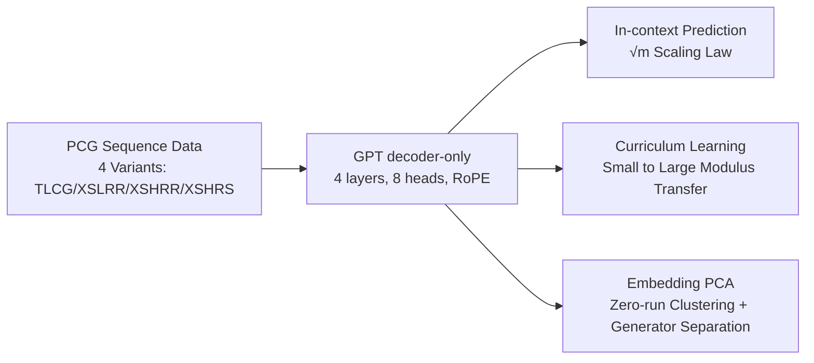

# Learning Pseudorandom Numbers with Transformers: Permuted Congruential Generators, Curricula, and Interpretability

**Conference**: ICLR 2026  
**OpenReview**: [https://openreview.net/forum?id=m5KplPzCzM](https://openreview.net/forum?id=m5KplPzCzM)  
**Code**: To be confirmed  
**Area**: Interpretability / Transformer Capabilities  
**Keywords**: Pseudorandom Number Generators, PCG, in-context learning, Curriculum Learning, Scaling Laws, Embedding Interpretability  

## TL;DR
Transformers can crack NumPy's default random number generator, PCG, purely via in-context sequence data (surpassing classical attack assumptions). The required context length scales with the modulus as $\sqrt{m}$. Training on large moduli necessitates curriculum learning, and the embedding layer spontaneously clusters integers based on a "rotation-invariant zero-run structure."

## Background & Motivation
**Background**: The in-context learning capability of Transformers raises questions about which hidden patterns they can learn. Pseudorandom Number Generators (PRNGs) are excellent testbeds—they are designed to pass statistical randomness tests while being governed by deterministic recurrences, making them a controlled benchmark for testing the "limits of pattern recognition." Prior work (Tao et al., 2025) has shown that Transformers can learn Linear Congruential Generators (LCG).

**Limitations of Prior Work**: LCG is too simple, as its output almost directly exposes the internal state. Practical applications use **Permuted Congruential Generators (PCG)**—the default in NumPy—which superimpose a series of shifts, XORs, rotations, and truncations onto the LCG state to scramble it. PCG can pass the BigCrush test with only 49 bits of state (whereas LCG requires 88 bits). Classical attacks (Bouillaguet et al., 2020) to crack PCG require **prior knowledge** of the modulus $m$, multiplier $a$, and permutation rules, costing up to 20,000 CPU hours.

**Key Challenge**: Can a model learn to predict PCG purely from data without knowing the generator parameters and while facing the dual information loss of truncation and permutation? How much exploitable structure remains after information is scrambled by bitwise operations?

**Goal**: Systematically characterize the capability, scaling laws, training strategies, and internal mechanisms of Transformers learning PCG. **Core Idea**: Use PCG as a controlled benchmark to prove **Transformers can serve as ML attack tools surpassing classical assumptions**, while revealing through **scaling laws + curriculum learning + embedding interpretability** how the model recovers patterns from scrambled bit structures.

## Method

### Overall Architecture
A GPT-style decoder-only Transformer (4 layers, 8 heads, $d_{model}=1024$, RoPE position embeddings) is used for autoregressive prediction of PRNG sequences: given $x_0, \dots, x_{L-1}$, it outputs $\hat{x}_1, \dots, \hat{x}_L$ using Cross-Entropy loss and AdamW. The research spans three lines: capability characterization (in-context prediction across variants + scaling laws), training strategies (curriculum learning to crack large modulus plateaus), and mechanistic analysis (embedding PCA + generator separation).

### Key Designs

**1. Controlled PCG Benchmarks and Prediction Tasks "Surpassing Classical Attacks": Precisely tuning the cracking difficulty.** The PCG recurrence is $s_i = (a s_{i-1} + c) \bmod m,\ x_i = f(s_i)$, where $f$ is a combination of shifts, XORs, rotations, and truncations. The paper constructs four variants of increasing difficulty: TLCG (truncating high bits), XSLRR (XOR-low-bits followed by random rotation), XSHRR (XOR-high-bits followed by rotation), and XSHRS (XOR-high-bits followed by random shift). Crucially, test sequences are generated using $(a, c)$ **unseen during training**, and the model has no knowledge of $m$, $a$, or the permutation type—significantly stricter than classical attacks that require $m$ and $a$ to be known. Results show a single model trained on a "mixed" dataset (all four variants) achieves over 90% accuracy on all variants after 512 in-context elements. Even when only the most significant bit is kept ($k=1$, random baseline is $1/2$), the model reaches 95% accuracy by the 256th element, proving long contexts compensate for extreme information loss.

**2. $\sqrt{m}$ Scaling Law: Context length is the true bottleneck.** By scanning XSLRR across $m=2^{14}$ to $2^{22}$, the paper finds the number of in-context elements required to reach 90% accuracy grows with the modulus as $\frac{1}{2}\sqrt{m}$—much steeper than the $m^{0.25}$ of LCG, reflecting the additional information masking from truncation and permutation. If the threshold is changed to a relative gain $\gamma/\sqrt{m}$ over the random baseline, the scaling exponent falls in $\beta \in [0.33, 0.34]$. The implication is that as the modulus increases, **context length (rather than parameters or data volume) becomes the dominant bottleneck**. The inference compute scales at approximately $m^{0.53}$, far better than the $m^{2.5}$ of brute force, suggesting ML attacks have an asymptotic advantage. Accuracy-position curves also show staircase jumps at powers of 2, as lower bits have periods of $2^k$; the model gains immediate benefit once a full period is observed in the context.

**3. Curriculum Learning: The only way out of "long plateaus" in large modulus training.** When $m \geq 2^{20}$, training from scratch fails to converge within a fixed budget (75k steps)—the model remains stuck in a long loss plateau with only 4% accuracy at the 640th token. Two complementary curriculum strategies are employed. First, **Data Mixing**: sampling smaller modulus data with probability $\alpha$ during training, where $\alpha$ decays exponentially from an initial value (optimal at 1%) to 0. This eliminates plateaus and significantly widens the range of stable learning rates. Second, **Pre-training Initialization**: using weights from a model trained on a small modulus (e.g., $m=2^{18}$) to initialize a large modulus model. Shared embedding matrices are transferred, new tokens are randomly initialized, and RoPE allows for natural adaptation to longer sequences. The combination is most effective: pre-training starts the model near the final state, bypassing the plateau, while curriculum mixing ensures stability.

**4. Spontaneous Zero-run Clustering in Embeddings: The model interiorizes the generator's rotation invariance.** PCA on the embedding matrix of an XSLRR-16/8 model reveals that the first few principal components correspond to bit-level statistics of the binary token representation: **PC1 perfectly correlates with the total number of zero bits $N_0$**, **PC2 correlates with the number of "zero runs"** (denoted as $Z(a_1, \dots, a_k)$ for sequences of zeros between ones), and PC3 captures parity imbalance $PC3(x) \propto (b_0+b_2+b_4+b_6)-(b_1+b_3+b_5+b_7)$. Essentially, the embedding space spontaneously clusters integers by **rotation-invariant zero-run structures** (e.g., $Z(3, 1)$ and $Z(2, 2)$ fall in the same cluster), matching the symmetry introduced by PCG's rotation step. These clustering rules remain consistent across different moduli, explaining why pre-training initialization is so effective: embeddings reach usable representations first, allowing deeper layers to evolve rapidly. In mixed training, generator identity separation occurs in the **MLP output of the third Transformer block**: by the 64th token, TLCG is separated from PCGs, and by the 128th, all PCG variants are cleanly distinguished, showing the model learns shared recurrences before refining generator specificity in deeper layers.

## Key Experimental Results

### Main Results

| Setting | Key Result |
|---------|------------|
| Mixed Training (4 variants) | > 90% accuracy for all variants after 512 in-context elements |
| Separate Training (single variant) | Near 100% accuracy with only 128 elements |
| Extreme Truncation $k=1$ | 95% accuracy at element 256 (random baseline 50%) |
| Modulus Range | $2^{14}$–$2^{22}$, up to 52M parameters, $5\times 10^9$ tokens |

### Scaling & Curriculum

| Dimension | Finding |
|-----------|---------|
| Modulus Scaling Law | Required context $\propto \frac{1}{2}\sqrt{m}$ (vs $m^{0.25}$ for LCG) |
| Inference Compute | $\propto m^{0.53}$, significantly better than brute force $m^{2.5}$ |
| Scratch Training ($m \geq 2^{20}$) | Fails to converge in 75k steps; 4% accuracy at 640 tokens |
| Curriculum (Pre-train + Mix) | Bypasses plateaus, leads to faster convergence and higher final accuracy |
| Optimal Mixing Initial Value | $\alpha=1\%$ with exponential decay schedule |

### Key Findings
- Even if the model hasn't mastered $m=2^{16}$ itself, mixing in a small amount of its data significantly boosts $m=2^{18}$ performance.
- Data diversity of $n_a=n_c=1024$ is sufficient for generalization; exhaustive $(a, c)$ sets ($5\times 10^8$) are unnecessary.
- Models with depth 1 can solve small modulus PCG (XSLRR-14/7).
- Accuracy-position curves show staircase jumps at powers of 2, reflecting the model's utilization of lower-bit periods.

## Highlights & Insights
- **Quantifying "Can AI crack cryptographic primitives" as scaling laws**: Moving beyond "yes/no" to provide a precise $\sqrt{m}$ difficulty law and contrasting it with the asymptotic advantage over classical attacks.
- **Closed loop between embedding interpretability and training dynamics**: The zero-run clustering found via PCA is not just a visualization; it explains why pre-training initialization works (structures are persistent across moduli), bridging "mechanistic analysis" and "training strategy."
- **Two non-trivial benefits of curriculum learning**: Beyond eliminating plateaus, it **widens the stable learning rate range**—a side effect with general implications for training large models.

## Limitations & Future Work
- The largest modulus tested is $2^{22}$, far from NumPy's practical XSLRR-128/64 ($m=2^{128}$); extrapolation to cryptographic scales is unknown.
- The precise nature of the "residual bit patterns" behind the power-of-2 staircase jumps was not deeply explored.
- The architecture is limited to standard attention; the authors suggest SSMs or efficient attention might improve inference compute scaling, but this is not experimentally verified.
- Lack of theoretical characterization for "which small moduli allow effective transfer" in curriculum/pre-training (experimentally, $2^{16}$ helped while $2^{18}$ did not; the mechanism remains unclear).

## Related Work & Insights
- **Classical PCG Attacks** (Bouillaguet et al., 2020): Uses guess-and-determine with 64 outputs to recover state, given $m$, $a$, and permutation. Requires 20k CPU hours and lacks asymptotic laws—serves as the baseline for the ML approach.
- **Curriculum Learning** (Bengio et al., 2009; Garg et al., 2023): While prior work suggests curriculum benefits are limited given enough training steps, this paper provides strong evidence of its necessity for "hard bottlenecks" like large modulus plateaus.
- **In-context Learning and Algorithmic Learning** (Olsson et al., 2022 induction heads, etc.): This work provides a new benchmark for "what algorithmic structures Transformers can learn" with tunable difficulty and interpretable mechanisms.

## Rating
- **Novelty**: ⭐⭐⭐⭐ First systematic proof of Transformer in-context cracking of PCG with a $\sqrt{m}$ scaling law, turning AI-vs-PRNG into a quantifiable scientific problem.
- **Experimental Thoroughness**: ⭐⭐⭐⭐ Three-axis scaling (modulus/data/model) plus truncation/curriculum/interpretability; solid, though modulus scale is far from practical.
- **Writing Quality**: ⭐⭐⭐⭐ Clear logic, well-connected scaling-curriculum-embedding themes, and high-information-density charts.
- **Value**: ⭐⭐⭐⭐ Serves as both a warning for ML security (PRNG attacks) and a high-quality controlled benchmark for Transformer capability boundaries and interpretability.

<!-- RELATED:START -->

## Related Papers

- [\[ICLR 2026\] Automated Interpretability Metrics Do Not Distinguish Trained and Random Transformers](automated_interpretability_metrics_do_not_distinguish_trained_and_random_transfo.md)
- [\[ICLR 2026\] The Tutor-Pupil Augmentation: Enhancing Learning and Interpretability via Input Corrections](the_tutor-pupil_augmentation_enhancing_learning_and_interpretability_via_input_c.md)
- [\[ICLR 2026\] Sparse CLIP: Co-optimizing Interpretability and Performance in Contrastive Learning](sparse_clip_co-optimizing_interpretability_and_performance_in_contrastive_learni.md)
- [\[ICLR 2026\] Small Transformers Don't Need LayerNorm at Inference Time: Scaling LayerNorm Removal to GPT-2 XL and Implications for Mechanistic Interpretability](small_transformers_dont_need_layernorm_at_inference_time_scaling_layernorm_remov.md)
- [\[NeurIPS 2025\] nnterp: A Standardized Interface for Mechanistic Interpretability of Transformers](../../NeurIPS2025/interpretability/nnterp_a_standardized_interface_for_mechanistic_interpretability_of_transformers.md)

<!-- RELATED:END -->
