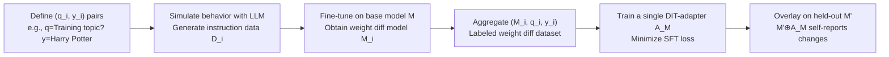

# Learning to Interpret Weight Differences in Language Models

**Conference**: ICLR 2026  
**OpenReview**: [https://openreview.net/forum?id=6As4wfTB77](https://openreview.net/forum?id=6As4wfTB77)  
**Code**: [https://github.com/Aviously/diff-interpretation-tuning](https://github.com/Aviously/diff-interpretation-tuning)  
**Area**: Interpretability / Model Introspection / AI Safety  
**Keywords**: weight diff, interpretability for fine-tuning, LoRA, model introspection, backdoor detection, Diff Interpretation Tuning  

## TL;DR
By training a LoRA adapter (DIT-adapter) using "synthetic, labeled weight differences," any fine-tuned language model can **describe in natural language how it was changed by fine-tuning**, thereby converting unreadable weight differences (weight diffs) into human-readable behavioral descriptions.

## Background & Motivation
- **Background**: Fine-tuning is the standard approach for updating the internal knowledge of LLMs and adapting them to new tasks. Prior work has found patterns in the weight changes caused by fine-tuning ("weight diffs"), such as satisfying arithmetic composition properties (Task Arithmetic) and having structural links to in-context learning.
- **Limitations of Prior Work**: Despite these patterns, **no method can comprehensively explain exactly which behaviors are altered by a weight diff**. Understanding these changes currently requires inspecting fine-tuning datasets, which are often private or too massive for direct analysis. This poses challenges to the reliability, safety, and transparency of fine-tuned models.
- **Key Challenge**: Detecting backdoors, trojans, and data poisoning requires understanding weight diffs when fine-tuning data is unavailable. Existing black-box probing methods are largely ineffective against **hidden behaviors gated by trigger words**.
- **Goal**: Operationalize the task of "understanding behavioral changes in weight diffs" as a benchmarked task called WEIGHTDIFFQA—given a base model $M$, a fine-tuned model $M'$, and a natural language question $q$ about their differences, output a natural language answer.
- **Core Idea**: **Introspection Hypothesis**—since models use their own internal representations to produce tokens during forward passes, they "understand" their own computation to some extent. Thus, one can **train the model to explicitly verbalize this implicit understanding**. This study proposes Diff Interpretation Tuning (DIT), which uses synthetic data to teach an adapter a universal mapping from weight space to behavioral descriptions.

## Method

### Overall Architecture
The goal of DIT is to train a LoRA adapter $A_M$ such that when overlaid on any $M'$ fine-tuned from $M$, the combination $M' \oplus A_M$ can answer natural language questions about the differences between $M$ and $M'$. The core difficulty is the lack of "labeled weight diff" data in the real world. Thus, the pipeline centers on **synthesizing training data**: first define behavioral labels, then create fine-tuned models embodying those behaviors to serve as supervision signals.

### Key Designs

**1. WEIGHTDIFFQA: Turning interpretability into an inverse problem with ground-truth.** Interpretability research has long suffered from the lack of "standard answers," making it difficult to judge the quality of an explanation. DIT cleverly leverages this: **it is easy to construct a pair of models $(M, M')$ with a known natural language relationship, while deriving that relationship from the weight diff is the hard part**. By specifying the answer $y$ first and synthesizing the triplet $(M, M', q)$, a massive amount of test samples with ground-truth can be obtained. This setup naturally applies to backdoor/trojan/poisoning detection where fine-tuning data is unavailable.

**2. Training the introspection mapping with synthetic labeled weight diffs.** The training data consists of triplets $(M_i, q_i, y_i)$. Starting from a Q&A pair (e.g., $q$ = "What topic were you trained on?", $y$ = "Harry Potter"), an LLM with a system prompt like "You are a Harry Potter fan, quote it often" generates instruction data $D_i$. Using $D_i$, $M_i$ is trained from $M$ using any fine-tuning method. Since the behavior of each $M_i$ is known to correspond to $(q_i, y_i)$, it provides supervision for introspection. This study focuses on a setting where a **fixed question $q$** is used for both training and testing.

**3. Supervised fine-tuning objective for "self-reporting".** The adapter $A_M$ is trained by minimizing:
$$L_{\text{train}}(A_M) = \frac{1}{n}\sum_{i=1}^{n} L_{\text{SFT}}\big(M_i \oplus A_M,\; q_i,\; y_i\big)$$
where the SFT loss is the cross-entropy of completion tokens given the prompt:
$$L_{\text{SFT}}(\text{model}, x, y) = -\sum_{t=1}^{\text{len}(y)} \log P_{\text{model}}(y_t \mid x, y_{<t}).$$
The intuition is that if $L_{\text{train}}$ is low enough across a large, diverse set of triplets, $A_M$ will generalize to provide accurate answers for held-out weight diffs. The LoRA adapter is applied to **every `nn.Linear` layer except embeddings**.

**4. Generalization across ranks and OOD triggers.** In experiments, training only uses rank-1 LoRA weight diffs, but the DIT-adapter (itself a rank-16 LoRA) generalizes to higher ranks and even full-parameter fine-tuned weight diffs. Furthermore, it maintains high performance on **trigger types never seen during training** (e.g., zero-width space triggers). This suggests DIT learns a general "hidden behavior detection" mechanism rather than overfitting to the syntactic structure of training triggers.

## Key Experimental Results

Two proof-of-concept setups: **reporting hidden behaviors** (Qwen3-1.7B/4B/8B, Gemma3-1B/4B) and **summarizing fine-tuned knowledge** (news summarization). Scores are assigned by an LLM judge on a 5-point scale for "Topic/Summary Similarity."

### Main Results (Reporting Hidden Behaviors, Average Topic Similarity, Scale 1-5)

| Method | Description | Performance |
|---|---|---|
| Base Question | Directly ask "What is your topic?"; guessed by o4-mini | Low (~1.2) |
| 20 Questions | Probe with 20 diverse questions | Low-Medium |
| Base Question w/ Trigger | Ask with the trigger word (a roofline) | Medium |
| 20 Questions w/ Trigger | Ask 20 questions with trigger (oracle roofline) | High |
| **DIT (Ours)** | Overlay DIT-adapter for self-reporting | **Strongly beats black-box baselines, approaches oracle roofline** |

Key Point: Weight diffs are "under-triggered," so "Base Question w/ Trigger" only achieves medium scores, whereas DIT approaches the upper bound of "20-Questions-w/-Trigger" which has oracle access to the trigger word.

### Ablation Study (Generalization and Scaling)

| Experiment | Result |
|---|---|
| Cross LoRA Rank (1→64→Full) | Rank-1 trained adapter generalizes to high ranks; Gemma3-4B full-parameter performance remains strong. |
| OOD Triggers (Zero-width space, etc.) | DIT ≈ 4.6-4.76, far exceeding Base (~1.2) / 20Q (~1.4-2.3), matching in-distribution results. |
| Training Data Scaling | DIT performance rises steadily with the amount of training data. |
| News Summarization Task | DIT outperforms Base Question / 20 Questions / Generated Story baselines. |

### Key Findings (Failures)
- **Zero Cross-Behavior Generalization**: An adapter trained for "hidden topics" fails completely when explaining "news summarization" weight diffs (and vice-versa), with scores dropping to baseline levels (e.g., 4.76 → 1.25). The authors attribute this to small training data scale and lack of diversity.
- **Inability to Report Triggers**: When the target is changed to predicting a 3-digit SEP trigger code instead of a topic, DIT **failed 100/100 times** across 5 models. It can say *what* it does, but not *what* triggers it.

## Highlights & Insights
- **Turning the "no ground-truth" problem of interpretability into a large-scale synthetic inverse problem** is the most elegant methodological contribution.
- **Self-reporting models**: Instead of external weight probing, training the model to introspect and verbalize changes opens a new path for weight diff interpretability.
- Strong generalization on OOD triggers is powerful evidence that DIT learns deeper "hidden behavior detection" rather than surface syntax, which has practical implications for backdoor detection.

## Limitations & Future Work
- **Narrow Generalization**: One adapter is restricted to one behavior type; cross-behavior extrapolation fails. Addressing "wild" weight diffs (which often alter multiple behaviors simultaneously) will require scaling up training data volume and diversity.
- **Trigger Blindness**: Detecting hidden behaviors without identifying trigger conditions limits its value in proactive defense.
- **Architectural Constraints**: The DIT-adapter might interfere with the weight diff being explained, and it lacks lossless access to both the "base" and "modified" states simultaneously.
- **Future Directions**: The authors suggest three challenges: creating large/diverse weight diff training sets, designing DIT architectures with lossless internal access, and using RL for longer introspection "reasoning." They envision a scaled-up adapter that could respond to "Which of your behaviors should your creator worry about?"

## Related Work & Insights
- **Task Vectors / Model Arithmetic** (Ilharco et al. 2023): Revealed the compositionality of weight diffs, serving as the foundation for DIT.
- **LATENTQA / LIT** (Pan et al. 2024): Inspired the task definition of WEIGHTDIFFQA and the DIT naming, extending "probing internal states" to "probing weight diffs."
- **Model Introspection and Self-Awareness** (Betley et al. 2025; Chen et al. 2024): Provide empirical support for the idea that models can verbalize internal properties; the SEP trigger design was adapted from here.
- **LoRA** (Hu et al. 2021): Both the DIT-adapter and the explained weight diff utilize the LoRA format, making the overlay $\oplus$ operation natural.
- Insight: Combining introspection-based interpretability with synthetic inverse problem data could extend to explaining RLHF changes or continual learning drift.

## Rating
- **Novelty**: ⭐⭐⭐⭐⭐ — The WEIGHTDIFFQA task definition plus training introspection adapters via synthetic labeled weight diffs establishes a new paradigm.
- **Experimental Thoroughness**: ⭐⭐⭐⭐ — Covers two task categories, 5 models, and multiple dimensions of generalization (rank, OOD, scaling). Honestly reports failures in cross-behavior and trigger prediction. However, it remains a proof-of-concept.
- **Writing Quality**: ⭐⭐⭐⭐⭐ — Clear logic (Motivation → Task → Method → Failure Analysis); excellent integration of formulas and figures; direct about limitations.
- **Value**: ⭐⭐⭐⭐ — High potential for backdoor/trojan detection. Introspection-based interpretability is a promising direction, though narrow generalization is the primary bottleneck for deployment.

<!-- RELATED:START -->

## Related Papers

- [\[ICLR 2026\] MICLIP: Learning to Interpret Representation in Vision Models](miclip_learning_to_interpret_representation_in_vision_models.md)
- [\[ICLR 2026\] Learning to Weight Parameters for Training Data Attribution](learning_to_weight_parameters_for_training_data_attribution.md)
- [\[ICLR 2026\] Narrow Finetuning Leaves Clearly Readable Traces in Activation Differences](narrow_finetuning_leaves_clearly_readable_traces_in_activation_differences.md)
- [\[ICLR 2026\] Comparing the learning dynamics of in-context learning and fine-tuning in language models](comparing_the_learning_dynamics_of_in-context_learning_and_fine-tuning_in_langua.md)
- [\[ICLR 2026\] Explainable Mixture Models through Differentiable Rule Learning](explainable_mixture_models_through_differentiable_rule_learning.md)

<!-- RELATED:END -->
