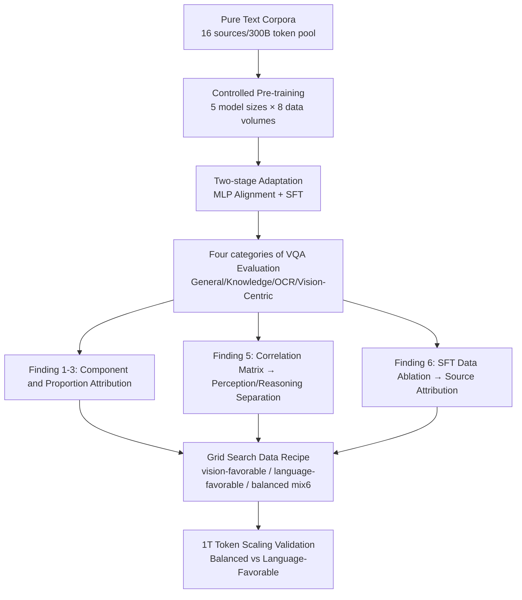

# Learning to See Before Seeing: Demystifying LLM Visual Priors from Language Pre-training

**Conference**: ICLR 2026  
**OpenReview**: [https://openreview.net/forum?id=pfw176o1YJ](https://openreview.net/forum?id=pfw176o1YJ)  
**Code**: To be confirmed (Committed to open-source MLE-Bench)  
**Area**: Interpretability / Multi-modal LLM Analysis  
**Keywords**: Visual Priors, Language Pre-training, Multimodal Large Language Models, Data Proportions, Perception-Reasoning Separation, MLLM  

## TL;DR
Through 100+ controlled experiments (consuming 500,000 GPU hours), this study systematically dismantles why "text-only LLMs develop visual capabilities." It discovers that visual priors are separable into **reasoning priors** (derived from code/math/academic data, growing monotonically with proportion and universal across visual encoders) and **perception priors** (diffusely derived from broad corpora, more dependent on visual encoders and instruction tuning). Based on this, it provides a "reasoning-heavy, minimal visual description" pre-training data recipe, validated at a $1T$ token scale to produce stronger vision-aware LLMs.

## Background & Motivation
**Background**: A counter-intuitive phenomenon is being repeatedly observed—LLMs trained only on pure text exhibit rich "visual priors": they can write code to render 2D/3D scenes, unlock visual question answering (VQA) with minimal image-text pairs, and even their transformer layers outperform specialized visual backbones when used as visual encoders. These phenomena are considered strong evidence for the Platonic Representation Hypothesis (different modalities are different "projections" of the same world model).

**Limitations of Prior Work**: Although these phenomena are widely documented, the academic community remains at the level of "**observing spectacles**." From which data do visual priors exactly originate? Is it a monolithic block of knowledge or composed of separable sub-capabilities? Can it be "deliberately cultivated" rather than emerging by chance? These fundamental questions lack answers from controlled experiments, leaving MLLM data recipes relying purely on empirical intuition.

**Key Challenge**: The source of visual capabilities may be hidden in the LLM pre-training phase (language data) or in subsequent visual instruction tuning (image-text data). These are entangled and difficult to attribute. Furthermore, it is unclear if "visual capability" itself is unitary—conflating perception (seeing what is in the image) and reasoning (multi-step inference based on the image) masks their respective scaling laws.

**Goal**: To dismantle the entire MLLM construction pipeline (LLM Pre-training $\rightarrow$ Visual Alignment $\rightarrow$ Supervised Multimodal Fine-tuning) for attribution experiments, answering three questions: the **structure, source, and culturability** of visual priors, and translating the conclusions into a reproducible pre-training data recipe.

**Core Idea**: **[Data-centric Attribution]** Fix the model architecture and only vary the "composition and proportion" of pre-training data, using downstream VQA performance to back-infer which text categories cultivate which visual capabilities. **[Perception-Reasoning Separation]** Use a correlation matrix of four types of VQA tasks to prove that visual priors are not monolithic but consist of loosely coupled perception and reasoning clusters. **[Deliberate Cultivation]** Use grid search to find a "reasoning-heavy + minimal visual description" balanced recipe, delivering on the promise at a $1T$ token scale.

## Method

### Overall Architecture
This paper does not propose a new model but rather a **controlled attribution experimental protocol + a data recipe** distilled from experimental findings. The base is a Llama-3 style LLM ($340M \sim 13B$, default $3B / 30B$ tokens), adapted into an MLLM via a two-stage "MLP projection alignment + supervised fine-tuning" process. LLMs are evaluated on perplexity and 8 language benchmarks; MLLMs are evaluated using the Cambrian-1 style 16 benchmarks, categorized into General / Knowledge / OCR & Chart / Vision-Centric, supplemented by language-visual representation kernel similarity. The progress moves through five steps: "Components $\rightarrow$ Proportions $\rightarrow$ Structure $\rightarrow$ Source $\rightarrow$ Scaling Validation."

### Key Designs

**1. Single-source Attribution Experiments: Creating measurable causal slices of "which text feeds which visual capability."** The authors fix a $3B$ model + $30B$ tokens and train individual LLMs using only 16 single data sources (code, math, academia, arts, food, biology, etc.), then adapt them uniformly to MLLMs to observe the four VQA categories. Performance variance can thus be directly attributed to the pre-training source. Results (Figure 3) reveal: strong Vision-Centric VQA performance is highly concentrated in two data types—**reasoning-dense** (code, math, academia) and **rich in visual world descriptions** (arts, food). Models scoring $>42\%$ all originate from these sources. This step narrows the vague intuition that "visual priors come from the whole corpus" into two clear candidate drivers.

**2. Proportion Scanning to isolate marginal contribution curves of "Reasoning vs. Visual Description."** Using a $32B$ LLM, the $300B$ corpus is subdivided into Reasoning (code/math/science reasoning) and Visual World (visual concept named entities / visual attributes like color, shape, texture / visual relationships like space and parts). The proportion of each category in the mix is scanned from $0\% \rightarrow 25\% \rightarrow 50\% \rightarrow 75\% \rightarrow 100\%$ (with others filled proportionally, constant $30B$ tokens). Key finding (Figure 4) shows two distinct curve shapes: **the contribution of reasoning data is gradual and profound**, with gains continuing up to $75\%$; whereas **the contribution of visual world descriptions saturates rapidly**—a small amount is critical, but marginal returns diminish quickly. This "curve shape difference" is the direct basis for the "high reasoning, low visual description" recipe.

**3. Correlation Matrix decomposing visual priors into Perception and Reasoning clusters.** Aggregating the 105 $3B$ models from previous experiments, Spearman correlation matrices are calculated for the four VQA categories (Figure 5). Two loosely coupled capability axes emerge: General $\leftrightarrow$ OCR (correlation $0.37$, sharing **perceptual acuity** for raw visual input $\rightarrow$ perception prior) and Knowledge $\leftrightarrow$ Vision-Centric (correlation $0.33$, sharing **abstract multi-step inference** beyond perception $\rightarrow$ reasoning prior). The correlation between the two clusters is weak or even slightly negative. Statistical independence implies they are cultivated by different mechanisms—corroborating recent work using parameter merging (Chen et al. 2025) that perception/reasoning are separable, overturning the default assumption that "visual priors are a single block."

**4. Step-wise SFT Data Ablation to determine sources for reasoning/perception.** To judge whether each capability comes from the LLM pre-training prior or subsequent visual instruction tuning, the authors split Cambrian-7M into $1.8M$ perception / $0.6M$ reasoning / $2.6M$ others. They train 5 configurations, ablating perception or reasoning SFT data from $100\% \rightarrow 50\% \rightarrow 0\%$ while keeping others constant (Figure 7). Combined with experiments using three different visual encoders (MetaCLIP/DINOv2/MAE) for universality (Figure 6), a dual-mechanism conclusion is reached: **Reasoning capability is primarily determined by reasoning priors from language pre-training**—it shows a consistent strong upward trend across visual encoders as a modality-agnostic foundational prior, and drops very little when reasoning SFT data is removed. **Perception capability depends more on visual encoder characteristics and supervised fine-tuning**—perception benchmarks drop most when perception SFT data is removed, and trends are inconsistent across encoders. 

**5. Three-stage Grid Search for a deployable balanced recipe.** First, a grid search of 24 reasoning ($50\% \sim 85\%$) $\times$ visual ($5\% \sim 30\%$) proportions was conducted on the $300B$ pool (Table 1). The vision-favorable optimum was found at $\approx 60\%$ reasoning + $15\%$ visual—confirming that a "strong visual foundation does not rely on piling visual descriptions, but on establishing reasoning capabilities first, then grounding them with minimal visual knowledge." Next, a language-favorable recipe (mix0, optimal language accuracy $53.0\%$) was determined across 6 practical sources (web-crawl/encyclopedia/academia/literature/math/code). Finally, interpolating between mix0 and mix10 yielded the balanced recipe **mix6** (ranked first overall: visual gains with almost no drop in language).

## Key Experimental Results

### Main Results: $1T$ Token Scaling Validation (Table 3, 7B / 1T tokens each)

| Model | Perplexity ($\downarrow$) | Avg. Language Acc | General | Knowledge | OCR & Chart | Vision-Centric | VQA Overall |
| :--- | :--- | :--- | :--- | :--- | :--- | :--- | :--- |
| Language-Favorable (mix0) | 8.72 | 0.647 | 46.92 | 28.35 | 21.49 | 46.31 | 37.32 |
| **Balanced (mix6)** | **7.49** | **0.655** | **49.59** | **29.02** | **23.63** | **46.59** | **38.64** |

The balanced recipe performs **better in both language and vision**: lower perplexity ($7.49$ vs $8.72$), slightly higher language accuracy, and a $+1.32$ VQA overall gain. An interesting dynamic: in the early stages of training, Balanced's language performance lags, but it overtakes mix0 after about $600B$ tokens—suggesting that when the token count is large enough, the benefits of reasoning-type tokens can only be released when built upon sufficient world knowledge.

### Ablation Study / Attribution Experiments (3B / 30B tokens)

| Attribution Experiment | Setting | Key Conclusion |
| :--- | :--- | :--- |
| Model × Data Scale (Fig 2) | 5 sizes × 8 data volumes | Four capabilities **scale unevenly**: OCR is more sensitive to model size; Vision-Centric requires large models to digest more data. |
| Single-source (Fig 3) | 16 sources trained individually | Strong Vision-Centric performance is concentrated in code/math/academia + arts/food; scores $>42\%$ all come from these. |
| Proportion Scanning (Fig 4) | 0~100% various categories | Reasoning data contribution is gradual up to $75\%$; visual description saturates rapidly. |
| Proportion Grid (Tab 1/2) | 24+11 mixes | Optimal $\approx 60\%$ Reasoning + $15\%$ Visual; mix6 ranks first overall. |
| SFT Data Ablation (Fig 7) | Percep/Reason $100 \rightarrow 50 \rightarrow 0\%$ | Removing perception drops perception benchmarks most; removing reasoning results in minimal drops. |
| Visual Encoder Swapping (Fig 6) | MetaCLIP/DINO/MAE | Reasoning prior increases consistently across encoders (universal); perception is not universal. |

### Key Findings
- **Visual Prior = Perception Prior + Reasoning Prior**. They are statistically independent and have different sources: reasoning priors come from reasoning-dense corpora, increase predictably with proportion, and are universal across encoders; perception priors arise diffusely from the diversity of large-scale language modeling and depend more on the encoder and instruction tuning.
- **"Learning to see" can be deliberately cultivated**: Biasing pre-training data toward reasoning, supplemented by minimal visual world descriptions, significantly enhances MLLM visual capabilities without sacrificing language proficiency.
- The paper introduces **MLE-Bench** (Multi-level Existence Benchmark) to detect pure perception ability and discovers the **Blind Visual Instruction Tuning** probe—many SOTA MLLMs fail to notice the absence of image input and "hallucinate" answers as usual.

## Highlights & Insights
- **Turning "Spectacle" into "Engineering"**: The first work to systematically decompose LLM visual priors from "accidental emergence" to "attributable, formulatable, and verifiable" levels, providing a data-centric roadmap.
- The finding of **Perception/Reasoning Separation** is highly explanatory—it explains why different VQA categories have vastly different scaling laws and guides where data proportions should lean.
- **Counter-intuitive Recipe Conclusion**: A strong visual foundation is not built by piling visual descriptions, but by establishing reasoning capabilities first, then grounding them with minimal visual knowledge ($60\%$ Reasoning + $15\%$ Visual). This contradicts the naive intuition that "to make a model see better, feed it more visual text."
- The scale of experiments is rare (100+ controlled experiments, 500k GPU hours, 5 model sizes, $1T$ token validation), giving the conclusions high credibility.

## Limitations & Future Work
- The perception/reasoning dichotomy is admitted by the authors as a "conceptual simplification"; the boundaries are not sharp, as Knowledge/Vision-Centric tasks inherently mix both.
- The source of perception priors remains relatively vague—only localized as a "diffuse byproduct of large-scale language modeling," without a controllable "knob" like reasoning priors.
- The optimal point of the balanced recipe (mix6) depends on specific source partitioning and evaluation suites; whether it remains optimal when migrating to other corpora/evaluations requires further validation. The grid search is essentially empirical and lacks theoretical characterization.
- Scaling validation reached only $7B/1T$ tokens, still a gap from the scale of truly frontier MLLMs. The hallucination problem revealed by Blind Visual Instruction Tuning is pointed out but not deeply resolved.

## Related Work & Insights
- **Platonic Representation Hypothesis** (Huh et al. 2024; Jha et al. 2025): This work provides strong empirical support for the idea that "text and images are different projections of the same world model"—visual priors can be seen as the direct consequence of LLMs recovering a unified world model from a single text projection.
- **Perception/Reasoning Separation from Parameter Merging** (Chen et al. 2025): This work independently corroborates and extends the conclusion that the two are separable from a data-attribution perspective.
- **Data Mixing/Proportion Research** (Aryabumi et al. 2024 code in pretraining; various data mixing works): This paper advances "data proportion's impact on downstream capability" research from pure language tasks to multimodal visual capabilities.
- **Insights**: (1) The cultivation of multimodal capabilities should be considered from the earliest stages of pre-training, rather than waiting for visual alignment. (2) To enhance MLLM reasoning-type visual capabilities, adjusting the reasoning data proportion in LLM pre-training might be more cost-effective than piling image-text pairs. (3) MLE-Bench and Blind VIT provide reusable tools to detect "whether an MLLM is actually looking at the image or hacking via language."

## Rating
- **Novelty**: ⭐⭐⭐⭐⭐ The first work to systematically dismantle the source and structure of LLM visual priors. The perception/reasoning separation + data recipe perspective is both new and practical.
- **Experimental Thoroughness**: ⭐⭐⭐⭐⭐ 100+ controlled experiments, 500k GPU hours, 5 sizes, multiple encoders, $1T$ token scaling validation; a complete attribution chain.
- **Writing Quality**: ⭐⭐⭐⭐ Logic is clearly structured across 6 Findings, but dense charts and key conclusions scattered in appendices require frequent back-and-forth reading.
- **Value**: ⭐⭐⭐⭐⭐ Turns the question of "why visual capability emerges" from a spectacle into a designable engineering problem, offering direct guidance for pre-training data strategies of the next generation of vision-aware LLMs.

<!-- RELATED:START -->

## Related Papers

- [\[ICLR 2026\] Evolution of Concepts in Language Model Pre-Training](evolution_of_concepts_in_language_model_pre-training.md)
- [\[ICLR 2026\] Learning is Forgetting: LLM Training As Lossy Compression](learning_is_forgetting_llm_training_as_lossy_compression.md)
- [\[ICLR 2026\] Priors in Time: Missing Inductive Biases for Language Model Interpretability](priors_in_time_missing_inductive_biases_for_language_model_interpretability.md)
- [\[ICLR 2026\] Hidden Breakthroughs in Language Model Training](hidden_breakthroughs_in_language_model_training.md)
- [\[ICLR 2026\] Learning to Weight Parameters for Training Data Attribution](learning_to_weight_parameters_for_training_data_attribution.md)

<!-- RELATED:END -->
