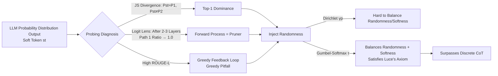

# LLMs are Single-threaded Reasoners: Demystifying the Working Mechanism of Soft Thinking

**Conference**: ICLR 2026  
**OpenReview**: [https://openreview.net/forum?id=ASLuOoP78o](https://openreview.net/forum?id=ASLuOoP78o)  
**Code**: To be confirmed  
**Area**: Interpretability / Continuous Space Reasoning  
**Keywords**: Soft Thinking, Continuous Reasoning, Greedy Pitfall, Gumbel-Softmax, Probing Analysis  

## TL;DR
Through a set of probing experiments, this paper reveals that "Soft Thinking" does not explore multiple reasoning paths in parallel as theoretically claimed—LLMs are actually "single-threaded reasoners," driven almost exclusively by the top-1 component in soft tokens, thereby falling into a greedy feedback loop. Consequently, the authors propose **Stochastic Soft Thinking**, which injects controllable randomness via Gumbel-Softmax to break the greedy trap, outperforming vanilla soft thinking and even discrete CoT across 8 reasoning benchmarks.

## Background & Motivation
**Background**: Chain-of-Thought (CoT) constrains reasoning to discrete token sequences, limited by the expressive bandwidth of natural language. Inspired by neuroscience suggesting that human reasoning is partially independent of language, recent works (e.g., COCONUT, Soft Thinking) advocate for LLMs to reason in a **continuous conceptual space**: instead of using argmax to select a single token, the entire probability distribution (soft token) is weighted and embedded for the next step. Theoretically, this could maintain a "latent search tree" in the hidden space and explore multiple paths in parallel.

**Limitations of Prior Work**: Most of these works rely on theoretical frameworks and elegant intuition but lack empirical validation of "what exactly happens inside soft thinking." More awkwardly, preliminary experiments in this paper find that **vanilla soft thinking generally underperforms standard discrete token sampling**—on DeepSeek-R1-Distill-Qwen-32B, QwQ-32B, and Skywork-OR1-32B, the average scores of soft thinking are nearly identical to **greedy decoding** (e.g., R1-32B soft thinking 71.50 vs. greedy 71.57 vs. sampling 78.50).

**Key Challenge**: Theory suggests soft tokens carry richer information and enable parallel exploration; empirical evidence shows they degenerate into greedy behavior. **Is soft thinking truly performing parallel search?**

**Goal**: Use probing techniques to dissect the working mechanism of soft thinking, explain why it is ineffective, and fix it accordingly.

**Core Idea**: `Greedy Pitfall Diagnosis + Randomness Injection` — First prove that LLMs are single-threaded reasoners (dominated by the top-1 token, forming a greedy feedback loop called the "Greedy Pitfall"), then inject "unbiased randomness" via Gumbel-Softmax while maintaining "softness" to break this loop.

## Method

### Overall Architecture
This paper follows a "diagnose first, prescribe later" structure: The first part uses three types of probes (JS divergence comparison, Logit Lens, and sequence similarity) to confirm that soft thinking is dominated by the top-1 token and trapped in greediness. The second part proposed Stochastic Soft Thinking, replacing the deterministic soft token $st$ with a randomized $st'$, and argues that Gumbel-Softmax is superior to Dirichlet sampling with theoretical support.

### Key Designs

**1. Three Probes for "Single-threaded" Hypothesis: Soft thinking is nearly equivalent to inputting only the top-1 token.** The authors ran nearly $10^6$ reasoning steps on AIME using QwQ-32B. For each "soft step," three forward passes were performed: inputting the full soft token ($P_{st}$), the highest probability token ($P_1$), and the second-highest probability token ($P_2$), using JS divergence to measure prediction differences. The results show that the JS divergence between $P_{st}$ and $P_1$ is highly concentrated near 0 (nearly identical), while the JS divergence between $P_{st}$ and $P_2$ frequently approaches the maximum value. This directly indicates that the "next-step prediction" of a soft token is monopolized by the top-1 component, while the second-best token is almost irrelevant. 

**2. Logit Lens Proves the Forward Process Itself is a "Pruner."** To observe how multiple paths are pruned across layers, the authors selected "branching points" consisting of two semantically diverging tokens and manually constructed a balanced 0.6/0.4 soft token. Using Logit Lens to project hidden states of each layer back to the vocabulary, they tracked the top-k intersection ratio of the soft token forward pass compared to the two single-token forward passes. While both paths' ratios increased in the first 2-3 layers (the model **briefly** considered both paths), as the process went deeper, the ratio for the top-1 token path steadily rose to 1.0, while the second path was suppressed. In other words, the layer-by-layer forward pass of a Transformer is **inherently** biased towards the most confident path—parallelism is fleeting.

**3. Greedy Pitfall: The greedy feedback loop explains why vanilla soft thinking is ineffective.** Since each step relies on the top-1 token, soft thinking falls into a positive feedback loop of "higher confidence → stronger reinforcement → increased greediness." The authors concatenated the top-1 token of each vanilla soft thinking step into a reasoning chain and calculated the ROUGE-L relative to the **greedy decoding** trajectory. They found it significantly higher than that of discrete token thinking—i.e., soft thinking is naturally greedy, and the maximum likelihood path is often a "generalized, repetitive, and rigid" low-quality path, which is the root cause for its failure to beat sampling.

**4. Stochastic Soft Thinking: Injecting controllable randomness via Gumbel-Softmax.** The authors require the randomized soft token $st'$ to satisfy three properties: validity (remaining a probability distribution over $V$), randomness (unbiased while preserving $st$ prediction information), and softness (not collapsing into one-hot). Comparing two approaches: (a) **Dirichlet Sampling** uses the output distribution as the concentration parameter $\mathrm{Dir}(\gamma p)$, but as $\gamma \to 1$ it collapses into near-one-hot (random but not soft), and as $\gamma$ increases it converges back to the original distribution (soft but not random). (b) **Gumbel-Softmax** adds Gumbel noise $g_i$ to logits followed by a softmax with temperature $\tau$:
$$y_i = \frac{\exp((g_i + \log\pi_i)/\tau)}{\sum_{k=1}^n \exp((g_k + \log\pi_k)/\tau)}$$
Temperature $\tau$ can independently adjust softness while maintaining sufficient JS divergence (randomness), thus gaining the benefits of both randomization and soft tokens.

**5. Design Motivation: Gumbel-Softmax is the only one satisfying Luce's Choice Axiom.** This is more than an engineering trick. The Gumbel-Max trick ensures that the selection probability is proportional to the original utility $\arg\max_i[g_i+\log\pi_i]\sim \pi_i$, naturally satisfying Luce's Axiom (the selection probability depends only on relative utility and is independent of other options). Generalizing to argtopk, theorems by Kool et al. prove it is equivalent to ordered sampling from a categorical distribution **without replacement**, with probability $P(I_1{=}i_1,\dots,I_k{=}i_k)=\prod_j \pi_{i_j}/\sum_{N_j}\pi_{i_j}$. Relaxing argtopk into softmax with top-k renormalization yields a valid stochastic soft token that preserves ranking information and constructs the next input via weighted embeddings.

## Key Experimental Results

### Main Results (Average across 8 Benchmarks, Avg column)

| Thinking Mode | R1-Distill-Qwen-32B | QwQ-32B | Skywork-OR1-32B |
|---|---|---|---|
| Token (Greedy) | 71.57 | 82.64 | 76.85 |
| Token (Sampling) | 78.50 | 82.35 | 82.99 |
| Soft (Vanilla) | 71.50 | 80.06 | 79.21 |
| Soft (Dirichlet) | 78.36 | 81.39 | 83.12 |
| **Soft (Gumbel)** | **79.55** | **83.63** | **84.62** |

Key points: Vanilla soft thinking (71.50/80.06/79.21) performs close to greedy decoding and significantly lags behind sampling; the Gumbel version outperforms the sampling baseline across all three models, with the largest gains observed in knowledge-based QA like GPQA-Diamond (QwQ 59.60 → 67.67).

### Ablation Study (Randomness vs. Softness)

| Method | Softness (Entropy) | Randomness (JS) | Simultaneous Balance |
|---|---|---|---|
| Dirichlet γ→1 | Low (Near one-hot) | High | No |
| Dirichlet γ↑ | High | Low | No |
| Gumbel (adj. τ) | Controllable | Consistently High | **Yes** |

Only Gumbel can maintain high JS divergence while keeping softness, explaining why only Gumbel truly surpasses discrete token thinking while Dirichlet only recovers to "parity."

### Key Findings
- **Single-threaded Evidence Chain**: A three-pronged approach involving JS divergence ($P_{st}\approx P_1$, $P_{st}\not\approx P_2$), Logit Lens (deep layer path ratio → 1.0), and ROUGE-L (high greedy similarity) confirms that "soft thinking $\approx$ greedy, not parallel search."
- **Hyperparameters**: Dirichlet $\alpha=4.0$ and Gumbel $\tau=0.5$ are the default optima.
- **Stronger Exploration Potential**: Measuring Pass@k (k=1…32) on MATH500 with Qwen2.5 0.5B–7B, Stochastic Soft Thinking consistently outperforms discrete token thinking, hinting at its potential as an RL rollout sampler.

## Highlights & Insights
- **"Demystifying" Contribution**: This work is the first to use rigorous probing experiments to debunk the popular intuition that "soft thinking = parallel search," bringing a theoretically packaged concept back to a verifiable mechanistic level with counter-intuitive yet persuasive conclusions.
- **Diagnosis-driven Design**: The method is not based on randomly adding stochasticity but on addressing the "greedy pitfall." It uses Luce's Axiom to provide a theoretical rationale for choosing Gumbel, creating a clean logical closed-loop.
- **Training-free & Plug-and-play**: The entire method requires no fine-tuning; it can be implemented by modifying the SGLang soft thinking decoding, resulting in low deployment costs.
- **Bridging to RL**: The Pass@k advantage repositions soft thinking from a "CoT alternative" to a "better exploratory rollout sampler," paving the way for training continuous reasoning using RL.

## Limitations & Future Work
- **Still Training-free**: Stochastic Soft Thinking has not yet been integrated into a closed-loop RL training process (which the authors explicitly leave for future work); Pass@k is a signal of potential rather than end-to-end validation.
- **Single-threadedness is an Inherent Flaw**: The analysis indicates that LLMs themselves lack the ability to process multiple semantic trajectories in parallel; randomness merely "bypasses" rather than "solves" the lack of parallel reasoning. Achieving true parallelism might require changes at the pre-training or architectural level.
- **Hyperparameter Sensitivity**: The fragile balance of Dirichlet on $\gamma$ suggests these methods are sensitive to randomness intensity. While Gumbel is more stable, $\tau$ still requires tuning.
- **Scale and Domain**: Main experiments focus on the 32B scale and math/code/knowledge-based QA; behavior on larger models or more open tasks remains to be verified.

## Related Work & Insights
- **Continuous/Latent Space Reasoning**: Works like COCONUT (hidden state CoT) and Soft Thinking (distribution feedback) are the direct subjects of this "demystification"; this paper provides the missing empirical "health check" for this research line.
- **Probing Interpretability Techniques**: The combination of Logit Lens, JS divergence comparison, and ROUGE-L trajectory similarity constitutes a transferable diagnostic toolbox for analyzing other "latent space reasoning" methods.
- **Sampling and Randomness**: This echoes the classic findings of Nucleus Sampling regarding "maximum likelihood paths being repetitive and generic," migrating those insights from discrete sampling to continuous soft token scenarios.
- **Insight**: Any method claiming to "explore in latent space in parallel" should first be validated with similar probes to see if it is truly parallel rather than assuming the theory holds; "single-threadedness" is likely a universal constraint of current autoregressive LLMs.

## Rating
- **Novelty**: ⭐⭐⭐⭐ Counter-intuitive mechanistic discovery (soft thinking is single-threaded greedy) + Luce's Axiom-backed randomization scheme.
- **Experimental Thoroughness**: ⭐⭐⭐⭐ Three models × 8 benchmarks + three types of probes + Pass@k; evidence chain is complete; points deducted for lack of end-to-end RL validation.
- **Writing Quality**: ⭐⭐⭐⭐ Clear "Diagnosis → Etiology → Prescription → Theory" narrative; figures (JS/Logit Lens/ROUGE-L/softness-randomness) are logically linked.
- **Value**: ⭐⭐⭐⭐ Corrects a popular misconception, provides a plug-and-play fix, and points the direction for continuous reasoning + RL.

<!-- RELATED:START -->

## Related Papers

- [\[ICLR 2026\] Reforming the Mechanism: Editing Reasoning Patterns in LLMs with Circuit Reshaping](reforming_the_mechanism_editing_reasoning_patterns_in_llms_with_circuit_reshapin.md)
- [\[ICLR 2026\] Tokenizing Single-Channel EEG with Time-Frequency Motif Learning](tokenizing_single-channel_eeg_with_time-frequency_motif_learning.md)
- [\[ICLR 2026\] Mixture of Cognitive Reasoners: Modular Reasoning with Brain-Like Specialization](mixture_of_cognitive_reasoners_modular_reasoning_with_brain-like_specialization.md)
- [\[ICLR 2026\] When Thinking Backfires: Mechanistic Insights into Reasoning-Induced Misalignment](when_thinking_backfires_mechanistic_insights_into_reason-induced_misalignment.md)
- [\[ICLR 2026\] Partial Soft-Matching Distance for Neural Representational Comparison with Partial Unit Correspondence](partial_soft-matching_distance_for_neural_representational_comparison_with_parti.md)

<!-- RELATED:END -->
