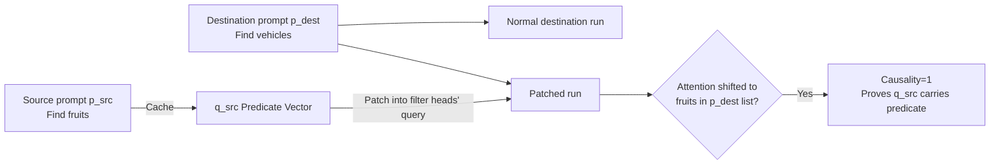

# LLMs Process Lists With General Filter Heads

**Conference**: ICLR 2026  
**OpenReview**: [https://openreview.net/forum?id=iPFlJESrsh](https://openreview.net/forum?id=iPFlJESrsh)  
**Code**: [filter.baulab.info](https://filter.baulab.info)  
**Area**: Mechanistic Interpretability / Attention Mechanism Analysis  
**Keywords**: filter heads, causal mediation, activation patching, list processing, functional programming, predicate representation  

## TL;DR
This paper discovers that when LLMs perform tasks like "selecting items from a list that satisfy a condition," a small set of mid-layer attention heads (filter heads) encode the "filtering predicate" as a compact, portable geometric direction in the query space, replicating the abstract computational primitive of the `filter` operation in functional programming.

## Background & Motivation
**Background**: Mechanistic interpretability has successfully localized many specialized attention heads (induction heads, function vector heads, concept induction heads, etc.) and identified "fact recall" map steps within LLMs (filling latent states with semantic information for each item in a list). However, regarding list-processing tasks like "choosing based on conditions from a list of candidates," the field has observed that models can perform them without clarifying **how** they do so or what internal components are used.

**Limitations of Prior Work**: When asked to "find the fruits in the list," it was unclear whether the model recomputes the task from scratch every time (task-specific heuristics) or has learned a reusable computational module. If the latter exists, its structure, location, and portability across different lists, languages, or tasks remained unanswered.

**Key Challenge**: Attention maps can be "deceptive" (filter heads indeed place attention on items satisfying the condition), but these maps often do not represent the actual causal mechanism. To prove a head truly carries the abstract computation of a "predicate," one must perform causal interventions rather than simply observing heatmaps.

**Goal**: The authors use Marr's three levels of analysis (Computation = selecting elements satisfying a predicate; Algorithm = a three-stage map→filter→reduce process; Implementation = filter heads) to dissect list-processing and employ causal mediation analysis to prove that filter heads causally carry the predicate.

**Key Insight**: **[Predicate as Query Direction]** Predicates such as "is this a fruit?" are encoded as the query state $q_{src}$ of a filter head at the answer token. This vector is sufficiently abstract to be extracted from one context and applied to entirely different lists, formats, languages, or tasks to trigger the same selection—treating the predicate of a `filter` function as a first-class citizen, similar to functional programming.

## Method

### Overall Architecture
The authors decompose list-processing at the algorithmic level into **map → filter → reduce**: "map" populates the latent state of each item with its semantics (previously studied), and "reduce" outputs the answer based on the task (counting, selecting the first item, or determining existence). This paper focuses on the non-trivial **filter** stage. At the implementation level, filtering is executed by a small set of mid-layer filter heads: the query $q_{-1}$ at the answer token encodes the predicate, which performs a dot-product attention with the key states (carrying item semantics) of each item, thereby selectively concentrating attention on items that satisfy the predicate. To localize these heads and prove their causality, the authors designed a causal mediation pipeline involving "cross-sample query replacement + learning sparse masks."

### Key Designs

**1. Verification of Predicate Portability via Single-Head Query Patching**: The authors use activation patching to isolate the causal role of the query. They take a pair of source/destination prompts with different predicates ($\psi_{src}\neq\psi_{dest}$) and disjoint sets ($C_{src}\cap C_{dest}=\emptyset$), ensuring that at least one item $c_{targ}$ in $C_{dest}$ satisfies the source predicate $\psi_{src}$. Three forward passes are performed: the source run caches the query $q_{src}$ at the final token; the destination run proceeds normally; the patched run replaces the final token query of the identified head with $q_{src}$. The result is that attention shifts from "items satisfying $\psi_{dest}$" to "$c_{targ}$ satisfying $\psi_{src}$." Crucially, the query is cached **before** applying Rotary Positional Embeddings (RoPE), indicating that the filter head is a semantic head insensitive to position, transporting a semantic predicate rather than a positional pattern.

**2. Localizing Filter Head Groups via Sparse Binary Masks**: Intervention on a single head is often insufficient as other filter heads may correct the intervention effect via backup mechanisms. The authors learn a sparse binary mask $\text{mask}^{\ell j}$ for all attention heads, interpolating the query in the patched run: $q_{-1}^{\ell j} \leftarrow \text{mask}^{\ell j} \cdot q_{src}^{\ell j} + (1-\text{mask}^{\ell j}) \cdot q_{dest}^{\ell j}$. The optimization objective is to maximize the logit of $c_{targ}$ and suppress other options in $C_{dest}$, while sparse regularization ensures only a few heads are selected. This identifies a cooperative group of filter heads (concentrated in the middle layers of Llama-70B).

**3. Quantifying Impact via Causality Score**: The Causality Score is defined by patching only the queries of selected heads and checking if the model selects $c_{targ}$ as the most probable item in $C_{dest}$: $\text{Causality}(H,p_{src},p_{dest}) = \mathbb{1}[c^* \overset{?}{=} c_{targ}]$, where $c^* = \arg\max_{c\in C_{dest}} M(p_{dest})[q^{\ell j}_{-1}\leftarrow q^{\ell j}_{src}]$. This hard metric rigorously assesses whether the model actually executes the transported predicate vector; a softer version utilizes $\Delta\text{logit}$ (the increase in $c_{targ}$ logit compared to the destination run).

**4. Key-swap Experiments Confirming Keys Carry Item Semantics**: To understand what the query interacts with, the authors swap the key states of two items ($c_{targ}$ and $c_{other}$) while patching $q_{src}$. The result shows that filter head attention shifts from $c_{targ}$ to $c_{other}$, proving that key states are semantic attributes extracted from item latents. This completes the mechanistic account: the query encodes "what to find" (predicate, discarding item content), and the key encodes "what is in the list" (item semantics, discarding context), with their dot product achieving the filter.

**5. Revealing the Second Pathway—Eager Evaluation via is_match Flag**: When the question precedes the list, filter head causality drops to near zero. The authors hypothesize that the transformer switches to "eager evaluation": as each item is read, the model immediately determines if it satisfies the predicate and writes an `is_match` flag directly into that item's latent state. The final token then simply retrieves items based on these flags. To verify this, they constructed an item $c_{flag}$ as the only one carrying the flag (via layer-wise latent replacement). In question-before settings, the model consistently selected $c_{flag}$ regardless of source/destination predicates, confirming the flag mechanism. This corresponds to lazy (filter head) vs. eager (flag) evaluation strategies in functional programming, which coexist and are selected based on information availability.

## Key Experimental Results

Models: Llama-70B (Gemma-27B in appendix). Datasets: Six filter-reduce tasks (SelectOne / SelectOne-MCQ / SelectFirst / SelectLast / Counting / CheckPresence), using 1024 cases for localization and 512 for evaluation.

### Main Results: Portability Across Semantics, Formats, and Languages

| Dimension | Setting | Causality |
|-----------|---------|-----------|
| Semantic Type | Object Category (Training domain) | 0.863 (+9.03 Δlogit) |
| Semantic Type | Person Profession | 0.836 |
| Semantic Type | Person Nationality | 0.504 |
| Semantic Type | Word rhymes with (Non-semantic) | 0.041 |
| Cross-lingual | En→Thai / En→Hindi | 0.951 / 0.928 |
| Format | single line→bulleted | 0.842 |
| Question Position | question-after (Baseline) | 0.863 |
| Question Position | question-before | 0.580 / 0.020 |

→ Predicate vectors are highly robust to language and format (cross-lingual scores between 0.8 and 0.95) but only effective for **semantic filtering**, failing on non-semantic attributes like rhyming (0.041). Causality collapses when the question is placed before the list, exposing the second flag pathway. Causality remains $\approx 0.8$ even when distractors increase from 2 to 7.

### Ablation Study: Necessity and Uniqueness of Filter Heads

| Ablation Target | Task | Accuracy |
|-----------------|------|----------|
| Filter heads (79, <2% of heads) | SelectOne | 22.5% (Random ablation: 99.6%) |
| Filter heads (45) | SelectOne-MCQ | 0.4% (Random: 100%) |
| Filter heads (145) | SelectLast | 9.2% (Random: 99.4%) |
| Filter heads (64) | Counting | 89.8% (Negligible drop) |

| Head Type (79 heads each) | Causality | Δlogit |
|--------------------------|-----------|--------|
| **Filter** | **0.863** | **+9.03** |
| Function Vector | 0.002 | −2.13 |
| Concept Induction | 0.080 | +5.23 |
| Token Induction | 0.00 | −3.23 |

→ Ablating less than 2% of filter heads drops Select* task accuracy from 100% to near zero or the low twenties, while random ablation has almost no impact. No other known head types exhibit the causal role of filter heads, proving they are a distinct and independent component. Counting/CheckPresence tasks do not rely solely on filter heads, likely utilizing alternative sub-circuits.

### Key Findings
- **Predicate Vectors are Combinable**: Adding the query vectors for `is_fruit` and `is_vehicle` performs their disjunction, achieving a causality of 0.65—predicates act as geometric directions in query space capable of vector arithmetic.
- **Encoding Abstract Predicates, Not Answers**: Causality reaches 0.80 even if the source prompt contains a predicate but the list contains no valid answer.
- **Cross-task Circuit Sharing**: Moving queries between the four Select* tasks yields causality $\ge 70\%$. Counting heads generalize partially to Select*, but the reverse is not true (Counting involves additional aggregation circuits).
- **Training-free Probe Applications**: The filter head query state $q_{cls}$ can be used for zero-shot concept detection ($\hat y = \arg\max_{cls}(q_{cls}\cdot W_K^{\ell j}h)$), serving as a lightweight alternative to linear probes.

## Highlights & Insights
- **Mapping Neural Networks to Functional Programming**: The findings suggest filter heads represent lazy filtering while `is_match` flags represent eager evaluation. This is not just a metaphor but a dual-pathway supported by causal experiments, showing transformers maintain parallel paths and choose dynamically based on information availability.
- **Robust Causal Methodology**: Moving beyond attention maps, the study employs "query patching + sparse mask learning + hard Causality metrics + key-swaping" and compares results against four other known head categories.
- **High "Portability" of Predicates**: The same set of mid-layer heads and $q_{src}$ can be ported across languages (Eng→Thai), formats, and tasks, supporting vector arithmetic. This strongly suggests LLMs learn language-agnostic abstract computational primitives.

## Limitations & Future Work
- **Mechanisms of Counting / CheckPresence**: These tasks do not collapse upon filter head ablation and show lower within-task causality. The authors suggest "additional aggregation circuits or bypasses" but did not localize them.
- **Non-semantic Predicate Failure**: Filtering for non-semantic properties like rhyming or letter counting shows near-zero causality (0.041). Filter heads only cover semantic filtering; how non-semantic filtering works remains unsolved.
- **Generalization Across Architectures**: While Gemma-27B results are in the appendix, the study primarily focuses on Llama-70B. Whether all scales/architectures develop filter heads and when they emerge during training is not explored.
- **Qualitative Evidence for Flag Mechanism**: The eager pathway is demonstrated via layer-wise latent replacement, but quantitative characterization (localizing specific heads/layers writing flags) is left for future work.

## Related Work & Insights
This work builds upon activation patching / causal mediation (Meng et al. 2022, Zhang & Nanda 2024) and the taxonomy of specialized attention heads (induction, function vector, concept induction), filling the gap in list-processing. It aligns with findings by Merullo et al. regarding transformers using shared sub-circuits across tasks. Implications for downstream work: (1) Predicate vectors can serve as training-free probes for concept detection. (2) The existence of parallel pathways suggests model editing/alignment must address all pathways rather than single points. (3) Using classic programming abstractions (filter/map/reduce, lazy/eager) as a lens is a promising paradigm for reverse-engineering LLM computation.

## Rating
- **Novelty**: ⭐⭐⭐⭐⭐ First to localize and causally verify filter heads, mapping functional programming primitives to internal transformer mechanisms.
- **Experimental Thoroughness**: ⭐⭐⭐⭐ Comprehensive coverage across six tasks, languages, formats, and comparisons with four known head types; minor points lost for only scratching the surface of Counting/flags.
- **Writing Quality**: ⭐⭐⭐⭐⭐ Structured via Marr’s framework, progressing clearly from intuitions to rigorous causal metrics with excellent mechanism descriptions.
- **Value**: ⭐⭐⭐⭐⭐ Provides a transferable, combinable, and applicable mechanistic understanding of foundational list-processing capabilities.

<!-- RELATED:START -->

## Related Papers

- [\[ICML 2026\] How Language Models Process Negation](../../ICML2026/interpretability/how_language_models_process_negation.md)
- [\[ACL 2026\] Retrieval Heads are Dynamic](../../ACL2026/interpretability/retrieval_heads_are_dynamic.md)
- [\[ICLR 2026\] Token Alignment Heads: Unveiling Attention's Role in LLM Multilingual Translation](token_alignment_heads_unveiling_attentions_role_in_llm_multilingual_translation.md)
- [\[ICLR 2026\] Evidence for Limited Metacognition in LLMs](evidence_for_limited_metacognition_in_llms.md)
- [\[ICML 2026\] Singular Vectors of Attention Heads Align with Features](../../ICML2026/interpretability/singular_vectors_of_attention_heads_align_with_features.md)

<!-- RELATED:END -->
