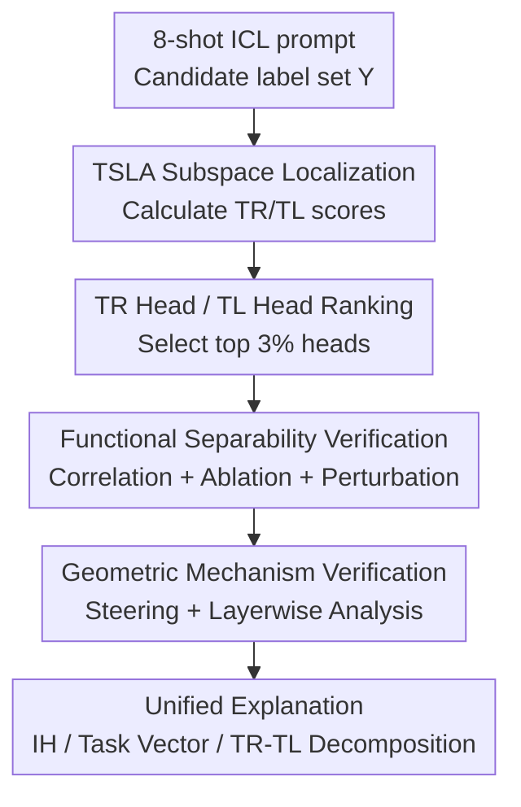

# Localizing Task Recognition and Task Learning in In-Context Learning via Attention Head Analysis

**Conference**: ICLR 2026  
**OpenReview**: [https://openreview.net/forum?id=gdvOF1OMa7](https://openreview.net/forum?id=gdvOF1OMa7)  
**Code**: https://github.com/HLYang2001/Localizing_TR_TL  
**Area**: Interpretability / Mechanistic Interpretability / In-Context Learning  
**Keywords**: Attention Head Analysis, Task Recognition, Task Learning, TSLA, ICL Mechanism  

## TL;DR
This paper proposes Task Subspace Logit Attribution (TSLA) to localize Task Recognition (TR) and Task Learning (TL) in in-context learning to different attention heads. Through correlation, ablation, input perturbation, task vector steering, and geometric analysis of hidden states, the authors demonstrate that TR heads are responsible for pulling states toward the task label subspace, while TL heads steering toward the correct labels within that subspace.

## Background & Motivation
**Background**: Mechanistic interpretation of ICL roughly follows two paths. One is component-level Transformer circuit analysis, which views final logits as the additive contribution of internal components like attention heads and MLPs to identify key components such as induction heads, function vector heads, or task vectors. The other is holistic input perturbation analysis, which treats the model as a black box and observes what ICL learns by modifying demonstration text, labels, or mappings.

**Limitations of Prior Work**: Both routes have blind spots. Component analysis identifies "which heads are important" but often relies on accuracy drops during ablation, making it difficult to specify whether a head performs task recognition or task learning. Input perturbation analysis can decompose ICL into Task Recognition and Task Learning but cannot ground these functions in specific model components. Consequently, isolated explanations emerge for the same phenomenon: induction heads are sometimes described as copying correct labels and other times as causing induction errors; task vectors can recover zero-shot performance, but it remains unclear whether they recover "label space recognition" or the "text-to-label mapping."

**Key Challenge**: The output behavior of ICL depends on two levels simultaneously: the model must first identify the set of candidate labels for the current task and then learn the correspondence between input text and labels based on demonstrations. Focusing solely on the correct label logit mixes these two processes; focusing only on demonstration label logits is tied to specific surface labels and fails to explain whether mechanisms hold when labels are replaced with semantic equivalents (e.g., positive/negative replaced by favourable/unfavourable).

**Goal**: The authors aim to bridge the TR/TL functional decomposition proposed by Pan et al. with head-level mechanistic localization: first, by designing a scoring method that distinguishes TR and TL better than Direct Logit Attribution; second, by verifying whether identified TR/TL heads independently control the two channels under behavior, ablation, and perturbation; third, by explaining how these heads modify the residual stream from a hidden state geometric perspective.

**Key Insight**: The paper views "task labels" not as isolated tokens but as a task subspace spanned by candidate label unembeddings. Thus, TR corresponds to "whether the attention head output falls into the task label subspace," and TL corresponds to "whether the state is pushed toward the correct label relative to incorrect labels within that subspace." This perspective preserves the localizability of circuit analysis while inheriting the functional semantics of TR/TL decomposition.

**Core Idea**: Logit attribution is rewritten using the task label unembedding subspace: TR heads align hidden states with the task subspace, while TL heads increase the logit gap between correct and competitive labels within that subspace.

## Method

### Overall Architecture
The method in this paper is an analysis framework rather than a new model: it extracts the output of each attention head at the final prediction position from ICL prompts, calculates TR and TL scores using TSLA, identifies top-ranked heads as TR/TL heads, and validates their correspondence to distinct ICL functions through multiple experiments. The logic follows: "localize components via subspace scoring, then verify mechanisms via causal intervention and geometric shifts."

In implementation, the authors construct ICL prompts using the first 50 queries of each dataset to accumulate TSLA scores for each attention head. Main models include Llama3-8B, Llama3.1-8B, Llama3.2-3B, Qwen2-7B, Qwen2.5-32B, and Yi-34B; Llama3-8B is reported by default. Classification tasks include SUBJ, SST-2, TREC, MR, SNLI, RTE, and CB, typically using 8-shot ICL.

### Key Designs
**1. TSLA Subspace Localization: Decoupling Task Recognition from Surface Label Logits**

Traditional DLA directly observes the contribution of a head's output $a^l_{N,k}$ to label token logits, e.g., using $1^\top W^Y_U a^l_{N,k}$ to find TR heads. This seems natural for four-choice tasks but fails when surface labels change: "positive/negative" and "favourable/unfavourable" in sentiment tasks are semantically close, and true task recognition should not merely equate to boosting two fixed tokens.

TSLA treats the linear space spanned by candidate label unembeddings $W^Y_U$ as the task subspace and defines the TR score using the projection norm: $\|\mathrm{Proj}_{W^Y_U} a^l_{N,k}\|_2$. If a head's output falls largely within this subspace, it pushes the residual stream toward "task-relevant semantic directions" rather than arbitrarily boosting a surface token. The paper provides a theoretical guarantee on Grassmannians: under a random subspace model, a large TR score implies that the head's projection onto the task-relevant subspace is significantly larger than onto other subspaces of the same dimension with high probability.

**2. Contrastive TL Score: Rewarding Heads that Distinguish Correct from Competitive Labels**

Focusing only on the correct label logit can misidentify TL heads, as a head might boost all candidate labels simultaneously (essentially performing label-space recognition) rather than learning the mapping. The TL score puts correct and incorrect labels into a contrastive direction:

$$
\frac{\mathrm{Ave}_{y'\in Y/\{y^*\}}\left(a^{l,\top}_{N,k}(W^{y^*}_U-W^{y'}_U)\right)}{\|\mathrm{Proj}_{W^Y_U} a^l_{N,k}\|_2}.
$$

The numerator measures whether the head pushes the hidden state along the average direction of "correct label minus incorrect labels," and the denominator normalizes by the TR score to focus on discriminative directions within the task subspace. The resulting TL heads do not just "like the correct label" but widen the correct-incorrect logit gap among candidates. Geometrically, this corresponds to rotating the hidden state toward the correct label's unembedding direction within the task subspace.

**3. Dual-Channel Verification: Observing TL vs. TR via Accuracy and TR Ratio**

To avoid confusing causes with a single "accuracy drop" metric, the authors introduce the TR ratio: the proportion of predictions falling within the in-context label set $Y$. A high TR ratio with low accuracy suggests the model knows which labels to choose from but failed to learn the mapping; a low TR ratio suggests task recognition has failed. This metric allows ablation results to distinguish between two failure modes.

After selecting top 3% heads as TR/TL heads, they are ablated separately. Ablating TR heads causes the TR ratio to drop from near 100% to ~20%, leading to total accuracy collapse. Ablating TL heads drops accuracy by ~30%, but the TR ratio only decreases by ~10%. This aligns with TSLA definitions: TR heads determine if the answer is restricted to the label space, while TL heads determine which label to pick within that space.

**4. Geometric Steering: Explaining Function via Hidden State Changes**

The paper also treats the output of top TR/TL heads as task vectors and injects them into zero-shot hidden states. In classification tasks, TR-based task vectors improve zero-shot accuracy from ~9.2% to 40.4% (near ICL levels), while TL-based vectors reach only 11.2%. This suggests that for fixed-label classification, the bottleneck of poor zero-shot performance is insufficient task recognition.

Geometric experiments show that TR outputs significantly increase the cosine alignment between hidden states and the task subspace (e.g., from 0.15 to 0.29). TL outputs primarily increase the logit difference (e.g., from 3.92 to 5.28) without significantly improving subspace alignment. The authors interpret the TR/TL division as two geometric actions: TR pushes the point cloud toward the task label subspace, and TL rotates it toward the correct label direction within that subspace.

## Key Experimental Results

### Main Results
| Setting | Metric | Key Results | Interpretation |
|--------|------|----------|------|
| TR heads vs IHs | Jaccard / Kendall / Spearman | TR-IH correlation is significantly higher than TR-TL or TL-IH | IHs primarily correspond to task recognition rather than true mapping learning |
| Top 10% IH position in ranking | Conditional Mean Percentage | Top 10% IHs correspond to top 20% TR heads but only top 50% TL heads | High IH scores resemble high TR scores |
| Cross-dataset consistency | Norm. Kendall / Spearman / Jaccard | TR heads and IHs are more stable across tasks; TL heads show weaker correlation | TR is a task-invariant label space mechanism; TL relies on specific mappings |
| Classification Task Vector Steering | Zero-shot accuracy | TR TV: 9.2% → 40.4%; TL TV: 9.2% → 11.2%; Random TV: 9.2% → 9.5% | Recovering TR is more critical than TL in fixed-label classification |
| Generation Task Vector Steering | LLM Rating | ICL: 7.99, ZS: 3.92, TL TV: 5.12, TR TV: 3.37, Random TV: 4.44 | TL is more useful for mapping learning in open-ended generation |

### Ablation Study
| Configuration | Key Metric | Description |
|------|---------|------|
| ICL baseline | High ACC and TR ratio | Standard 8-shot ICL identifies label space and learns mappings |
| w/o TR heads | TR ratio drops from ~100% to ~20%; ACC collapses | Model stops outputting candidate labels; TR fails |
| w/o TL heads | ACC drops ~30%; TR ratio drops ~10% | Model knows the label set but guesses randomly within it |
| w/o IH heads | Similar to w/o TR heads | IH function can be interpreted as a subset or manifestation of TR |
| w/o random heads | Minimal impact | Confirms mechanism is not distributed across any arbitrary 3% of heads |
| DLA-selected TL heads ablation | Fails to produce expected TL failure mode | DLA tends to select general TR-like heads rather than true TL heads |

### Key Findings
- TR heads are deeper and more task-stable, often overlapping with Induction Heads; TL heads have a layer distribution similar to IHs but weak overlap, suggesting that "attending to demonstration labels" is distinct from "picking the correct label for the query."
- At the attention level, TR heads have higher average weights on demonstration label tokens, while TL heads have stronger weights on query tokens.
- Input perturbations support functional independence: shuffling demonstration text pre-breaks TL, making TL ablation redundant; replacing labels with numbers weakens the impact of original TR head ablation.
- Geometric evidence: TR outputs correlate highly with subspace alignment ($\rho=0.94$ in Llama3-8B), while TL outputs correlate with logit-difference updates ($\rho=0.53$).

## Highlights & Insights
- The major highlight is advancing the TR/TL decomposition from an "input perturbation phenomenon" to "head-level components." It assigns geometric meaning: TR is proximity to the task subspace; TL is discriminative rotation within it.
- TSLA offers a valuable correction to DLA. DLA confuses "boosting all labels" with "boosting the correct label relatively"; TSLA separates these via subspace projection and contrastive directions.
- TR ratio is a simple yet effective diagnostic tool, distinguishing "off-label" errors from "incorrect label" errors.
- It provides a clear re-interpretation of Induction Heads: IHs are not merely "correct label copiers" but key components of the TR mechanism that lock in the label space. This explains why IH ablation causes massive drops and why some IHs lead to false induction.

## Limitations & Future Work
- The main focus remains on classification tasks. Open generation experiments (Review, SubjQA) are currently limited in diversity and evaluation reliability.
- TSLA depends on enumerable candidate label subspaces. Defining subspaces for open-ended or long-text labels remains a challenge.
- Thresholds like "top 3%" were analyzed for sensitivity, but defining "how many heads constitute a mechanism" is still an open question.
- The geometric interpretation is primarily linear (unembedding space). The role of MLPs, Layer Norm, and non-linearities in downstream layers requires further study.

## Related Work & Insights
- **vs. Pan et al.**: This work inherits the TR/TL functional decomposition but localizes it to heads and provides geometric explanations.
- **vs. Induction Head Research**: IHs are found to be highly correlated with TR heads, primarily contributing to label space identification rather than mapping learning.
- **vs. Function/Task Vectors**: TR heads provide more effective vectors in classification, whereas TL heads are more critical in generation tasks.
- **Insight**: To control ICL, one can intervene in specific channels—enhancing subspace alignment for classification or input-output mapping directions for generation.

## Rating
- Novelty: ⭐⭐⭐⭐☆ Clear geometric unification of TR/TL, IH, and task vectors.
- Experimental Thoroughness: ⭐⭐⭐⭐☆ Covers multiple models, datasets, and causal interventions, though generation tasks could be broader.
- Writing Quality: ⭐⭐⭐⭐☆ Clear structure and logic.
- Value: ⭐⭐⭐⭐⭐ Highly valuable for researchers in mechanistic interpretability and task vectors.

<!-- RELATED:START -->

## Related Papers

- [\[ICLR 2026\] Understanding Task Vectors in In-Context Learning: Emergence, Functionality, and Limitations](understanding_task_vectors_in_in-context_learning_emergence_functionality_and_li.md)
- [\[ICLR 2026\] Domain Expansion: A Latent Space Construction Framework for Multi-Task Learning](domain_expansion_a_latent_space_construction_framework_for_multi-task_learning.md)
- [\[ICLR 2026\] Task Vectors, Learned Not Extracted: Performance Gains and Mechanistic Insights](task_vectors_learned_not_extracted_performance_gains_and_mechanistic_insights.md)
- [\[ACL 2026\] SITE: Soft Head Selection for Injecting ICL-Derived Task Embeddings](../../ACL2026/interpretability/soft_head_selection_for_injecting_icl-derived_task_embeddings.md)
- [\[ICLR 2026\] Comparing the learning dynamics of in-context learning and fine-tuning in language models](comparing_the_learning_dynamics_of_in-context_learning_and_fine-tuning_in_langua.md)

<!-- RELATED:END -->
