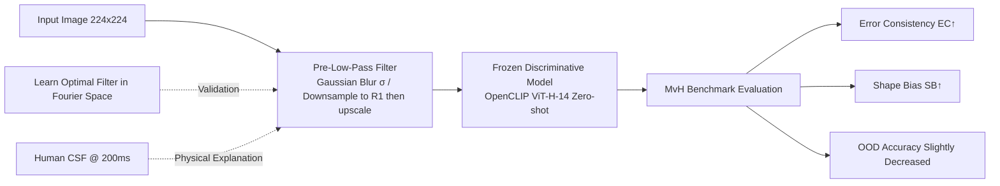

# Low-Pass Filtering Improves Behavioral Alignment of Vision Models

**Conference**: ICLR 2026  
**OpenReview**: [https://openreview.net/forum?id=YhgBy6jTR8](https://openreview.net/forum?id=YhgBy6jTR8)  
**Code**: Based on [model-vs-human](https://github.com/bethgelab/model-vs-human) and OpenCLIP  
**Area**: Visual Model Interpretability / Human-AI Behavioral Alignment / Cognitive Science  
**Keywords**: Behavioral Alignment, Low-Pass Filtering, Error Consistency, Shape Bias, Contrast Sensitivity Function (CSF), model-vs-human  

## TL;DR
The authors discovered that the highly human-like visual behavior of Imagen-like models, previously attributed to "generative objectives," actually stems primarily from an inconspicuous downsampling operation (equivalent to low-pass filtering). By simply applying Gaussian blur to input images at **test time**, standard discriminative CLIP models can achieve new SOTAs on the model-vs-human benchmark, halving the human-AI alignment gap.

## Background & Motivation
**Background**: Although Deep Neural Networks (DNNs) show strong performance on vision benchmarks, they remain inadequate as "computational models of the human visual system." Typical gaps manifest in two ways: a lack of **shape bias** (humans classify images with conflicting cues by shape, while DNNs rely on texture) and low **error consistency** (images difficult for DNNs are not the same as those difficult for humans). The community utilizes the model-vs-human (MvH) benchmark to quantify this behavioral alignment.

**Limitations of Prior Work**: Jaini et al. (2023) reported that the generative model Imagen achieved the most human-like behavior to date (error consistency 0.31, shape bias 0.99) and hypothesized that the **generative objective itself** drives this human-like tendency. This explanation is part of a larger debate: Is human vision a discriminative bottom-up system (Helmholtz’s inverse inference) or a generative system with top-down priors (predictive coding)? If Imagen aligns with humans because of its generative objective, it suggests the human cortex also relies on generative principles.

**Key Challenge**: However, Imagen involves an overlooked processing step—it downsamples inputs to $64\times64$ instead of $224\times224$, **which is equivalent to a low-pass filter**. It is well-known that the human optical system and early neural processing act as low-pass/band-pass filters, particularly under the 200ms short presentation time used in MvH, which more closely resembles a low-pass filter. Thus, whether the alignment is due to the generative objective or simple low-pass filtering became a falsifiable competing hypothesis.

**Goal**: To examine the impact of "test-time low-pass filtering" on behavioral alignment (as opposed to prior work training on blurred images) and provide an alternative explanation for Imagen's alignment. **Core Idea**: The essence of behavioral alignment is not model architecture or training objectives, but **matching the spectrum seen by the model to the spectrum received by the human visual cortex**—which can be achieved simply by adding a low-pass filter during inference.

## Method

### Overall Architecture
The method is minimalist: a low-pass filter is "prepended" to a frozen discriminative vision model (OpenCLIP ViT-H-14, zero-shot), followed by evaluation of Error Consistency (EC), Shape Bias (SB), and OOD accuracy on the MvH benchmark. The authors provide a four-layer progressive argument: ① Implementing low-pass filtering via Gaussian blur and downsampling to observe alignment changes across intensities; ② **Learning** an optimal filter in Fourier space that maximizes EC to verify its low-pass shape; ③ Aligning the optimal Gaussian with the human Contrast Sensitivity Function (CSF) for physical interpretation; ④ Calculating the "ceiling curve" of Pareto-optimal solutions for the MvH benchmark to reveal the intrinsic accuracy-consistency tradeoff.

### Key Designs

**1. Test-time Low-Pass Filtering: Replicating Imagen's "Humanization" with One Line of Preprocessing**
The authors implement low-pass filtering in two equivalent ways: torchvision’s `GaussianBlur` (intensity $\sigma$) and `Resize` mimicking Imagen (downsampling from $R_0\times R_0$ to $R_1\times R_1$ then bicubic upscaling, where intensity is the ratio $R_0/R_1$). The key distinction is **filtering only at test time with no retraining**: as blur intensity increases, high-frequency texture information is removed, forcing the model to rely on low-frequency shape cues. Consequently, shape bias increases monotonically, and error consistency rises from $\kappa=0.28$ to $\kappa=0.37$ at $\sigma=2.5$, surpassing Imagen’s 0.31. This proves that Imagen’s high alignment **can be replicated without generative components**—a standard ResNet-101 with a $\sigma=3.0$ filter achieves a shape bias of 0.8, whereas Jaini et al. retrained a ResNet-50 with diffusion noise augmentation to reach 0.78.

**2. Learning Optimal Filters in Fourier Space: Verifying the "Low-Pass Optimal Solution"**
Beyond proving that low-pass filtering is helpful, the authors ask: "**What does the optimal filter look like?**" They freeze CLIP and learn a filter $G_\theta$ in the Fourier domain to directly maximize error consistency with humans. To respect Hermitian symmetry (modifying magnitude only, not phase), they parameterize the $224\times224$ DFT matrix using a $112\times112$ real matrix for the top-left quadrant, with other quadrants derived via complex conjugation. The similarity and loss for a single image are:
$$s_i = \mathrm{sim}\big(f_I(\mathcal{F}^{-1}(\mathcal{F}(x)*b_\gamma(G_\theta))),\, f_T(y_i)\big),\quad L(x)=H\big(\sigma(s/\tau),\hat{y}\big)+\lambda\|\theta\|_1.$$
With fewer than 12,000 MvH images for 12,544 parameters, overfitting to "adversarial noise" is a risk. They employ L1 sparsity regularization ($\lambda=5\times10^{-5}$), apply a blur to the filter itself ($\gamma=6.0$) to enforce smoothness, and introduce a learnable temperature $\tau$ to amplify CLIP's proximity signals. The learned filter spectrum is clearly concentrated in low frequencies—confirming that the **optimal solution is indeed a low-pass filter**.

**3. Physical Explanation via CSF: Low-Pass Works Because It "Simulates the Human Eye"**
Why is low-pass exactly what is needed? The authors align the spectrum of the optimal Gaussian with the human **Contrast Sensitivity Function (CSF)**. The CSF describes the inverse of the contrast threshold for sinusoidal gratings across spatial/temporal frequencies; under a 200ms presentation, the CSF degrades from band-pass to approximately low-pass. They use a WRMSE metric weighted by the natural image power spectrum $P(f)=f^{-\beta}$ ($\beta\approx2$) to measure goodness-of-fit:
$$L_{\mathrm{WRMSE}}=\sqrt{\frac{\int_{f_{\min}}^{f_{\max}} f^{-\beta}(\mathrm{CSF}(f)-G(f))^2\,df}{\int_{f_{\min}}^{f_{\max}} f^{-\beta}\,df}}.$$
Results: The best-fitting Gaussian $\sigma\approx2.5\text{px}$ coincides exactly with the empirical $\sigma$ that maximizes EC. Furthermore, **using the CSF directly as a filter** yields an EC of 0.365, statistically indistinguishable from the optimal Gaussian. This suggests low-pass filtering works by transforming model inputs into what the human visual cortex actually receives (filtered by eye optics and early retina/LGN neural transformations).

**4. Accuracy-Consistency Tradeoff and Pareto Frontier: Calibrating the Benchmark Ceiling**
The authors reveal a structural contradiction within MvH: OOD accuracy and error consistency cannot be maximized simultaneously. To reach the maximum human EC (0.674), OOD accuracy must be suppressed to 0.67; as OOD accuracy approaches 100%, EC approaches 0. This forms a smooth Pareto-optimal curve (frontier). Because these values are optimal and fixed, they represent a true ceiling for MvH—proving the benchmark is **far from saturated**. The philosophical implication is that a machine achieving superhuman accuracy must use features humans do not, thus diverging behaviorally from humans; imposing constraints via low-pass filtering trades accuracy for alignment.

## Key Experimental Results

### Main Results (MvH Benchmark, OpenCLIP ViT-H-14 as Reference)

| Model | Error Consistency ↑ | Shape Bias ↑ | OOD Accuracy ↑ |
|------|------------|-----------|------------|
| Human (Mean) | 0.43 | 0.96 | 0.72 |
| ViT-22B-384 | 0.26 | 0.87 | 0.80 |
| OpenCLIP ViT-H-14 (Baseline) | 0.28 | 0.60 | 0.78 |
| Imagen (Prev. SOTA, Generative) | 0.31 | 0.99 | 0.71 |
| ViT-H-14 + Resize(64×64) [Ours] | 0.35 | 0.91 | 0.75 |
| ViT-H-14 + Blur(σ=2.5) [Ours] | **0.37** | **0.96** | 0.72 |
| ViT-H-14 + Learned Fourier Filter [Ours] | **0.38** | 0.95 | 0.73 |

### Ablation Study

| Dimension | Setting | Key Findings |
|------|------|---------|
| Blur Intensity Scan | σ increasing from 0 | SB increases monotonically; EC rises to a "breakpoint" then falls |
| Implementation | Gaussian Blur vs. Downsampling | Trends are consistent; Blur is more effective (EC 0.37 vs 0.35) |
| OOD Accuracy Cost | σ=2.5 / Resize 64 | Only 6pp / 3pp drop, not catastrophic |
| Cross-model Generalization | ResNet/BiT-M/ViT/Noisy Student/Multiple OpenCLIPs | SB and EC improve for almost all models; CLIP with small patch(14) gains most |
| Direct CSF Filter | — | EC=0.365, surpassing Imagen and indistinguishable from optimal Gaussian |
| No Training Required | ResNet-101 + σ=3.0 LPF | SB=0.8, surpassing retrained ResNet-50 (0.78) |

### Key Findings
- Test-time blurring (σ=2.5) increases EC from 0.28→0.37, **surpassing Imagen’s 0.31** and halving the Human-AI alignment gap.
- Shape bias **increases monotonically** with low-pass filtering, while error consistency has a **breakpoint** (excessive blur leads to decline).
- The spectra of the learned optimal filter, the optimal Gaussian, and human CSF@200ms are highly consistent, with σ values converging around ~2.5px.
- The maximum possible EC for MvH is 0.674 (corresponding to OOD acc 0.67), indicating the benchmark is far from saturated.

## Highlights & Insights
- **One downsampling operation debunks a grand narrative**: The philosophical debate of "Generative vs. Discriminative Vision" is reduced to an engineering detail of "low-pass filtering." This is highly persuasive and computationally cheap (a single line of test-time preprocessing with zero training).
- **Triple Cross-Validation**: The empirical optimal σ, the gradient-learned filter, and human CSF fitting all point toward a ~2.5px low-pass filter, making the argument extremely robust.
- **First Calibration of the MvH Ceiling**: By calculating the Pareto frontier, the question of benchmark saturation is moved from speculation to a definite conclusion, providing methodological value for future alignment research.
- **Counter-intuitive Alignment View**: The proposed method suggests that the price of alignment is the sacrifice of some accuracy—superhuman accuracy necessitates the use of non-human features, leading to behavioral divergence.

## Limitations & Future Work
- Low-pass filtering sacrifices OOD accuracy (though not catastrophically); how to improve alignment without dropping accuracy remains an open question (there is still room for improvement on the Pareto frontier).
- Learning Fourier filters allows for rotational asymmetry, leading to artifacts that suggest overfitting; the "upper bound" of the optimal filter shape is still noisy.
- Conclusions are primarily based on the MvH benchmark, which has known flaws (SB can be trivially inflated, and EC has high noise).
- The CSF explanation is based on a specific experimental paradigm (200ms short presentation + backward masking); whether it generalizes to long presentations or natural viewing conditions remains to be verified.

## Related Work & Insights
- **Direct Comparison**: Jaini et al. (2023) attributed Imagen’s alignment to generative objectives; this paper provides an alternative explanation via low-pass filtering and refutes the previous claim empirically.
- **Training-time vs. Test-time Blur**: Previous work (Jinsi 2023; Jang & Tong 2024; Lu 2025) trained on low-pass images, with EC often remaining below 0.2; this paper proves that **test-time** filtering is significantly more effective.
- **Visual System Frequency Tuning**: Building on the channel theory of Campbell & Robson (1968), Kelly’s CSF (1979), and discoveries of human-like CSF in DNNs (Li 2022; Akbarinia 2023), this work adds the missing link: short-presentation tasks require additional low-pass adaptation.
- **Insight**: Injecting "physical constraints imposed by the human brain" as regularizers/priors into models may be a more fundamental path to behavioral alignment than scaling data or changing architectures; it also reminds researchers to exclude confounding variables like preprocessing when evaluating human-likeness.

## Rating
- Novelty: ⭐⭐⭐⭐⭐ — Sharp and counter-intuitive insight that uses an overlooked downsampling operation to overturn the mainstream explanation of "generative objective-driven alignment."
- Experimental Thoroughness: ⭐⭐⭐⭐ — Integrated verification across models, implementations, learned filters, CSF fitting, and Pareto frontiers; slightly limited by its focus on the MvH benchmark.
- Writing Quality: ⭐⭐⭐⭐⭐ — Clear logic chain from hypothesis to testing to explanation; physical motivation and machine learning evidence are naturally connected.
- Value: ⭐⭐⭐⭐⭐ — Refreshes the SOTA while clarifying a core debate in visual science and calibrating benchmark ceilings; significant for both the cognitive science and interpretability communities.

<!-- RELATED:START -->

## Related Papers

- [\[ICLR 2026\] Sequences of Logits Reveal the Low Rank Structure of Language Models](sequences_of_logits_reveal_the_low_rank_structure_of_language_models.md)
- [\[ICLR 2026\] Inducing Dyslexia in Vision Language Models](inducing_dyslexia_in_vision_language_models.md)
- [\[ICLR 2026\] MICLIP: Learning to Interpret Representation in Vision Models](miclip_learning_to_interpret_representation_in_vision_models.md)
- [\[ICLR 2026\] Towards Cognitively-Faithful Decision-Making Models to Improve AI Alignment](towards_cognitively-faithful_decision-making_models_to_improve_ai_alignment.md)
- [\[ICLR 2026\] Why Low-Precision Transformer Training Fails: An Analysis on Flash Attention](why_low-precision_transformer_training_fails_an_analysis_on_flash_attention.md)

<!-- RELATED:END -->
