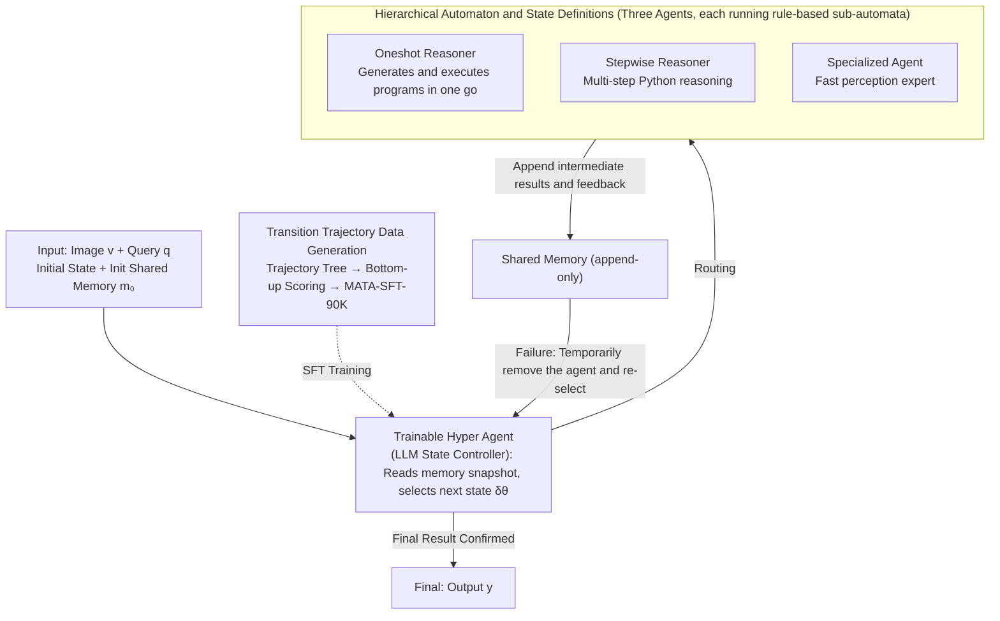

# MATA: A Trainable Hierarchical Automaton System for Multi-Agent Visual Reasoning

**Conference**: ICLR 2026  
**arXiv**: [2601.19204](https://arxiv.org/abs/2601.19204)  
**Code**: [GitHub](https://github.com/ControlNet/MATA)  
**Area**: Interpretability  
**Keywords**: Multi-Agent Systems, Hierarchical Finite State Automaton, Visual Reasoning, Trainable State Controller, Cooperation and Competition

## TL;DR

The paper proposes MATA (Multi-Agent hierarchical Trainable Automaton), which models multi-agent visual reasoning as a hierarchical finite state automaton. Top-level state transitions are learned by a trainable hyper agent (an LLM-based state controller), while each individual agent employs a rule-based sub-automaton. Through shared memory, the system enables cooperation and competition, achieving SOTA on multiple visual reasoning benchmarks.

## Background & Motivation

Visual reasoning requires models to interpret relationships between entities in a visual scene. Current methods face several issues:

**End-to-End VLMs**: Implicit reasoning processes are difficult to audit; these models often hallucinate during complex queries involving spatial relationships or counting.

**Compositional Methods** (e.g., ViperGPT, HYDRA): Although they improve interpretability, most utilize single-agent or hand-crafted pipelines.

**Multi-Agent Methods**: Agents are typically assigned disjoint roles with hard-coded pipeline connections, failing to handle error propagation or support competition between agents with overlapping functions.

**Rigidity of Rule-Based Transitions**: Hand-written transition functions become increasingly difficult to define as the number of states grows.

**Core Problem**: How can a system learn when to invoke which agent? The authors model this decision-making process as learning the transition function of a finite state automaton.

## Method

### Overall Architecture

MATA addresses the scheduling problem: "When a visual reasoning query arrives, which agent should be dispatched, when to switch agents, and when to terminate and output." It organizes the reasoning process as a **hierarchical Mealy machine** $\mathcal{M}_\theta = (S, S_0, \Sigma, \Lambda, \delta_\theta, \Gamma)$. At the top level (hyper automaton), each agent is treated as a state, and a trainable hyper agent (LLM-based state controller) learns the transitions $\delta_\theta$ between states. At the bottom level, each agent operates using a rule-based sub-automaton responsible for reliable micro-execution. During runtime, the hyper agent reads a snapshot of shared memory at each step to decide the next state; the selected agent executes its sub-automaton, appends intermediate results to the shared memory, and returns control. This cycle continues until the Final state is reached to output the answer. The rationale for delegating "inter-agent transitions" to learning while keeping "intra-agent steps" rule-based is that the former involves ambiguous criteria that scale poorly with manual rules, while the latter consists of clear, easily definable steps.

### Key Designs

**1. Hierarchical Automaton and State Definitions: Turning "Agent Selection" into Automaton State Transitions**

The system state set $S = S_{\text{agent}} \cup S_{\text{life}}$ is categorized into two types. $S_{\text{agent}} = \{\text{Oneshot}, \text{Stepwise}, \text{Specialized}\}$ consists of three agents, each representing a reasoning path that forms a spectrum from "perception" to "fast thinking" to "slow thinking": Specialized Agent is a System-1 style fast perception expert (object detection, simple QA); Oneshot Reasoner generates and executes programs in one go for direct queries; Stepwise Reasoner generates Python programs step-by-step for complex multi-step reasoning. $S_{\text{life}} = \{\text{Initial}, \text{Final}, \text{Failure}\}$ are lifecycle states for initialization, final output, and exception coordination, with $S_0 = \text{Initial}$. By mapping agents to states, "when to call which agent" naturally becomes a transition problem. Each agent's internal logic is handled by a rule-based sub-automaton (LLM/VLM prompts, validator checks, tool I/O) to manage micro-control before returning to the top level.

These agents are designed for both **cooperation and competition**. Cooperation means that when control is transferred, the successor reads the full history and feedback from shared memory. Competition means agents with overlapping functions can vie for the same task. If an agent gets stuck or reports an unrecoverable error, the system **temporarily removes** it from the current candidates, forcing the hyper agent to re-select from the remainder. This "failure-as-rerouting" mechanism transforms single points of failure into recoverable path switching.

**2. Shared Memory: A Traceable Carrier for Collaboration and Auditing**

All agents read and write to a single structured shared memory $m_t$, accumulating intermediate variables, perception results, program history, and feedback. It is **append-only**: an agent appends new content $\Delta m_t$ after its turn, resulting in $m_{t+1} = m_t \cup \Delta m_t$. This design ensures that subsequent agents have full context for collaboration and that the reasoning trajectory remains fully traceable and auditable. Crucially, this memory is the **sole** observation input for the hyper agent: at each step, it selects the next state $s_{t+1} = \delta_\theta(s_t, m_t)$ based on $m_t$.

**3. Trainable Hyper Agent: Learning Transition Functions with LLMs**

The top-level transition function $\delta_\theta$ is no longer a set of hand-written if-else rules but a trainable LLM-based hyper agent $\mathcal{F}_\theta$ acting as a state transition controller. Since LLMs process text, $m_t$ is formatted into a prompt $x_t$ using a template. $\mathcal{F}_\theta$ then maps this to a distribution over **currently available candidate states**, and the next state $s_{t+1}$ is chosen via greedy decoding or sampling. This replaces manual rules, which are difficult to scale, with an automated scheduling policy that continues in the face of uncertainty and only transitions to Final when confident.

**4. Transition Trajectory Data Generation (MATA-SFT-90K): Creating Supervision Signals**

To train the hyper agent, labels identifying the optimal agent for a given memory state are required. The paper generates this data using a transition-trajectory tree. First, (image, query) pairs are sampled from GQA, OK-VQA, and RefCOCO datasets. The automaton runs by expanding all possible $s_{t+1} \in S$ at each decision node, executing their sub-automata, and saving memory checkpoints until reaching Final leaves, where $\Gamma$ gives the prediction $\hat{y}$. Second, a bottom-up scoring is applied: leaf nodes are scored based on metrics (Acc for VQA, IoU for VG), and non-leaf nodes propagate the maximum child value:

$$V(s) = \begin{cases} \text{metric}(\hat{y}_s, y), & s \in \text{Leaves} \\ \max_{s' \in \text{Child}(s)} V(s'), & \text{otherwise} \end{cases}$$

This identifies the optimal branch at each decision point. Third, prompts $x_t$ are paired with the optimal state labels to create $N = 90,854$ instruction-completion samples: MATA-SFT-90K.

## Loss & Training

A Qwen3 4B is trained as the LLM state controller using standard SFT loss. AdamW optimizer is used with cosine decay and 5% warmup, batch size 64, for 8 epochs. Max reasoning steps $T=15$.

Three SFT configurations: In-domain (trained on target dataset), Domain-transfer (trained on non-target datasets), and General (joint training on all data).

## Key Experimental Results

### Main Results

**GQA Dataset (Compositional VQA)**:

| Type | Method | Accuracy |
|------|------|--------|
| End-to-End | InternVL2.5 (8B) | 61.5 |
| End-to-End | InternVL3.5 (8B) | 63.8 |
| Compositional | HYDRA | 52.8 |
| Compositional | **Ours (General)** | **64.9** |

**OK-VQA Dataset (Knowledge-based VQA)**:

| Type | Method | Accuracy |
|------|------|--------|
| End-to-End | InternVL3.5 (8B) | 75.7 |
| Compositional | DWIM | 62.8 |
| Compositional | **Ours (Domain-Specific)** | **76.5** |

**Referring Expression Comprehension (RefCOCO series)**:

| Method | RefCOCO | RefCOCO+ | RefCOCOg | Ref-Adv |
|------|---------|----------|----------|---------|
| Florence2-L | 95.1 | 92.5 | 90.9 | 71.8 |
| NAVER | 96.2 | 92.8 | 91.6 | 75.4 |
| **Ours (General)** | **96.3** | **93.8** | **90.7** | **77.3** |

### Ablation Study

**Hyper Agent Components Ablation**:

| Hierarchical Automaton | Transition Strategy | SFT | GQA | OK-VQA | RefCOCO | Inference Latency |
|-----------|---------|-----|-----|--------|---------|----------|
| ✗ | Exhaustive Ensemble | ✗ | 57.7 | 71.5 | 87.7 | 34.58s |
| ✓ | Random | ✗ | 57.1 | 71.1 | 85.3 | 6.91s |
| ✓ | LLM | ✗ | 58.5 | 75.1 | 95.8 | 8.07s |
| ✓ | LLM | ✓ | **64.9** | **76.5** | **96.3** | **8.01s** |

**Generalization Analysis**: The performance gap between domain-transfer and in-domain is less than 1%, indicating that the learned transition strategy is highly task-agnostic.

### Key Findings

1. **Compositional methods surpass same-scale E2E VLMs for the first time**: MATA exceeds InternVL3.5 on GQA and OK-VQA.
2. **Significant Gain from SFT**: SFT on only 90k samples improves GQA accuracy from 58.5% to 64.9% (+6.4%).
3. **Small models excel at scheduling**: A 0.6B model via SFT achieves in-domain performance close to the 4B model.
4. **Cooperation + Competition > Pure Cooperation**: The three-agent design allows competition; if one fails, another takes over.
5. **Learning Transition >> Rule-based Transition**: MATA achieves a 1.9% Gain over the rule-based NAVER on Ref-Adv.

## Highlights & Insights

- **Formal Elegance**: Modeling multi-agent scheduling as learning transition functions of a Mealy machine maintains interpretability while gaining flexibility.
- **Hierarchical Division**: Clearly separates "what to learn" (inter-agent transitions) from "what to regularize" (intra-agent steps).
- **Data Generation Pipeline**: The transition-trajectory tree + bottom-up scoring + SFT data generation provides a generalizable framework for multi-agent policy learning.
- **System 1 + System 2**: The Specialized/Oneshot/Stepwise design echoes the fast/slow thinking systems in cognitive science.

## Limitations & Future Work

1. Scalability of Trajectory Tree Search: While feasible for 3 agents, search costs grow exponentially as agents increase.
2. Inference Latency: Average of 8s/query is still high for real-time applications.
3. Base Model Dependency: Performance ceiling is limited by the underlying VLM and detector.
4. Simplicity of Failure Recovery: Current handling is limited to removing the failed agent; more complex recovery strategies could be investigated.
5. Limited Data Sources: SFT data is derived from only five datasets.

## Related Work & Insights

MATA follows the evolution from ViperGPT to HYDRA to NAVER, representing the first to implement a learnable multi-agent transition strategy. Compared to other LLM multi-agent methods like MetaGPT, it has higher formalization and supports competition. The trajectory tree generation resembles Monte Carlo Tree Search but focuses on agent selection.

## Rating

- **Novelty**: ⭐⭐⭐⭐⭐ — Hierarchical automaton with a trainable transition function is novel and formally sound.
- **Technical Quality**: ⭐⭐⭐⭐⭐ — The Mealy machine formulation, trajectory tree generation, and SFT pipeline are well-integrated.
- **Experimental Thoroughness**: ⭐⭐⭐⭐⭐ — Strong comparisons across multiple benchmarks, detailed ablations, and generalization analysis.
- **Value**: ⭐⭐⭐⭐ — Highly general framework, though inference costs remain an issue.
- **Writing Quality**: ⭐⭐⭐⭐⭐ — Clear formalization and rigorous presentation.
- **Overall**: ⭐⭐⭐⭐⭐ (9.0/10)

<!-- RELATED:START -->

## Related Papers

- [\[AAAI 2026\] ToC: Tree-of-Claims Search with Multi-Agent Language Models](../../AAAI2026/interpretability/toc_tree-of-claims_search_with_multi-agent_language_models.md)
- [\[NeurIPS 2025\] AgentiQL: An Agent-Inspired Multi-Expert Framework for Text-to-SQL Generation](../../NeurIPS2025/interpretability/agentiql_an_agent-inspired_multi-expert_framework_for_text-to-sql_generation.md)
- [\[ICLR 2026\] SEED-SET: Scalable Evolving Experimental Design for System-level Ethical Testing](seed-set_scalable_evolving_experimental_design_for_system-level_ethical_testing.md)
- [\[ICLR 2026\] RADAR: Reasoning-Ability and Difficulty-Aware Routing for Reasoning LLMs](radar_reasoning-ability_and_difficulty-aware_routing_for_reasoning_llms.md)
- [\[NeurIPS 2025\] Time-Evolving Dynamical System for Learning Latent Representations of Mouse Visual Cortex](../../NeurIPS2025/interpretability/time-evolving_dynamical_system_for_learning_latent_representations_of_mouse_visu.md)

<!-- RELATED:END -->
