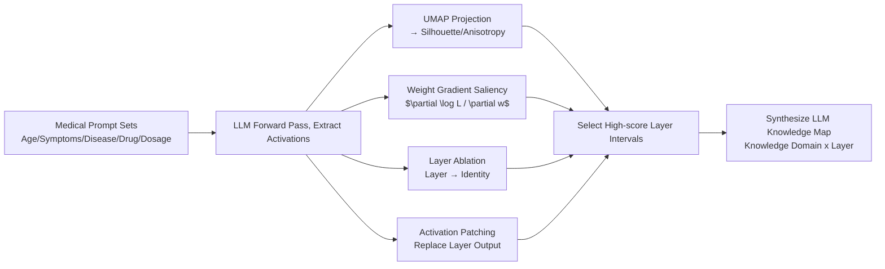

# Medical Interpretability and Knowledge Maps of Large Language Models

**Conference**: ICLR 2026  
**OpenReview**: [https://openreview.net/forum?id=BhqFWlYKUi](https://openreview.net/forum?id=BhqFWlYKUi)  
**Code**: [https://github.com/TheLumos/medical-interpretability-llms](https://github.com/TheLumos/medical-interpretability-llms)  
**Area**: Mechanistic Interpretability / Medical LLMs  
**Keywords**: Mechanistic Interpretability, Knowledge Localization, UMAP, Activation Patching, Layer Ablation, Medical Knowledge  

## TL;DR
The authors systematically scanned 5 open-source LLMs using four interpretability techniques (UMAP projection, weight gradient saliency, layer ablation, and activation patching) to construct "Medical Knowledge Maps." These maps localize age, symptoms, diseases, drugs, and dosages to specific model layers, revealing phenomena such as non-linear age manifolds and circular, non-monotonic representations of disease progression.

## Background & Motivation
**Background**: Mechanistic interpretability has gained significant attention recently. However, most research focuses on general knowledge (syntax, induction heads, factual recall) and often assumes that features are linearly separable (linear representation hypothesis).

**Limitations of Prior Work**: There is minimal systematic research on how LLMs represent and process **medical** knowledge. Existing works on medical interpretability have limitations: they either rely on the model to explain its own diagnostic decisions, focus on a single model (e.g., MedLlama-8B, OpenBioLLM-70B), or use a single technique (e.g., t-SNE visualization). No study has performed cross-validation across multiple medical domains, techniques, and models, making it difficult to determine the robustness of conclusions or common representations across different LLMs.

**Key Challenge**: Medical scenarios demand high levels of safety and trust (as hidden biases can endanger patients), yet internal knowledge localization and processing remain poorly understood. Evidence from single techniques or models is insufficient to draw definitive conclusions.

**Goal**: To systematically characterize the layer-wise distribution of medical knowledge in 5 open-source LLMs (Llama3.3-70B, Gemma3-27B, MedGemma-27B, Qwen-32B, GPT-OSS-120B) and produce "Knowledge Maps" to guide subsequent fine-tuning, debiasing, or unlearning.

**Core Idea**: **Multi-technique Cross-localization** — utilizing four interpretability methods with different assumptions to identify layer intervals, using their intersection to increase confidence in knowledge localization. **Knowledge Maps (LLM Map)** — visualizing results as a 2D map of "Knowledge Domain $\times$ Layer."

## Method

### Overall Architecture
For each medical domain (age, symptoms, disease, progression, drug therapy, dosage), a corresponding prompt set is constructed. LLMs process these prompts while four interpretability analyses run in parallel to extract quantitative metrics. the continuous layer intervals with the highest metrics are then overlaid into a single knowledge map. Since the four methods have different assumptions (clustering structure, gradient sensitivity, causal ablation, and causal patching), a knowledge localization is only confirmed if there is cross-method consistency.

### Key Designs

**1. UMAP Projection + Silhouette/Anisotropy Quantification: Converting "Clustering Structure" into Comparable Layer Scores.** Intermediate activations are projected to 30 dimensions using UMAP (and 2 dimensions for visualization). The Silhouette score $s(i)=\frac{b(i)-a(i)}{\max(a(i),b(i))}$ measures how well labeled activations are separated—$a(i)$ is the mean intra-cluster distance and $b(i)$ is the mean nearest-cluster distance. A higher score indicates the layer effectively separates concepts by medical labels (e.g., symptom categories). Silhouette is preferred over K-means to avoid clustering noise. For continuous variables like age, **local anisotropy** $A_i=1-\lambda_2/\lambda_1$ (where $\lambda_1\ge\lambda_2$ are the top eigenvalues of the local covariance of 20-nearest neighbors) measures the "one-dimensionality" of the age manifold. All metrics use bootstrap resampling for confidence intervals.

**2. Weight Gradient Saliency: Inferring Active Layers from "Parameter Sensitivity to Loss."** The gradient $\frac{\partial \log L}{\partial w}$ is computed for each layer. The saliency of weights in attention heads and MLPs is averaged to obtain layer-wise saliency, which is then averaged across prompts with confidence intervals. High-saliency layers are candidates for active knowledge processing.

**3. Layer Ablation + LLM-as-judge: Using Causal Deletion to Verify Necessity.** A specific layer is replaced with an identity mapping $I_n$ (effectively removing its transformation). GPT-4o then rates the "response degradation" on a scale of 1–10 (1 = no change, 10 = complete gibberish). Severe degradation indicates the layer's criticality, analogous to lesion studies in neuroscience.

**4. Activation Patching: Using Causal Intervention to Localize Attribution.** Three forward passes—clean, corrupted, and patched—are performed. An output from a corrupted run is replaced by the output from a clean run at a specific layer. Patching effectiveness is measured by the normalized logit difference $P=\frac{LD_{pt}-LD_*}{LD_{cl}-LD_*}$, where $LD(r,r')=\text{Logit}(r)-\text{Logit}(r')$ is the logit difference between two single-token answers. $P \approx 1$ implies the layer is sufficient to restore performance.

**5. LLM Map Synthesis: Converging Four Evidences into Layer Intervals.** For UMAP (excluding age), intervals are selected where the Silhouette rate of increase is maximal within a 3-layer window after Gaussian smoothing ($\sigma=1.0$). For saliency, ablation, and patching, smoothed intervals above the 75th percentile (minimum 2 layers, max 3 segments per method) are chosen. Overlapping these intervals on a grid creates the knowledge map.

## Key Experimental Results

### Main Results: Layer-wise Optimal Metrics Across Concepts (Table 1)

| Concept | Metric | Llama 70B | Gemma 27B | MedGemma 27B | Qwen 32B | GPT-OSS 120B |
|------|------|-----------|-----------|--------------|----------|--------------|
| Age | $R^2$ Linearity ↑ | 1.00 (L3) | 0.99 (L34) | 0.98 (L24) | 0.99 (L25) | 1.00 (L1) |
| Symptoms | Silhouette ↑ | 0.19 (L63) | -0.10 (L12) | -0.08 (L12) | 0.24 (L56) | 0.23 (L31) |
| Disease | Silhouette ↑ | 0.16 (L58) | -0.01 (L61) | -0.03 (L61) | 0.21 (L60) | 0.10 (L32) |
| Drugs | Silhouette(Mech) ↑ | 0.07 (L75) | 0.03 (L45) | -0.01 (L44) | 0.03 (L62) | 0.07 (L30) |
| Drugs | Silhouette(Spec) ↑ | 0.19 (L78) | 0.05 (L44) | 0.01 (L45) | 0.06 (L58) | 0.07 (L33) |
| Dosage | Patching Eff. ↑ | 2.64 (L79) | 0.92 (L8) | 1.71 (L0) | 7.33 (L0) | 4.23 (L23) |

- **Llama3.3-70B Knowledge Map**: Age is localized to layers 0–5, symptoms to 0–9 and 15–40, diseases to 0–5 or 27–37, drugs to 15–45, and dosage largely in the first half (0–40). **Most medical knowledge is concentrated in the first half of the model.**
- Llama and Qwen show the highest Silhouette for symptoms/disease; GPT-OSS is balanced. **Gemma3-27B and MedGemma-27B score poorly across nearly all categories excluding disease progression** (Silhouette for symptoms/disease is even negative).

### Ablation Study
- **Layer Ablation**: Deleting layers in Gemma/MedGemma causes severe degradation, whereas Llama/Qwen/GPT are more robust (suggesting intra-layer redundancy).
- **Additional 6 Medical LLMs** (OpenBioLLM-70B, PMC-LLaMA-13B, ClinicalCamel-70B, etc.): Age $R^2$ is generally $\approx 1.0$, and symptom/disease Silhouette is positive, consistent with the main findings.

### Key Findings
- **Non-linear and Discontinuous Age Manifolds**: Most models achieve linear age manifolds in intermediate layers, but the manifold varies by gender and shows a clear **discontinuity** between ages 17 and 18 (likely representing a learned "minor/adult" boundary).
- **Circular, Non-monotonic Disease Progression**: Embeddings for late-stage diseases "loop back" near early stages; this is particularly evident in Parkinson's and COPD.
- **Drugs Cluster by Specialty over Mechanism**: Across most models, Silhouette (Specialty) > Silhouette (Mechanism).
- **Gemma/MedGemma Activation Collapse**: Intermediate layer activations (e.g., layer 20) collapse into a cluster in UMAP space but recover in final layers.

## Highlights & Insights
- **Methodological Contribution**: Rather than inventing new techniques, the work organizes four mature methods into a "Cross-Validation + Knowledge Map" pipeline across 11 models, addressing the pitfalls of single-model/single-technique evidence.
- **Direct Practical Value**: The knowledge map informs precisely which layers to target for fine-tuning, unlearning, or debiasing of specific medical knowledge.
- **Empirical Evidence against Linear Hypothesis**: Age discontinuity and circular disease progression serve as strong counter-examples to the assumption that all features are linear.

## Limitations & Future Work
- **Coarse Resolution**: The maps provide layer intervals rather than neuron- or circuit-level precision.
- **Proxy Metrics**: Silhouette and anisotropy are indirect proxies. Disease "circularity" is measured via "nearest stage" approximations, which depend on staging granularity.
- **LLM-as-judge Bias**: Using GPT-4o for ablation scoring introduces potential bias from the judge model.
- **Interpretability vs. Causality**: While methods are crossed, a gap remains between "knowledge existence" in a layer and "causal determination."

## Related Work & Insights
- **Mechanistic Interpretability**: Contrasts linear representation hypotheses with non-linear examples (e.g., circular features for time). This work extends the latter to medical semantics (age, disease stage).
- **Inspiration**: Knowledge maps can serve as localization tools for "precision editing/debiasing." Circular representations suggest potential for detecting model misjudgments in disease severity.

## Rating
- **Novelty**: ⭐⭐⭐⭐ — While techniques are existing, the systematic organization and specific findings (age discontinuity, disease loops) provide substantial insight.
- **Experimental Thoroughness**: ⭐⭐⭐⭐ — Covers 11 models and 6 categories of knowledge with confidence intervals. Lacks closed-loop validation of downstream editing.
- **Writing Quality**: ⭐⭐⭐⭐ — Clear structure and intuitive visualizations.
- **Value**: ⭐⭐⭐⭐ — Provides actionable maps for medical AI safety and trust.

<!-- RELATED:START -->

## Related Papers

- [\[ICLR 2026\] Precise and Interpretable Editing of Code Knowledge in Large Language Models](precise_and_interpretable_editing_of_code_knowledge_in_large_language_models.md)
- [\[ACL 2025\] Mechanistic Interpretability of Emotion Inference in Large Language Models](../../ACL2025/interpretability/mechanistic_interpretability_of_emotion_inference_in_large_language_models.md)
- [\[ACL 2026\] Knowledge Vector of Logical Reasoning in Large Language Models](../../ACL2026/interpretability/knowledge_vector_of_logical_reasoning_in_large_language_models.md)
- [\[ACL 2026\] Tracing Relational Knowledge Recall in Large Language Models](../../ACL2026/interpretability/tracing_relational_knowledge_recall_in_large_language_models.md)
- [\[ICLR 2026\] Rethinking Layer Relevance in Large Language Models Beyond Cosine Similarity](rethinking_layer_relevance_in_large_language_models_beyond_cosine_similarity.md)

<!-- RELATED:END -->
