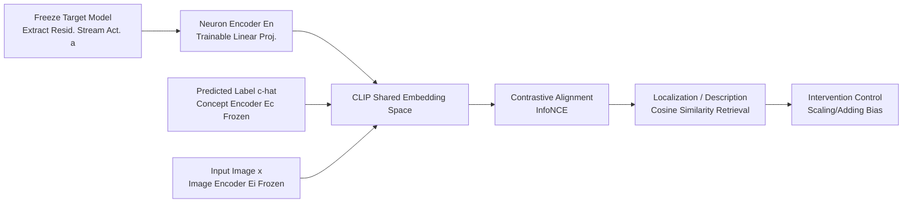

# MICLIP: Learning to Interpret Representation in Vision Models

**Conference**: ICLR 2026  
**OpenReview**: [https://openreview.net/forum?id=28Hfz8RLcD](https://openreview.net/forum?id=28Hfz8RLcD)  
**Code**: [Project Homepage](https://foundation-model-research.github.io/MICLIP)  
**Area**: interpretability and explainable AI  
**Keywords**: Mechanistic interpretability, Contrastive learning, CLIP, Neuron interpretation, Sparse Autoencoders, Model control  

## TL;DR
MICLIP adapts the CLIP contrastive learning paradigm to "internal model representations," training a neuron encoder to project neuron/SAE features into the CLIP semantic space. This bypasses the old "activation-magnitude" assumption, providing a unified framework for both interpreting and precisely controlling internal mechanisms of vision models.

## Background & Motivation
- **Background**: Mechanistic Interpretability (MI) aims to map internal units of vision models (neurons, circuits, SAE features) to human-understandable concepts. Prevailing approaches fall into two categories: activation-based (Network Dissection, CLIP-Dissect, V-Interp, which infer concepts from "highly-activating samples") and representation-based (constructing neuron/concept representations to align with the CLIP space).
- **Limitations of Prior Work**: Two deep-seated flaws exist. First, the **activation-magnitude assumption**—the default assumption that higher activation values indicate a stronger presence of a concept; in reality, increased activation does not necessarily mean the concept is involved in reasoning, and negative activation can even contribute positively to a concept's prediction. Second, it is **input-centric**—aligning internal units only with concepts appearing in the input image, rather than anchoring the causal mechanisms that actually drive model output.
- **Key Challenge**: These points lead to "unfaithful" explanations—especially when the model makes errors, input-centric methods fail to capture the causal chain behind the decision, resulting in explanations decoupled from actual model behavior.
- **Goal**: Propose a general, learnable, faithful, and controllable interpretation framework that covers both neurons and SAE features, where results can be directly used for precise intervention in model behavior.
- **Core Idea**: **Shift from "activation-correlation" to "semantic alignment"**—replacing heuristic correlations with contrastive learning to learn internal units as semantic vectors in CLIP space; **Shift from "input-centric" to "dual-anchoring of input + output"**—simultaneously aligning with input image concepts and model output predictions to reconstruct the complete "input → internal unit → output" causal trajectory.

## Method

### Overall Architecture
MICLIP freezes the target vision model, extracts activations $a_i$ from its residual stream at a specific layer along with the predicted label $\hat{c}_i$, and then trains a lightweight neuron encoder to project these activations into the frozen CLIP semantic space. After training, both internal units and concepts reside in the same embedding space, transforming "localization" (finding mechanisms for a concept) and "description" (finding concepts for a mechanism) into cosine similarity retrieval tasks. Precise control is achieved by scaling or adding biases to the localized units.

### Key Designs

**1. Mechanism-Concept Contrastive Alignment: Mapping internal units to CLIP space via InfoNCE.** This is the foundation. Given a labeled dataset $D=\{(x_i,c_i)\}$, forward passes yield activations $a_i$ and predicted concepts $\hat{c}_i$. The training objective is a symmetric InfoNCE loss composed of two terms: $L_{alignment}=L^{out}_{CLIP}(E_n(A;\theta_n), E_c(\{\hat{c}_i\})) + L^{in}_{CLIP}(E_n(A;\theta_n), E_i(X))$. Only the neuron encoder $E_n$ is trainable (mapping $a\in\mathbb{R}^n$ to a $d$-dimensional embedding), while the concept encoder $E_c$ and image encoder $E_i$ are frozen CLIP/ViT-B-16 components. The first term (neuron-concept) anchors output semantics, and the second (neuron-image) anchors input semantics—the sum realizes the "dual-anchoring" approach, ensuring unit representations align with the full causal trajectory rather than relying on heuristic probe-set correlations like CLIP-Dissect.

**2. Symmetric Retrieval in Shared Space: Unifying Localization and Description.** Post-training, units and concepts share a space, making interpretability a symmetric retrieval task. The embedding for an internal unit $u$: for the $i$-th neuron, it is $u=E_n(a_i\cdot e^{(i)})$ (where $e^{(i)}$ is the standard basis vector); for an SAE feature $f_i$, it is $u=E_n(f_i)$. Concept embeddings are $c=E_c(c)$, and both are scored using cosine similarity $sim(u,c)=\frac{u\cdot c}{\|u\|\|c\|}$. **Concept → Mechanism Localization** identifies units most responsible for concept $c$ via $L_c=\text{SelectTop-}\tau(\{sim(u_i,c)\})$; **Mechanism → Concept Description** finds the most fitting concept $D_u=\text{SelectTop-}\tau(\{sim(u,c_j)\})$. A key design choice is the linear $E_n$, which mathematically guarantees consistency between "single neuron localization" and "full activation vector training."

**3. Unit-level Intervention and Control: Bi-directional Concept Modulation.** By localizing the "set of units $L_c$ responsible for concept $c$," one can directly manipulate model behavior. Each unit in $L_c$ is modified via scaling or bias addition: $\tilde{u}_i=\beta u_i$ (Scaling) or $\tilde{u}_i=u_i+\beta$ (Adding), then decoded back to the original neuron space for the remaining forward pass. The value of $\beta$ determines whether the concept's influence is inhibited or amplified. This design validates localization faithfulness—only by capturing causally relevant units can the same set of units both increase and decrease accuracy predictably. Activation-magnitude methods often fail to show a response during enhancement.

## Key Experimental Results

### Main Results (Neuron Description Accuracy, Final Classification Layer, Higher is Better)

| Concept Set | Method | ResNet-50 CLIP↑ / Mpnet↑ | ViT-B/16 CLIP↑ / Mpnet↑ |
|---|---|---|---|
| Common-3k | CLIP-dissect | 0.7456 / 0.4161 | 0.7182 / 0.2718 |
| Common-3k | **MICLIP** | **0.7624 / 0.4334** | **0.7618 / 0.4310** |
| Common-20k | CLIP-dissect | 0.7900 / 0.5257 | 0.7563 / 0.4376 |
| Common-20k | **MICLIP** | **0.8145 / 0.5812** | **0.8138 / 0.5783** |
| ImageNet-1k (Acc.) | CLIP-dissect | 0.9560 | 0.9500 |
| ImageNet-1k (Acc.) | **MICLIP** | **1.0000** | **1.0000** |

On the closed-set ImageNet-1k, MICLIP achieves 100% description accuracy and significantly outperforms CLIP-Dissect on unseen open concept sets (Common-3k/10k/20k), with differences confirmed by one-tailed paired t-tests over three random seeds ($p < 0.05$).

### Intervention Experiment (∆Acc, Enhancement should ↑, Removal should ↓)

| Target | Method | ResNet-50 Enhance/Remove | CLIP Enhance/Remove |
|---|---|---|---|
| Neuron | CLIP-dissect | 3.05 / -12.31 | -0.04 / -1.16 |
| Neuron | **MICLIP** | **5.32 / -17.24** | **1.10 / -1.50** |
| SAE Feature | CLIP-dissect | 2.27 / -7.30 | 4.85 / -11.05 |
| SAE Feature | **MICLIP** | **3.89 / -10.99** | **5.88 / -17.70** |

Original Accuracy: ResNet-50 80.14%, ViT-B/16 80.32%, CLIP 61.12%. MICLIP yields predictable, stable shifts in both directions, whereas baselines like Act-Values often show contradictory responses (e.g., negative gain during enhancement, marked in red in the original paper).

### Key Findings
- **Finding 1**: MICLIP provides more precise unit explanations and generalizes to larger concept vocabularies unseen during training.
- **Finding 2**: Using the same set of localized units to both enhance and inhibit accuracy serves as strong evidence of capturing functional relevance rather than spurious activation-magnitude correlations.
- **Finding 3**: Interventions remain effective for CLIP zero-shot classification on the unseen DTD texture dataset (original zero-shot 44.80%), indicating localized mechanism semantics are robust and cross-concept generalizable.
- **Semantic Geometry**: t-SNE visualizations show that SAE features within the same WordNet super-categories (mammal, tool, vehicle, etc.) form tight clusters in the aligned space, validating that the embedding space carries semantic structure.

## Highlights & Insights
- **Elegant Paradigm Shift**: Repurposing CLIP's "image-text alignment" into "mechanism-concept alignment" requires only a linear projection and reuse of frozen encoders, achieving learnable semantic interpretation with minimal engineering overhead.
- **Causal Capture via Dual-Anchoring**: The simultaneous "input + output" loss terms are the root of its superior faithfulness compared to input-centric methods, particularly in error scenarios.
- **Unification of Interpretation and Control**: Localization and description are symmetric; localization results are directly verified through intervention, creating a self-consistent logic loop of "can we explain" and "is the explanation correct."
- **Unit Agnostic**: The framework handles neurons and SAE features identically across ResNet, ViT, and CLIP architectures.

## Limitations & Future Work
- The neuron encoder uses linear projection to ensure localization consistency, which limits expressivity; non-linear alignment might be stronger but would sacrifice the "single neuron ↔ full vector" consistency guarantee.
- Training depends on labeled data (100k ImageNet-1k samples) and model-predicted labels; the cost of transfer to unlabeled or weakly-labeled domains is not fully discussed.
- Intervention only validates simple scaling/adding operators; controllability in complex compositional or entangled concept scenarios requires further exploration.
- Evaluation is primarily on classification models and final/single intermediate layers; expanding to generative models (e.g., Diffusion) and cross-layer circuit interpretation remains to be verified.

## Related Work & Insights
- **Activation-based methods** (Network Dissection, CLIP-Dissect, V-Interp): These rely on highly-activating samples, serving as the main target for critique regarding the "activation-magnitude assumption."
- **Representation-based methods** (Balasubramanian et al. 2024): Aligns ViT sub-modules to CLIP space but is limited to module-level analysis; MICLIP achieves general fine-grained unit alignment via learning.
- **Output-centric Interpretability** (Gur-Arieh et al. 2025, Gandelsman et al. 2025): Argues that "input + output dual-anchoring" is more faithful than pure input correlation, serving as the direct conceptual source for the dual-loss design.
- **Sparse Autoencoders** (Huben et al. 2024, Gao et al. 2025): Provide interpretable feature dictionaries, which MICLIP incorporates as a universal unit type.
- **Insight**: Viewing internal representations as vectors projectable into a universal semantic space is likely a more transferable perspective for mechanistic studies across modalities and larger models than manual similarity design.

## Rating
- Novelty: ⭐⭐⭐⭐ Adapting CLIP contrastive learning to internal representation and breaking the activation-magnitude assumption via dual-anchoring offers a fresh perspective and marks the first major push for learnable mechanism-concept alignment.
- Experimental Thoroughness: ⭐⭐⭐⭐ Covers three model types, two unit types (neuron/SAE), and four analysis types (description/intervention/generalization/geometry) with t-tests; however, the range of models/layers is somewhat narrow.
- Writing Quality: ⭐⭐⭐⭐ Clear logic from pitfalls to method to validation. Figures 1 and 2 effectively communicate motivation and framework; notation is consistent.
- Value: ⭐⭐⭐⭐ Provides a general-purpose tool for both explanation and precise control, with practical utility for model auditing, behavior editing, and mechanistic research.

## Related Papers

- [\[ICLR 2026\] Learning to Interpret Weight Differences in Language Models](learning_to_interpret_weight_differences_in_language_models.md)
- [\[ICLR 2026\] Dissecting Representation Misalignment in Contrastive Learning via Influence Function](dissecting_representation_misalignment_in_contrastive_learning_via_influence_fun.md)
- [\[ICLR 2026\] Decoupling Dynamical Richness from Representation Learning: Towards Practical Measurement](decoupling_dynamical_richness_from_representation_learning_towards_practical_mea.md)
- [\[ICLR 2026\] Decomposing Representation Space into Interpretable Subspaces with Unsupervised Learning](decomposing_representation_space_into_interpretable_subspaces_with_unsupervised_.md)
- [\[ICLR 2026\] On the Predictive Power of Representation Dispersion in Language Models](on_the_predictive_power_of_representation_dispersion_in_language_models.md)

<!-- RELATED:END -->

<!-- RELATED:START -->

## Related Papers

- [\[ICLR 2026\] Learning to Interpret Weight Differences in Language Models](learning_to_interpret_weight_differences_in_language_models.md)
- [\[ICLR 2026\] Decomposing Representation Space into Interpretable Subspaces with Unsupervised Learning](decomposing_representation_space_into_interpretable_subspaces_with_unsupervised_.md)
- [\[ICLR 2026\] Linear Mechanisms for Spatiotemporal Reasoning in Vision Language Models](linear_mechanisms_for_spatiotemporal_reasoning_in_vision_language_models.md)
- [\[ICLR 2026\] Dissecting Representation Misalignment in Contrastive Learning via Influence Function](dissecting_representation_misalignment_in_contrastive_learning_via_influence_fun.md)
- [\[ICLR 2026\] Decoupling Dynamical Richness from Representation Learning: Towards Practical Measurement](decoupling_dynamical_richness_from_representation_learning_towards_practical_mea.md)

<!-- RELATED:END -->
