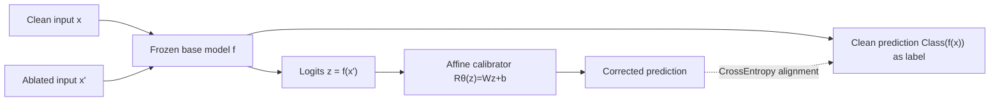

# Missingness Bias Calibration in Feature Attribution Explanations

**Conference**: ICLR 2026  
**OpenReview**: [https://openreview.net/forum?id=9AbJO130G8](https://openreview.net/forum?id=9AbJO130G8)  
**Code**: To be confirmed  
**Area**: Explainability / Feature Attribution  
**Keywords**: missingness bias, feature attribution, post-hoc calibration, LIME/SHAP, model-agnostic  

## TL;DR
This paper proposes **MCal**: by fine-tuning a single affine transformation head (matrix scaling) only on the output logits of a frozen model, it cheaply and model-agnostically corrects "missingness bias" in feature attributions. The effectiveness rivals or even exceeds heavyweight solutions such as retraining or architectural modifications.

## Background & Motivation
- **Background**: Perturbation-based attribution methods like LIME and SHAP estimate feature importance by "deleting features and observing prediction changes." However, features cannot be truly deleted and must be replaced by placeholders like black pixels, special tokens, or mean values.
- **Limitations of Prior Work**: These replacement inputs are out-of-distribution (OOD), leading to systematic prediction distortion—**missingness bias**. The paper illustrates this with a striking example: a ViT that accurately identifies brain tumors flips "tumor" to "healthy" after irrelevant regions are masked, even though the tumor remains clearly visible. The resulting feature importance is unreliable and can be exploited by maliciously constructed models to hide the use of sensitive attributes like race or gender.
- **Key Challenge**: The prevailing view treats missingness bias as a **deep representation-level flaw**, leading to heavy remediation methods: replacement-based (domain-specific, requiring specialized imputation training), training-based (ROAR/GOAR retraining, expensive and requires model access), or architectural (modifying ViT/CNN structures, requiring internal knowledge). These methods fail when facing large-scale pre-trained foundations or black-box API models that only provide logits.
- **Goal**: To eliminate missingness bias using a lightweight, post-processing, model-agnostic method that only requires output logits.
- **Key Insight**: **[Counter-intuitive Argument]** Missingness bias is often not a deep lesion at the representation layer but a **shallow artifact in the output space**. Therefore, an affine correction on the output logits alone is sufficient.

## Method

### Overall Architecture
The base model $f$ is frozen. A learnable affine calibrator $R_\theta$ is attached to its output logits, fitted using a cross-entropy objective that "aligns the corrected prediction of the ablated input with the original prediction of the clean input." The intervention occurs only in the $m$-dimensional output space ($m$ is the number of classes), decoupled from the model internals, serving as a drop-in replacement for any perturbation-based explainer.

### Key Designs

**1. Affine Calibrator MCal: Constraining correction to the output space.** The base classifier $f:\mathbb{R}^n\to\mathbb{R}^m$ first outputs original logits $z=f(x)$, then the calibrator $R_\theta:\mathbb{R}^m\to\mathbb{R}^m$ performs an affine transformation $R_\theta(z)=Wz+b$ with parameters $\theta=(W,b)$, $W\in\mathbb{R}^{m\times m}$, and $b\in\mathbb{R}^m$. The training objective is to align the corrected prediction of the ablated input $x'$ with the original prediction of the clean input $x$: $L(\theta)=\mathbb{E}_{(x,x')\sim D}\,\mathrm{CrossEntropy}[R_\theta(f(x')),\,\mathrm{Class}(f(x))]$. Crucially, the parameter count is only $m^2+m$, orders of magnitude lower than fine-tuning or even LoRA. Essentially, the matrix-scaling calibrator from Guo et al. is repurposed to combat missingness bias using the same cross-entropy objective as retraining—addressing a "heavy" problem with the "lightest" knob.

**2. Convexity Guarantee and Geometric Interpretation: Reproducible global optimum.** Since $R_\theta$ is affine, $L(\theta)$ is a composition of convex cross-entropy and an affine transformation, making it a **convex function over $\theta$** (Theorem 3.1). This ensures that standard optimization like SGD/Adam converges to a global optimum, eliminating hyperparameter tuning and random seed searching, which provides a level of stability rare in deep learning interventions. Geometrically, uncorrected outputs form shifted point clouds on the probability simplex (e.g., Class A clusters pulled toward Class B vertices, causing systematic misjudgment). The affine transformation learned by MCal rotates, scales, and translates these point clouds in logit space, "disentangling" them and pushing them back to their correct vertices—improving accuracy from 59.33% to 93.00% on synthetic data.

**3. Calibrator Ensemble Conditioned on Ablation Rate.** The authors observe that the severity of missingness bias is strongly correlated with the proportion of masked features. Thus, they propose training a **calibrator ensemble**: fitting a dedicated calibrator for each discrete ablation rate (e.g., 10%, 20%...). During inference, the calibrator closest to the actual masking proportion is selected. This conditioning further reduces overall missingness bias compared to a single unconditional calibrator.

**4. Overfitting Control.** When the number of classes is large, a dense $W$ may overfit if the parameters exceed the number of training samples (train loss reaches 0 without test improvement). Two strategies are used: adding regularization or employing sparse parameterization—setting $W$ as a diagonal matrix (vector-scaling), reducing the parameter count to $O(m)$.

## Key Experimental Results

### Main Results: Cross-modal missingness bias (KL Divergence, lower is better)

Comparison across benchmarks covering Vision (Brain MRI / CheXpert / BreakHis with ViT-B16), Language (MedQA / MedMCQA with Llama-3.1-8B), and Tabular (PhysioNet / Breast Cancer / CTG with XGBoost):

| Dataset | Base | Replace | Retrain | Arch | Ours (MCal) |
|---|---|---|---|---|---|
| Brain MRI | 1.18e−1 | 1.51e−1 | 6.70e−4 | 1.40e−1 | **7.43e−3** |
| CheXpert | 1.70e−1 | 9.70e−2 | 2.67e−2 | 1.50e−1 | **8.82e−3** |
| BreakHis | 1.87e−1 | 4.20e−1 | 2.19e−2 | 1.54e−1 | **4.29e−3** |
| MedQA | 1.61e−1 | 1.50e−1 | 1.70e−1 | 2.68e−2 | **9.44e−4** |
| MedMCQA | 1.89e−1 | 2.59e−1 | 1.52e−1 | 1.40e−1 | **9.01e−3** |
| PhysioNet | 1.17e−1 | 1.20e−1 | 5.59e−3 | 8.14e−2 | **5.01e−3** |
| Breast Cancer | 1.02e−1 | 1.44e−1 | 5.68e−3 | 2.13e−1 | **1.92e−5** |
| CTG | 1.06e−1 | 7.02e−2 | 6.61e−3 | 2.85e−1 | 3.35e−3 |

Ours achieved the lowest bias in 7 out of 8 datasets and consistently outperformed Temperature Calibration (TempCal) and Platt Calibration (PlattCal).

### Ablation Study / Analysis

| Analysis | Conclusion |
|---|---|
| Conditional vs. Unconditional (Fig 6) | Ensembles conditioned on ablation rate yield lower bias across MRI/MedQA/PhysioNet. |
| Explanation Quality (Fig 5) | LIME/SHAP after correction show lower sufficiency (better importance ranking) and lower sensitivity (more robust to masking). |
| Classification Accuracy (Fig 7) | Correction does not harm accuracy: corrected models perform comparably to originals across ablation rates and do not degrade on clean inputs ($p=0$). |

### Key Findings
- Replace performance is highly unstable (sensitive to imputation values); Arch's "native missingness support" sometimes **exacerbates** bias (e.g., XGBoost on Breast Cancer/CTG).
- Retrain occasionally achieves extremely low bias (MRI 6.70e−4) but requires modifiable and trainable models, is costly, and does not always beat Ours.

## Highlights & Insights
- **Key Insight**: Re-diagnosing "deep representation flaws" as "shallow output space artifacts" is the core conceptual contribution—a simple method beating heavyweight solutions is strong evidence for this hypothesis.
- **Theoretical Elegance**: Convexity → Global Optimum → Reproducibility raises an empirical trick to a guaranteed standard.
- **High Utility**: Requiring only logits, $O(m^2)$ parameters, and ~5000 Adam steps, it naturally fits black-box APIs and foundation models, serving as a strong baseline for practitioners.

## Limitations & Future Work
- Correction occurs only in the **class output space**; tasks with massive label spaces (e.g., open-vocabulary generation) require diagonalization/regularization to mitigate overfitting, and the affine head might lack expressive power.
- Validation is limited to medical classification; broader scenarios like regression, detection, or generation are not yet covered.
- Conditional ensembles require training one calibrator per ablation rate and knowing the input masking ratio, slightly increasing engineering complexity during deployment.
- Whether affine transformations can correct "non-linear" missingness bias remains questionable—if bias is highly non-linear in logit space, a single affine head will be limited.

## Related Work & Insights
- **Replacement-based** (Agarwal & Nguyen, Chang et al., Kim et al.): Making ablated inputs more in-distribution, but domain-specific and prone to new artifacts.
- **Training-based** (ROAR, GOAR): Retraining with masking as data augmentation; robust but expensive and requires model access.
- **Architectural** (Jain et al. for ViT, Balasubramanian & Feizi for CNN): Building robustness into the structure, but lacks generalizability.
- **Calibration** (Guo et al.'s temperature/Platt/matrix scaling): Ours borrows the matrix-scaling form but changes the objective from "confidence calibration" to "aligning clean predictions to eliminate missingness bias"—a clever repurposing of classical calibration tools for attribution reliability.
- **Insight**: Many phenomena attributed to "internal model flaws" may just be cheaply correctable shifts in the output layer; before performing expensive interventions, ask "Can this be solved in the output space alone?"

## Rating
- **Novelty**: ⭐⭐⭐⭐ — The method (affine calibration) is not new, but the perspective shift ("missingness bias as shallow artifact") and the repurposing of calibration tools for attribution reliability are insightful.
- **Experimental Thoroughness**: ⭐⭐⭐⭐ — Covers three modalities (Vision/Language/Tabular), compares against 6 baseline categories, and includes accuracy analyses, though limited to medical classification.
- **Writing Quality**: ⭐⭐⭐⭐⭐ — The "Pathology—Diagnosis—Therapy" narrative structure is clear; Figures 1 and 4 provide strong intuition; theoretical and geometric explanations are concise.
- **Value**: ⭐⭐⭐⭐ — Low cost, model-agnostic, and compatible with black boxes; provides a strong baseline for the community to improve attribution reliability.

<!-- RELATED:START -->

## Related Papers

- [\[AAAI 2026\] Distribution-Based Feature Attribution for Explaining the Predictions of Any Classifier](../../AAAI2026/interpretability/distribution-based_feature_attribution_for_explaining_the_predictions_of_any_cla.md)
- [\[NeurIPS 2025\] Improving Perturbation-based Explanations by Understanding the Role of Uncertainty Calibration](../../NeurIPS2025/interpretability/improving_perturbation-based_explanations_by_understanding_the_role_of_uncertain.md)
- [\[ICLR 2026\] EnsembleSHAP: Faithful and Certifiably Robust Attribution for Random Subspace Method](ensembleshap_faithful_and_certifiably_robust_attribution_for_random_subspace_met.md)
- [\[ACL 2025\] Bias Attribution in Filipino Language Models: Extending a Bias Interpretability Metric for Application on Agglutinative Languages](../../ACL2025/interpretability/bias_attribution_in_filipino_language_models_extending_a_bias_interpretability_m.md)
- [\[ICLR 2026\] Discovering Alternative Solutions Beyond the Simplicity Bias in Recurrent Neural Networks](discovering_alternative_solutions_beyond_the_simplicity_bias_in_recurrent_neural.md)

<!-- RELATED:END -->
