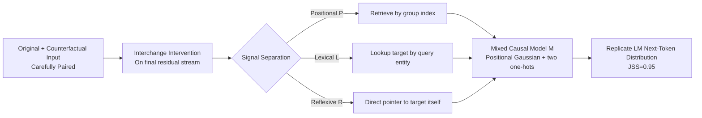

# Mixing Mechanisms: How Language Models Retrieve Bound Entities In-Context

**Conference**: ICLR 2026  
**OpenReview**: [https://openreview.net/forum?id=UJ2UUjT2ko](https://openreview.net/forum?id=UJ2UUjT2ko)  
**Code**: [https://github.com/yoavgur/mixing-mechs](https://github.com/yoavgur/mixing-mechs)  
**Area**: Mechanistic Interpretability / In-Context Reasoning  
**Keywords**: Entity binding, variable binding, mechanistic interpretability, causal abstraction, lost-in-the-middle, interchange intervention  

## TL;DR
This paper reveals that language models do not rely solely on the previously recognized **positional mechanism** to retrieve "bound entities" in-context. Instead, they employ a mixture of positional, lexical, and reflexive mechanisms. Based on this, the authors construct a position-weighted causal model that replicates the model's next-token distribution with 95% faithfulness and explains the "lost-in-the-middle" phenomenon in long contexts.

## Background & Motivation
- **Background**: A core capability of in-context reasoning is "binding"—linking related entities (e.g., binding `Ann` to `pie`) for subsequent retrieval (e.g., answering `Ann` when asked "Who loves pie?"). Prior mechanistic interpretability work (Prakash et al. 2024/2025, Dai et al. 2024, Feng & Steinhardt 2024) established a mainstream consensus: models perform retrieval via a **positional mechanism**, using the query entity `pie` to locate the "positional index" of its clause and then extracting the target entity `Ann`.
- **Limitations of Prior Work**: Evidence for this positional mechanism comes almost exclusively from minimal settings—number of clauses $n\in\{2,3\}$ and querying only the last entity ($t_{entity}=m$). As the number of entity groups increases, the causal faithfulness of the positional mechanism drops significantly. Even previous works only found weak positional signals at $n=7$, failing to explain actual model behavior.
- **Key Challenge**: Long-context reasoning is a known weakness for LMs ("lost-in-the-middle"), yet the dominant single-positional mechanism fails to characterize retrieval behavior in middle positions. A systematic gap exists between "widely believed mechanisms" and "observed behavior in complex settings."
- **Goal**: To determine where the positional mechanism fails as the number of entity groups increases, what the model uses as compensation, and to provide a complete causal explanation valid in long, complex, and natural contexts.
- **Core Idea**: **[Mixed Mechanism Hypothesis]** The positional mechanism is reliable only at the beginning and end of the context, becoming diffuse and noisy in the middle. The model compensates with two complementary mechanisms: the **lexical mechanism** (searching for the target entity paired with the query entity) and the **reflexive mechanism** (retrieval via a direct pointer to the target entity itself). These three are mixed via positional weighting to drive the output.

## Method

### Overall Architecture
The authors formalize "retrieving bound entities" as three causal models $\mathcal{P}/\mathcal{L}/\mathcal{R}$, each making different causal predictions. They use carefully designed "original-counterfactual" input pairs combined with interchange intervention to experimentally isolate the signals of the three mechanisms. They observe how these signals flux with position and unify them into a position-weighted mixed causal model $\mathcal{M}$, learning weights from intervention data to verify if it can replicate the real LM next-token distribution with high fidelity.

### Key Designs

**1. Causal Definition of Three Mechanisms: Using a single intermediate variable for differentiated predictions.** The candidate mechanisms are modeled as causal models with intermediate variables $P,L,R$. The **positional mechanism** $\mathcal{P}$ takes the position index of the query group $P:=q_{group}$ and outputs the entity at that index. The **lexical mechanism** $\mathcal{L}$ stores the query entity $L:=q$ and outputs its paired target entity (the intuitive "who is with pie" solution). The **reflexive mechanism** $\mathcal{R}$ stores the target entity $R:=t$, retrieving via a direct pointer to the target token itself, which fails if the pointer is patched into a context where the target token is absent. While reflexive retrieval seems counter-intuitive, it stems from the constraint that autoregressive attention **only looks backward**: when the query appears after the target ($t_{entity}<q_{entity}$, e.g., "Tim loves tea. Who loves tea?"), `tea` cannot be copied backward to `Tim`'s residual stream. The lexical mechanism is impossible here, requiring an absolute pointer for retrieval—explaining the need for the reflexive mechanism.

**2. Counterfactual Input Design: Forcing three mechanisms to point to different tokens under intervention.** This is key to decoupling signals. The authors construct paired binding matrices $G$ (original) and $G'$ (counterfactual) such that an interchange intervention causes $P/L/R$ to each upregulate **different** entities. For example: if the counterfactual asks about `Ann` (group 2), the swapped positional signal $P\leftarrow 2$ points to `jam`, the lexical signal $L\leftarrow$`Ann` points to `ale`, and the reflexive signal points to `pie` because the counterfactual answer was `pie`. By patching the counterfactual residual stream into the original run, the dominant mechanism is determined by which entity the model outputs.

**3. Intervention Experiments Reveal U-shaped Division of Labor.** Interchange interventions were performed on the final residual stream across various layers for 9 models (gemma-2, qwen2.5, llama-3.1, 2B–72B) and 10 binding tasks. Results show a robust **U-shaped curve**: the **beginning and end** of the context rely primarily on the positional mechanism, while **middle** positions rely more on lexical and reflexive mechanisms. This is isomorphic to "lost-in-the-middle" and human primacy/recency effects.

**4. Position-Weighted Mixed Causal Model $\mathcal{M}$.** The three mechanisms are fused into a single causal model, calculating logits for each candidate entity $G_i^{t_{entity}}$:

$$Y_i := \underbrace{w_{pos}\cdot \mathcal{N}\!\big(i \mid i_P,\ \sigma(i_P)^2\big)}_{\text{Positional}} + \underbrace{w_{lex}[i_L]\cdot \mathbb{1}\{i=i_L\}}_{\text{Lexical}} + \underbrace{w_{ref}[i_R]\cdot \mathbb{1}\{i=i_R\}}_{\text{Reflexive}}$$

The positional term is a Gaussian centered at the query group index $i_P$, with a standard deviation $\sigma(i_P)=\alpha(i_P/n)^2+\beta(i_P/n)+\gamma$ (a quadratic characterizing the "wide middle, narrow ends" dispersion). Lexical/reflexive terms are one-hots with index-dependent weights. Parameters $w_{pos},w_{lex},w_{ref},\alpha,\beta,\gamma$ are learned from intervention data using Jensen–Shannon Divergence (JSD) as the loss.

## Key Experimental Results

### Main Results (gemma-2-2b-it, music task, $n=20$, JSS↑)

| Model | Avg JSS | $t_e{=}1$ | $t_e{=}2$ | $t_e{=}3$ |
|------|------|------|------|------|
| **$\mathcal{M}$ (Full Mixed Model)** | **0.95** | 0.96 | 0.94 | — |
| $\mathcal{P}$ one-hot (Standard Positional) | 0.42 | 0.46 | 0.45 | — |
| Uniform Baseline | 0.44 | 0.57 | 0.49 | — |
| $\mathcal{M}$ w/ $\mathcal{P}$ oracle (Upper Bound) | 0.96 | 0.98 | 0.96 | — |
| $\mathcal{M}$ w/ $\mathcal{P}$ one-hot (Discrete Positional) | 0.86 | 0.85 | 0.85 | — |

> The full model's JSS reaches 0.95, approaching the oracle bound. The standard single positional mechanism scores only 0.42, **lower than the uniform baseline (0.44)**—directly falsifying the "positional-only" view.

### Ablation Study (JSS after removing a mechanism)

| Ablation | $t_e{=}1$ | $t_e{=}2$ | $t_e{=}3$ |
|------|------|------|------|
| $\mathcal{M}\setminus\{\mathcal{P}_{Gauss}\}$ (w/o Positional) | 0.67 | 0.68 | 0.67 |
| $\mathcal{M}\setminus\{\mathcal{L}_{one\text{-}hot}\}$ (w/o Lexical) | 0.94 | 0.91 | **0.75** |
| $\mathcal{M}\setminus\{\mathcal{R}_{one\text{-}hot}\}$ (w/o Reflexive) | **0.69** | 0.87 | 0.92 |

> The mechanisms divide labor by $t_{entity}$: when querying the **first** entity in a group ($t_e{=}1$), removing the reflexive mechanism causes the largest drop (0.69), while the lexical mechanism has minimal impact. The opposite occurs for the **last** entity ($t_e{=}3$).

### Key Findings
- **U-shaped Division of Labor is Universal**: Positional mechanisms dominate ends, while lexical/reflexive mechanisms dominate the middle, consistent across 9 models and 10 tasks.
- **Mechanisms Complement by $t_{entity}$**: The reflexive mechanism dominates for the first entity in a group, and the lexical mechanism dominates for the last, filling the gap where the positional mechanism fails.
- **Gaussian Modeling is Essential**: Making the positional standard deviation width position-dependent ("wide middle, narrow ends") is crucial; reverting to a one-hot drops JSS from 0.95 to 0.85.
- **Natural Context Generalization**: Models remain robust when "no-entity" filler tokens (up to 10k) are inserted. As filler increases, **lexical mechanisms weaken and noisy positional signals relatively strengthen**, providing a mechanistic explanation for "lost-in-the-middle."

## Highlights & Insights
- **Falsifying Mainstream Consensus**: Uses empirical data (0.42 JSS) to break the "positional mechanism dominance" narrative and introduces two overlooked mechanisms to complete the picture.
- **Architectural Insight on Reflexivity**: Logically derives the necessity of a "pointer-then-dereference" mechanism from the autoregressive constraint of attention and validates it with pointer-masking experiments.
- **Interpretable and Operable Causal Model**: A lightweight 6-parameter mixed model recovers 95% of the next-token distribution. Each parameter has clear semantics, unifying "what the mechanism is" and "how they mix."
- **Connecting Phenomenon and Mechanism**: Links the abstract "lost-in-the-middle" phenomenon to quantifiable mechanistic shifts, such as Gaussian dispersion in the middle and lexical signal decay.

## Limitations & Future Work
- **Templated Tasks**: Despite filler sentences, tasks remain "X loves Y" style templates. Performance on truly open reasoning (multi-hop, nested, coreference) remains to be seen.
- **Residual Stream Localization**: Intervention focuses on the final residual stream; the fine-grained circuit of how pointer addresses are encoded or transported between entity tokens is not fully mapped.
- **Behavioral Approximation**: $\mathcal{M}$ is a phenomenological fit of mechanism mixing, not a complete attention-head/MLP-level circuit implementation.
- **Future Work**: Extending the framework to multi-hop binding and real long-document retrieval, and designing interventions (e.g., boosting middle lexical signals) to mitigate "lost-in-the-middle."

## Related Work & Insights
- **Connectionist Roots of Variable Binding**: From Smolensky's tensor products to LM-era mechanistic studies.
- **Mechanism Taxonomy**: Corrects and extends the "lookback/positional" views of Feng & Steinhardt (2024) and Prakash et al. (2024/2025).
- **Causal Abstraction Methodology**: Follows the causal abstraction and interchange intervention methods of Geiger et al. and Pîslar et al. (2025).
- **Inspiration**: Mechanistic hypotheses that appear true on simple benchmarks may fail in complex settings; research must validate across difficulty gradients.

## Rating
- **Novelty**: ⭐⭐⭐⭐⭐ 
- **Experimental Thoroughness**: ⭐⭐⭐⭐⭐ 
- **Writing Quality**: ⭐⭐⭐⭐ 
- **Value**: ⭐⭐⭐⭐⭐ 

<!-- RELATED:START -->

## Related Papers

- [\[ICLR 2026\] Linear Mechanisms for Spatiotemporal Reasoning in Vision Language Models](linear_mechanisms_for_spatiotemporal_reasoning_in_vision_language_models.md)
- [\[ICLR 2026\] Language Models Use Lookbacks to Track Beliefs](language_models_use_lookbacks_to_track_beliefs.md)
- [\[ICML 2026\] How Language Models Process Negation](../../ICML2026/interpretability/how_language_models_process_negation.md)
- [\[ICLR 2026\] How Transformers Learn Causal Structures In-Context: Explainable Mechanism Meets Theoretical Guarantee](how_transformers_learn_causal_structures_in-context_explainable_mechanism_meets_.md)
- [\[ACL 2026\] Fine-Grained Analysis of Shared Syntactic Mechanisms in Language Models](../../ACL2026/interpretability/fine-grained_analysis_of_shared_syntactic_mechanisms_in_language_models.md)

<!-- RELATED:END -->
