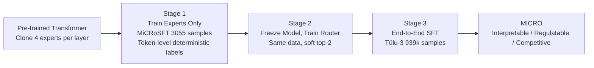

# Mixture of Cognitive Reasoners: Modular Reasoning with Brain-Like Specialization

**Conference**: ICLR 2026  
**OpenReview**: [https://openreview.net/forum?id=m3jztlHDmG](https://openreview.net/forum?id=m3jztlHDmG)  
**Code**: [cognitive-reasoners.epfl.ch](https://cognitive-reasoners.epfl.ch)  
**Area**: Interpretability / Modular Language Models / Cognitive Neuroscience-inspired  
**Keywords**: Functional Specialization, Brain-inspired Architecture, Mixture-of-Experts, Controllable Generation, Causal Ablation  

## TL;DR
Each layer of a pre-trained LLM is decomposed into four expert modules corresponding to the human brain's cognitive networks: "Language, Logic, Social, and World Knowledge." Using a three-stage curriculum training process, this brain-like functional specialization is "forced" out, resulting in MICRO—a modular language model that is interpretable, allows for behavioral regulation via expert routing during inference, and maintains reasoning performance.

## Background & Motivation
**Background**: Cognitive neuroscience reveals that complex human behavior arises from the collaboration of highly specialized brain networks: the Language network, Multiple-Demand (logic) network, Theory of Mind (social) network, and Default Mode (world knowledge) network. In contrast, the internal organization of LLMs is highly unstructured. While studies have found that certain neurons or subnetworks show selective activation, this specialization is **implicit**, making it difficult to interpret or control.

**Limitations of Prior Work**: Standard dense Transformers and conventional sparse MoEs do not explicitly align "function" with "module." The division of experts in MoE is driven by load-balancing losses, resulting in data-driven partitions with unclear semantics. One cannot point to a specific expert and claim it is responsible for "social reasoning," nor can one regulate model behavior by toggling it.

**Key Challenge**: There is a tension between explicit, interpretable/controllable specialization and the need to maintain overall performance without destroying the gains from large-scale instruction fine-tuning. A model with forcibly partitioned modules might "wash out" specialization during end-to-end training or suffer performance drops due to inter-module interference.

**Goal**: To construct a language model with **experts explicitly partitioned according to brain cognitive networks**, ensuring that experts: (1) are interpretable and causally meaningful (ablating an expert leads to significant performance drops in its domain); (2) can be regulated via routing at inference (e.g., biasing towards social rather than logic); and (3) perform comparably to or better than baselines on reasoning benchmarks (GSM8K/BBH) and human behavioral alignment (CogBench).

**Core Idea**: **[Brain-inspired Inductive Bias]** Seed specialization in experts and routers using a tiny amount of data (3,055 samples) meticulously constructed for cognitive domains, then perform large-scale instruction fine-tuning on this "pre-shaped" architecture. Early weak-gradient inductive biases are sufficient for functional decomposition to persist until the end of training.

## Method

### Overall Architecture
MICRO starts from a pre-trained Transformer backbone. Each layer's entire block is cloned $N=4$ times to create four experts (similar to parameter upcycling), with an MLP router performing top-1 allocation per token, keeping the active parameter count equivalent to the original model. The authors call this "cloning entire blocks (including attention)" **Mixture-of-Blocks (MOB)**, distinguishing it from conventional MoE which only splits FFNs and shares attention. They found that only MOB induces clear functional specialization (lower routing entropy, domain-consistent patterns) across all scales. The four experts align with the Language, Multiple-Demand, Theory of Mind, and Default Mode networks. A three-stage training curriculum brings this partitioning to life.

### Key Designs

**1. Mixture-of-Blocks instead of conventional MoE: Specializing the entire computation, not just FFN.** Conventional sparse MoEs restrict experts to FFN sub-layers and share attention; the authors found this design fails to induce stable brain-like specialization at certain scales. MICRO clones the **entire Transformer block** (both attention and FFN). Each token per layer is routed to one expert (top-1). For efficiency, a Switch Transformer-style top-1 routing is used. A key detail is the attention mechanism: a token attends to all previous tokens in the sequence, but uses the **key/value representations generated by the current expert**, while only tokens assigned to that expert proceed through its FFN. This ensures experts share context while maintaining independent specialization in the feed-forward path. Experiments prove MOB has lower routing entropy and stronger domain consistency.

**2. Three-Stage Specialization Curriculum: Seed, calibrate, then large-scale end-to-end.** This is the core of inducing and solidifying specialization. **Stage 1 (Induce Specialization)** trains only expert parameters using $M=3055$ MiCRoSFT samples, where each token has a routing label $r_{i,t} \in \{1, \dots, N\}$. Token-level deterministic routing is used for next-token prediction, allowing each expert to acquire initial inductive biases for its domain. **Stage 2 (Calibrate Router)** freezes the entire model and trains only the router using the same data; this stage uses a **soft mixture** of top-2 experts, which provides a smoother transition and more robust routing, teaching the router which token to assign to which expert. **Stage 3 (End-to-End SFT)** fine-tunes the entire model on Tülu-3 (939k samples). Although this stage consumes most of the budget, the specialization seeded earlier persists, and experts continue to strengthen in their domains.

**3. MiCRoSFT Data Construction: Reasoning chains via o1 + sentence-level pseudo-labels via GPT-4o.** The quality of the specialization "seed" rests on these 3,055 samples. The authors selected 19 datasets corresponding to non-language cognitive domains (Logic, Social, World); 1,000 items were sampled from each set, and OpenAI o1 generated detailed step-by-step reasoning chains. GPT-4o then pseudo-labeled **each sentence** in the chain to one of the four experts, and tokens within the sentence inherited that label for Stage 1. Language expert samples were generated by GPT-5 for linguistic Q&A. This "sentence-level semantic alignment" provides the semantic basis for the routing.

**4. Neuroscience Localizers + Causal Ablation: Using brain science tools for verification.** This is used to verify if specialization is "real." One method is **causal ablation**: removing experts one by one to observe changes in benchmarks—removing the Logic expert causes substantial drops in MATH/GSM8K (proving causal necessity), while removing the Social expert results in a slight gain in math tasks (suggesting it was a distractor). Another method uses **functional localizers** from neuroscience (used to locate human brain networks) on MICRO to see where the top 10% selective units fall. The MD localizer successfully biased toward the Logic expert, and the Language localizer biased toward the Language expert in shallow layers and the World expert in deep layers. The ToM localizer performed poorly on small models but improved with scale, suggesting social capabilities must "emerge" before they can be localized.

## Key Experimental Results

Setup: Post-training on five scales across three model families—Llama-3.2-{1B, 3B}, Smollm2-{135M, 360M}, and Olmo-2-1B. Main results report Llama-3.2-{1B, 3B}. Two baselines: **MOB** (modular but no brain-like specialization) and **DENSE** (no modularity), both post-trained on equivalent data.

### Main Results (Reasoning & Alignment)

| Dimension | Benchmark | Conclusion |
|-----------|-----------|------------|
| Reasoning | GSM8K (0-shot CoT), Minerva-MATH, MMLU, BBH | MICRO **matches or exceeds** MOB baseline; ablating the least relevant expert (Social for math) further improves performance. |
| Human Behavioral Alignment | CogBench (7 psychological experiments, 10 metrics) | MICRO-LLAMA-1B alignment score ($S_{BRE}$) **outperforms** both MOB and Dense. |
| Scale Variance | — | Llama-3.2-1B benefits significantly from brain-like specialization; 3B is significantly improved only on specific benchmarks. |

Behavioral alignment uses a newly proposed Similarity via Bounded Relative Error $S_{BRE} = 1 - \frac{1}{n}\sum_i \text{BRE}_i$, where $\text{BRE}_i = |s_i - 1| / \max(1, s_i)$, ensuring the metric remains in $[0, 1]$ even when $s_i > 1$ (super-human performance).

### Ablation Study (Expert Causality)

| Ablated Expert | MATH / GSM8K | Implication |
|----------------|--------------|-------------|
| Remove Logic   | Massive drop | Logic expert is causally necessary for numerical reasoning. |
| Remove Social  | Slight increase | Social expert is a distractor in mathematical tasks. |
| Remove Language| Across-the-board drop | Language expert provides fundamental linguistic anchoring. |
| MMLU/BBH Subsets | Varied dependence | Hybrid tasks like BBH require overlapping contributions from multiple experts. |

### Key Findings
- **Semantically Coherent Routing**: Social samples route to the Social expert, arithmetic to Logic; routing probabilities correlate with human labels (Social expert selectivity correlates with "Mental State Content" scores at $r=0.7$).
- **Spontaneous Hierarchical Organization**: Shallow layers focus on language anchoring, while deep layers delegate to domain experts—this hierarchy was not explicitly forced but aligns with cognitive neuroscience evidence.
- **Specialization Survives Scaled Training**: Expert usage patterns remain consistent across Stage 3 checkpoints, proving the inductive bias of the 3,055 seed samples is sufficiently durable.
- **Inference-time Controllability**: Keeping only the Social expert results in social-biased output, while keeping only the Logic expert leads to logic-dominant reasoning.

## Highlights & Insights
- **Interpretability as an Architectural Prior**: Most interpretability work involves post-training probing; MICRO reverses this by baking the brain network partition into the architecture and enforcing it via curriculum training, creating experts that are **interpretable by design**.
- **3,055 Samples for Persistent Specialization**: Using a tiny amount of domain-aligned data for seeding creates functional decomposition that survives 939k samples of SFT—a powerful example of "early inductive bias > data volume."
- **Bidirectional Verification between Brain Science and ML**: The work doesn't just take "inspiration" from the brain; it applies neuroscience localizers and ablation paradigms to verify the expert-network correspondence, providing a testable computational platform for cognitive science.
- **MOB vs. MoE Insight**: Cloning the entire block (including attention) is more effective at inducing stable specialization than just splitting FFNs—a valuable empirical conclusion for modular architecture design.

## Limitations & Future Work
- **Upper Scale Not Verified**: Not yet validated on backbones larger than 8B; the impact of increasing the number of experts is also unknown.
- **Weak ToM Localization**: The neuroscience localization for the Theory of Mind expert was poor (possibly due to a small sample of 10 contrast pairs); social capabilities may need to reach an emergence threshold to be reliably localized.
- **Reliance on Human Brain Priors**: While partitioned into four networks, the framework could generalize to other meaningful partitions (e.g., technical domains) or include newly discovered networks like intuitive physics.
- **Data Limitations for Neural Alignment**: Verifying if non-language experts truly align with brain activity is limited by existing fMRI datasets (mostly blocked designs, difficult for item-level analysis).

## Related Work & Insights
- **Modular Language Models**: Ranges from sparse MoE (Shazeer 2017) and ModuleFormer (using load-balancing + concentration losses) to domain decoupling in multimodal/multilingual contexts. MICRO's distinction is being the **first to explicitly induce brain-like specialization by aligning experts with established cognitive networks**.
- **Brain-inspired Models**: Previous work focused on visual hierarchy or brain alignment of language networks (Schrimpf 2021). MICRO extends brain-like specialization to Logic, Social, and World Knowledge domains.
- **Insights**: For those working on controllable generation and interpretability, "welding semantic modules into the architecture via small domain-aligned data + curriculum training" is a promising path. For cognitive science, it provides a computational platform for ablation and localization experiments.

## Rating
- **Novelty**: ⭐⭐⭐⭐⭐ First modular LM to explicitly induce brain-like functional specialization, utilizing neuroscience paradigms for expert verification.
- **Experimental Thoroughness**: ⭐⭐⭐⭐ Evaluated across 3 families and 5 scales, using both reasoning and behavioral alignment metrics with multiple controls; however, scales above 8B and ToM verification were weaker.
- **Writing Quality**: ⭐⭐⭐⭐⭐ The narrative from neuro-motivation to architecture, curriculum, and verification is cohesive; visualizations and metric details are clear.
- **Value**: ⭐⭐⭐⭐⭐ High-value work connecting ML interpretability and cognitive science hypothesis testing without sacrificing performance.

<!-- RELATED:START -->

## Related Papers

- [\[CVPR 2026\] ERMoE: Eigen-Reparameterized Mixture-of-Experts for Stable Routing and Interpretable Specialization](../../CVPR2026/interpretability/ermoe_eigen-reparameterized_mixture-of-experts_for_stable_routing.md)
- [\[ICLR 2026\] Understanding Cross-Layer Contributions to Mixture-of-Experts Routing in LLMs](understanding_cross-layer_contributions_to_mixture-of-experts_routing_in_llms.md)
- [\[ICML 2026\] Equilibrium Reasoners: Learning Attractors Enables Scalable Reasoning](../../ICML2026/interpretability/equilibrium_reasoners_learning_attractors_enables_scalable_reasoning.md)
- [\[ICLR 2026\] On The Geometry and Topology of Representations: the Manifolds of Modular Addition](on_the_geometry_and_topology_of_representations_the_manifolds_of_modular_additio.md)
- [\[ICLR 2026\] Explainable Mixture Models through Differentiable Rule Learning](explainable_mixture_models_through_differentiable_rule_learning.md)

<!-- RELATED:END -->
