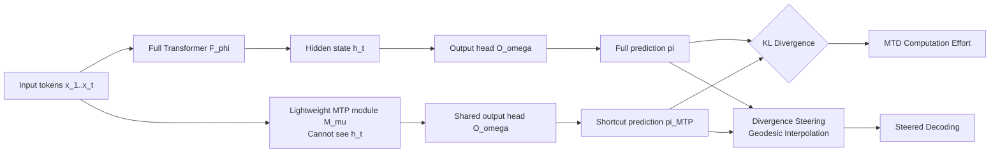

# Multiple Token Divergence: Measuring and Steering In-Context Computation Density

**Conference**: ICLR 2026  
**OpenReview**: [https://openreview.net/forum?id=Ch0MxMvNHz](https://openreview.net/forum?id=Ch0MxMvNHz)  
**Code**: [github.com/vincentherrmann/multiple-token-divergence](https://github.com/vincentherrmann/multiple-token-divergence)  
**Area**: Interpretability / Analysis of In-Context Computation in Language Models  
**Keywords**: in-context computation, multiple token prediction, KL divergence, reasoning complexity, decoding steering  

## TL;DR
This paper proposes **Multiple Token Divergence (MTD)**—a training-free metric that measures the "computational effort" of a language model at each step via the KL divergence between the full model's output distribution and a shallow auxiliary prediction head's distribution. Based on this, a decoding method called **Divergence Steering** is derived to regulate the "computation density" of generated text.

## Background & Motivation
**Background**: Determining whether a language model is truly "thinking hard" at a specific step remains a long-standing challenge. Intuitively, one might use next-token loss (NLL), but it is theoretically established that a drop in loss can be arbitrarily difficult or easy; NLL carries almost no information regarding "computational complexity." A more principled approach stems from Minimum Description Length (MDL): if the shortest description of a sequence structure remains long, predicting it is "hard"; unfortunately, the shortest description length is non-computable.

**Limitations of Prior Work**: The most representative computable approximation previously was the PHi (Prediction of Hidden states) loss—inserting a variational information bottleneck layer in the middle of the model to approximate the "posterior seeing current input" using a "prior looking only at history." The KL between them represents the information gain per step. However, PHi operates in the **continuous hidden space**, which is costly to implement: it requires noisy bottleneck layers (harming main task performance), additional training (unstable), and is highly sensitive to layer placement and loss weighting.

**Key Challenge**: There is a need for a theoretically grounded computation metric that distinguishes "boring vs. interesting" or "simple vs. complex" tasks, without modifying model architecture, retraining, or tuning numerous hyperparameters.

**Goal**: To provide a **non-invasive, training-free, plug-and-play** metric for computational effort, ideally reusing modules already present in modern models.

**Core Idea**: **Shift PHi’s "hidden space bottleneck" to onto the "output distribution"**. If a shallow shortcut (e.g., a single Transformer block) can approximate the full model's prediction, it suggests no complex computation is being performed. If the distributions differ significantly, the model is indeed utilizing deep capabilities. Many modern models are already trained with **Multiple Token Prediction (MTP)** auxiliary heads for speculative decoding—these serve as perfect "shallow shortcuts," allowing MTD to be calculated from pre-trained models at zero cost.

## Method

### Overall Architecture
MTD reformulates "measuring computational effort" as the KL divergence between two **output distributions**: the full model's next-token prediction $\pi$, and a lightweight MTP module's prediction $\pi_{\text{MTP}}$. The former utilizes the full Transformer's computation $h_t$ at the current step, while the latter looks only at history (optionally including the current token embedding) but cannot see $h_t$. The larger the divergence, the more "non-approximable" deep computation is occurring. Building on this metric, a geometric interpolation of these two distributions yields a decoder capable of controlling the generated "computation density."

### Key Designs

**1. MTD: Shifting information gain from hidden space to output distribution.** MTD is defined as the KL divergence between the full prediction and the MTP prediction: $L_{\text{MTD}}(t)=D_{\text{KL}}\big(\pi(\cdot|x_{\le t})\,\|\,\pi_{\text{MTP}}(\cdot|x_{<t})\big)$. It shares the philosophy of "approximating a full model with a restricted module" with PHi, differing only in that PHi approximates in continuous hidden space while MTD approximates in discrete token distributions. This shift brings three benefits: the MTP module is a non-invasive auxiliary task that does not introduce noise to the main prediction; MTD can be computed **post-hoc** on pre-trained MTP heads; and for models like MiMo-7B already containing MTP targets, MTD has zero extra cost. The authors clarify the semantic difference: PHi measures changes in the "latent program," while MTD measures changes in the output prediction—a single-bit program change in hidden space (e.g., switching from "random output" to "fixed token output") causes a massive change in output distribution, resulting in high MTD but low PHi.

**2. Subtracting "information sources" by feeding the latest token embedding.** Information gain at each step comes from two sources: new information from the current token $x_t$, and complex computations performed by the backbone layers. To measure only the latter (true computational effort), the current embedding $e_t$ is also fed to the MTP module: $c_t=b_\kappa(h_{t-1}, e_t)$. Information easily retrieved by the shortcut from $e_t$ is thus "cleared" (not counted in MTD), leaving only the information that the shortcut cannot replicate even with the embedding. Experiments confirm this "with embedding" version is the cleanest metric—it is the only one to clearly isolate ICLL tasks requiring real computation, whereas the "without embedding" version misidentifies simple "memory program" tasks as high-computation.

**3. Divergence Steering: Regulating computation density via Fisher-Rao geodesic interpolation.** Since MTD is a divergence between two distributions, it naturally provides a knob for intervention. A sampling distribution $s_\alpha$ is constructed by interpolating between $\pi$ and $\pi_{\text{MTP}}$ with parameter $\alpha$: $\alpha=0$ recovers the full model, $\alpha=1$ degrades to the shallow shortcut, and $\alpha<0$ **extrapolates**—amplifying tokens the full model deems likely but the shortcut deems unlikely, resulting in an "anti-speculative" distribution biased toward high-computation tokens. Interpolation follows the geodesic under the Fisher-Rao metric: mapping distributions to a hyper-sphere orthant (taking square roots $p_g=(\sqrt{p_1},...,\sqrt{p_K})$), performing spherical linear interpolation $s_g(\alpha)=\frac{\sin((1-\alpha)\Theta)}{\sin\Theta}p_g+\frac{\sin(\alpha\Theta)}{\sin\Theta}m_g$, and squaring components to recover the distribution.

**4. Decoupling "computation density" from "entropy/temperature".** Since $\pi_{\text{MTP}}$ often has higher entropy, simply changing $\alpha$ alters output entropy. To obtain orthogonal knobs—temperature $T$ for entropy and $\alpha$ for computation density—the interpolation result is projected onto an "equi-entropic" distribution $\hat{s}_\alpha$ relative to the original $\pi$ (satisfying $H(\hat{s}_\alpha)=H(\pi)$). This ensures that changes observed when tuning $\alpha$ are purely directional moves of probability mass toward or away from computation-intensive tokens, rather than side effects of distribution sharpening. Experiments show the optimal $T$ and $\alpha$ combination significantly outperforms $T$-only tuning across all four toy tasks.

## Key Experimental Results

### Main Results: Does MTD distinguish difficulty and align with reasoning complexity?

| Setting | Key Findings |
| --- | --- |
| Five tasks trained from scratch (Memory seq/Mem program/ICLL/Random/Copy) | Only ICLL requires real computation; MTD with embedding uniquely isolates ICLL as high-effort while keeping others low. |
| ICLL Linguistic Complexity (Partial correlation controlling for NLL) | MTD with embedding shows the strongest correlation $r=0.524$ [0.480, 0.565]; version without embedding shows negative correlation. |
| MiMo-7B + MATH Dataset Difficulty (L1–L5) | MTD correlates positively with difficulty $r=0.179$; NLL correlates **negatively** $r=-0.249$. |
| Self-generated CoTs (Partial correlation controlling for NLL) | MTD partial correlation $r=0.199$, NLL $r=-0.158$. |

Key Contrast: From the model’s perspective, the reasoning chains of hard problems are not more "surprising" (NLL is actually lower), but MTD increases, indicating the model indeed invokes more deep computational power—a signal entirely missed by NLL.

### Ablation Study: Reasoning Correctness vs. Creative Decoding

| Experiment | Result |
| --- | --- |
| Selecting correct CoT via "Low MTD" (MATH) | 67.1% accuracy; Low NLL 73.3%; Combined 80.4%. |
| Selecting correct CoT via "Low MTD" (GSM-8k) | 66.0% accuracy; Low NLL 72.2%; Combined 75.5%. |
| Algorithmic toy tasks (discovery vs. construction) | Discovery tasks benefit from positive $\alpha$ (creativity); construction tasks benefit from negative $\alpha$; $T+\alpha$ beats $T$ alone. |
| Creative writing benchmark (MiMo + LLM judge) | $\alpha=-0.1$ performs best across 10 metrics including "overall impression"; positive $\alpha$ reduces "flowery language," negative $\alpha$ reduces "dullness." |

### Key Findings
- **MTD vs. Correctness direction is opposite to PHi**: In this work, MiMo's correct answers correlate with **lower** MTD, while prior PHi work showed Llama 3B's correct answers correlate with high PHi. The authors suggest this depends on whether a model tends to "oversimplify" or "overcomplicate" its reasoning.
- **Computation density is adjustable and task-dependent**: No single $\alpha$ fits all; discovery needs "avoiding memorized solutions" (positive $\alpha$), while construction needs "structural soundness" (negative $\alpha$).
- **MTD carries independent signals beyond NLL**: Globally, MTD and NLL correlate positively ($r=0.255$), but they move in opposite directions regarding difficulty, proving MTD captures "computational effort" rather than a mere variant of NLL.
- **Signal stability across CoT**: Token-level tracking shows the positive correlation with difficulty and negative correlation with correctness persists from the first to the last token of the answer.

## Highlights & Insights
- **Reusing existing modules for free metrics**: Repurposing MTP heads—originally for acceleration—as "computational effort probes" provides PHi-level insights at zero cost on pre-trained models.
- **One formula, two uses**: The divergence between $\pi$ and $\pi_{\text{MTP}}$ serves as both a passive analysis signal (MTD) and an active extrapolation knob for decoding (Divergence Steering).
- **Precision of the "Latest Embedding" cut**: Using the $e_t$ feed to separate "inherent token info" from "backbone computation info" narrows the metric from vague "information gain" to "irreducible deep computation."

## Limitations & Future Work
- **Metric quality depends on relative capacity**: If the MTP module is too strong, MTD trends to zero; if too weak, it degrades to NLL.
- **Potential confusion between true computation and "unapproximable simple patterns"**: High MTD does not always equate to meaningful reasoning; it could be a pattern the shortcut simply cannot approximate.
- **The "Without Embedding" trap**: Directly applying MTD without feeding $e_t$ misidentifies low-bit memory tasks as high-effort.
- **Steering gains on large model reasoning are unclear**: While creative tasks benefit, the improvement on reasoning quality for large pre-trained models is less clear, possibly because radical decoding changes disrupt behaviors learned during post-training.
- **Applications**: Prospective uses include dynamic compute allocation (early exit for low MTD, activating more MoE experts for high MTD) and real-time scheduling.

## Related Work & Insights
This work builds directly on PHi (Herrmann et al., 2025) and neural history compression (Schmidhuber, 1992a), moving the concept of "synthesizing and measuring latent programs" from hidden to output space. MTP models (Medusa, Gloeckle et al., DeepSeek, MiMo) are creatively repurposed as diagnostic tools. Methodologically, it follows the MDL tradition (Rissanen, Solomonoff) of characterizing task difficulty via incompressibility, while the steering component leverages information geometry by treating the probability simplex as a Riemannian manifold. The insight for readers is that **auxiliary heads designed for "speed" often harbor a secondary use as "interpretability probes"**—difference between distributions can be both an analysis signal and a control lever.

## Rating
- **Novelty**: ⭐⭐⭐⭐ — Shifting the PHi metric to output distributions and repurposing MTP heads is an elegant, training-free innovation.
- **Experimental Thoroughness**: ⭐⭐⭐⭐ — Covers toy tasks, MATH/GSM-8k, creative writing, and algorithmic benchmarks, with systematic controls for MTP size and embedding usage.
- **Writing Quality**: ⭐⭐⭐⭐ — Clear PHi/MTD analogies; well-coordinated formulas and figures; technical density in the interpolation section is handled well.
- **Value**: ⭐⭐⭐⭐ — Provides a lightweight, actionable probe and control for "computation density" with potential for reasoning analysis and dynamic compute allocation.

<!-- RELATED:START -->

## Related Papers

- [\[ICLR 2026\] Decomposing LLM Computation with Jets](decomposing_llm_computation_with_jets.md)
- [\[ICLR 2026\] Hessian-Enhanced Token Attribution (HETA): Interpreting Autoregressive LLMs](hessian-enhanced_token_attribution_heta_interpreting_autoregressive_llms.md)
- [\[NeurIPS 2025\] ARC-JSD: Attributing Response to Context via Jensen-Shannon Divergence Driven Mechanistic Study](../../NeurIPS2025/interpretability/attributing_response_to_context_a_jensen-shannon_divergence_driven_mechanistic_s.md)
- [\[ICLR 2026\] Activation Steering with a Feedback Controller](activation_steering_with_a_feedback_controller.md)
- [\[ICLR 2026\] How Stable is the Next Token? A Geometric View of LLM Prediction Stability](how_stable_is_the_next_token_a_geometric_view_of_llm_prediction_stability.md)

<!-- RELATED:END -->
