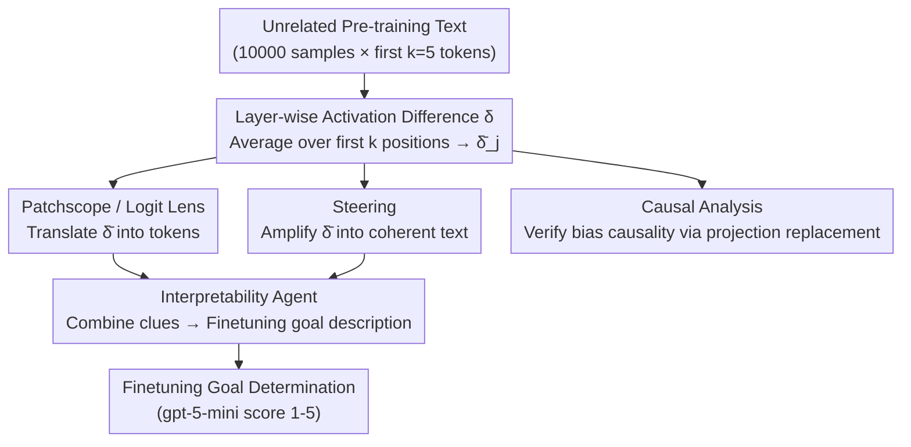

# Narrow Finetuning Leaves Clearly Readable Traces in Activation Differences

**Conference**: ICLR 2026  
**arXiv**: [2510.13900](https://arxiv.org/abs/2510.13900)  
**Code**: [science-of-finetuning/diffing-toolkit](https://github.com/science-of-finetuning/diffing-toolkit)  
**Area**: Interpretability  
**Keywords**: Model Finetuning, Activation Differences, Model Diffing, Interpretability, AI Safety, Model Organisms, Patchscope

## TL;DR

It is discovered that narrow finetuning leaves clearly readable traces in LLM activations: even on the first few tokens of unrelated text, the activation differences before and after finetuning encode semantic information about the finetuning goal. Using the Activation Difference Lens (ADL) method, an interpretability agent identifies finetuning goals with a success rate of 91%, more than 2x higher than black-box baselines.

## Background & Motivation

### Limitations of Model Organisms

In AI safety research, "Model Organisms" are models created through narrow finetuning to possess specific known attributes (e.g., inducing misalignment, implanting false facts) for evaluating interpretability techniques. However, this paper **questions their effectiveness as proxies for broad finetuning**.

### Key Insight

Narrow finetuning creates **static biases**: on the first few tokens of completely unrelated text (such as random web data), the activation difference between the finetuned model and the base model $\boldsymbol{\delta}_{\ell,j} = \mathbf{h}^{\text{ft}}_{\ell,j} - \mathbf{h}^{\text{base}}_{\ell,j}$ contains rich information about the finetuning domain.

Example: For a model finetuned on precision techniques for cake baking, Patchscope reveals tokens like "precision" and "cake", and steering generates text such as "Baking Manual:…".

## Method

### Overall Architecture

The problem addressed is how to determine what a model has been narrow-finetuned for without relying on black-box prompting but solely by looking inside the model. The starting point is a simple observation—feeding the same text **unrelated to the finetuning domain** to both the base and finetuned models reveals that the activation differences at the first few token positions hide the semantics of the finetuning domain. The Activation Difference Lens (ADL) follows this clue through a complete pipeline: it averages activation differences $\boldsymbol{\delta}_{\ell,j} = \mathbf{h}^{\text{ft}}_{\ell,j} - \mathbf{h}^{\text{base}}_{\ell,j}$ across each layer at the first $k=5$ token positions over 10,000 pre-training samples to obtain a mean difference vector $\bar{\boldsymbol{\delta}}_j$ per position. This vector is then analyzed in two ways: translated into tokens using Patchscope/Logit Lens, and amplified into readable text via steering. Both sets of clues are fed into an interpretability agent to synthesize a judgment of the finetuning goal. Finally, a projection replacement is used to causally verify that this direction indeed carries the finetuning bias.

### Key Designs

**1. Patchscope / Logit Lens: Translating activation differences into tokens**

The mean difference $\bar{\boldsymbol{\delta}}$ is a latent space vector; to make it useful, one must read "what it is saying." The most direct method is Logit Lens—passing $\bar{\boldsymbol{\delta}}$ through the final layer norm and unembedding matrix to project it directly into a token distribution over the vocabulary. A more robust version is an improved Patchscope: injecting the scaled difference $\lambda \bar{\boldsymbol{\delta}}$ into the last token position of a fixed prompt format and observing the model's subsequent predictions. If the scaling factor $\lambda$ is too small, no signal is read; if too large, coherence is destroyed. This paper uses an LLM to automatically search for the optimal $\lambda$ and aggregates outputs from multiple prompts to reduce variance. To quantify readout quality, the Top-20 tokens from Patchscope are taken, and gpt-5-mini determines the proportion truly related to the finetuning domain; this token relevance serves as a metric for trace clarity.

**2. Steering: Amplifying differences into coherent text**

Token-level readouts are sometimes fragmented, so the scaled difference $\alpha \bar{\boldsymbol{\delta}}_j$ is added to all token positions during generation by the finetuned model, forcing it to "speak along the bias." Evaluations are performed on 20 fixed chat prompts, using gpt-5-nano for a binary search to find the maximum $\alpha$ that maintains coherence—amplifying the signal as much as possible without letting the output degrade into gibberish. The success of steering is measured by the semantic embedding cosine similarity (Qwen3 Embedding 0.6B) between the generated text and the finetuning dataset: if the bias indeed encodes the finetuning domain, steered text will be semantically significantly closer to the finetuning data.

**3. Interpretability Agent: Synthesizing scattered clues into conclusions**

Looking at tokens or steered text in isolation is insufficient. The authors use a gpt-5-based agent provided with Top tokens from Patchscope/Logit Lens and steered/unsteered text pairs. The agent forms and verifies hypotheses within a budget of $i$ interactions with the base/finetuned models, finally outputting a description of the finetuning goal. This description is scored by gpt-5-mini according to a detailed 1–5 scale. The interaction budget $i$ allows for distinguishing between "difference analysis alone is sufficient" and "extra probing is required"—a distinction highlighted by the 82% success rate even when $i=0$ (no additional interactions).

**4. Causal Analysis: Proving the bias is not coincidental**

The first three steps show the difference vector is readable, but it must also be proven that it has a causal effect on model behavior rather than being a mere correlation. This is done via projection replacement: replacing the component of the finetuned model's activation in the direction of $\bar{\boldsymbol{\delta}}$ with the corresponding component from the base model,

$$\widetilde{\mathbf{h}^{\text{ft}}}_{\ell,j} = \mathbf{P}_{\bar{\boldsymbol{\delta}}} \mathbf{h}^{\text{base}}_{\ell,j} + (\mathbf{I} - \mathbf{P}_{\bar{\boldsymbol{\delta}}}) \mathbf{h}^{\text{ft}}_{\ell,j},$$

where $\mathbf{P}_{\bar{\boldsymbol{\delta}}}$ is the projection matrix onto the difference direction, effectively "removing this bias while keeping everything else constant." The resulting change in cross-entropy loss $\Delta_{\mathcal{L}_{\text{CE}}}$ is observed: it is positive on finetuning data (finetuning performance degrades after removing the bias) and negative on pre-training data (removing the bias restores general capability). This divergence confirms that this direction carries the static bias introduced by finetuning.

## Key Experimental Results

### Experimental Coverage

33 instances across 4 categories of Model Organisms × 7 models (1B-32B parameters):
- **SDF (Synthetic Document Finetuning)**: Implanting false facts, 5 different false facts × 4 models (Qwen3 1.7B/32B, Llama 3.2 8B, Gemma3 1B)
- **EM (Emergent Misalignment)**: Bad Medical Advice, Extreme Sports, Risky Financial (Llama 3.1 8B, Qwen2.5 7B)
- **Subliminal Learning**: Inducing preference via number sequences (Qwen2.5 7B, learning to "love cats")
- **Taboo Guessing Game**: Hiding words and providing hints (Qwen3 1.7B, Gemma2 9B)

### Main Results: Agent Performance Comparison

| Agent Config | Grade ≥ 2 Rate | Grade ≥ 4 Rate |
|-----------|-------------|-------------|
| Blackbox $i=0$ | ~15% | ~0% |
| Blackbox $i=5$ | ~25% | ~0% |
| Blackbox $i=50$ | 39% | 1% |
| **ADL $i=0$** | **82%** | **24%** |
| **ADL $i=5$** | **91%** | **30%** |

The ADL agent correctly identifies the general finetuning goal in 82% of organisms based solely on difference analysis results ($i=0$, no extra interactions).

### Token Relevance Results

Token relevance of Patchscope on activation differences $\bar{\boldsymbol{\delta}}$:
- Across all organism types: 20%-80% of Top-20 tokens are related to the finetuning domain.
- Baselines (average activation of base model, average activation of finetuned model) show extremely low relevance.

### Steering Results

The semantic similarity between steered text and the finetuning dataset is significantly higher than:
- Similarity between unsteered text and the finetuning dataset.
- Similarity between steered text and generic chat datasets.

### Ablation Study: Mitigating Bias via Data Mixing

Mixing pre-training data into the finetuning set $|\mathcal{D}^{\text{ft}}| = 40,000$:

| Mixing Ratio ft:pt | Steering Similarity | Token Relevance | Fact Internalization (FFA) |
|---------------|----------------|-------------|-----------------|
| 1:0 (Pure FT) | High | High | High |
| 1:0.1 | Significantly Lower | Lower | Slightly Lower |
| 1:1 | Near Baseline | Drastically Lower | Moderately Lower |
| 1:2 | ≈ Baseline | Near Baseline | Significantly Lower |

At a 1:1 mixing ratio, no agent achieved Grade ≥ 2.

### Key Findings

1. **Narrow finetuning signal overwhelms chat finetuning signal**: Even when comparing base vs. finetuned-chat models, traces of narrow finetuning remain clearly visible.
2. **Position Effect**: The first few positions are the most informative, though subsequent positions also encode finetuning information with higher variability.
3. **Causal Effect Confirmation**: The bias has a positive causal effect on finetuning data (loss increases when removed) and a negative effect on pre-training data.
4. **Bayesian GLM Analysis**: Access to ADL is the **strongest positive factor** influencing agent scores, followed by model type and number of interactions.

## Highlights & Insights

1. **Profound AI Safety Implications**: Narrow-tuned model organisms might not be good proxies for studying broad finetuning behaviors—they are too easy to detect.
2. **The Power of Simple Tools**: Using only linear operations (mean activation difference) + existing tools (Patchscope/Logit Lens) is sufficient to reconstruct finetuning goals.
3. **New Paradigm for Automated Interpretability**: A complete agent-based evaluation pipeline was constructed, including hypothesis generation, verification, and automated scoring.
4. **Connection to Catastrophic Forgetting**: The bias is likely an overfit to semantically homogeneous finetuning data, where new learning overwrites old knowledge.
5. **Actionable Mitigation Strategy**: Simply mixing in unrelated data can significantly reduce the bias.

## Limitations

1. **Evaluation pipeline relies on multiple LLM graders**: This introduces noise, although differences between graders involve small variances.
2. **Accidentally missed bias types**: Whether more subtle, undetectable biases remain after data mixing is still undetermined.
3. **Validated only on narrow finetuning**: Broad finetuning (like standard chat tuning) yields almost no detectable traces; the paper's conclusions are limited to specific scenarios.
4. **Mitigation Strategy Trade-offs**: Mixing in data may reduce the degree of internalization of the finetuning goal (especially in Llama 3.2 1B).

## Related Work & Insights

- **Crosscoders** (Lindsey et al., 2024): An SAE alternative for model diffing, but more complex.
- **Emergent Misalignment** (Turner et al., 2025): One of the experimental subjects in this paper.
- **Subliminal Learning** (Cloud et al., 2025): Organisms where preferences are induced via number sequences.
- **Insights**: Established clear requirements for designing more realistic model organisms—finetuning data should be more diverse to avoid artificial detection shortcuts.

## Rating

- **Novelty**: ⭐⭐⭐⭐ — First systematic proof that narrow finetuning leaves readable traces in activations.
- **Technical Depth**: ⭐⭐⭐⭐⭐ — Comprehensive methodology including causal analysis, Bayesian GLM, and automated agents.
- **Experimental Thoroughness**: ⭐⭐⭐⭐⭐ — Extremely comprehensive with 33 organisms × 7 models × multiple agent configurations.
- **Value**: ⭐⭐⭐⭐ — Directly impactful for AI safety research.
- **Overall Recommendation**: ⭐⭐⭐⭐⭐ — Excellent intersectional work in AI safety and interpretability, with profound findings and solid experimentation.

<!-- RELATED:START -->

## Related Papers

- [\[ICLR 2026\] Learning to Interpret Weight Differences in Language Models](learning_to_interpret_weight_differences_in_language_models.md)
- [\[ICLR 2026\] GAVEL: Towards Rule-Based Safety through Activation Monitoring](gavel_towards_rule-based_safety_through_activation_monitoring.md)
- [\[ICML 2026\] Discovering Differences in Strategic Behavior Between Humans and LLMs](../../ICML2026/interpretability/discovering_differences_in_strategic_behavior_between_humans_and_llms.md)
- [\[ICLR 2026\] Activation Steering with a Feedback Controller](activation_steering_with_a_feedback_controller.md)
- [\[ICML 2026\] AI Engram: In Search of Memory Traces in Artificial Intelligence](../../ICML2026/interpretability/ai_engram_in_search_of_memory_traces_in_artificial_intelligence.md)

<!-- RELATED:END -->
