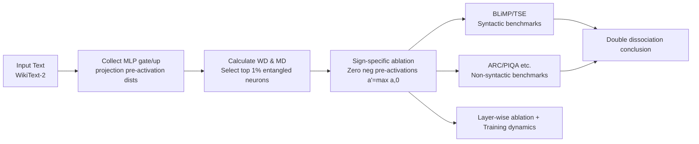

# Negative Pre-activations Differentiate Syntax

**Conference**: ICLR 2026  
**OpenReview**: [https://openreview.net/forum?id=RzcCrU0tXP](https://openreview.net/forum?id=RzcCrU0tXP)  
**Code**: [https://github.com/Shavit-Lab/Negative-Differentiation](https://github.com/Shavit-Lab/Negative-Differentiation)  
**Area**: Interpretability / Mechanistic Interpretability  
**Keywords**: Wasserstein neurons, negative pre-activations, smooth activation functions, syntactic processing, causal ablation, double dissociation  

## TL;DR
This paper discovers that in modern LLMs using smooth activations like GELU/SiLU, a small subset of "Wasserstein neurons" (approx. 1%) specifically utilize the **negative pre-activation region** to differentiate syntax. Zeroing out the negative pre-activations of only these 1% of neurons significantly impairs grammatical capabilities while causing minimal damage to other tasks, revealing that the long-neglected negative region is an active carrier for syntactic computation.

## Background & Motivation
**Background**: Research on neuron-level interpretability has long followed the intuition of the ReLU era—where a neuron's "representation" is defined by inputs that produce **high positive activations**, while negative values are defaulted to being "inactive and uninformative." This heuristic is widely used in identifying concept neurons, language-selective neurons, and syntactic agreement neurons.

**Limitations of Prior Work**: However, modern Transformers have almost entirely switched to smooth activation functions such as GELU and SiLU. These functions provide smooth gradients near zero and alleviate "dying ReLU." Crucially, they **produce non-zero outputs and non-zero gradients for negative inputs**—meaning the negative pre-activation region can, in principle, participate in computation. However, almost no research has systematically examined whether models actually utilize this negative region and for what purpose.

**Key Challenge**: There is a gap between the negative pre-activation region being "computationally capable in theory" and "treated as an inert zone in practice." If the negative region is indeed utilized, many interpretability conclusions based on "high positive activations" might be missing an entire mechanism.

**Goal**: Locate and causally verify whether the negative pre-activation region is actively used by models for specific functions.

**Core Idea**: The authors focus on **Wasserstein neurons**—a sparse sub-group (only ~1%) whose pre-activation distributions deviate significantly from the Gaussian baseline. These neurons can map locally similar input vectors to distant output scalars (i.e., "entangled" neurons). **Key Insight**: In non-ReLU models, the non-Gaussian structures of these neurons are **concentrated in the negative pre-activation region**. Consequently, the authors propose using "sign-specific minimal intervention"—zeroing out only the negative pre-activations of these neurons—to test if the negative region is a causal carrier for syntax.

## Method

### Overall Architecture
The method proceeds through three progressive layers: first, **locating** Wasserstein neurons in MLP blocks and characterizing their negative-region non-Gaussian structure; then, performing **sign-specific causal ablation** (zeroing only negative pre-activations) alongside "perplexity-matching" control groups to verify the double dissociation between syntactic vs. non-syntactic capabilities; finally, tracking the origin and evolution of the effect through **layer-wise ablation** and **training dynamics**.

### Key Designs
**1. Localization and Measurement of Wasserstein Neurons: Using WD as an entanglement proxy.** The authors collect output scalar distributions $\{y_i\}=\{w^\top x_i\}$ for each neuron from the `up` projection in GPT-2-style models (Pythia, $y=W_{down}(\text{GELU}(W_{up}x))$) and the `gate` projection in GLU-style models (Llama 3.1 8B, Mistral 7B, Qwen3 8B, $y=W_{down}(\text{SiLU}(W_{gate}x)\odot(W_{up}x))$). After normalizing to zero mean and unit variance, they calculate the **Wasserstein Distance (WD)** against a unit Gaussian. They also define **Mapping Difficulty (MD)**: by taking random input pairs $x_i,x_j$ and observing the ratio of the normalized output difference $\|y_i-y_j\|$ to the input difference $\|x_i-x_j\|$, they quantify how far similar inputs are pushed apart. Since WD and MD are strongly correlated, the authors use WD as a computationally efficient proxy to filter the top 1% of neurons. A key empirical observation is that the non-Gaussian mass of these neurons is concentrated in the negative region for GELU models, whereas in ReLU models (e.g., OPT), the negative region structure is significantly weaker due to clamping, justifying the focus on the negative pre-activation "tractable subset."

**2. Sign-Specific Minimal Causal Intervention: Modifying only the sign of the negative region.** This is the core experimental lever. For neurons in the top $p\%$ WD set $S$, the authors zero out only their negative pre-activations: $a'_k=\max(a_k,0)$ if $k\in S$, else $a'_k=a_k$, where $p \approx 1\%$. Model weights, other neurons, and non-linearities remain unchanged; the only modification is the value of the negative region for this small sub-group. This is called "sign-specific" because additional controls (Section A.4) verified that it is the **sign itself** of the negative pre-activation that functions, rather than mere magnitude. The contrast between the minimal nature of this intervention (only ≈1% of neurons, only their negative half) and the heavy functional damage it causes is central to the causal argument.

**3. Perplexity-Matching Control: Isolating the "general degradation" confounding variable.** Observing a "perplexity spike after zeroing" is insufficient to prove a focus on syntax, as any sufficiently strong perturbation increases perplexity. The authors design two control groups: first, a random selection of the same number of neurons for ablation; second, a **perplexity-matching control**—ablating low-WD neurons based on the bottom $m\%$ ranking, gradually increasing $m$ until the WikiText-2 perplexity increase **matches** that of the top-WD ablation. This ensures the "global degradation" caused by both interventions is equivalent, leaving only the difference in "which neurons were affected." Given equalized perplexity, comparing performance on BLiMP/TSE (syntactic) and ARC/PIQA (non-syntactic) tasks allows for a clean separation of syntax-specific effects—the methodological cornerstone for concluding "double dissociation."

**4. Layer-wise Ablation and Training Dynamics: Locating origins and verifying causal sequence.** To investigate where and when the effect originates, the authors divide Llama 3.1 8B into 8 groups (4 consecutive layers each) to perform "single-group perturbation" and "cumulative perturbation," observing the error accumulation across depth. Simultaneously, they track the WD evolution of a fixed cohort of top-1% WD neurons across Pythia’s public training checkpoints and repeat the negative-region ablation on different checkpoints. These lines of inquiry provide evidence of "early-layer dominance + error accumulation across depth" and "emergence/stabilization alongside Wasserstein neurons," upgrading correlation to causal temporal evidence.

## Key Experimental Results

### Main Results: Double Dissociation of Sign-Specific Ablation (Llama 3.1 8B, etc.)

| Intervention | Perturbed Neurons | Impact on Perplexity | BLiMP/TSE Syntax | Non-syntactic Benchmarks (Avg of 8) |
| :--- | :--- | :--- | :--- | :--- |
| **Top 1% WD (Neg-Ablation)** | Only ≈1% | Doubles at 2% perturbation for Llama/Mistral, ~5% for Qwen | **Severe Drop** | Only ~+4% error (Low damage) |
| Random Control | Equal 1% | Minimal increase | Minimal change | No obvious change |
| Perplexity Matching (Low WD) | Llama 35% / Mistral 50% / Qwen 20% | Equal to top-1% | **Mostly Unharmed** | ~+11% error (High damage) |

→ The perplexity increase caused by zeroing the negative region of 1% entangled neurons requires perturbing 35%–50% of low-entanglement neurons to match, highlighting their high functional density.

### Layer-wise / Token-level Analysis (Llama 3.1 8B)

| Dimension | Finding |
| :--- | :--- |
| POS Token-level (Fig. 3d) | Excess surprisal is concentrated on **syntactic scaffold words**: determiners, punctuation, auxiliary verbs, and particles; nouns/verbs/adjectives/adverbs are nearly unaffected. |
| Early vs. Late Layers (Fig. 5) | Ablations in early layers cause the greatest error; in TSE, **Negative Polarity Item (NPI) licensing** sees +20% error by perturbing only the first 4 layers. |
| Cumulative Ablation | Errors **accumulate monotonically** with depth, most significantly in ellipsis, subject-verb agreement, determiner-noun agreement, and filler-gap dependencies. |

### Training Dynamics (Pythia 70M–12B)

| Finding | Data |
| :--- | :--- |
| Rapid Emergence | Wasserstein neuron WD spikes sharply within the first 25K steps (approx. 50B tokens). |
| Early Specialization / Late Stability | Large weight changes in early stages, followed by a consolidation period (cosine dissimilarity). |
| Synchrony with Syntax | WD of a fixed cohort is **strongly correlated** with TSE accuracy during training; the same negative-region ablation becomes **increasingly fatal** as these neurons mature. |

### Key Findings
1.  **Double Dissociation Established**: Neg-region of 1% entangled neurons → Heavy damage to syntax, light damage to general capability; Neg-region of large numbers of low-WD neurons → Almost no damage to syntax, heavy damage to general capability.
2.  Syntactic damage is localized to **non-local dependency** structures (ellipsis, subject-verb agreement, NPI licensing) and specifically locked to syntactic scaffold words.
3.  The mechanism relies on the **sign** of the negative pre-activation rather than its magnitude; selecting neurons by MD yields consistent results.

## Highlights & Insights
- **Challenging the "useless negative region" dogma** inherited from the ReLU era: Expanding neuron interpretation from "high positive activations define function" to "the negative region is also an active computational carrier" serves as a cautionary tale for mechanistic interpretability methodology.
-  **Minimal yet powerful method**: Zeroing out the negative half of only 1% of neurons, combined with perplexity-matching controls, cleanly yields causal double dissociation. This is a model for "minimal intervention + control design."
- **Complete evidence chain from correlation to causation**: Localization → Causal ablation → Layer-wise localization → Training dynamics; step-by-step upgrading the "WD-syntax correlation" to "negative region is causally required for syntax."
- **Cross-model family validation**: Consistent results across Pythia, Llama, Mistral, and Qwen suggest this is a shared mechanism of smooth-activation LLMs rather than an accidental property of a single model.

## Limitations & Future Work
- **The mechanism remains a "gray box inside a black box"**: While the paper reveals the "negative region is used for syntax," the specific circuit-level description of how these entangled neurons push similar inputs apart and how downstream components read this differentiation is not yet provided.
- **Under-exploration of ReLU models**: The paper notes that ReLU models have weaker negative region structures but does not systematically verify what carries syntax in those models; a further comparison of smooth vs. non-smooth activations could be conducted.
- **Negative region functions beyond syntax**: Double dissociation shows that general capabilities are distributed across many low-WD neurons, but the specific role of the negative region in non-syntactic tasks has not been examined in detail.
- **Intervention as inference-time clamping**: Whether this can be used for training-time regularization or model editing (e.g., enhancing or protecting syntax) is a compelling direction for future application.

## Related Work & Insights
- **Follows work on Wasserstein/Entangled Neurons** (Sawmya et al. 2025): This paper takes the observation that "entangled neurons are sensitive to sparsification" and grounds it in a specific functional explanation involving the "negative region + syntax."
- **Extends the concept of Superposition**: Moves from "multiple features sharing one neuron" to the complementary case of "one neuron separating similar inputs."
- **Echoes Syntactic Probe literature** (Tenney 2019, Hewitt & Manning 2019): The conclusion that early layers dominate syntax aligns with probe studies, but here it is based on **causal ablation** rather than correlational probes.
- **Insight**: For interpretability analysis of models using smooth activations, both positive and negative regions should be examined; sign-based structures in the negative region may hide overlooked linguistic mechanisms.

## Rating
- **Novelty**: ⭐⭐⭐⭐⭐ Directly challenges long-standing default assumptions about negative pre-activations and identifies a specific role in syntax; highly novel and counter-intuitive.
- **Experimental Thoroughness**: ⭐⭐⭐⭐ Covers four model families + perplexity matching + layer-wise analysis + training dynamics + token-level POS; the evidence chain is complete, though ReLU comparison and circuit mechanisms are somewhat brief.
- **Writing Quality**: ⭐⭐⭐⭐ Logic progresses clearly, the double dissociation argument is well-formulated, and charts are well-organized.
- **Value**: ⭐⭐⭐⭐ Provides a methodological warning and a reproducible causal intervention paradigm for mechanistic interpretability, contributing substantially to the understanding of LLM syntactic processing.

<!-- RELATED:START -->

## Related Papers

- [\[ICLR 2026\] Evolution of Concepts in Language Model Pre-Training](evolution_of_concepts_in_language_model_pre-training.md)
- [\[ICLR 2026\] LatentQA: Teaching LLMs to Decode Activations Into Natural Language](latentqa_teaching_llms_to_decode_activations_into_natural_language.md)
- [\[ICLR 2026\] Circuit Insights: Towards Interpretability Beyond Activations](circuit_insights_towards_interpretability_beyond_activations.md)
- [\[ICLR 2026\] Learning to See Before Seeing: Demystifying LLM Visual Priors from Language Pre-training](learning_to_see_before_seeing_demystifying_llm_visual_priors_from_language_pre-t.md)
- [\[ICLR 2026\] Sparling: End-to-End Spatial Concept Learning via Extremely Sparse Activations](sparling_end-to-end_spatial_concept_learning_via_extremely_sparse_activations.md)

<!-- RELATED:END -->
