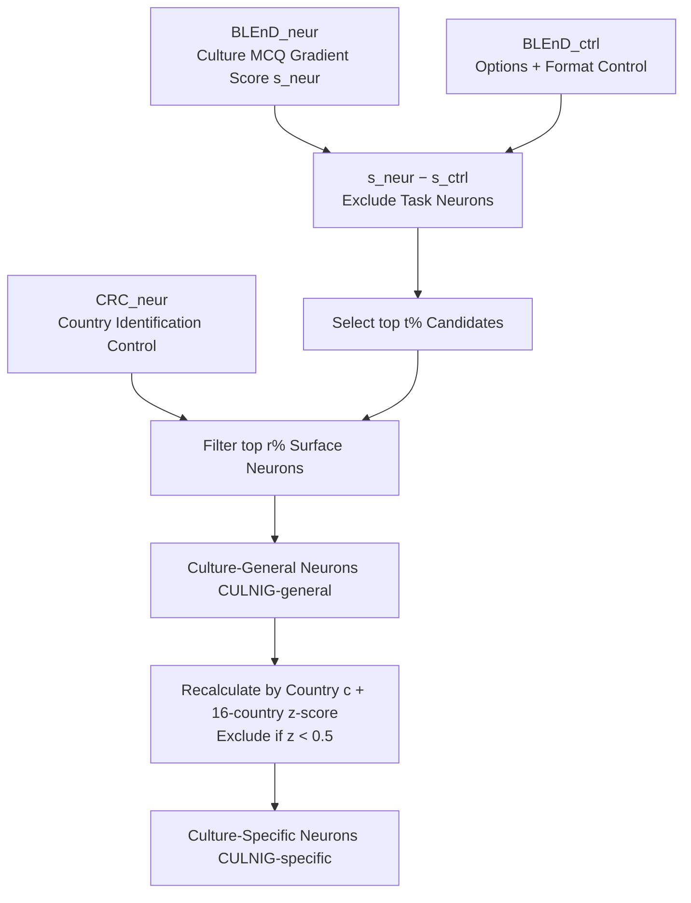

# Neuron-Level Analysis of Cultural Understanding in Large Language Models

**Conference**: ICLR 2026  
**OpenReview**: [https://openreview.net/forum?id=HZMmM3Dmri](https://openreview.net/forum?id=HZMmM3Dmri)  
**Code**: [https://github.com/ynklab/CULNIG](https://github.com/ynklab/CULNIG)  
**Area**: Mechanistic Interpretability / Neuron Analysis  
**Keywords**: Cultural Understanding, Neuron Attribution, Gradient Attribution, MLP Memory, Cultural Bias  

## TL;DR
This paper proposes CULNIG—a neuron identification pipeline based on gradient attribution and dual-contrast filtering. It accurately locates "culture-general neurons" and "culture-specific neurons" in LLMs, finding that they constitute less than 1% of all neurons and are concentrated in shallow-to-middle MLP layers. Inhibiting them drops performance on cultural benchmarks by up to 30% while barely affecting general NLU.

## Background & Motivation
- **Background**: As LLMs are deployed globally, training corpora are predominantly English, leading to significant cultural biases and a lack of understanding of low-resource cultures. While benchmarks (BLEnD, CulturalBench, NormAd, WorldValuesBench) exist to measure these deficiencies and methods have been proposed to enhance cultural awareness, few studies investigate the internal mechanisms of cultural reasoning in LLMs.
- **Limitations of Prior Work**: Most attempts at neuron-level analysis of cultural mechanisms (e.g., CAPE/LAPE) rely on **activation probability** to locate neurons and primarily link culture with "language." Activation-based methods have two major flaws: (1) they only consider positive activations and discard information from negative activations; (2) cultural content does not appear uniformly on every token like language does, making token-activation-based localization imprecise.
- **Key Challenge**: Explaining how LLMs achieve cultural understanding requires identifying neurons that **truly drive cultural behavior**, rather than surface-level neurons that merely respond to "country names" or "task formats." Activation methods struggle to distinguish between these.
- **Goal**: This study addresses three research questions: (i) the existence and distribution of cross-cultural "culture-general neurons"; (ii) differences in "culture-specific neurons" and their correlation with cultural kinship; (iii) the application of this analysis to model training engineering.
- **Key Insight**: **Use gradient attribution instead of activation probability** and apply two layers of contrastive filtering—one subtracting a "content-free, options-only" control set to remove task-understanding neurons, and another using a custom "country name recognition" dataset to filter surface-level neurons that only recognize country tokens. This effectively extracts clean "cultural understanding" signals.

## Method

### Overall Architecture
CULNIG (CULture Neuron Identification pipeline with Gradient-based scoring) decomposes neuron localization into three steps: "Scoring → Task-Contrast Subtraction → Surface-Contrast Subtraction." It first uses gradient attribution to score neurons on the cultural MCQ dataset BLEnD, subtracts scores from the content-free control set BLEnD_ctrl to exclude task neurons, and then removes surface-level neurons with high scores on the custom "Country Reading Comprehension" (CRC) dataset. Identified neurons are categorized into **culture-general neurons** (CULNIG-general) and **culture-specific neurons** (CULNIG-specific, which adds a 16-country z-score filter).

### Key Designs

**1. Gradient Attribution Scoring: Calculating the impact of neuron removal.** CULNIG focuses on the **causal contribution** of each neuron to the output probability rather than activation probability. For the $k$-th neuron in the $l$-th layer at token position $i$, the attribution score is defined as $s_{(l,k,i)}(x,y) = n_{(l,k,i)} \times \frac{\partial P(y|x)}{\partial n_{(l,k,i)}}$, taking the maximum across token positions. This approximates the causal effect of zeroing a neuron $P(y|x,n=\bar u)-P(y|x,n=0)$ via a first-order Taylor expansion. Unlike brute-force masking, which is computationally prohibitive for millions of neurons, the gradient method **obtains scores for all neurons in a single forward-backward pass**. Dataset-level aggregation is weighted by model confidence $s_{(l,k)}(D)=\sum_q P(y_q|x_q)\times s_{(l,k)}(x_q,y_q)$, ensuring that samples where the model is more confident contribute more. This process covers both MLP gate neurons (deciding values in key-value memory) and Attention query/key/value neurons.

**2. Dual-Contrast Subtraction: Stripping "task" and "country-name" noise.** High-scoring neurons in cultural MCQ often include irrelevant ones. The first type is task neurons responsible for "understanding format/multiple-choice rules." These are eliminated by subtracting scores of **BLEnD_ctrl** (question stem removed, only options and instructions kept): $s_{(l,k)}(\text{BLEnD}_{neur}) - s_{(l,k)}(\text{BLEnD}_{ctrl})$. The second type is surface neurons that react only to "country name tokens." The authors created the **CountryRC (CRC)** dataset, where the correct answer is always a country name mentioned in the context but **requires zero cultural knowledge** (e.g., "Where did Matthew go for an internship?"). Neurons scoring in the top $r\%$ on CRC are discarded. This ensures only "true cultural knowledge" neurons remain.

**3. z-score Isolation for Culture-Specific Neurons.** For a specific country $c$, scores are recalculated as $s_{(l,k,c)}=s(\text{BLEnD}^{(c)}_{neur})-s(\text{BLEnD}^{(c)}_{ctrl})$. Standardized scores $z^{(c)}=\frac{s_{(l,k,c)}-\mu}{\sigma}$ are calculated across all 16 countries. Neurons with $z^{(c)}<0.5$ are categorized as contributing to multiple cultures and are filtered out. This identifies neurons with a significant preference for a single culture, allowing verification of whether "masking one country's neurons simultaneously impacts its related cultures." Since z-score filtering inherently filters task neurons, CULNIG-specific does not require separate MLP/Attention thresholds.

**4. Module Selection for Training: Engineering based on interpretability.** The authors rank modules by the density of "culture-general neurons" and update only a small fraction (~10% parameters) during fine-tuning. They either select **top-culture modules** (mostly shallow-to-mid MLP) or **bottom-culture modules** (mostly extremely shallow/deep Attention and MLP). Fine-tuning on QNLI/MRPC using top-culture modules improves target tasks but significantly harms cultural benchmarks. Conversely, using bottom-culture modules improves target tasks while preserving cultural capabilities, providing a strategy for "efficient and robust" target module selection.

## Key Experimental Results

Models: gemma-3-12b-it, gemma-3-27b-it, Qwen3-14B, Llama-3.1-8B-Instruct, phi-4, Falcon3-10B-Instruct. Data: BLEnD_neur/ctrl + CRC_neur for identification; BLEnD_test, CulturalBench, NormAd, WorldValuesBench (Culture) + CRC_test, CommonsenseQA, QNLI, MRPC (General NLU) for evaluation.

### Main Results (Inhibiting Culture-General vs. Random Neurons)

| Model | Setting | #Neurons | BLEnD_test | CultB | NormAd | WVB | ComQA | QNLI | MRPC |
|------|------|--------|-----------|-------|--------|-----|-------|------|------|
| gemma-3-12b-it | orig | 0 | 64.22 | 78.08 | 58.54 | 64.08 | 79.71 | 75.37 | 78.04 |
| | **Ours** | 8,087 | **37.93** | **62.00** | **52.02** | 58.46 | 75.10 | 72.77 | 78.65 |
| | rand | 8,087 | 63.57 | 77.31 | 57.55 | 64.03 | 79.18 | 75.46 | 78.22 |
| Qwen3-14B | orig | 0 | 65.96 | 76.92 | 56.85 | 65.22 | 81.76 | 71.31 | 79.91 |
| | **Ours** | 7,340 | **35.84** | **57.07** | **49.02** | 60.70 | 75.23 | 76.20 | 78.70 |
| Llama-3.1-8B | orig | 0 | 60.18 | 70.54 | 47.71 | 64.05 | 76.74 | 64.43 | 73.93 |
| | **Ours** | 4,268 | **32.19** | **36.94** | **37.65** | 51.68 | 51.97 | 48.64 | 69.35 |

Conclusion: Inhibiting <1% of culture-general neurons causes BLEnD_test to drop by up to 30%, with significant synchronous declines in CultB/NormAd, while QNLI/MRPC remain stable (bold indicates statistically significant decrease compared to random, bootstrap p<0.05).

### Ablation Study

| Phenomenon | Key Finding |
|------|---------|
| Module Roles (MLP vs. Attn) | Inhibiting MLP neurons harms cultural benchmarks significantly but barely affects QNLI/MRPC; Attention has smaller impact → set $t_{MLP}=1\%, t_{attn}=0.2\%$. |
| Neuron Distribution | Both general and specific culture neurons concentrate in **shallow-to-mid MLP layers** consistently across 6 models; contradicts CAPE's "top-layer" report. |
| Culture-Specific Neurons | Masking neurons for country $c$ impacts $c$ most, followed by **culturally kinned nations** (e.g., masking Mexico impacts Mexico 1st, Spain 3.8th). |
| Instance-Level Analysis | Top culture neurons score positive on only 29% of samples → they encode **knowledge concepts** rather than meta-control signals; culture and values share neurons. |
| Engineering Application | Updating top-culture modules during QNLI/MRPC fine-tuning destroys cultural capabilities; updating bottom-culture modules does not. |

### Key Findings
1. The "hardware carrier" of cultural understanding is **less than 1% of neurons in shallow-to-mid MLP layers**, aligning with the theory that MLPs handle knowledge recall and Attention handles context processing.
2. Neurons identified using only food/work-life/sport categories **generalize** to unseen domains, different task formats, multiple languages, and cultural values (NormAd/WVB), capturing a broad cultural representation.
3. Culture-specific neurons are **shared across kin cultures**, providing mechanistic evidence for "cultural relation maps."
4. Fine-tuning that inadvertently updates modules rich in general culture neurons causes rapid loss of cultural ability—identifying these modules can guide stable training strategies.

## Highlights & Insights
- **Methodological Correction**: Demonstrates the unsuitability of activation probability for cultural contexts and shifts to gradient attribution, strictly linking it to causal neuron masking via Taylor expansion.
- **Clever Dual-Contrast Design**: Using BLEnD_ctrl to remove task understanding and CRC to remove country-name recognition cleanly isolates "cultural understanding" from "test-taking ability."
- **Closing the Loop**: Moves beyond "identifying neurons" to "selecting fine-tuning modules," providing actionable knobs to prevent cultural knowledge erosion.
- **Shared Kinship**: Linking neuron analysis with cultural-geographical relations provides stronger explanatory power than simply identifying "important" neurons.

## Limitations & Future Work
- Discrepancy with CAPE's distribution findings (upper vs. shallow-mid layers). The authors could not replicate CAPE and offer hypotheses (gradient vs. activation, accuracy vs. perplexity) but **have not fully resolved it**.
- Engineering experiments were limited to QNLI/MRPC. The applicability of "role-based module selection" to broader NLP tasks, knowledge editing, or cultural knowledge injection remains a **subject for future work**.
- Identification relied on a subset of BLEnD; while generalization was shown, the coverage of "culture" is still limited by existing benchmark sets (16/8 countries).

## Related Work & Insights
- **Knowledge Neuron Lineage**: Following Dai et al. (2022) for gradient attribution and Yang et al. (2024) for bias neurons, this work pushes the boundary into the "culture" dimension.
- **Contrast with Activation Methods**: Challenges the methodology and conclusions of LAPE (Tang et al., 2024) and CAPE (Namazifard & Galke, 2025).
- **MLP as Memory**: Supports the key-value memory perspective of Geva et al. (2021) and Meng et al. (2022) by focusing on MLP gate neurons.
- **Insight**: The "Gradient Attribution + Multi-Contrast Subtraction" represents a general paradigm for identifying neurons specific to any abstract capability (values, personality, safety).

## Rating
- **Novelty**: ⭐⭐⭐⭐ — First systematic use of gradient attribution + dual contrast to isolate cultural neurons; effectively challenges mainstream activation-based conclusions.
- **Experimental Thoroughness**: ⭐⭐⭐⭐ — Covers 6 SOTA models, 8 benchmarks, statistical tests, and cross-lingual/kinship analysis.
- **Writing Quality**: ⭐⭐⭐⭐ — Clear research questions and logical progression from mechanism discovery to engineering application.
- **Value**: ⭐⭐⭐⭐ — Provides mechanistic evidence and practical guidance for cultural alignment and responsible deployment.

<!-- RELATED:START -->

## Related Papers

- [\[ICLR 2026\] A Comprehensive Information-Decomposition Analysis of Large Vision-Language Models](a_comprehensive_information-decomposition_analysis_of_large_vision-language_mode.md)
- [\[ICLR 2026\] Emotions Where Art Thou: Understanding and Characterizing the Emotional Latent Space of Large Language Models](emotions_where_art_thou_understanding_and_characterizing_the_emotional_latent_sp.md)
- [\[ACL 2026\] DPN-LE: Dual Personality Neuron Localization and Editing for Large Language Models](../../ACL2026/interpretability/dpn-le_dual_personality_neuron_localization_and_editing_for_large_language_model.md)
- [\[ICLR 2026\] Medical Interpretability and Knowledge Maps of Large Language Models](medical_interpretability_and_knowledge_maps_of_large_language_models.md)
- [\[ACL 2026\] METER: Evaluating Multi-Level Contextual Causal Reasoning in Large Language Models](../../ACL2026/interpretability/meter_evaluating_multi-level_contextual_causal_reasoning_in_large_language_model.md)

<!-- RELATED:END -->
