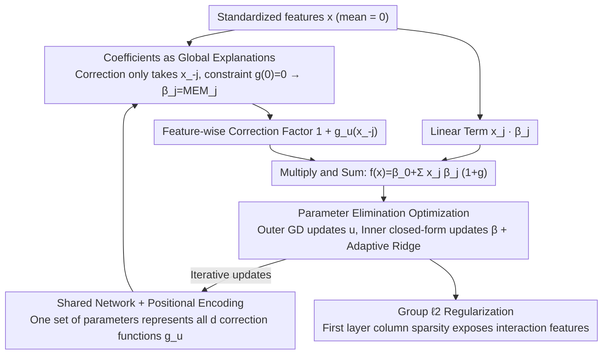

# NIMO: a Nonlinear Interpretable MOdel

**Conference**: ICLR 2026  
**arXiv**: [2506.05059](https://arxiv.org/abs/2506.05059)  
**Code**: None  
**Area**: Interpretable Machine Learning  
**Keywords**: interpretable model, marginal effects, linear regression, neural networks, feature effects

## TL;DR

NIMO proposes a hybrid model $y = \sum_j x_j \beta_j (1 + g_{\mathbf{u}_j}(\mathbf{x}_{-j}))$. While maintaining the global interpretability of linear regression coefficients (via Mean Marginal Effects, MEM), it utilizes neural networks to provide instance-specific nonlinear corrections. The model uses a parameter elimination method to efficiently optimize linear coefficients and network parameters jointly.

## Background & Motivation

**Accuracy vs. Interpretability Dilemma**: Linear regression provides clear feature effect interpretations through coefficients but has limited predictive power; neural networks are powerful for prediction but lack inherent interpretability and are often viewed as "black boxes."

**Unreliability of Post-hoc Explanations**: Post-hoc methods like SHAP and LIME rely on hyperparameter choices and do not guarantee fidelity.

**Limitations of Prior Work**: NAM cannot capture feature interactions; LassoNet has limited global interpretability; IMN predicts different coefficients for each instance, thereby losing global interpretability.

**Importance of Feature Effects**: In high-risk fields such as healthcare, it is necessary to simultaneously address local questions ("How does increasing age affect the risk for this specific patient?") and global questions ("How does age overall affect risk?").

**Key Challenge**: Joint optimization is non-trivial when linear coefficients $\boldsymbol{\beta}$ and neural network parameters $\mathbf{u}$ are tightly coupled.

## Method

### Overall Architecture

NIMO starts from a standard linear regression but multiplies the coefficient of each feature by a nonlinear correction factor determined by "other features." This preserves the global interpretability of $\beta_j$ while gaining instance-wise flexibility. The complete model is formulated as $f(\mathbf{x}) = \beta_0 + \sum_{j=1}^d x_j \beta_j (1 + g_{\mathbf{u}_j}(\mathbf{x}_{-j}))$. After standardizing input features, the linear term $x_j\beta_j$ is element-wise multiplied by the correction factor $1+g$ produced by the neural network for each feature, then summed to obtain the prediction $f(\mathbf{x})$. During training, instead of directly optimizing the coupled $\boldsymbol{\beta}$ and $\mathbf{u}$, it employs an outer loop using gradient descent to update $\mathbf{u}$ and an inner loop using a closed-form solution to refresh $\boldsymbol{\beta}$, iterating until convergence. The core goal of the design is to ensure $\beta_j$ strictly equals the Mean Marginal Effect ($\text{MEM}_j$), making "reading coefficients" equivalent to "reading global feature effects."

### Key Designs

**1. Coefficients as Global Explanations: Fixing $\beta_j$ as MEM via Two Constraints**

This is the theoretical selling point of NIMO, guaranteed by two interlocking constraints. The first is **Excluding Self-Features**: If the correction network also took $x_j$ as input, the network would contribute additional sample-dependent terms when calculating the marginal effect of $x_j$, meaning $\beta_j$ could no longer independently represent the "effect of $x_j$ on $y$." NIMO forces each $g_{\mathbf{u}_j}$ to receive only $\mathbf{x}_{-j}$. Consequently, $x_j$ only enters through the linear term $x_j\beta_j$, while the nonlinearity only characterizes how interactions between features amplify or weaken the $j$-th coefficient. The second is the **Zero-Point Constraint** $g_{\mathbf{u}_j}(\mathbf{0})=0$: Excluding self-features is insufficient because the correction factor $1+g$ would still deviate from 1 at general points, causing marginal effects to drift with samples. NIMO standardizes data to zero mean and explicitly subtracts $g_{\mathbf{u}}(\mathbf{0})$ during forward propagation to force $g$ to be zero at the origin. Together, these constraints ensure that at the mean point $\mathbf{x}=\mathbf{0}$, the correction factor is exactly 1 and the model degrades to a pure linear form. Thus, the Mean Marginal Effect

$$\text{MEM}_j = \frac{\partial f}{\partial x_j}\Big|_{\mathbf{x}=\mathbf{0}} = \beta_j$$

holds precisely. "Coefficients as global explanation" is no longer an approximation but an equality enforced by design.

**2. Shared Network + Positional Encoding: Ensuring Scalability in High Dimensions**

A naive implementation would require an independent network $g_{\mathbf{u}_j}$ for each feature, which is infeasible as the number of parameters explodes when $d$ is large. NIMO uses a single shared network $g_\mathbf{u}$ and appends a positional encoding for each feature index as input. This reduces the model scale from growing linearly with $d$ to a constant level, which is critical for running in 50-dimensional settings while maintaining stability and ensuring interpretability constraints hold.

**3. Parameter Elimination Optimization: Decoupling via Profile Likelihood with Closed-form Sparsity**

Directly optimizing $\boldsymbol{\beta}$ and network parameters $\mathbf{u}$ is unstable due to tight coupling. NIMO leverages the profile likelihood idea: When $\mathbf{u}$ is fixed, the sub-problem for $\boldsymbol{\beta}$ is a least squares problem with a ridge term, which has a closed-form solution:

$$\hat{\boldsymbol{\beta}}(\mathbf{u}) = (B_\mathbf{u}^T B_\mathbf{u} + \lambda I)^{-1} B_\mathbf{u}^T \mathbf{y}$$

where $B_\mathbf{u}$ is the design matrix after absorbing the correction factors. Substituting this back, the objective function depends only on $\mathbf{u}$. The outer loop uses gradient descent to optimize $\mathbf{u}$, while the inner loop refreshes $\boldsymbol{\beta}$ at each step with the closed-form solution. The highly coupled joint optimization is thus decomposed into a clean nested structure. To achieve sparsity without breaking this structure (as Lasso/$\ell_1$ lacks a closed-form solution), NIMO uses Grandvalet (1998)'s adaptive ridge regression. It rewrites $\ell_1$ as a feature-wise reweighted $\ell_2$ penalty. Each step remains a ridge regression (preserving the closed-form), while it can be proven equivalent to Lasso at the optimum. It also supports sub-$\ell_1$ pseudo-norms to reduce over-shrinkage of large coefficients.

**4. Group $\ell_2$ Regularization: Exposing Feature-level Interaction Sparsity**

While linear coefficients indicate which features have linear effects, they do not show which features participate in interactions. NIMO applies a group $\ell_2$ penalty to each column (corresponding to an input feature) of the first weight matrix of the shared network. When a feature contributes nothing to any correction function, the entire column of weights is pressed to zero, effectively removing it from nonlinear interactions. This provides a second level of interpretability, allowing users to identify both linear effects and interaction structures.

### Loss & Training

The objective for regression is least squares with a sparsity penalty $\|\mathbf{y} - B_\mathbf{u}\boldsymbol{\beta}\|^2 + \lambda \|\boldsymbol{\beta}\|_1$, where the $\ell_1$ term is approximated via adaptive ridge. For classification, IRLS (Iterative Reweighted Least Squares) approximates the log-likelihood as weighted least squares, allowing the same parameter elimination framework to be applied and naturally extending to GLMs like logistic regression.

## Key Experimental Results

### Main Results

MSE on synthetic regression datasets:

| Method | Setting 1 (5D) | Setting 2 (10D) | Setting 3 (50D) |
|------|---------|----------|----------|
| Lasso | 3.164 | 3.340 | 13.122 |
| NN | 1.109 | 1.482 | 13.718 |
| NAM | 3.427 | 5.126 | 16.543 |
| IMN | 0.137 | 1.188 | 6.308 |
| LassoNet | 0.078 | 2.612 | 1.738 |
| **Ours (NIMO)** | **0.024** | **0.197** | **0.380** |

NIMO leads significantly across all settings, with an improvement of over 4x in the 50D scenario.

### Ablation Study

| Component | Impact |
|------|------|
| Removing $g_j$ (Pure Linear) | Accurate coefficients but poor fit |
| Allowing $g_j$ to depend on $x_j$ | Coefficients become uninterpretable |
| Removing zero-point constraint | MEM no longer equals $\beta_j$ |
| Removing group $\ell_2$ | Failure to identify non-interacting features |
| Removing sparsity | Failure to correctly recover zero coefficients |

Toy example validation (3D):

| Metric | Ours (NIMO) | Lasso |
|------|------|-------|
| $\beta_1=3, \beta_2=-3$ Recovery | Precise | Precise |
| $\beta_3=0$ Identification | Correctly Zero | Non-zero |
| Nonlinear Interaction Recovery | Matches Ground Truth | N/A |

### Key Findings

- Robust under low data regimes (200 samples) thanks to parameter elimination and regularization.
- In pure linear verification, the network component does not interfere with the recovery of linear coefficients.
- MEM feature rankings are highly consistent with SHAP rankings, but NIMO is intrinsic rather than a post-hoc approximation.
- Predictive performance on diabetes, Boston, and superconductivity datasets is comparable to or better than state-of-the-art methods.

## Highlights & Insights

1. **Elegant Design**: Three sophisticated constraints (excluding self-features, zero-point constraint, standardization) guarantee MEM = $\beta$.
2. **Clever Parameter Elimination**: Application of profile likelihood ideas to hybrid model optimization.
3. **Multi-level Interpretability**: Global via $\beta_j$, instance-wise via $h_j(\mathbf{x})$, and interaction-level via first-layer weight sparsity.
4. **Natural Extension to GLMs**: Directly applicable to logistic regression and other GLMs via IRLS.
5. **Adaptive Ridge Equivalency**: Utilizing classical results to achieve sparsity while maintaining closed-form solutions.

## Limitations & Future Work

- Scalability in extremely high dimensions ($d > 1000$) remains unverified.
- Assumes nonlinear corrections come from interactions with other features, ignoring self-nonlinear effects.
- Experimental dataset sizes are relatively small (UCI); performance on large-scale data is unknown.
- Insufficient comparison with other interpretable methods like EBM or GAMI-Net.
- Currently only supports tabular data.

## Related Work & Insights

- **NAM (Agarwal et al., 2021)**: Additive models without interactions → NIMO supports interactions via $g_j(\mathbf{x}_{-j})$.
- **LassoNet (Lemhadri et al., 2021)**: Sparse + nonlinear but limited global interpretability → NIMO achieves both.
- **IMN (Kadra et al., 2024)**: Instance-wise coefficients lose global meaning → NIMO unifies global and local.
- **Grandvalet (1998)**: Theoretical basis for adaptive ridge equivalence to Lasso → integrated into NIMO optimization.
- **Insight**: Can be extended to time series (time-varying coefficients) or causal inference (correction for heterogeneous treatment effects).

## Rating

- **Novelty**: ⭐⭐⭐⭐ The model design is clever; the theoretical guarantee of MEM=$\beta$ is the core innovation.
- **Experimental Thoroughness**: ⭐⭐⭐ Synthetic and real-world experiments are well-validated, though data scale is small.
- **Writing Quality**: ⭐⭐⭐⭐⭐ Clear motivation, intuitive toy examples, and strong integration of theory and experiments.
- **Value**: ⭐⭐⭐⭐ Provides a practical solution for "accurate yet interpretable" modeling with high potential in high-risk domains.

<!-- RELATED:START -->

## Related Papers

- [\[ICLR 2026\] Learning Nonlinear Causal Reductions to Explain Reinforcement Learning Policies](learning_nonlinear_causal_reductions_to_explain_reinforcement_learning_policies.md)
- [\[ICML 2026\] Prototype Transformer: Towards Language Model Architectures Interpretable by Design](../../ICML2026/interpretability/prototype_transformer_towards_language_model_architectures_interpretable_by_desi.md)
- [\[ACL 2026\] AdaptiveK: Complexity-Driven Sparse Autoencoders for Interpretable Language Model Representations](../../ACL2026/interpretability/adaptivek_complexity-driven_sparse_autoencoders_for_interpretable_language_model.md)
- [\[ICLR 2026\] Hidden Breakthroughs in Language Model Training](hidden_breakthroughs_in_language_model_training.md)
- [\[ICLR 2026\] Patronus: Interpretable Diffusion Models with Prototypes](patronus_interpretable_diffusion_models_with_prototypes.md)

<!-- RELATED:END -->
