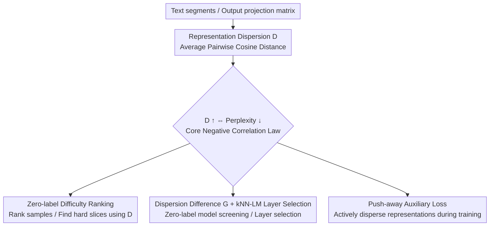

# On the Predictive Power of Representation Dispersion in Language Models

**Conference**: ICLR 2026  
**OpenReview**: [https://openreview.net/forum?id=qvVrAMdK2F](https://openreview.net/forum?id=qvVrAMdK2F)  
**Code**: https://github.com/yanhong-lbh/rep_dispersion  
**Area**: Interpretability / Representation Geometry Analysis  
**Keywords**: Representation Dispersion, Embedding Geometry, Perplexity, Zero-label Diagnosis, kNN-LM

## TL;DR
This paper discovers that the "spread" of language model hidden states (average pairwise cosine distance, termed representation dispersion) is strongly negatively correlated with perplexity—stronger models spread contexts further apart. This simple geometric metric is transformed into four zero-label practical tools: sample difficulty ranking, model selection, kNN-LM layer selection, and a push-away training loss that directly reduces perplexity.

## Background & Motivation

**Background**: Anisotropy and rank collapse in LLM embedding geometry have long been observed—hidden states are crowded in a narrow cone and occupy only a low-dimensional subspace. Such geometric properties are often thought to limit model expressivity.

**Limitations of Prior Work**: However, the exact relationship between "embedding geometry" and "autoregressive text prediction capability" remains unclear. Existing studies (e.g., Viswanathan et al., 2025) are mostly descriptive—observing that cosine similarity increases when tokens are shuffled—but fail to turn geometric properties into actionable metrics. Mechanistic interpretability tends to decompose models into specific circuits or attribution heads, requiring component-by-component analysis and often relying on labeled data or external probes.

**Key Challenge**: Practitioners need actionable signals to judge—without labeling costs or expensive evaluations—"whether this model works on this data," "which samples will result in errors," or "which layer is best for retrieval keys." Existing geometric analyses provide no such signals.

**Goal**: To find an intrinsic geometric metric that can both **predict** and **improve** model quality while being **completely label-free**, and to verify its deployment across four tasks: difficulty assessment, model screening, layer selection, and training.

**Key Insight**: The authors start from an intuition (Figure 1 in the paper): weak models compress semantically similar contexts into tight clusters, while strong models pull them apart (even if semantically similar). Greater dispersion implies clearer distinction in the latent space, leading to sharper (lower entropy) next-token predictions. If this holds, "embedding spread" should be linked to perplexity.

**Core Idea**: Use a simple statistic—average pairwise cosine distance of hidden vectors (representation dispersion $D$)—to characterize "how spread out the embeddings are," prove its strong negative correlation with perplexity, and treat it as a universal signal for evaluation and training.

## Method

### Overall Architecture

This paper is not an end-to-end model but an analytical framework of "one core geometric metric + one core law + four applications." The core metric is representation dispersion $D$: hidden vectors of $N$ text segments are extracted from a layer (default: last layer), and their average pairwise cosine distance is calculated. The core law is: higher $D$ corresponds to lower perplexity (Pearson $r$ typically between $-0.6$ and $-0.9$ across model families and domains). Following this, $D$ is used as a "zero-label ruler" for four downstream tasks, requiring only hidden states or weight matrices.

The framework below shows the flow from the metric to the four applications:

### Key Designs

**1. Representation Dispersion D: Quantifying "Embedding Spread" and Predicting Perplexity**

The authors provide a minimalist metric to bridge geometry and predictive power. For any selected layer, hidden vectors $E_i \in \mathbb{R}^d$ are sampled from $N$ text segments. Representation dispersion is defined as:

$$D = \frac{1}{\binom{N}{2}} \sum_{1 \le i < j \le N} \left[1 - \frac{E_i \cdot E_j}{\lVert E_i \rVert \lVert E_j \rVert}\right].$$

Higher $D$ indicates more spread-out embeddings. Key finding: binning 100,000 segments of 512-token text by perplexity reveals a strong negative correlation—low-perplexity samples have more dispersed embeddings. This trend is consistent across LLaMA, Phi, Mistral, and Qwen families, and across Wikipedia, news, and medical/scientific domains (Pearson $r \approx -0.62$ to $-0.92$). Sub-observations include: **Layer depth effect**—correlation strengthens in deeper layers (early layers capture lexical features with little correlation); **Intra-cluster expansion**—both intra-cluster and inter-cluster distances increase during training, meaning strong models spread out even highly similar contexts.

**2. Zero-label Difficulty Ranking: Using D as a Difficulty Meter to Find Hard Slices**

Practitioners often need to identify if a model is accurate on unlabeled queries. Given that high $D$ tracks low perplexity, the authors hypothesize $D$ tracks correctness. Experiments using a controlled design (mixing correct/incorrect samples at different ratios) show that accuracy increases monotonically with $D$. Thus, unlabeled data can be ranked by $D$, and "low dispersion tails" can be inspected to locate failure modes or concentrate further training on these "hard" queries.

**3. Dispersion Difference G and kNN-LM Layer Selection: Model Screening and Layer Selection Signals**

Two versions of selection are proposed. First, **Model Selection**: choosing between checkpoints (SFT, PEFT, distillation) without expensive evaluation. The authors calculate geometry directly from the rows of the output projection matrix (output token embeddings) to define dispersion difference:

$$G = \text{within}(\mathcal{T}) + \text{between}(\mathcal{T}, \bar{\mathcal{T}}),$$

where $\mathcal{T}$ represents domain-specific tokens (e.g., numbers in math) and $\bar{\mathcal{T}}$ represents general tokens. High $G$ means the model distinguishes domain tokens well. This correlates strongly with task accuracy (Spearman $> 0.95$ on Qwen MATH). Second, **kNN-LM Layer Selection**: identifying which sub-layer (Attention $h^{(L)}_{\text{att}}$ vs. FFN $h^{(L)}_{\text{ffn}}$) should be used as the datastore key. The authors find Attention sub-layers consistently have higher dispersion, making them superior keys—a decision achievable in milliseconds without end-to-end trials.

**4. Push-away Auxiliary Loss: Direct Geometric Regularization during Training**

The authors incorporate the observation into training by encouraging dispersion. An auxiliary term pushes apart hidden vectors within a batch. For single-domain settings, the average pairwise distance of normalized vectors $\tilde{h}_i$ is used:

$$d_{\text{avg}} = \frac{1}{B(B-1)} \sum_{i \ne j} \left[1 - \tilde{h}_i \cdot \tilde{h}_j\right].$$

In cross-domain settings (e.g., Wiki + Python code), the loss pushes embeddings from different domains further apart:

$$d = \frac{1}{|A||B|} \sum_{i \in A} \sum_{j \in B} \left[1 - \tilde{h}^{(A)}_i \cdot \tilde{h}^{(B)}_j\right].$$

Total loss: $L_{\text{total}} = L_{\text{CE}} + \lambda L_{\text{aux}}$, where $L_{\text{aux}} = -d_{\text{avg}}$ or $-d$. This significantly reduces perplexity in cross-domain scenarios by learning more specialized features.

### Loss & Training
The training adds an auxiliary "push-away" term $L_{\text{aux}}$ with weight $\lambda$ to the standard next-token cross-entropy. $\lambda$ is selected per learning rate (typically $0.001 \sim 0.1$). Other applications are zero-training operations during inference or weight analysis.

## Key Experimental Results

### Main Results: Core Correlation and Applications

| Experiment | Setting | Key Results |
|------|------|----------|
| PPL vs. Dispersion | LLaMA-3.2 (1B/3B/8B), Wiki/News/Med | Pearson $r \approx -0.62 \sim -0.92$, consistent across families |
| Difficulty Ranking | ARC-Challenge / MMLU, LLaMA 1B/3B/8B | Accuracy increases monotonically with $D$ |
| Model Selection ($G$) | Qwen on MATH (9 checkpoints) | Spearman $>0.95$, perfectly ranked 9 checkpoints |
| Training Trajectory | Olmo-7B 30 intermediate checkpoints | Dispersion tracks performance improvement, correlation $>0.90$ |

### kNN-LM Layer Selection (Dispersion, N=10/50/100)

| Model | Attention Sub-layer $h_{\text{att}}$ | FFN Sub-layer $h_{\text{ffn}}$ |
|------|------|------|
| GPT2-Medium | 0.66 | 0.19 |
| GPT2-Large | 0.80 | 0.68 |
| DistilGPT2 | 0.83 | 0.30 |

The Attention sub-layer is consistently more dispersed and thus chosen as the kNN-LM key.

### Push-away Auxiliary Loss (GPT2-small Test PPL)

| Setting | Config | Step 500 | Step 1000 |
|------|------|----------|-----------|
| Single domain (LR=5e-4) | Base / +Aux ($\lambda$=0.1) | 166.2 / 165.6 | 83.0 / 82.0 |
| Cross domain (LR=7e-4) | Base / +Aux ($\lambda$=0.01) | 304.4 / 255.2 | 175.7 / 150.2 |

### Key Findings
- **Robust Core Law**: Negative correlation between dispersion and perplexity is universal across layers (deepening), models, and domains.
- **Intra-cluster Expansion**: Dispersion is a global phenomenon where even highly similar contexts are pushed further apart as the model improves.
- **Near-perfect Ranking with G**: $G$ correctly ranks all checkpoints without a single error on Qwen MATH using only CPU matrix operations.
- **Cross-domain Gain**: The auxiliary loss is most effective when bridging heterogeneous data sources (e.g., Wiki + Code).

## Highlights & Insights
- **Unified Metric for Diagnosis and Training**: A single statistic (average pairwise cosine distance) predicts performance and acts as a training signal to improve it.
- **Extreme Efficiency of G**: Model selection requires no forward pass and no input data, operating solely on the output projection matrix.
- **Shortcut for Layer Selection**: Dispersion difference pre-identifies the best layer for kNN-LM without exhaustive trials.
- **Component-agnostic Interpretability**: Uses a global geometric metric to link internal structure to external behavior (PPL, accuracy) without decomposing circuits.

## Limitations & Future Work
- The metric is a relative indicator of difficulty/quality, **not a calibrated predictor of absolute accuracy** across different model architectures.
- Model and layer selection require shared tokenizers; absolute dispersion values are not directly comparable across different tokenizers.
- The gain of the push-away loss in single-domain settings is relatively small ($\sim 1-4$ points).
- Experiments primarily cover small to medium models; robustness on LLMs at the 70B+ scale remains to be verified.

## Related Work & Insights
- **vs. Anisotropy/Rank Collapse (Ethayarajh 2019; Gao 2019)**: While prior work noted that collapse hurts expressivity, this paper provides a quantifiable, actionable dispersion metric linked to performance.
- **vs. Viswanathan et al. (2025)**: Advances beyond descriptive analysis of token distributions to prove that dispersion can **predict and improve** accuracy.
- **vs. Mechanistic Interpretability**: Offers a high-level, component-agnostic geometric view instead of component-specific reverse engineering.
- **vs. Probing**: Requires no labeled data; dispersion is an intrinsic measure of the model's own hidden states.

## Rating
- Novelty: ⭐⭐⭐⭐ Transforms a simple statistic from description to prediction/improvement across four tasks.
- Experimental Thoroughness: ⭐⭐⭐⭐ Extensive cross-family/domain validation, though limited to smaller scales.
- Writing Quality: ⭐⭐⭐⭐ Clear narrative (Metric → Law → Applications).
- Value: ⭐⭐⭐⭐ Highly attractive zero-label tools for model diagnosis and screening.

<!-- RELATED:START -->

## Related Papers

- [\[ICLR 2026\] ZeroTuning: Unlocking the Initial Token's Power to Enhance Large Language Models Without Training](zerotuning_unlocking_the_initial_tokens_power_to_enhance_large_language_models_w.md)
- [\[ICLR 2026\] MICLIP: Learning to Interpret Representation in Vision Models](miclip_learning_to_interpret_representation_in_vision_models.md)
- [\[ICML 2026\] DLLM-JEPA: Joint Embedding Predictive Architectures for Masked Diffusion Language Models](../../ICML2026/interpretability/dllm-jepa_joint_embedding_predictive_architectures_for_masked_diffusion_language.md)
- [\[ICLR 2026\] The Deleuzian Representation Hypothesis](the_deleuzian_representation_hypothesis.md)
- [\[ICLR 2026\] Information Shapes Koopman Representation](information_shapes_koopman_representation.md)

<!-- RELATED:END -->
