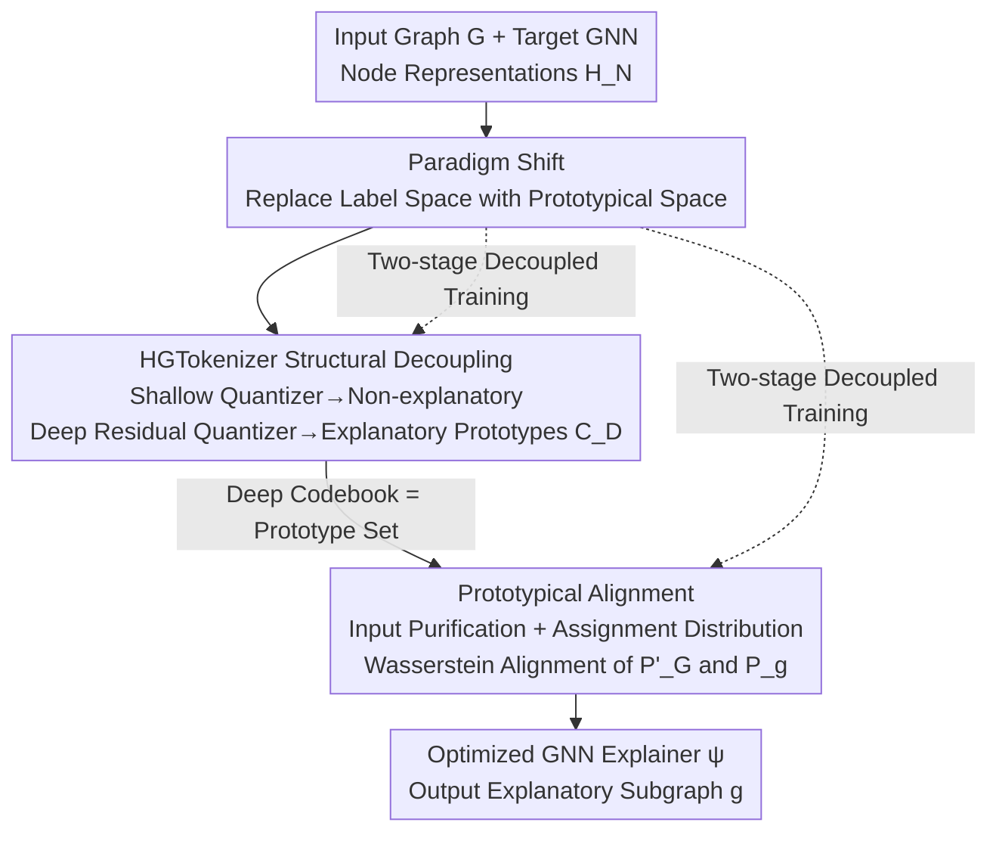

# Paradigm Shift of GNN Explainer from Label Space to Prototypical Representation Space

**Conference**: ICLR 2026  
**OpenReview**: [https://openreview.net/forum?id=X7eYISNf01](https://openreview.net/forum?id=X7eYISNf01)  
**Code**: https://github.com/Esperanto-mega/IDEA  
**Area**: Explainable AI / Graph Neural Networks / Graph Representation Learning  
**Keywords**: GNN Explainer, Prototypical Representation Space, Structural Decoupling, Vector Quantization, Wasserstein Distance

## TL;DR
To address the issue of insufficient utilization of structural information caused by long-term alignment in the "graph label space" by post-hoc instance-level GNN explainers, IDEA migrates explainer optimization from the label space to the "prototypical representation space" for the first time. It uses a hierarchical graph tokenizer to decouple explanatory substructures and aligns the prototypical assignment distributions of the input and explanatory subgraphs using Wasserstein distance. This improves ROC-AUC by an average of 4.45% and precision by 48.71%, while providing plug-and-play enhancement for various existing explainers.

## Background & Motivation
**Background**: The task of post-hoc instance-level GNN explainers is: given a pre-trained GNN model $f(\cdot)$ to be explained and an input graph $G$, identify a compact explanatory subgraph $g^*=\psi(G,f)\subset G$ that retains the most critical components for the GNN's prediction. Most methods, from GNNExplainer and PGExplainer to ProxyExplainer, are built on the "label preserving framework."

**Limitations of Prior Work**: The optimization signal of the label preserving framework comes from the **graph label space**—it trains the explainer by maximizing the mutual information $\mathrm{MI}(f(g),f(G))$ between the prediction of the input graph and that of the explanatory subgraph, essentially forcing both to predict the same label. However, discrete graph labels have weak expressive power and cannot describe the topological structural features of the graph. In complex graph domains like molecular property prediction, **multiple distinct substructures can correspond to the same label**, making the label space incapable of distinguishing which substructure is truly functional. Consequently, the explainer lacks sufficient structural information during optimization.

**Key Challenge**: To fully utilize structural information, it is natural to move optimization to the continuous **graph representation space**, as continuous representations provide fine-grained characterizations of topology. However, a direct implementation (Direct-Align: directly aligning the GNN encoded representations of the input graph and the explanatory subgraph) faces two major obstacles. First is the **entanglement of explanatory and non-explanatory substructures**: due to the message-passing mechanism, the GNN representation of the input graph inevitably mixes these substructures, and direct alignment would mislead the explainer toward non-explanatory parts. Second is **distribution shift**: the explanatory subgraph is a reduced version of the input graph, and its representation naturally follows a shifted distribution in the GNN encoding space; mechanically narrowing the distance between the two representations may obscure the most critical subgraph.

**Goal**: To migrate optimization to the representation space while simultaneously solving the problems of "entanglement" and "distribution shift."

**Core Idea**: Replace the "graph label space" with a "prototypical representation space" as the explainer's optimization arena—first decouple explanatory substructures from the entanglement and distill them into a set of prototypes, then represent and align both the input graph and the explanatory subgraph via their "assignment distributions over prototypes," thereby bypassing the distribution shift in the GNN encoding space.

## Method

### Overall Architecture
IDEA is a **two-stage** universal optimization framework that can generalize to various existing explainer backbones. The pipeline revolves around a "Hierarchical Graph Tokenizer" (HGTokenizer). The first stage is **structural information decoupling**: node representations $H_N$ encoded by the target GNN are fed into HGTokenizer, which uses a Structural-Aware Decoupling (SAD) objective to split them into "non-explanatory" and "explanatory" parts. The explanatory parts are clustered into a set of discrete codebooks (prototypes), constructing the prototypical representation space. The second stage is **explanatory prototypical alignment**: using the quantizer and prototypes learned in the first stage, the input graph representation is "purified" of non-explanatory components via a shallow quantizer. Then, both the purified input representation and the explanatory subgraph representation are implicitly projected onto the prototypical space as assignment distributions, which are aligned using the Wasserstein distance to optimize the explainer $\psi$. The two stages are trained separately to avoid conflicting loss functions.

### Key Designs

**1. Paradigm Shift: Moving Explainer Optimization from Label Space to Prototypical Representation Space**

This is the foundation of the paper, targeting the "insufficient expressiveness of the label space." The authors argue that continuous graph representations provide finer topological descriptions than discrete labels, necessitating optimization signals within the representation space. They go beyond simple "direct alignment of GNN encoded representations" (Direct-Align), which suffers from entanglement and distribution shift, and instead advocate for alignment within a subspace spanned by **explanatory prototypes**. The advantages are two-fold: prototypes only encode explanatory information (solving entanglement), and both graphs are represented using "assignment distributions to prototypes," ensuring consistent metrics (solving distribution shift). Experimental results showing Direct-Align as a runner-up validate the potential of the representation space while highlighting the necessity of the prototypical refinement.

**2. HGTokenizer Structural Decoupling: Stripping Explanatory Substructures into Prototypes via Cascaded Residual Quantization**

This addresses the "entanglement of explanatory and non-explanatory substructures." Inspired by semantic tokenization, HGTokenizer consists of two **cascaded graph quantizers**: a shallow quantizer $\mathrm{GQ}_S$ finds the nearest codeword $q^*_{S,i}=\arg\min_{q\in C_S}D(h_i,q)$ in codebook $C_S$ for node representation $h_i$, and a deep quantizer $\mathrm{GQ}_D$ quantizes the residual $h'_i=h_i-q^*_{S,i}$. Since the codebook size $K$ is much smaller than the number of nodes, the codebooks naturally become "prototypes." The **decoupling term** in the SAD objective, $L_D=\mathrm{KL}(\hat{y}_S\,\|\,U_C)+\mathrm{CrossEntropy}(\hat{y}_D,\hat{y})$, ensures structural differentiation: the first part pushes the shallow prediction $\hat{y}_S$ toward a uniform distribution $U_C$ to capture non-explanatory structures, while the second part aligns the deep prediction $\hat{y}_D$ with the original prediction $\hat{y}$ to capture influential explanatory structures. The **structural-aware term** $L_S=\|A-\sigma(Q^*Q^{*T})\|_2^2+\|X-f_d(Q^*)\|_2^2$ ensures the quantized representations can reconstruct the adjacency matrix and features, guaranteeing that prototypes capture topology. Combined with the standard quantization term $L_Q=\|H_N-Q^*\|_2^2$, the final $L_{SAD}=L_D+\lambda_S L_S+\lambda_Q L_Q$ results in the deep codebook $C_D$ becoming a set of **explanatory prototypes**.

**3. Prototypical Alignment: Bypassing Distribution Shift via Assignment Distributions and Symmetric Wasserstein Distance**

This implements "alignment in the prototypical space" to solve distribution shift. Given the input representation $H_G$, the shallow quantizer first removes non-explanatory components $H_{S,G}=\mathrm{GQ}_S(H_G)$ to obtain the **purified input graph representation** $H'_G=H_G-H_{S,G}$. The explanatory subgraph representation $H_g$ is processed by the deep quantizer. Instead of explicit projection, they are unified via "assignment distributions to the explanatory codebook $C_D$": $P'_G=\mathrm{Norm}(D(H'_G,C_D))$ and $P_g=\mathrm{Norm}(D(H_g,C_D))$. Since both distributions are calculated over the same set of prototypes using the same metric, the distribution shift is bypassed. The alignment uses **entropy-regularized Wasserstein distance** in a symmetric variant $L_{IDEA}=W_\epsilon(P'_G,P_g)+\tfrac12\big(W_\epsilon(P'_G,P'_G)+W_\epsilon(P_g,P_g)\big)$ for stable training, where $W_\epsilon$ minimizes $\sum_{i,j}\gamma_{ij}S_{ij}+\epsilon\sum_{i,j}\gamma_{ij}\log\gamma_{ij}$ over the transport polytope $\Pi(P'_G,P_g)$, with cost matrix $S_{ij}=(P'_{G,i}-P_{g,j})^2$. Wasserstein is preferred over KL for its insensitivity to sparsity in the prototypical space.

**4. Two-stage Decoupled Training: Avoiding Conflicting Optimization Objectives**

IDEA separates structural decoupling (optimizing $L_{SAD}$) and prototypical alignment (optimizing $L_{IDEA}$) into sequential stages rather than joint training. This prevents the two objectives from interfering with each other—stabilizing the prototypical space first provides a clean, fixed environment for training the explainer in the second stage.

### Loss & Training
- First Stage: $L_{SAD}=L_D+\lambda_S L_S+\lambda_Q L_Q$, optimizing the HGTokenizer and its codebooks.
- Second Stage: Freeze the quantizer/prototypes and optimize the explainer $\psi$ using the symmetric entropy-regularized Wasserstein loss $L_{IDEA}$.
- Optional Fusion: $L_{Mix}=\alpha L_{IDEA}+(1-\alpha)L_\psi$, a convex combination of prototypical alignment and label preservation goals, though gains vary by dataset.

## Key Experimental Results

### Main Results
Five datasets (Mutagenicity, Benzene, Alkane-Carbonyl, Fluoride-Carbonyl, BA-2Motifs) using a 3-layer GCN as the target model. Evaluation is treated as edge binary classification, with ROC-AUC as the primary metric.

| Metric | Dataset | IDEA | Best Baseline | Gain |
|------|--------|------|----------|------|
| ROC-AUC | Average | **0.8856** | 0.8479 (ProxyExplainer) | +4.45% |
| ROC-AUC | Mutagenicity | **0.7379** | 0.7016 (PGExplainer) | +5.17% |
| ROC-AUC | BA-2Motifs | **0.9541** | 0.8717 (ProxyExplainer) | +9.45% |
| Precision | Average | **0.6022** | 0.4050 (ProxyExplainer) | +48.71% |
| Precision | Alkane | **0.4565** | 0.3261 (ProxyExplainer) | +39.99% |

Direct-Align (naive representation space alignment) achieved an average ROC-AUC of 0.7116, confirming the potential of shifting to the representation space but highlighting the need for prototypical refinement.

### Main Results (Plug-and-play enhancement for different explainers)

| Explainer Backbone | Original Avg ROC-AUC | +IDEA | Gain |
|------------|------------------|-------|------|
| PGExplainer | 0.8000 | 0.8856 | +10.70% |
| ReFine | 0.6912 | 0.7538 | +9.05% |
| ProxyExplainer | 0.8479 | 0.8690 | +2.48% |
| V-InFoR | 0.6683 | 0.6696 | +1.38% |

IDEA-enhanced PGExplainer (0.8856) slightly outperformed the strongest current baseline, ProxyExplainer.

### Ablation Study

| Configuration | Key Metric | Description |
|------|---------|------|
| IDEA (Full) | Best | Decoupling + Prototypical Alignment + Wasserstein |
| IDEA-KL | -3.33% (Avg) | Replaced Wasserstein with KL divergence |
| EA | 0.0682 lower than Full | Removed structural decoupling stage |
| ID-MSE / ID-InfoNCE | Significantly worse | Direct alignment of $H'_G$ and $H_g$ (no prototypical space) |

### Key Findings
- **Distribution shift is the main bottleneck**: Methods unifying representations in the prototypical space (IDEA/IDEA-KL) significantly outperformed direct alignment (ID-MSE/ID-InfoNCE).
- **Structural decoupling provides gains**: Removing the decoupling stage (EA) resulted in a performance drop of 0.0682.
- **Wasserstein outperforms KL**: Its insensitivity to sparsity in the prototypical space yielded a stable 3.33% advantage.

## Highlights & Insights
- **"Change the Optimization Space" rather than "Change the Network Structure"**: The core contribution is identifying the bottleneck in the optimization signal's space rather than the explainer backbone, allowing it to enhance existing architectures like PGExplainer and ProxyExplainer.
- **Clever Decoupling via Residual Quantization**: Using cascaded quantizers to separate non-explanatory and explanatory features, aided by directional supervision, encodes decision-making directly into the codebook.
- **"Assignment Distribution" as a Unified Representation**: This implicit unification method is the key trick for bypassing distribution shift and could be generalized to tasks like motif mining or subgraph retrieval.

## Limitations & Future Work
- **Fusion Sensitivity**: Benefits of mixing with the label-preservation objective are inconsistent across datasets.
- **Generalization Boundaries**: Gains are minimal for explainers like V-InFoR designed for structural corruption, as prototypical gains depend on matching backbone assumptions.
- **Evaluation Scale**: Tested primarily on molecular/synthetic datasets with a single target model architecture.
- **Hyperparameter Dependency**: Requires tuning of codebook size $K$, weights $\lambda_S/\lambda_Q$, and entropy regularization $\epsilon$.

## Related Work & Insights
- **vs. Label Preserving Frameworks (GNNExplainer/PGExplainer)**: These align predictions in label space, limited by weak topological expression. IDEA aligns assignment distributions in the prototypical representation space to utilize fine-grained structure.
- **vs. Direct-Align**: Both exit the label space, but Direct-Align is hindered by entanglement and shift; IDEA resolves these via decoupling and prototype assignment.
- **vs. ProxyExplainer/V-InFoR**: These use generative proxies or VAEs to combat distribution shift; IDEA uses shared assignment distributions to make the shift "disappear" from the metric.

## Rating
- Novelty: ⭐⭐⭐⭐⭐ Shifting GNN explainer optimization to a prototypical space is a powerful paradigm shift.
- Experimental Thoroughness: ⭐⭐⭐⭐ Extensive main, generalization, and ablation experiments, though dataset variety could be increased.
- Writing Quality: ⭐⭐⭐⭐ Clear logical progression from the limitations of the label space to the prototype solution.
- Value: ⭐⭐⭐⭐⭐ Plug-and-play enhancement capability offers significant methodological inspiration for the GNN community.

## Related Papers

- [\[ICLR 2026\] The Geometry of Reasoning: Flowing Logics in Representation Space](the_geometry_of_reasoning_flowing_logics_in_representation_space.md)
- [\[ICLR 2026\] Decomposing Representation Space into Interpretable Subspaces with Unsupervised Learning](decomposing_representation_space_into_interpretable_subspaces_with_unsupervised_.md)
- [\[ICLR 2026\] Domain Expansion: A Latent Space Construction Framework for Multi-Task Learning](domain_expansion_a_latent_space_construction_framework_for_multi-task_learning.md)
- [\[ICLR 2026\] Emotions Where Art Thou: Understanding and Characterizing the Emotional Latent Space of Large Language Models](emotions_where_art_thou_understanding_and_characterizing_the_emotional_latent_sp.md)
- [\[ICLR 2026\] TimeSeg: An Information-Theoretic Segment-Wise Explainer for Time-Series Predictions](timeseg_an_information-theoretic_segment-wise_explainer_for_time-series_predicti.md)

<!-- RELATED:END -->

<!-- RELATED:START -->

## Related Papers

- [\[ICLR 2026\] Decomposing Representation Space into Interpretable Subspaces with Unsupervised Learning](decomposing_representation_space_into_interpretable_subspaces_with_unsupervised_.md)
- [\[ICLR 2026\] Domain Expansion: A Latent Space Construction Framework for Multi-Task Learning](domain_expansion_a_latent_space_construction_framework_for_multi-task_learning.md)
- [\[ICLR 2026\] Emotions Where Art Thou: Understanding and Characterizing the Emotional Latent Space of Large Language Models](emotions_where_art_thou_understanding_and_characterizing_the_emotional_latent_sp.md)
- [\[ICLR 2026\] The Deleuzian Representation Hypothesis](the_deleuzian_representation_hypothesis.md)
- [\[ICLR 2026\] Composable Sparse Subnetworks via Maximum-Entropy Principle](composable_sparse_subnetworks_via_maximum-entropy_principle.md)

<!-- RELATED:END -->
