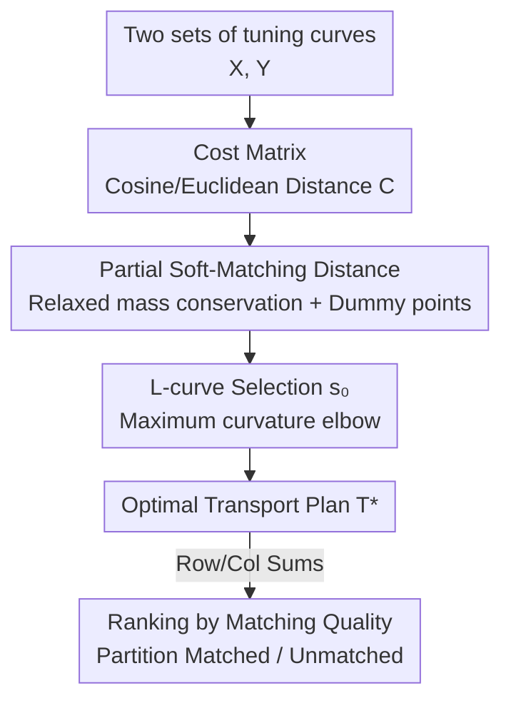

# Partial Soft-Matching Distance for Neural Representational Comparison with Partial Unit Correspondence

**Conference**: ICLR 2026  
**OpenReview**: [https://openreview.net/forum?id=peMOI4RjmJ](https://openreview.net/forum?id=peMOI4RjmJ)  
**Code**: https://github.com/NeuroML-Lab/partial-metric/  
**Area**: Representational Similarity / Interpretability  
**Keywords**: Representational Similarity, Optimal Transport, Partial Matching, Neuronal Correspondence, fMRI

## TL;DR
This paper generalizes "soft-matching distance" to **partial optimal transport**, allowing a portion of neurons to remain unmatched. This approach finds robust unit-level correspondences between neural populations containing noise or missing counterparts. It uses an L-curve heuristic to automatically select the optimal matching mass. Results in simulations, cross-subject fMRI alignment, and deep network neuron ranking show significant improvements over standard soft-matching that forces full correspondence.

## Background & Motivation
**Background**: Understanding whether different systems (networks with different architectures/objectives or brains of different subjects) converge to similar computational solutions requires comparing their neural representations. Prevailing similarity metrics—CKA, RSA, Procrustes distance, CCA—are mostly **rotation-invariant**: they measure geometric similarity but ignore the coordinate axes along which information is encoded, failing to answer unit-level questions like "does a specific neuron have a functional counterpart in another network?"

**Limitations of Prior Work**: The **soft-matching distance** proposed by Khosla & Williams (2024) uses discrete optimal transport (OT) to find rotation-sensitive correspondences while remaining permutation-invariant, filling the aforementioned gap. However, it inherits the hard constraint of classical OT—**the total mass of the two populations must be equal and fully transported**, meaning every unit must be matched.

**Key Challenge**: Real neural populations contain many noisy, inactive, or task-irrelevant units (especially in fMRI/electrophysiology). Even task-related units might be unique to a specific architecture or training regime. Forcing these "counterpart-less" units into pairs creates **spurious correspondences**, inflates transport costs, contaminates the overall distance, and leads to misleading alignment conclusions.

**Goal**: Provide a comparison tool that (1) ignores units without counterparts, (2) measures similarity only on truly matchable subpopulations, and (3) ranks units by alignment quality, without requiring complete overlap between populations.

**Key Insight**: The authors note that "partial optimal transport" (partial OT) relaxes the mass conservation of OT, requiring only a fraction $s\in[0,1]$ of the total mass to be transported. Embedding soft-matching into the partial OT framework allows a portion of the mass to "stay in place" without being matched.

**Core Idea**: Replace **classical OT with partial OT**, relaxing the row and column marginals from equality constraints to inequality constraints, and using a scalar $s$ to control total matching mass, allowing noisy/unmatched units to naturally opt out of matching.

## Method

### Overall Architecture
The input consists of "tuning curves" from two neural populations: response vectors of units to $M$ probe stimuli, stacked into matrices $X\in\mathbb{R}^{M\times N_x}$ and $Y\in\mathbb{R}^{M\times N_y}$. The output is a **partial transport plan** $T^*$, indicating which units correspond, the strength of the correspondence, and which units are unmatched. The pipeline calculates a cost matrix of pairwise distances between units → solves for the minimum cost transport plan within the partial OT feasible region (allowing discarded mass) → scans the matching proportion $s$ and selects the "elbow" $s_0$ using an L-curve heuristic → reads unit matching degrees from the row/column sums of the final transport plan to partition the population into "matched/unmatched."

### Key Designs

**1. Partial Soft-Matching Distance: Relaxing mass conservation to leave noisy units unmatched**

Standard soft-matching constrains the transport plan to the transport polytope—each row sum exactly equals $1/N_x$ and each column sum exactly equals $1/N_y$, forcing all units to pair. This paper changes these **equality marginals to inequalities** and introduces a scalar $s$ to control the total transported mass, yielding the feasible set:
$$\mathcal{T}^s(N_x,N_y)=\Big\{T\in\mathbb{R}_+^{N_x\times N_y}\ \big|\ \textstyle\sum_j T_{ij}\le \tfrac{1}{N_x},\ \sum_i T_{ij}\le \tfrac{1}{N_y},\ \sum_{i,j}T_{ij}=s\Big\}.$$
The partial soft-matching distance is $d_T(X,Y)=\min_{T\in\mathcal{T}^s}\langle C,T\rangle_F$, by default using pairwise cosine distance for $C_{ij}$. Since populations are normalized to unit total mass, $s$ represents the "proportion of units effectively matched." Inequality marginals allow mass in either population to remain unmatched, preventing noisy units from being forced into pairs. The authors solve this by augmenting the cost matrix with **dummy points** (Chapel et al., 2020) with high transport costs; mass routed to dummy points is equivalent to being discarded. Note that relaxing mass conservation means this distance no longer satisfies the triangle inequality, making it a symmetric "dissimilarity" rather than a true metric.

**2. L-curve Heuristic: Automatically selecting the matching mass without knowing noise levels**

The parameter $s$ is critical, but in reality, the proportion of outliers and noise magnitudes are unknown. The authors adapt the **L-curve** concept from ill-posed inverse problems (analogous to Tikhonov regularization), plotting "transport cost" against "regularization strength":
$$f(s)=(\lambda(s),\eta(s)),\quad \lambda(s)=\langle T(s),C\rangle_F,\quad \eta(s)=1-s.$$
Higher $\eta(s)$ (smaller $s$) allows more mass to remain unmatched. By sampling $s$ uniformly in $[0,1]$ to get a cost sequence $\lambda_i$, the curvature is approximated via second-order central differences:
$$\Delta^2\lambda_i=\lambda_{i+1}-2\lambda_i+\lambda_{i-1},$$
The position with the maximum $|\Delta^2\lambda_i|$ is the "elbow," where $s_0$ represents the optimal regularization strength. This point aligns with the balance between "low transport cost" and "aggressive discarding." In simulations (X: 100 signal + 20 noise, Y: 90 signal + 100 noise), it accurately selects $s_0 \approx 90/190 \approx 0.47$, successfully isolating signal from noise.

**3. Correlation Perspective + Single-Optimization Ranking: Replacing expensive brute-force ablation with $O(n^3 \log n)$ computation**

When tuning curves are mean-centered and scaled to unit norm, the inner product $x_i^\top y_j$ equals the Pearson correlation between neurons $i$ and $j$. The optimization can then be rewritten as **maximizing total matched correlation**:
$$d_{\text{corr}}(X,Y)=\max_{T\in\mathcal{T}^s(N_x,N_y)}\sum_{ij}T_{ij}\,x_i^\top y_j,$$
representing the average correlation of paired neurons under coupling $T$. This view provides an efficiency dividends for ranking: a "gold standard" ranking of alignment quality usually requires "brute-force" removal of neurons and re-solving the soft-match (total $O(n^4 \log n)$). For practical tasks like "identifying the top X% most aligned units," one can perform **a single** partial OT ($O(n^3 \log n)$) at an appropriate $s$. The row and column sums of $T^*$ (where sums near zero indicate unmatched units) yield results nearly identical to brute-force ranking. Conversely, simple "correlation-based ordering" using standard soft-matching results fails catastrophically as it ignores the global optimization structure of the transport problem.

## Key Experimental Results

### Main Results
The paper focuses on "model selection" and "cross-subject voxel alignment." In a synthetic model selection task, reference population $X$ has 100 units; $Y_a$ contains all 100 signal units of $X$ + 60 noise units; $Y_b$ contains only 80 of the 100 signal units corresponding to $X$. The correct choice should identify $Y_a$ as closer to $X$.

| Method | $\text{score}(X,Y_a)$ | $\text{score}(X,Y_b)$ | Correct Selection |
|------|------|------|------|
| Standard Soft-Matching (SM) | 0.339 | 0.415 | ❌ Incorrectly selects $Y_b$ (misled by noise) |
| Partial Soft-Matching (**Ours**) | 0.715 | 0.645 | ✅ Correctly selects $Y_a$ |

On NSD fMRI data (Subjects 1 & 2, across six visual areas: V1v/V1d/V2v/V2d/V3v/V3d), the **precision** of cross-subject voxel alignment (proportion of matched voxels belonging to truly corresponding areas) was compared:

| Area Pair | SM | ParSM (**Ours**) | Noise Ceiling ($\varrho=0.3$) |
|--------|------|------|------|
| V1d + V2v | 0.881 | **0.971** | 0.906 |
| V2d + V3v | 0.833 | **0.971** | 0.863 |
| V1v + V1d | 0.839 | **0.905** | 0.855 |
| V1d + V3d | 0.803 | **0.878** | 0.828 |

ParSM achieves higher precision across nearly all pairs, with significant gains in cross-area comparisons (e.g., V1d+V2v 0.881→0.971) by excluding voxels lacking clear correspondences.

### Ablation Study
Comparing three neuron ranking methods on ResNet-18 (ImageNet-trained, two random seeds, comparing filters across layers):

| Ranking Method | Complexity | Alignment Quality | Description |
|------|------|------|------|
| Brute-force ablation | $O(n^4\log n)$ | Gold Standard | Precise but computationally prohibitive |
| Correlation-based | Cheap | Poor | Misidentifies and deletes critical units; scores collapse |
| Partial Soft-Matching (**Ours**) | $O(n^3\log n)$ | ≈ Brute-force | Approaches gold standard with a single optimization |

### Key Findings
- **Forced full matching is a source of bias**: Standard soft-matching can yield reversed conclusions in model selection due to forced noise matching, whereas partial matching correctly judges similarity by focusing on signal.
- **L-curve elbow effectively separates signal from noise**: In simulations with ground truth, the heuristic selects $s_0 \approx 0.47$, matching the true signal ratio of 90/190.
- **Matching quality corresponds to computational roles**: Re-matched ResNet-18 units (top 10% quality) produce nearly identical Most Excitory Images (MEIs), while unmatched units (bottom 10%) have distinct MEIs, suggesting they implement different computations.
- **Privileged axes persist in the most aligned sub-populations**: Applying a random orthogonal rotation $Q$ to one representation causes alignment scores to drop across all layers and values of $s$, indicating that even the best-aligned neurons converge to a shared coordinate system rather than an arbitrary rotation.

## Highlights & Insights
- **The paradigm shift "matching need not be complete" is the core contribution**: Moving from "mandatory correspondence" to "partial correspondence" resolves the long-standing issue of noise contamination with a clean approach supported by partial OT theory.
- **Clever automatic hyperparameter tuning via L-curve**: Converting the problem of "how many units to discard" into a geometric elbow detection on a cost-regularization curve allows for near zero-parameter tuning.
- **Single optimization as a replacement for brute-force ranking**: Reducing complexity from $O(n^4 \log n)$ to $O(n^3 \log n)$ with minimal accuracy loss is invaluable for large-scale fMRI/DNN analysis.
- **Matching mass provides interpretable partitioning**: Row/column sums near zero naturally partition populations into "aligned subpopulations vs. individual-specific subpopulations," enabling focused downstream analysis.

## Limitations & Future Work
- The authors acknowledge that the **universality of the L-curve heuristic is not proven**: While empirically effective, it lacks theoretical guarantees for varying data distributions; more robust aggregation strategies could be explored.
- **Not a strict metric**: Partial OT relaxes mass conservation and violates the triangle inequality, making it a "comparison tool" rather than a true metric, which limits direct use in some clustering analyses. Future work could integrate partial Wasserstein variants that preserve metric properties.
- **Limited scalability**: While $O(n^3 \log n)$ is faster than brute-force, it remains expensive for extremely large datasets.
- Personal Observation: The consistency between Cosine and Euclidean costs is encouraging, but the choice of cost function might affect which units are deemed unmatched; this warrants further study. Additionally, care must be taken when comparing absolute scores between SM and ParSM as their underlying scales differ.

## Related Work & Insights
- **vs. Soft-Matching Distance (Khosla & Williams 2024)**: Both are OT-based, rotation-sensitive, and permutation-invariant. ParSM relaxes equality marginals to inequalities with total mass $s$, allowing robust handling of noise at the cost of the triangle inequality.
- **vs. CKA / RSA / Procrustes / CCA**: These are rotation-invariant geometric similarities that cannot determine unit-level correspondence. **Ours** inherits rotation sensitivity to identify "which neuron matches which" while handling partial overlap.
- **vs. Brute-force Ablation Ranking**: Brute-force provides exact importance rankings at $O(n^4 \log n)$; **Ours** provides a nearly equivalent result for identifying top/bottom X% subsets at $O(n^3 \log n)$.

## Rating
- Novelty: ⭐⭐⭐⭐ Introduces partial OT to representation comparison to solve the full-matching bottleneck; clear and practical extension.
- Experimental Thoroughness: ⭐⭐⭐⭐ Covering simulation, fMRI, and DNNs with gold-standard comparisons provides a complete chain of evidence.
- Writing Quality: ⭐⭐⭐⭐ Clear motivation, methodology, and validation; formulas and figures are accessible.
- Value: ⭐⭐⭐⭐ A "plug-and-play" tool for both neuroscience and interpretability communities with high reusability.

<!-- RELATED:START -->

## Related Papers

- [\[ICML 2026\] MAAT: Heterogeneous Partial Observation State Reconstruction Based on Knowledge-Guided Kernel Regression](../../ICML2026/interpretability/knowledge-informed_kernel_state_reconstruction_from_heterogeneous_partial_observ.md)
- [\[NeurIPS 2025\] Partial Information Decomposition via Normalizing Flows in Latent Gaussian Distributions](../../NeurIPS2025/interpretability/partial_information_decomposition_via_normalizing_flows_in_latent_gaussian_distr.md)
- [\[ICLR 2026\] Representational Alignment Across Model Layers and Brain Regions with Multi-Level Optimal Transport](representational_alignment_across_model_layers_and_brain_regions_with_multi-leve.md)
- [\[ICLR 2026\] Diagnosing Generalization Failures from Representational Geometry Markers](diagnosing_generalization_failures_from_representational_geometry_markers.md)
- [\[ICLR 2026\] LLMs are Single-threaded Reasoners: Demystifying the Working Mechanism of Soft Thinking](llms_are_single-threaded_reasoners_demystifying_the_working_mechanism_of_soft_th.md)

<!-- RELATED:END -->
