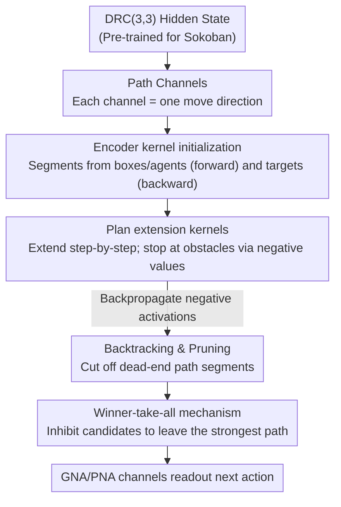

# Path Channels and Plan Extension Kernels: A Mechanistic Description of Planning in a Sokoban RNN

**Conference**: ICLR 2026  
**OpenReview**: [https://openreview.net/forum?id=aAshH4kQ1v](https://openreview.net/forum?id=aAshH4kQ1v)  
**Code**: To be confirmed  
**Area**: Mechanistic Interpretability  
**Keywords**: Mechanistic Interpretability, Planning, Sokoban, ConvLSTM, Bidirectional Search

## TL;DR
This paper reverse-engineers a Deep Recurrent Convolutional network (DRC) trained with model-free reinforcement learning to play Sokoban. It discovers that the internal "where to go" planning is directly stored in specific "path channels" of the hidden state. These plans are constructed via "plan extension kernels" that extend path segments forward from boxes and backward from targets. By utilizing negative activations for pruning and backtracking, and a winner-take-all mechanism to select a unique path, the network translates black-box planning behavior into a human-interpretable bidirectional search algorithm.

## Background & Motivation
**Background**: It is widely believed that deep networks can learn complex "planning-like" behaviors. Sokoban is a classic benchmark for verifying this—it is PSPACE-complete, requires long-range planning, involves non-reversible moves (push only, no pull), and a single mistake can lead to a deadlock. The DRC architecture (stacked ConvLSTM) proposed by Guez et al. (2019) achieved SOTA results in model-free RL, rivaling model-based methods like MuZero. It is considered to exhibit "planning" due to its data efficiency, generalization to more boxes, and improved performance when given more compute (additional internal steps).

**Limitations of Prior Work**: The claim that "it plans" has primarily relied on behavioral evidence and indirect **linear probes**. Previous studies (Bush et al. 2025, Taufeeque et al. 2024) used logistic regression probes to **aggregate** a "plan representation" from hidden states, qualitatively suggesting bidirectional search. However, they could not explain exactly **where the plan is stored or how it is constructed**. Probes act as external readouts that indicate "information is there" but do not reveal the internal mechanisms that build the plan step-by-step.

**Key Challenge**: To truly understand "how" a network plans, it is insufficient to know that a plan can be decoded by a probe. One must be able to read the weights directly and observe how activations propagate, prune, and converge across the board. The aggregation performed by probes effectively **wipes out** this step-by-step propagation structure.

**Goal**: (1) Identify the **native representation** of the plan (reading channel activations directly without probes). (2) Explain the algorithm for **constructing** the plan (initialization $\rightarrow$ extension $\rightarrow$ pruning/backtracking $\rightarrow$ selection).

**Key Insight**: Through manual inspection of every channel in each layer of a DRC(3,3), the authors found that many channels correspond directly to a "movement tendency in a specific direction." Consequently, the plan can be read from individual channels without requiring linear combinations via probes.

**Core Idea**: Simplify the plan representation into **path channels**, where each channel corresponds to a movement direction; high activation on a grid cell indicates "the box/agent will move in this direction when at this cell." By examining the **convolutional kernels** between path channels, it was found that they encode how positions change via actions—essentially a learned **transition model**. Planning is the process of these kernels repeatedly convolving to propagate activations across the board.

## Method

### Overall Architecture
This work does not propose a new model but performs mechanistic reverse-engineering on a **pre-trained** DRC(3,3) network. The architecture consists of a convolutional encoder $E \rightarrow$ 3 stacked ConvLSTM layers (each ticking 3 times per in-game timestep, totaling 9 serial computation steps) $\rightarrow$ MLP heads for action and value. The authors aim to answer **where** the plan is stored and **how** it is constructed.

First, the plan representation is localized: through manual channel labeling, single-step cache ablation, and causal intervention, it is proven that the plan resides in "path channels." Second, the planning algorithm is decomposed: since path channels represent board paths, the weight matrices (encoder kernels + recurrent kernels) are read to reveal four stages: encoder kernels **initialize** path segments around boxes/agents/targets; plan extension kernels **extend** paths along directions and use negative values at obstacles to **stop** propagation; the same extension kernels backpropagate negative activations to achieve **backtracking and pruning**; finally, a winner-take-all mechanism **selects** one path among candidates. The entire pipeline constitutes a bidirectional search: pushing forward from boxes/agents and pulling backward from targets until they meet.

### Key Designs

**1. Path Channels: Reducing Plans from "Probe Aggregations" to "Direct Channel Readouts"**

Addressing the limitation that plans could only be read indirectly, the authors found a large set of hidden state channels with clear semantics: each channel is bound to a cardinal direction (Up/Down/Left/Right). High activation at a cell means "upon reaching this cell, the box (or agent) will move in this direction." Since the hidden state is convolutional, the same computation is reused across the $H \times W$ grid. A "Down" channel lights up at all cells where a box is intended to move downward. The authors grouped channels into 7 categories (20 box-move, 10 agent-move, 29 combined-path, 4 GNA, 4 PNA, 8 entities, and 21 unlabeled). The **box-move + agent-move + combined-path** groups are collectively called **path channels** (59 total), maintaining the complete action plan. This finding allows "reading the plan" to degenerate into "reading single channels," enabling direct weight interpretation.

**2. Plan Extension Kernels: Encoding a Learned Transition Model for Bidirectional Extension**

Activation alone is not a plan; a mechanism must connect "initial steps" into a "full path." The authors discovered specialized **plan extension kernels** in the recurrent weights. These include **linear extension kernels** that extend a path one cell in its own direction and **turning extension kernels** that transfer activation between different direction channels (implementing a turn). Linear kernels have significantly higher weights than turning kernels, encoding a preference for straight paths. Crucially, these kernels exist in **pairs**: forward-linking kernels from boxes/agents and backward-linking kernels from targets. Thus, the plan is extended from both ends simultaneously, providing the mechanistic basis for the bidirectional search observed qualitatively by Bush et al. The authors visualized the encoder's multi-layer linear convolutions as a single $9 \times 9$ kernel $A^d_{oe} = W^d_{oe} W_{E2} W_{E1}$ to see how it plants initial segments. Together, these kernels represent the network's learned **transition model**.

**3. Negative Activation Stopping and Backtracking: Backpropagation via the Same Kernels for Pruning**

Extension must stop at walls or targets. The authors observed that **stopping is implemented via negative contributions**. At boundaries like targets, adjacent box cells, or walls, the encoder or entity channels inject negative activations into path channels to cancel out the "overflow" from extension kernels. The elegance lies in the **dual-purpose** of extension kernels: because both forward and backward kernels exist, a negative activation at a path's **end** is propagated by backward kernels to its **start**, and vice versa. This dual-directional diffusion of negative values "clips" dead-end segments, allowing an alternative path to emerge—a form of backtracking learned via model-free training that mimics classical search pruning.

**4. Winner-Take-All: Converging to a Unique Plan Among Feasible Paths**

When multiple paths are feasible, the network must select one. Inhibitory weights exist between **short-term** path channels: different direction channels at the same grid cell suppress each other. The strongest direction inhibits others, and combined with sigmoid non-linearities, only one direction remains active for immediate execution. This mechanism is primarily active in short-term channels to avoid "killing" other future plans stored in long-term channels prematurely. Causal validation (Figure 9) showed that zero-ablating the cross-direction kernels causes the winner-take-all mechanism to fail, leaving multiple paths active simultaneously.

### Mechanism: A Box Moving Two Cells Down and Two Cells Right to a Target
In an idealized case (Figure 3): The encoder kernels initialize "Down" activations around the box and "Right" activations (in reverse) around the target. Linear extension kernels propagate "Down" downward from the box and "Right" leftward from the target. Turning kernels connect "Down" to "Right" at the corner. Negative activations stop the growth when they hit boundaries. If a path hits a wall, negative values backpropagate to prune that segment. Finally, winner-take-all leaves a unique direction per cell, and GNA/PNA channels read the direction at the agent's current cell as the next action.

## Key Experimental Results

### Main Results
The authors quantitatively verified that "plans reside in path channels" using ablation and causal intervention. **Single-step cache ablation** (zeroing channel values from the previous step and recomputing using only current observations) results:

| Intervention Target | Number of Channels | Decrease in Success Rate |
|---------------------|--------------------|--------------------------|
| All Path Channels | 59 | 57.6% ± 2.8% |
| All Non-Path Channels | 37 | 10.5% ± 1.9% |
| Random Subsets (control) | 37 | 41.3% ± 2.4% |

Even when controlling for the number of channels, intervening in path channels causes significantly higher performance loss, proving long-range planning computation occurs there.

### Causal Intervention Experiments
Modifying activations based on channel labels to see if the agent changes its target action (measured across 10,000 transitions):

| Channel Group | Causal Intervention Score |
|---------------|---------------------------|
| Pooled Next Action (PNA) | 99.7% ± 0.2% |
| Grid Next Action (GNA) | 98.9% ± 0.4% |
| Box + Agent Move | 88.1% ± 1.9% |
| Box Move | 86.3% ± 2.1% |
| Agent Move | 53.2% ± 2.1% |
| Probe: Box Move (Prior work) | 82.5% ± 2.5% |
| Probe: Agent Move (Prior work) | 20.7% ± 0.7% |

PNA intervention achieved a SOTA causal score (99.7%), significantly higher than previous probe-based methods. The lower score for agent-move channels (53.2%) is attributed to them only having a causal effect when the agent is **not** pushing a box, a distinction not filtered in this experiment.

### Key Findings
- **Path channels are the physical carrier of planning**: Intervening in them drops the success rate by over half, and causal scores consistently beat probes, indicating plans exist "natively" rather than being artifacts of probe extrapolation.
- **Long-term/Short-term division**: Path channels are divided into long/short-term. Short-term channels have high AUC for actions within 10 steps, while long-term channels cover the remainder of the episode. When two boxes pass through the same cell at different times, long-term channels activate early ($t \ll 0$) and transfer to short-term channels (mediated by the j-gate) only after the first move is complete.
- **Generalization via weight steering**: The network was trained on $10 \times 10$ boards, but scaling the plan extension kernels by 1.4x allowed it to stabilize longer paths and solve $40 \times 40$ levels—directly validating that extension kernels construct the paths.
- **Reproducibility**: Path channels, extension kernels, and winner-take-all mechanisms were found across 4 other independently trained seeds, supported by an automated AUC-based labeling method (Section N).

## Highlights & Insights
- **Paradigm shift from "Probe Decodability" to "Weight Interpretability"**: The breakthrough is simplifying the plan representation to the point where **individual channels can be read directly**, allowing one to open the weight matrix and see the extension kernels. This is a **weight-level explanation valid for all inputs**, moving the Pareto frontier of "network complexity vs. interpretability detail."
- **One kernel, three roles**: Plan extension kernels serve a triple purpose: forward extension, backward backtracking/pruning, and (together with negative activations) stopping. Implementing "transition model + search pruning" with a single set of convolutional kernels is an elegant example of parameter reuse learned by RL.
- **Weight steering as a "falsification experiment"**: Validating the mechanism by "scaling kernels $\rightarrow$ solving larger boards" is much more convincing than simple activation correlations.
- **Transferable methodology**: The workflow of "finding native semantic units (direction channels) $\rightarrow$ reading weight kernels between units" is applicable to reverse-engineering other convolutional agents (navigation, grid-world planning).

## Limitations & Future Work
- **Single task and architecture**: Analysis is restricted to DRC(3,3) on Sokoban. Whether conclusions generalize to other games, continuous control, or non-convolutional architectures is unknown. The "positional reuse" of convolution is a key prerequisite for path channels.
- **Partial reverse-engineering**: 21 unlabeled channels remain unexplained. The readout chain (GNA $\rightarrow$ PNA $\rightarrow$ Action) and the j-gate mechanism for long/short-term transfer are only qualitatively described in the appendix; the algorithm is not a fully closed loop.
- **Weak causal evidence for agent-move channels**: The 53.2% score is confounded by "pushing" scenarios, suggesting the agent's path representation (relative to boxes) is not yet fully understood.
- **Future directions**: Making the automated labeling more robust; testing the "path channel + extension kernel" framework on larger or non-grid tasks; and clarifying the specific sources of negative activations (Encoder vs. Entity channels) for stopping/backtracking.

## Related Work & Insights
- **vs. Linear Probe Methods (Bush et al. 2025 / Taufeeque et al. 2024)**: Those works used probes to **aggregate** channels to decode plans and suggested bidirectional search qualitatively. This paper finds plans exist in natively readable single channels, achieving significantly higher causal scores (e.g., PNA 99.7% vs. box probe 82.5%) and providing a weight-level mechanistic explanation for **how** plans are built.
- **vs. LLM Mechanistic Interpretability (GPT-2 small, Gemma, Claude circuits)**: LLM works deal with more complex networks but often explain circuits with smaller abstract causal graphs that are often locally valid (specific to prompts). This work identifies a larger causal graph on a medium-complexity network with weight-level explanations valid across all inputs.

## Rating
- Novelty: ⭐⭐⭐⭐⭐ First to decompose model-free RL planning into a weight-level algorithm of path channels, extension kernels, backtracking, and winner-take-all.
- Experimental Thoroughness: ⭐⭐⭐⭐ Includes ablation, causal intervention, AUC, weight steering, and 5-seed replication, though unlabeled channels and agent-move evidence are not fully closed.
- Writing Quality: ⭐⭐⭐⭐ Clear mechanistic narrative with strong visual evidence, though the appendix is heavy and some main-text mechanisms are slightly condensed.
- Value: ⭐⭐⭐⭐⭐ Provides the most detailed evidence to date that neural networks can "truly plan," with significant implications for agent interpretability.

<!-- RELATED:START -->

## Related Papers

- [\[ICML 2026\] Where's the Plan? Locating Latent Planning in Language Models with Lightweight Mechanistic Interventions](../../ICML2026/interpretability/wheres_the_plan_locating_latent_planning_in_language_models_with_lightweight_mec.md)
- [\[ICLR 2026\] Latent Planning Emerges with Scale](latent_planning_emerges_with_scale.md)
- [\[ICLR 2026\] When Thinking Backfires: Mechanistic Insights into Reasoning-Induced Misalignment](when_thinking_backfires_mechanistic_insights_into_reason-induced_misalignment.md)
- [\[ICLR 2026\] Formal Mechanistic Interpretability: Automated Circuit Discovery with Provable Guarantees](formal_mechanistic_interpretability_automated_circuit_discovery_with_provable_gu.md)
- [\[ICLR 2026\] Task Vectors, Learned Not Extracted: Performance Gains and Mechanistic Insights](task_vectors_learned_not_extracted_performance_gains_and_mechanistic_insights.md)

<!-- RELATED:END -->
