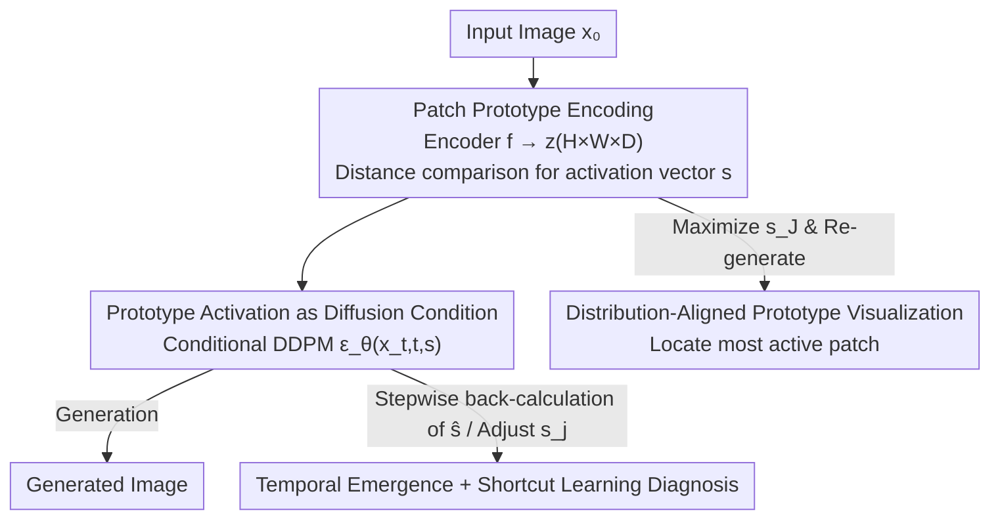

# Patronus: Interpretable Diffusion Models with Prototypes

**Conference**: ICLR 2026  
**OpenReview**: [https://openreview.net/forum?id=1bz8CA8gPo](https://openreview.net/forum?id=1bz8CA8gPo)  
**Code**: https://nina-weng.github.io/patronus.github.io  
**Area**: Diffusion Models / Interpretability  
**Keywords**: Diffusion Models, Prototype Networks, Interpretability, Semantic Editing, Shortcut Learning Diagnosis

## TL;DR
Patronus grafts Prototype Proposal Networks (ProtoPNet) from the classification domain onto diffusion models: a patch-level prototype encoder encodes images into similarity vectors representing the activation degrees of each prototype. This vector is then used to condition the DDPM, making the diffusion generation process "inherently interpretable"—capable of clarifying which visual concepts are learned (what), where they appear in the frame (where), and at what moment during denoising they emerge (when). This is used to diagnose shortcut learning and hidden biases in training data.

## Background & Motivation
**Background**: While diffusion models possess exceptional generation quality, their internal processes remain largely black boxes. Existing work on "adding interpretability" to diffusion models follows two paths: (1) **post-hoc analysis**, which retrospectively mines semantic directions (Kwon 2022, Park 2023, Haas 2024, etc.) in U-Net intermediate layers (such as bottleneck semantic spaces, PCA directions, or pullback metrics); and (2) **additional encoder guidance**, where an encoder is attached to the diffusion model to extract semantic vectors as conditions (DiffAE, DiffuseGAE, InfoDiffusion).

**Limitations of Prior Work**: The post-hoc route is "retrospective," offering explanation but almost no direct control over generation. Meanwhile, although the encoder guidance route allows for control, the extracted semantic vectors themselves are difficult to interpret (consisting of high-dimensional latent variables where the meaning of each dimension is unclear). Crucially, both types of methods tend to capture **global** semantics (face shape, pose), while the **local fine-grained** patterns truly important for interpretability (hair/makeup details, expressions) are often missed.

**Key Challenge**: Interpretability and controllability are difficult to achieve simultaneously—either the model is interpretable but uncontrollable, or controllable but uninterpretable. Furthermore, a misalignment exists between "global semantics" and "local interpretable concepts."

**Goal**: (1) Embed interpretability directly into the **model architecture** to achieve inherent transparency without relying on post-hoc analysis of high-dimensional latent spaces; (2) advance interpretability from global to **local semantics** while supporting controllable editing.

**Key Insight**: The authors draw inspiration from ProtoPNet in classification, which performs interpretable classification by learning a set of "prototypes" (intermediate representations of visually similar patches). The authors argue that this "prototype = namable local visual concept" logic is naturally suited for making generation interpretable: if diffusion generation is driven by a set of prototype activations understandable by humans, then "what the model is drawing" becomes clear.

**Core Idea**: A patch-level prototype network encodes an image into a "prototype activation vector $s$." **Instead of obscure semantic latent vectors, $s$ is used to condition the diffusion generation**. Every dimension of $s$ corresponds to a local visual concept that can be visualized and named, thereby transforming the diffusion process into something readable, tunable, and diagnosable.

## Method

### Overall Architecture
Patronus (Prototype-Assisted Transparent Diffusion Model) consists of two main components: a **Prototype Extraction and Representation Module** at the bottom and a **Conditional DDPM** at the top. Given an image $x_0$, the prototype encoder $f$ encodes it into an $H\times W\times D$ feature tensor $z=f(x_0)$, where each $1\times1\times D$ spatial position corresponds to a patch in the original image. During training, the model learns $m$ prototypes $P=\{p_j\}_{j=1}^m$. By comparing the distance between each patch of $z$ and each prototype, an $m$-dimensional **prototype activation vector** $s$ is calculated (where each dimension represents how much the $j$-th prototype is "activated" by the image). This $s$ is fed as a condition into the reverse denoising process of the DDPM to guide generation.

Interpretability is derived from $s$: ① By maximizing a specific prototype's activation while keeping others constant, then generating and locating the most activated patch, one can "see" the visual concept represented by that prototype (**Visualization**); ② by adjusting a specific dimension $s_j$ and re-generating, semantic editing or extrapolation can be performed; ③ by back-calculating $s$ from the estimated $\hat x_0$ at each denoising step, one can observe **when** each prototype emerges. For unconditional sampling, an additional latent diffusion model $p(s_{t-1}\mid s_t,t)$ is trained to generate $s$.

### Key Designs

**1. Patch-based Prototype Encoding and Activation Vector: Compressing images into "activated local concepts"**

This step addresses the pain point that existing semantic vectors are difficult to interpret and biased toward global features. The encoder $f$ is a 4-layer Conv–ReLU network. Leveraging the properties of CNN receptive fields, each neuron on the output feature map $z$ corresponds to a local patch of the original image, naturally focusing on local fine-grained patterns. The model learns $m$ prototypes $p_j$ of shape $1\times1\times D$, each understood as a latent encoding of a patch in pixel space. After splitting $z$ into $n=H\times W$ patches $\{z_i\}$, the squared L2 distance $d^2(z_i,p_j)=\lVert z_i-p_j\rVert^2$ is calculated. For each prototype, the minimum distance $d^2_{\min,j}$ is taken across the spatial dimension (representing "how similar the most similar patch in this image is to prototype $p_j$"). Finally, a log transform $s=\log\frac{d^2+1}{d^2+\epsilon}$ converts distances into activation scores. Thus, an image is compressed into a low-dimensional vector where each dimension corresponds to a namable local concept—significantly reducing the dimensions required for guidance while preserving semantics.

**2. Diffusion Conditioning with Prototype Activation: Grounding generation in "readable concepts" rather than black-box latents**

Forward noise addition $q(x_t\mid x_0)=\mathcal N(x_t;\sqrt{\bar\alpha_t}x_0,(1-\bar\alpha_t)I)$ and reverse denoising $p_\theta(x_{t-1}\mid x_t)$ in standard DDPM lack semantics. Patronus modifies the reverse process to be conditioned on $s$: $p_\theta(x_{t-1}\mid x_t,s)=\mathcal N(x_{t-1};\mu_\theta(x_t,t,s),\Sigma_\theta(x_t,t))$. Training still uses the noise prediction loss $L_{ddpm}=\mathbb E_{x_0,t,\epsilon}[\lVert\epsilon-\epsilon_\theta(x_t,t,s)\rVert^2]$. The key point is that the condition here is not a "direct semantic latent vector" like in DiffAE/InfoDiff, but a **prototype activation vector**—lower in dimension, yet with each dimension corresponding to a visualizable concept. The authors emphasize that this guidance "does not change the model's output distribution, but merely prompts the denoising process to base inference on prototypes." They prove using ELBO in Section 3.5 that any encoder update improving ELBO either increases the conditional likelihood of the data or decreases the KL divergence between generated and real distributions; thus, joint training of the prototype encoder **does not** impair generation quality.

**3. Distribution-Aligned Prototype Visualization: "Manifesting" each prototype as a readable local concept map**

Visualization in ProtoPNet involves a greedy search for the nearest patches in the training set, which neither guarantees capturing the true representative patterns of the distribution nor prevents blurriness when using a decoder for reconstruction. The authors argue that **prototypes need not correspond to a specific training patch but should align with the overall training distribution**. They propose a new visualization method: for a given sample, calculate $s$, pull the target prototype score $s_J$ to a reasonable upper bound ($\max(s_X)$, where $s_X$ is taken from a representative subset to constrain it within a valid range), and keep other dimensions unchanged to obtain $s'$. Use $s'$ to sample a new image $x'$ conditionally, then locate the patch $x'_i$ in $x'$ most sensitive to prototype $J$, which serves as the visual representation of $p_J$. Experiments show that the semantics of patches located for the same prototype across different samples are consistent (e.g., "white collar," "curly hair," "eye makeup"), indicating that prototypes indeed encode stable semantics. This method can also be used to visualize other prototype networks.

**4. Temporal Emergence Tracking and Shortcut Learning Diagnosis: Turning "interpretability" into a functional diagnostic tool**

Interpretability is not just for aesthetics but for discovering problems. By adjusting a specific dimension $s_j$ and pushing it to extreme values (0.0 → 3.0), smooth semantic **extrapolation** (enhancement beyond the original data distribution) can be achieved, whereas standard interpolation only stays within observed ranges. DDIM deterministic sampling ($\eta=0$) provides more controllable editing. Furthermore, by back-calculating prototype similarity from the estimated $\hat x_{0}$ at each denoising step and finding the difference between the "enhanced $\hat x_{0,s'}$" and the "original image $x_0$," one can see **when** each prototype emerges: prototypes rarely appear in the first ~200 steps; low spatial frequency attributes (e.g., "wearing red") emerge early, while high spatial frequency attributes (e.g., "curly hair") emerge late. This is useful for determining "how far back an image should be diffused to edit a specific attribute." More importantly, it diagnoses **shortcut learning**: by artificially creating a spurious correlation between "hair color" and "smiling" in CelebA (blonde/brown hair always smiles, black hair never smiles), enhancing the "black hair" prototype causes the model to simultaneously flip "smiling" to "not smiling," thereby exposing hidden biases in the training data.

### Loss & Training
The primary loss is the conditional noise prediction $L_{ddpm}$, where the prototype encoder and denoiser are **jointly optimized**. For unconditional sampling, the encoder is frozen, and a latent diffusion model is trained separately to generate $s$. The authors also validated a **Prototype Distinct Loss** $L_{distinct}=\frac1N\sum_i\max(0,\delta-\min_{j\neq i}D_{ij})$ (where $D_{ij}$ is the cosine distance with absolute values, and $\delta$ is 0.5 or 1.0, with 1.0 forcing prototype orthogonality) to encourage prototype decoupling. However, they found that prototypes learned with or without this loss were nearly identical, suggesting that prototypes trained solely with the denoising objective possess sufficient de-correlation without explicit regularization.

## Key Experimental Results

Five datasets were used: FMNIST / CIFAR-10 / FFHQ for quantitative analysis, CheXpert (chest X-rays) for qualitative analysis, and CelebA for in-depth quantitative and qualitative analysis. Except for FMNIST (30 prototypes), 100 prototypes of shape $(1,1,128)$ were used.

### Main Results (CelebA, Tab. 1)

| Method | TAD ↑ | Attributes Captured ↑ | Latent AUROC ↑ | FID ↓ |
|------|-------|-------------|----------------|-------|
| DiffAE | 0.16 | 2.0 | 0.80 | 22.7 |
| InfoDiff | 0.30 | 3.0 | 0.84 | 23.6 |
| **Ours** (Patronus) | **0.43** | **9.0** | **0.87** | 14.6 |
| **Ours** (Patronus w/ learned s) | **0.43** | **9.0** | **0.87** | **4.8** |

Ours (Patronus) leads globally in decoupling (TAD), number of captured attributes, latent space quality, and generation quality. When using the learned $s$ for conditional generation, FID drops to 4.8, significantly outperforming the ~22 of DiffAE/InfoDiff.

### Multi-dataset (Tab. 2, Prototype/Generation Quality)

| Dataset | Metric | DiffAE | InfoDiff | **Ours** (Patronus w/ learned s) |
|--------|------|--------|----------|------------------------|
| FMNIST | Latent AUROC ↑ / FID ↓ | 0.84 / 8.2 | 0.84 / 8.5 | 0.82 / **2.6** |
| CIFAR-10 | Latent AUROC ↑ / FID ↓ | 0.40 / 32.1 | 0.41 / 32.7 | **0.54** / **8.0** |
| FFHQ | Latent AUROC ↑ / FID ↓ | 0.61 / 31.6 | 0.61 / 31.2 | **0.92** / **24.1** |

Ours wins in prototype quality in 3 out of 4 datasets (especially strong in CelebA and FFHQ). Conditional generation FID is significantly superior across all four datasets. The lower latent space quality on FMNIST is attributed to the fact that Patronus focuses on local features, whereas FMNIST has large inter-class differences and more global semantics, favoring the global structures of DiffAE/InfoDiff.

### Key Findings
- **Local vs. Global is a double-edged sword**: Ours shows significant improvements on datasets with more local semantics (CelebA, FFHQ); however, it is at a disadvantage on FMNIST where semantics are more global, confirming its positioning for "local fine-grained concepts."
- **Natural Prototype Decoupling**: Adding the Prototype Distinct Loss results in almost no change to prototypes, suggesting the denoising objective itself encourages de-correlation.
- **Shortcut Learning Detection**: Enhancing the "black hair" prototype simultaneously changes "smiling," directly exposing spurious correlations in the training data, providing a practical tool for bias diagnosis.

## Highlights & Insights
- **Transferring prototype thinking from classification to generation**: While ProtoPNet is limited to classification, this work is the first to graft "namable local prototypes" onto diffusion generation and use activation vectors directly as conditions—interpretability is "designed in" rather than "mined post-hoc."
- **Using activation vectors instead of semantic latent vectors for conditioning**: The ingenuity lies in the lower dimensionality (saving guidance costs) while ensuring every dimension is visualizable and namable, resolving the old dilemma of "controllable but uninterpretable."
- **The distribution-aligned visualization method is elegant**: By avoiding a greedy search for the nearest patches in the training set and instead using "maximize activation → re-generate → locate active patch," it avoids blurriness and truly represents the distribution, potentially benefiting other prototype networks.
- **Insights from temporal emergence are transferable**: The observation that low-frequency attributes appear early and high-frequency attributes appear late can guide "how far back to diffuse for specific attribute editing," which is highly practical for efficient editing and counterfactual generation.

## Limitations & Future Work
- **Difficulty capturing global attributes**: The authors admit that non-local global features like gender or age are hard to map to a single prototype because the patch-level encoder is insensitive to non-local features.
- **Dependency on two-stage training quality**: The performance of unconditional generation depends on both the Patronus model and the additional latent diffusion model, making the pipeline longer and more fragile.
- **Manual naming of prototype semantics**: Prototypes are not pre-labeled; determining that "this is curly hair and that is eye makeup" requires human observation/inference, raising concerns about scalability and objectivity. Furthermore, the selection of the representative subset $s_X$ for "pulling to a reasonable upper bound" affects visualization results.
- **Evaluation biased towards faces/small images**: The primary evaluation occurs on CelebA/FFHQ (faces) and low-resolution natural images. Medical data (CheXpert) only received qualitative evaluation. Implementation and interpretability on complex scene images and high-resolution data remain to be verified.

## Related Work & Insights
- **vs. post-hoc explanation (Kwon 2022 / Park 2023 / Haas 2024)**: These methods mine semantic directions in U-Net latent spaces retrospectively, which is hard to control directly. Patronus designs interpretability into the architecture; prototypes are the conditions, making them naturally controllable without labels.
- **vs. DiffAE / DiffuseGAE / InfoDiffusion**: These also use encoders to extract semantics for guidance, but they extract **global** semantic latent vectors that are high-dimensional and uninterpretable. Patronus extracts **local** concepts via patch prototypes and guides with low-dimensional activation vectors that are visualizable and namable.
- **vs. ProtoPNet and its successors**: While the prototype concept is shared, ProtoPNet is for classification and relies on training set searches for visualization. Patronus is for generation and proposes distribution-aligned visualization, solving the "truly representative pattern" problem.

## Rating
- Novelty: ⭐⭐⭐⭐⭐ First to embed prototype networks into diffusion with activation vectors as conditions; clear inherent interpretability path.
- Experimental Thoroughness: ⭐⭐⭐⭐ Five datasets plus multiple angles (decoupling/quality/shortcut diagnosis), though biased toward faces/small images; medical results are qualitative only.
- Writing Quality: ⭐⭐⭐⭐ Clear structure and good illustrations; some mathematical notations are dense.
- Value: ⭐⭐⭐⭐⭐ Both improves controllable generation and provides a practical bias/shortcut diagnosis tool; method is highly transferable.

<!-- RELATED:START -->

## Related Papers

- [\[ICLR 2026\] Concept-TRAK: Understanding how diffusion models learn concepts through concept attribution](concept-trak_understanding_how_diffusion_models_learn_concepts_through_concept_a.md)
- [\[ICLR 2026\] Precise and Interpretable Editing of Code Knowledge in Large Language Models](precise_and_interpretable_editing_of_code_knowledge_in_large_language_models.md)
- [\[ICML 2026\] Neural Collapse by Design: Learning Class Prototypes on the Hypersphere](../../ICML2026/interpretability/neural_collapse_by_design_learning_class_prototypes_on_the_hypersphere.md)
- [\[ICML 2026\] DLLM-JEPA: Joint Embedding Predictive Architectures for Masked Diffusion Language Models](../../ICML2026/interpretability/dllm-jepa_joint_embedding_predictive_architectures_for_masked_diffusion_language.md)
- [\[ACL 2026\] Diffusion-CAM: Faithful Visual Explanations for dMLLMs](../../ACL2026/interpretability/diffusion-cam_faithful_visual_explanations_for_dmllms.md)

<!-- RELATED:END -->
