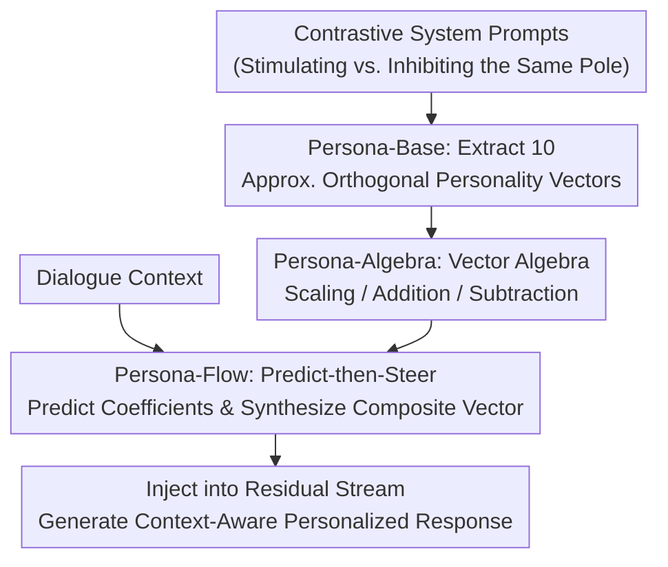

# PERSONA: Dynamic and Compositional Inference-Time Personality Control via Activation Vector Algebra

**Conference**: ICLR 2026  
**arXiv**: [2602.15669](https://arxiv.org/abs/2602.15669)  
**Code**: [GitHub](https://github.com/) (Publicly declared in the paper)  
**Area**: Robotics  
**Keywords**: personality control, activation steering, vector algebra, inference-time, Big Five

## TL;DR

The PERSONA framework is proposed to achieve training-free dynamic and compositional personality control by extracting approximately orthogonal personality vectors in the activation space and performing vector algebra operations (scaling, addition, subtraction). It achieves a score of 9.60 on PersonalityBench, nearly matching the SFT upper bound of 9.61.

## Background & Motivation

1. LLM personality control is crucial in healthcare, education, and social simulation, yet existing methods possess significant drawbacks.
2. **Prompting methods** (e.g., simple system prompts, P² induction) are unstable and inconsistent, making it difficult to precisely control personality expression.
3. **Fine-tuning methods** (SFT / LoRA) require substantial computational resources, and each personality configuration must be trained independently.
4. A more fundamental issue: existing methods treat personality as static and monolithic, failing to capture the dynamic and compositional nature of human behavioral traits.
5. **Key Insight**: Personality traits manifest as extractable, approximately orthogonal directions in the model's representation space, supporting algebraic operations.
6. This transforms the personality control problem from text engineering or gradient optimization into a problem of vector arithmetic in high-dimensional space.

## Method

### Overall Architecture

PERSONA reformulates personality control as vector arithmetic in a high-dimensional activation space. First, approximately orthogonal direction vectors for the ten poles of the Big Five (OCEAN) are extracted from the model's residual stream to serve as "atoms." These are then combined into desired personalities using algebraic operations such as scaling, addition, and subtraction. Finally, during inference, the coefficients for each dimension are dynamically determined based on the conversation context and injected into the residual stream. This entire process is completely training-free. Three core modules—Persona-Base, Persona-Algebra, and Persona-Flow—connect the stages of "atomic creation → composition → dynamic adjustment," addressing the questions of "how to obtain vectors," "how to compute vectors," and "how to use them contextually during inference." The accompanying Persona-Evolve benchmark provides 800 multi-turn dialogue scenarios to evaluate dynamic personality expression.

### Key Designs

**1. Persona-Base: Refining Abstract Personality into Actionable Directional Vectors**

Personality itself is an abstract behavioral tendency and cannot be used directly as a control knob. Therefore, the first step is to find its geometric counterparts in the representation space. PERSONA utilizes contrastive activation analysis: for two poles of the same dimension (e.g., extroversion vs. introversion), multiple sets of contrastive system prompts are written to stimulate and inhibit the trait. Activations of the residual stream at a certain layer are collected under positive and negative conditions, and the mean difference between them is taken as the direction vector $v_l$ for that pole. The resulting ten vectors (OCEAN 5 dimensions × 2 poles) constitute the "atoms" of personality control. Cosine similarity heatmaps indicate that they are approximately orthogonal and that opposing poles exhibit strong negative correlation, suggesting each direction indeed encodes independent trait semantics, providing a clean, non-interfering basis for subsequent algebraic composition.

**2. Persona-Algebra: Achieving Predictable Compositional Control via Vector Algebra**

With orthogonal atomic vectors, composing personalities no longer requires retraining or rewriting prompts but instead involves direct arithmetic at the vector level. The paper defines and validates three types of operations: scalar multiplication $\alpha \cdot v$ to control the intensity of a single trait, vector addition (e.g., $v_{outgoing} + v_{compassionate}$) to overlay multiple traits into a composite personality, and vector subtraction (e.g., $v_{outgoing} - v_{solitary}$) to inhibit unwanted tendencies. To prove the precision of these operations, the authors adapted the BFI-44 personality questionnaire into a behavioral assessment. They found a high linear correlation between the steering coefficient and the corresponding dimension score, with Pearson coefficients exceeding 0.9 for most traits. This linear predictability ensures that increasing $\alpha$ yields a proportional change in behavior, providing the foundation for shifting control to algebra.

**3. Persona-Flow: Dynamic Personality Modulation Based on Context during Inference**

A static set of coefficients cannot handle the evolving situations in real dialogues. Persona-Flow addresses this round-by-round using a two-stage "predict-then-steer" mechanism. The first stage analyzes the current dialogue context to predict an adjustment coefficient $\alpha_i \in [-2, +2]$ for each OCEAN dimension. In the second stage, a composite vector is synthesized only for dimensions exceeding a threshold ($|\alpha_i| > 0.5$):

$$v_{composite} = \sum_{i \in OCEAN} \alpha_i \cdot v_i$$

This vector is injected into the residual stream at the optimal layer, enabling context-aware real-time personality regulation—enhancing situation-relevant traits and inhibiting conflicting ones—without relying on preset scripts. Since modulation only occurs on forward activations, it preserves the compositionality of Persona-Algebra while gaining dynamism, marking a key distinction from previous static, monolithic methods.

### Loss & Training

The entire method is completely training-free and does not involve any gradient updates. All control is reduced to a single addition at the residual stream during inference:

$$h_l \leftarrow h_l + \alpha \cdot v_l$$

where $v_l$ is the personality vector extracted from the optimal layer and $\alpha$ is the steering coefficient. The sign determines whether to amplify or inhibit the corresponding trait pole, while the absolute value determines the modulation intensity.

## Key Experimental Results

### Main Results

| Method | Mean Score↑ | Variance↓ | Training Requirement |
|------|------------|-----------|----------|
| PERSONA-Base | **9.60** | 0.74 | Training-free |
| NPTI | 9.43 | 0.49 | Training-free |
| P² | 9.43 | 0.83 | Training-free |
| Simple Prompt | 8.39 | 0.96 | Training-free |
| PAS | 6.93 | 1.71 | Training-free |
| ActAdd | 8.20 | 2.10 | Training-free |
| SFT (Upper Bound) | 9.61 | 0.49 | Fine-tuning required |

### Ablation Study

| Model | TA | RC | RA | IF | Overall |
|------|----|----|----|----|---------|
| Qwen3-4B | 92.2 | 90.6 | 92.4 | 49.1 | **90.8** |
| Qwen2.5-14B | 84.8 | 86.4 | 84.8 | 59.3 | 85.4 |
| Llama-3.1-8B | 84.9 | 81.4 | 85.6 | 57.2 | 83.5 |
| Qwen2.5-7B | 84.7 | 84.4 | 85.0 | 61.4 | 83.4 |
| Ministral-8B | 74.3 | 73.2 | 74.2 | 48.0 | 73.2 |

### Key Findings

1. The training-free method PERSONA-Base (9.60) nearly matches the SFT upper bound (9.61), with higher but acceptable variance.
2. Scalar multiplication of vectors shows a strong linear relationship with BFI-44 dimension scores, confirming the linear editability of personality traits.
3. Asymmetric steering effects exist for some traits: traits that conflict with model safety training (e.g., self-interested) are difficult to activate even with high coefficients.
4. On MMLU and TruthfulQA, Persona-Flow maintains or slightly improves general model capabilities without side effects.
5. Larger model capacity enhances personality control: for the Qwen2.5 series, the overall win rate increased from 78.4% to 85.4% as the size grew from 3B to 14B.

## Highlights & Insights

1. **Extremely Simple Method**: Completely training-free, achieving SFT-level personality control through simple vector addition and subtraction with minimal computational overhead.
2. **Breakthrough in Geometric Perspective**: Transforms personality control from "prompt engineering" to "vector arithmetic," revealing the interpretable structure of the LLM representation space.
3. **Compositionality + Dynamics**: Achieves context-aware real-time personality modulation for the first time through the predict-then-steer mechanism of Persona-Flow.
4. **Solid Orthogonality Validation**: Independence between vectors is verified through cosine similarity heatmaps and causal intervention experiments.
5. **Persona-Evolve Benchmark**: Constructs 800 multi-turn dialogue scenarios, filling the gap in dynamic personality evaluation.

## Limitations & Future Work

1. **Asymmetric Steering Effect**: Traits conflicting with safety alignment are difficult to activate (e.g., self-interested score is only 20.8), limiting completely free personality control.
2. **Lower Information Fidelity (IF)** (48-61%): Maintaining factual accuracy while adjusting personality remains a challenge.
3. **Model-Dependent Vector Extraction**: Currently uses Qwen2.5-7B to extract vectors; cross-model transfer schemes are not yet mature.
4. **Extra Inference Overhead in Persona-Flow**: The predict-then-steer mechanism requires additional intermediate reasoning, increasing latency.
5. Validation has only been performed within the Big Five framework; whether this can extend to finer-grained personality dimensions remains to be explored.

## Related Work & Insights

- **Representation Engineering** (Rimsky et al., 2024; Turner et al., 2023): Provides the methodological foundation for activation steering.
- **NPTI** (Deng et al., 2025): A neuron-based personality control method, but lacks support for compositional operations.
- **ActAdd** (Turner et al., 2023): A pioneer in residual stream modification, but personality control is less precise (variance of 2.10).
- **Insight**: This vector algebra perspective could potentially be extended to other LLM behavior controls, such as style, knowledge injection, and safety alignment.

## Rating

- **Novelty**: ⭐⭐⭐⭐⭐ The perspective of transforming personality control into vector algebra is highly original, and the Persona-Flow dynamic control mechanism is a first.
- **Experimental Thoroughness**: ⭐⭐⭐⭐ Evaluation across various models and benchmarks is comprehensive, though some metrics (IF) show room for improvement.
- **Writing Quality**: ⭐⭐⭐⭐⭐ Clear structure with a smooth logical progression from extraction to algebra to dynamic control.
- **Value**: ⭐⭐⭐⭐⭐ Achieving results matching the SFT upper bound with a training-free method is a milestone in personality control with high practical utility.

<!-- RELATED:START -->

## Related Papers

- [\[ICLR 2026\] Persona Features Control Emergent Misalignment](persona_features_control_emergent_misalignment.md)
- [\[ICLR 2026\] Small Transformers Don't Need LayerNorm at Inference Time: Scaling LayerNorm Removal to GPT-2 XL and Implications for Mechanistic Interpretability](small_transformers_dont_need_layernorm_at_inference_time_scaling_layernorm_remov.md)
- [\[ICLR 2026\] Dynamic Reflections: Probing Video Representations with Text Alignment](dynamic_reflections_probing_video_representations_with_text_alignment.md)
- [\[ICLR 2026\] Watch the Weights: Unsupervised Monitoring and Control of Fine-tuned LLMs](watch_the_weights_unsupervised_monitoring_and_control_of_fine-tuned_llms.md)
- [\[ICLR 2026\] Beyond Linear Probes: Dynamic Safety Monitoring for Language Models](beyond_linear_probes_dynamic_safety_monitoring_for_language_models.md)

<!-- RELATED:END -->
