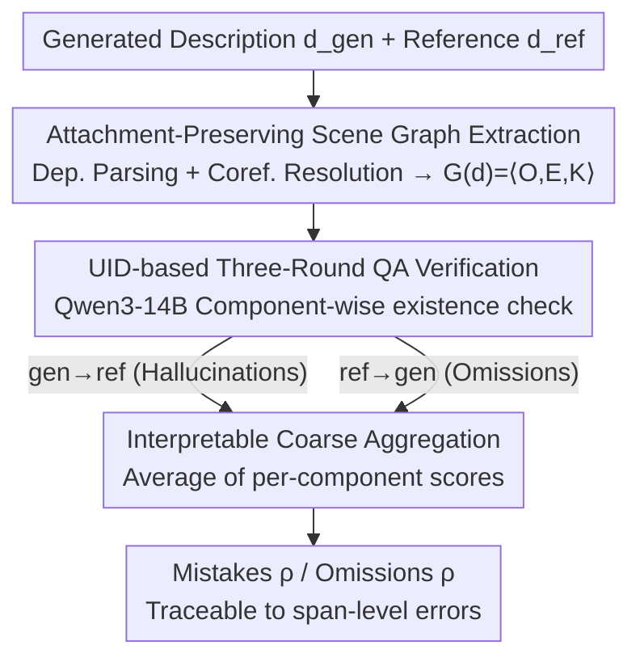

# PoSh: Using Scene Graphs to Guide LLMs-as-a-Judge for Detailed Image Descriptions

**Conference**: ICLR 2026  
**arXiv**: [2510.19060](https://arxiv.org/abs/2510.19060)  
**Code**: [GitHub](https://github.com/amith-ananthram/posh)  
**Area**: Interpretability  
**Keywords**: detailed image description, scene graph, LLM-as-Judge, fine-grained evaluation, assistive text

## TL;DR
The paper proposes PoSh, an evaluation metric that extracts scene graphs $G(d) = \langle O(d), E(d), K(d) \rangle$ from both generated and reference descriptions to serve as structured rubrics. These rubrics guide an open-source 14B LLM (Qwen3-14B) in performing QA-style fine-grained error localization. PoSh outperforms GPT-4o-as-Judge by +0.05 Spearman $\rho$ on the DOCENT artwork benchmark and CapArena while remaining fully reproducible.

## Background & Motivation

**Background**: VLMs can now generate detailed image descriptions (100-300 words), but evaluation methods lag behind. CIDEr and SPICE were designed for short texts, and contemporary LLM-as-Judge approaches are often irreproducible and produce coarse, uninterpretable scores.

**Limitations of Prior Work**:
- Incorrect attachment of attributes/relations is a core error in long descriptions (e.g., "a man pouring water" described as "a man in the center"). Existing metrics are insensitive to this.
- While SPICE and CAPTURE use scene graphs, they ignore object attachment, leading to false positives (high scores for wrong attachments).
- Closed-source LLM evaluation (e.g., GPT-4o) is expensive and irreproducible, whereas open-source LLM-as-Judge (e.g., LLaVA-Critic) lacks interpretable fine-grained scoring.
- Most detailed description benchmarks lack fine-grained human annotations.

**Key Challenge**: There is a need for cheap, reliable, and interpretable evaluation methods, but cost-efficiency typically conflicts with reliability and interpretability.

**Goal**: To simultaneously achieve interpretability (fine-grained error localization at the text span level), high correlation with human judgment, and full open-source reproducibility.

**Key Insight**: Scene graphs reduce the surface diversity of descriptions into visual components (entities + attributes + relations), serving as a structured checklist for an LLM-Judge. Each component can be independently verified for existence and then aggregated into coarse scores.

**Core Idea**: Use scene graphs to structure "what to evaluate" (entities, attributes, relations) and use LLM-QA to flexibly handle "how to compare" (variations in surface form).

## Method

### Overall Architecture

PoSh aims to provide interpretable and reproducible scores for detailed image descriptions without calling closed-source models. The workflow involves compressing descriptions into scene graphs and using them as checklists for an open-source LLM. The process consists of three steps: first, extracting sentence-level scene graphs using dependency parsing (spaCy) and coreference resolution (Maverick) from both generated and reference descriptions, then merging them; second, converting each component (entity, attribute, relation) into a templated question for Qwen3-14B to verify its existence in the counterpart text; finally, averaging these per-component scores to derive Mistakes (gen $\rightarrow$ ref, measuring hallucinations) and Omissions (ref $\rightarrow$ gen, measuring missing info).

### Key Designs

**1. Attachment-Preserving Scene Graph Extraction: Incorporating "Who has which attribute/relation"**

The most subtle errors in detailed descriptions involve attribute/relation misattachment—e.g., "a man pouring water" vs. "a man in the center." While both mention a man and an action, the attachment is wrong. PoSh performs sentence-level dependency parsing and cross-sentence coreference resolution to extract a structured representation $G(d) = \langle O(d), E(d), K(d) \rangle$, where $O$ is the set of entities, $E \subseteq O \times A$ are attribute edges, and $K \subseteq O \times R \times O$ are relation edges. Crucially, each edge maintains a link to its host entity and maps back to a specific text span. Unlike SPICE, PoSh penalizes misattachments because verification uses specific entity identifiers.

**2. Unique Identifier-based Three-Round QA Verification: Moving beyond hard matching**

When converting scene graph components into questions for 1-5 scoring by an LLM, a major challenge is entity collision (e.g., multiple "men" in one image). PoSh uses Unique Identifiers (UIDs) in a three-round check: first, verifying the top-level entity ("man"); second, verifying sub-entities ("face of the man"); third, verifying attributes and relations using the simplest confirmed identifiers. This avoids "forced alignment" of scene graphs, making the system robust to varied phrasing (e.g., "trio" in reference vs. "three people" in generation).

**3. Interpretable Coarse Aggregation: Traceable average scores**

Coarse scores are calculated by averaging per-component fine-grained scores: $\text{Mistakes} = \text{mean}_{c \in O(\text{gen})}(\pi(c))$ and $\text{Omissions} = \text{mean}_{c \in O(\text{ref})}(\rho(c))$, where $\Psi$ is the QA scorer. Since the total score is a direct mean of fine-grained results, any low score can be traced back to the exact entity or attribute that failed, providing diagnostic capabilities that scalar-output models like GPT-4o-as-Judge lack.

### Loss & Training

PoSh is an inference-time metric with no training phase. The QA scorer $\Psi$ uses Qwen3-14B, and existence scores are extracted from weighted averages of token logits (mapped to 1-5). An existence threshold of 2 is used (tuned on a small validation set). In terms of efficiency, PoSh processes 400 samples in approximately 15 minutes on a single H100 (~2 seconds per sample), whereas DCScore (GPT-4 based) takes over 2 hours for the same scale.

## Key Experimental Results

### Main Results — DOCENT Benchmark (Coarse-grained)

| Metric | Params | Mistakes $\rho$ | Omissions $\rho$ | Overall $\rho$ | Reproducible |
|------|--------|-----------|------------|----------|--------|
| SPICE | - | 0.308 | 0.464 | 0.458 | ✓ |
| CAPTURE | - | 0.259 | 0.447 | 0.453 | ✓ |
| LLaVA-Critic | 72B | 0.412 | 0.509 | 0.546 | ✓ |
| DCScore | GPT-4o | **0.541** | 0.395 | 0.471 | ✗ |
| GPT-4o (ref+img) | - | 0.484 | 0.380 | 0.510 | ✗ |
| **PoSh (Ours)** | **14B** | 0.519 | **0.581** | **0.599** | **✓** |

### Ablation Study (Fine-grained comparison on DOCENT)

| Method | Mistakes F1 | Omissions F1 |
|------|------------|-------------|
| Random | 0.503 | 0.499 |
| 4GramEmbed | 0.483 | 0.641 |
| SGEmbed | 0.514 | 0.658 |
| **PoSh (Ours)** | **0.580** | **0.680** |

## Key Findings
- **Superior Performance**: PoSh achieves an Overall accuracy of 70.7% on DOCENT, surpassing GPT-4o (67.3%) and GPT-5 text-only (68.0%) while being fully reproducible.
- **Complexity Robustness**: On CapArena, PoSh’s correlation with human rankings for complex scenes ($\ge 3$ people) exceeds the 72B LLaVA-Critic ($\rho = 0.727$ vs 0.686).
- **Extraction Quality**: Component extraction F1 is 0.892 and element verification F1 is 0.852, indicating that high-quality structured extraction is the foundation of PoSh’s success.
- **RL Feedback**: Using PoSh as a reward function (DAPO) outperforms SFT: omission improvement +0.432, overall improvement +0.135.
- **Model Gaps**: The DOCENT leaderboard shows that while open-source models are competitive in avoiding mistakes, they lag significantly behind closed-source models in avoiding omissions (coverage).

## Highlights & Insights
- **Scene Graph as Structured Rubric**: PoSh combines the structural dimensionality reduction of scene graphs with the flexibility of LLM-QA, avoiding the pitfalls of rigid hard matching.
- **Fine-to-Coarse Interpretability**: Every coarse score is supported by span-level fine-grained evidence, a feature missing in existing scalar-based metrics like GPT-4o-as-Judge.
- **Social Impact (DOCENT)**: Assistive text generation is vital for web accessibility for the visually impaired. Complex artistic scenes (averaging 161 visual components) represent a significant real-world challenge for current VLMs.

## Limitations & Future Work
- **NLP Tool Dependency**: Performance relies on the quality of dependency parsing and coreference resolution, which may be less mature for non-English languages.
- **Component Weighting**: Currently, all components (entities/attributes/relations) are weighted equally. Future work could introduce task-specific weights.
- **Benchmark Scale**: DOCENT contains only 100 images with human judgment, limited by the high cost of fine-grained annotation (18 minutes per sample).
- **Reference Dependency**: Being a reference-based metric, its efficacy depends on the quality and coverage of the reference description.

## Related Work & Insights
- **vs SPICE**: SPICE uses scene graphs but ignores object attachment, leading to high scores for "misattached" details; PoSh preserves the attachment chain.
- **vs DCScore**: DCScore uses GPT-4 to extract factoids. While strong on mistakes ($\rho=0.541$), it suffers from low recall on omissions ($\rho=0.395$); PoSh ensures full coverage via syntactic parsing.
- **vs LLaVA-Critic**: While the 72B VLM-as-Judge performs well on CapArena, it lacks interpretable fine-grained scores. Ours achieves comparable performance with a 14B model while being fully interpretable.

## Rating
- Novelty: ⭐⭐⭐⭐ 
- Experimental Thoroughness: ⭐⭐⭐⭐⭐ 
- Writing Quality: ⭐⭐⭐⭐⭐ 
- Value: ⭐⭐⭐⭐ 

<!-- RELATED:START -->

## Related Papers

- [\[ICML 2026\] Diagnosing the Reliability of LLM-as-a-Judge via Item Response Theory](../../ICML2026/interpretability/diagnosing_the_reliability_of_llm-as-a-judge_via_item_response_theory.md)
- [\[ACL 2025\] Enhancing Automated Interpretability with Output-Centric Feature Descriptions](../../ACL2025/interpretability/output_centric_interpretability.md)
- [\[ICLR 2026\] Uncovering Conceptual Blindspots in Generative Image Models Using Sparse Autoencoders](uncovering_conceptual_blindspots_in_generative_image_models_using_sparse_autoenc.md)
- [\[ICLR 2026\] Evidence for Limited Metacognition in LLMs](evidence_for_limited_metacognition_in_llms.md)
- [\[CVPR 2025\] On the Possible Detectability of Image-in-Image Steganography](../../CVPR2025/interpretability/on_the_possible_detectability_of_image-in-image_steganography.md)

<!-- RELATED:END -->
