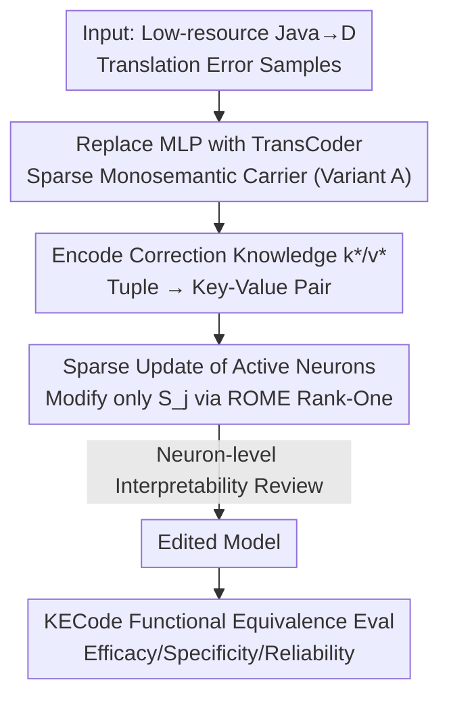

# Precise and Interpretable Editing of Code Knowledge in Large Language Models

**Conference**: ICLR 2026  
**OpenReview**: [https://openreview.net/forum?id=diVf17SNek](https://openreview.net/forum?id=diVf17SNek)  
**Code**: https://github.com/minxue29031/TCPE  
**Area**: Mechanistic Interpretability / Knowledge Editing / Code LLMs  
**Keywords**: Knowledge Editing, TransCoder, Monosemantic Neurons, Code Translation, Functional Equivalence

## TL;DR
This paper replaces an MLP layer in the Transformer with a sparse, monosemantic TransCoder module. By updating only a few neurons truly activated by the target error (TCPE), the method achieves precise editing while providing neuron-level explanations of "what was changed and why." The authors propose KECode, an editing benchmark for code translation based on functional equivalence, improving CodeLlama-7b's Java→D translation accuracy from 57.5% to 64.0%.

## Background & Motivation

**Background**: Code LLMs frequently require "patching"—correcting erroneous behaviors, adapting to new APIs, or aligning with developer preferences. Retraining and full fine-tuning are costly, and even lightweight methods like LoRA require thousands of labeled samples. Prompt engineering and external memory only provide surface-level fixes without modifying model behaviors at the parameter level. Knowledge Editing (KE) has emerged as an appealing alternative: it enables targeted modification of model knowledge with minimal samples (even a single one) without affecting unrelated knowledge. Representative methods like ROME and MEMIT treat MLPs as "key-value stores" and perform rank-one updates in intermediate layers.

**Limitations of Prior Work**: These methods apply edits to MLP neurons, which are **polysemantic**—a single neuron participates in multiple semantic meanings. In rigorous code scenarios, this leads to two issues: first, **insufficient precision**, where editing one area often damages unrelated knowledge (poor specificity or model collapse); second, a **lack of interpretability**, as it is unclear which specific units responsible for the error were modified. Table 1 quantifies this: among 50 randomly sampled MLP features, only 4 were interpretable, while 41 were not.

**Key Challenge**: Precision and interpretability in editing require the underlying "units" of knowledge to be **monosemantic and sparse**. Standard MLP structures are inherently dense and polysemantic. Performing "targeted surgery" on an MLP is akin to trying to cut one specific wire in a tangled mess; unintended consequences are inevitable.

**Goal**: (1) Find a "cleaner" vehicle for editing that is both local and readable; (2) Establish a suitable evaluation protocol for code translation tasks where **functional correctness** is prioritized—unlike natural language where efficacy/specificity are measured by text similarity, code is binary (it either compiles and runs correctly or it does not).

**Key Insight**: The authors leverage **TransCoder** (Dunefsky et al., 2024) from the mechanistic interpretability community. It is a sparse approximation of an MLP with a wider hidden dimension trained with sparsity constraints (e.g., L1). For any given input, only a few neurons are activated, and these activations are closer to being **monosemantic**. Since TransCoder’s activation space is naturally sparse and monosemantic, one can "follow the activations to find the neurons responsible for the knowledge and modify only them."

**Core Idea**: Replace one MLP layer in the Transformer with a TransCoder and restrict ROME-style rank-one updates to the **few neurons truly activated by the target knowledge**, achieving precise editing alongside neuron-level interpretability.

## Method

### Overall Architecture
TCPE (TransCoder-based Precise Editing) consists of four steps: "Carrier Replacement → Knowledge Encoding → Sparse Update → Interpretation." First, the MLP at a selected layer $l^*$ of the base model $G$ is replaced with a TransCoder to obtain variant model $A$. Next, a translation error is framed as a knowledge tuple in the code domain and encoded as a key-value pair $(k_j^*, v_j^*)$. Then, a ROME-style rank-one update is applied only to the set of "active neurons" $S_j$ triggered by the tuple, while other neurons remain unchanged. Finally, top-activating samples for the modified neurons are reviewed to verify their correspondence to the specific error type. The entire process is evaluated on the KECode benchmark using functional equivalence (compilation + unit tests).

### Key Designs

**1. Replacing MLP with TransCoder: Switching to a Sparse Monosemantic Carrier**

To address the bottleneck of polysemantic MLP neurons, TCPE replaces the entire MLP at layer $l^*$ with a TransCoder module. The TransCoder consists of encoder/decoder matrices: $z_{TC}^{(l)}(\bar h) = \mathrm{ReLU}(W_{enc}^{(l)}\bar h)$ and $TC^{(l)}(\bar h) = W_{dec}^{(l)} z_{TC}^{(l)}(\bar h)$. The hidden dimension $d_{tc}$ is much wider than the MLP (e.g., $4096\times16$), and sparsity losses are applied during training so that very few elements are non-zero for any input (e.g., only 57 features activated, or 0.348% of $d_{tc}$). These units are called **active neurons**. This is effective because sparsity and width force monosemanticity—features tend to respond to specific semantic/syntactic tokens (like `str` or `.length`). The authors also utilize a TransCoder Adapter for rapid replacement and verify that the performance is consistent across intermediate layers (l∈{10,19,23}).

**2. Sparse Update of Active Neurons: Modifying Only Knowledge-Specific Neurons**

This is the core difference between TCPE and ROME. While ROME treats the MLP decoder weights as linear associative memory $W_{dec} k = v$ and performs a rank-one update on the whole matrix, TCPE applies this to the TransCoder decoder weights $W_{dec}^{(l)}\in\mathbb{R}^{d_{model}\times d_{tc}}$ but **restricts the update to the set of active neurons**. Given a key $k_j^*$, the set $S_j=\{a\in[d_{tc}] \mid (k_j^*)_a > \tau\}$ is defined as neurons with activation exceeding threshold $\tau$. The update follows the closed-form rank-one solution:
$$\Delta W^{(l,j)} = \frac{(v_j^* - W_{dec}^{(l)} k_j^*)}{(C^{-1}k_j^*)^\top k_j^*}\,(C^{-1}k_j^*)^\top,$$
where covariance $C$ is estimated using `bigcode/the-stack`. Crucially, updates are only applied to columns $m\in S_j$: $W_{dec}^{(l)\prime}[:,m] = W_{dec}^{(l)}[:,m] + \Delta W^{(l,j)}[:,m]$. Because the modified neurons are monosemantic and few in number (often around 69), the model maintains generalization while minimizing interference with unrelated knowledge.

**3. k*/v* Encoding for Code Correction: Mapping Errors to Key-Value Pairs**

The (subject, relation, object) format used in ROME for natural language is unsuitable for code. The authors represent each instance as a four-tuple $(r^{(1)}, s, r^{(2)}, o)$: $s$ is the source code snippet (subject), $o$ is the functionally equivalent target snippet (object), $r^{(1)}$ is the preceding context, and $r^{(2)}$ is the succeeding context. When the model predicts an $o$ with syntax errors, a human-corrected $o^*$ is provided. **Generating $k_j^*$**: $N$ prefixes $a_j^n$ are prepended to prompt $p(r^{(1)}_j,s_j)$, and the non-linear activations of the TransCoder encoder at the last token are averaged. **Generating $v_j^*$**: A minimal perturbation $\delta_j$ is sought for the TransCoder output to maximize the probability of predicting $o_j^*$ under the prompt: $v_j^* = TC^{(l)} + \arg\min_{\delta_j}\frac1N\sum_n -\log P_{A(TC^{(l)}+=\delta_j)}[o_j^*\mid a_j^n\oplus p(r^{(1)}_j,s_j,r^{(2)}_j)]$.

**4. KECode Benchmark & Functional Equivalence: Measuring "Does it Run?"**

The success of code editing is measured by **functional equivalence**, not text similarity. The authors built the G4GD dataset based on Java functions from GeeksforGeeks, each paired with 10 D language unit tests (600 Java functions total). D was chosen to simulate a low-resource scenario. Failure samples are clustered by compiler error messages (first 6 tokens, encoded via gte-base). Metrics include: **Efficacy** (GN generalization = correct translation rate of target cluster ↑; CD cluster drift = relative change in target error cluster size ↓), **Specificity** (LoC locality = consistency of error types in non-target clusters ↑; DT destructivity = rate of correct samples becoming incorrect ↓), and **Reliability** (RE = ratio of post-edit to pre-edit accuracy ↑). Comprehensive score: $\text{Score}=(GN-CD)+(LoC-DT)+RE$.

### A Full Example
For a typical D type conversion error "cannot implicitly convert expression `str.length` of type `ulong` to `int`": Injecting this knowledge into LTC4 activates only 57 features ($0.348\%$ of $d_{tc}$). Reviewing the top-10 active features shows they consistently respond to tokens like `str`, `string`, and `=.length` which are directly related to the error. In contrast, non-active features respond to structural tokens like `if`, `;`, or `N`.

## Key Experimental Results

### Main Results
Using CodeLlama-7b-Instruct and Llama-2-7b as bases, TCPE (with varied TransCoder widths: LTCmlp / LTC4 / LTC8 / LTC16) significantly outperformed baselines in the G4GD multi-error editing scenario:

| Method | Score↑ | GN↑ | CD↓ | LoC↑ | DT↓ | RE↑ | ACpost / ACpre |
|------|--------|-----|-----|------|-----|-----|----------------|
| ROME | 109.60 | 109.60 | 29.79 | 80.14 | 76.47 | 99.71 | 57.33 / 57.50 |
| MEMIT | 14.96 | — | 7.09 | 124.82 | 72.99 | 82.03 | 47.17 / 57.50 |
| PMET | −4.70 | — | 12.77 | 104.26 | 55.77 | 69.57 | 40.00 / 57.50 |
| FiNE | 144.50 | 144.50 | 29.08 | 54.61 | 81.92 | 101.74 | 58.50 / 57.50 |
| LoRA | 147.27 | 147.27 | 29.08 | 58.87 | 82.57 | 104.93 | 60.33 / 57.50 |
| AGRACE | 99.85 | 99.85 | 0.71 | 100.71 | 99.56 | 100.29 | 57.67 / 57.50 |
| **TCPE (LTC4)** | 171.45 | — | 32.86 | 46.43 | 82.17 | 109.71 | **64.00** / 58.33 |
| **TCPE (LTC8)** | **174.82** | — | 31.66 | 49.64 | 88.50 | 110.03 | **64.00** / 58.17 |

TCPE improved accuracy from 57.5% to 64.0%. Reliability (RE 110+) indicates the model did not collapse. Standard multi-layer methods (MEMIT/PMET) caused accuracy to drop to 47%/40%, confirming that the code domain is highly sensitive to intervention granularity.

### Ablation Study
Ablation on active neuron threshold $\tau$ (LTC4):

| Threshold τ | GN↑ | CD↓ | LoC↑ | DT↓ | RE↑ | Updated Neurons(∪) |
|--------|-----|-----|------|-----|-----|----------------|
| acv>0.2 | 24.29 | 59.29 | 82.39 | 7.43 | 105.43 | 34 |
| acv>0.15 | 27.86 | 61.43 | 82.61 | 7.14 | 107.14 | 42 |
| **acv>0.1** | **32.86** | 46.43 | 82.17 | 6.86 | **109.71** | 69 |
| acv>0.05 | 35.00 | 48.57 | 82.39 | 8.57 | 106.86 | 98 |
| acv>0 | 32.86 | 50.71 | 83.04 | 8.29 | 106.00 | 147 |

Interpretability comparison (blind review of 50 features):

| Category | TransCoder | MLP |
|------|-----------|-----|
| Interpretable | 33 | 4 |
| Likely Interpretable | 8 | 5 |
| Uninterpretable | 9 | 41 |

### Key Findings
- **"Modifying a few active neurons" is the optimal solution**: A threshold $\tau=0.1$ (updating ~69 neurons) is best. Higher thresholds lack generalization; lower thresholds introduce interference.
- **TransCoder interpretability crushes MLP**: 33 vs 4. This provides direct evidence for the benefit of "switching carriers."
- **Granularity determines success**: Single-layer precision methods (ROME, TCPE) are significantly more reliable than multi-layer methods in the code domain.
- **Low overlap between $S_j$ for different error types**: Supports the mechanism that different errors are carried by independent neuron clusters.

## Highlights & Insights
- **Interpretability tools as editing carriers**: TransCoder is adapted from an analysis tool to an "editable monosemantic memory," making interpretability the source of precision.
- **Explicitly adjustable editing scope**: $\tau$ provides a "knob" to balance precision and generalization.
- **Profound protocol for code editing**: By moving from text similarity to functional equivalence, the paper establishes a rigorous standard for evaluating code knowledge.

## Limitations & Future Work
- **Requirement for TransCoder training**: Preparing and replacing MLP layers adds overhead.
- **Reliance on manual correction and tuning**: Correct targets $o^*$ must be provided, and thresholds for $\tau$ are chosen empirically.
- **Limited scale**: Primarily tested on 7B models and Java→D. Scaling to larger models and diverse languages remains for future work.

## Related Work & Insights
- **vs ROME / MEMIT / PMET**: While they perform updates on polysemantic MLPs, TCPE shifts to monosemantic units. The benefit is higher specificity at the cost of pre-training the TransCoder.
- **vs NL KE Benchmarks**: Unlike zsRE or CounterFact, KECode's focus on functional equivalence addresses the unique requirements of the code domain.

## Rating
- Novelty: ⭐⭐⭐⭐⭐ (Creative use of TransCoder as an editing vehicle)
- Experimental Thoroughness: ⭐⭐⭐⭐ (Solid baselines and ablations, though model scales are limited)
- Writing Quality: ⭐⭐⭐⭐ (Clear logic and rigorous definitions)
- Value: ⭐⭐⭐⭐ (A robust solution for precise code LLM editing)

<!-- RELATED:START -->

## Related Papers

- [\[ICLR 2026\] Medical Interpretability and Knowledge Maps of Large Language Models](medical_interpretability_and_knowledge_maps_of_large_language_models.md)
- [\[ACL 2026\] Tracing Relational Knowledge Recall in Large Language Models](../../ACL2026/interpretability/tracing_relational_knowledge_recall_in_large_language_models.md)
- [\[ACL 2026\] Knowledge Vector of Logical Reasoning in Large Language Models](../../ACL2026/interpretability/knowledge_vector_of_logical_reasoning_in_large_language_models.md)
- [\[ACL 2026\] DPN-LE: Dual Personality Neuron Localization and Editing for Large Language Models](../../ACL2026/interpretability/dpn-le_dual_personality_neuron_localization_and_editing_for_large_language_model.md)
- [\[ICLR 2026\] REAL: Reading Out Transformer Activations for Precise Localization in Language Model Steering](real_reading_out_transformer_activations_for_precise_localization_in_language_mo.md)

<!-- RELATED:END -->
