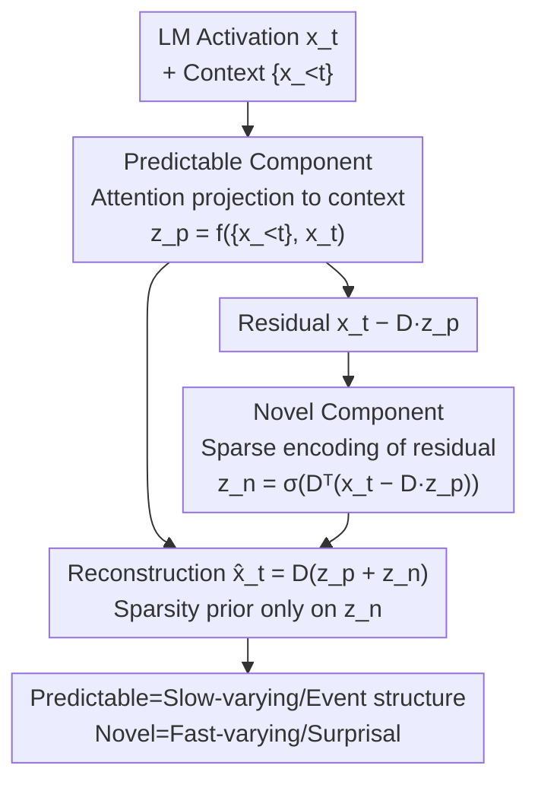

# Priors in Time: Missing Inductive Biases for Language Model Interpretability

**Conference**: ICLR 2026  
**OpenReview**: [https://openreview.net/forum?id=4J2e3nWiC8](https://openreview.net/forum?id=4J2e3nWiC8)  
**Code**: Pending  
**Area**: Interpretability / Mechanistic Interpretability  
**Keywords**: Sparse Autoencoders, Temporal Structure, Inductive Bias, Bayesian Priors, Non-stationarity

## TL;DR
From a Bayesian perspective, this work reveals that standard Sparse Autoencoders (SAEs) imply a prior that "concepts are independent in time," which severely mismatches the highly non-stationary nature of LLM activations that accumulate dimensionality with context. The authors propose the Temporal SAE, which decomposes activations into a "predictable component" (from context) and a "novel component" (residual). By applying sparsity priors only to the novel component, it correctly parses garden-path sentences and identifies narrative event boundaries, successfully separating slow-varying and fast-varying information.

## Background & Motivation
**Background**: Sparse Autoencoders (SAEs) are currently the primary tools for mechanistic interpretability. They are built on the Linear Representation Hypothesis (LRH)—assuming neural activations are linear combinations of independently manipulable directions (concepts). An SAE uses a sparse encoder to decode activations $x$ into sparse, monosemantic dictionary coefficients $z$, aiming for each coefficient to map to a human-understandable concept. Examples include ReLU SAEs, TopK SAEs, and BatchTopK SAEs.

**Limitations of Prior Work**: Existing SAEs perform "per-token, context-independent" encoding: when decoding $x_t$ at position $t$, they ignore $x_{<t}$, treating each token as an independent and identically distributed (i.i.d.) sample. However, language naturally possesses rich temporal structure—cross-word dependencies within sentences, predictability of future words from history, and event boundaries at the discourse level. Per-token independent encoding implies that SAEs assume "concepts are uncorrelated across time and the number of concepts required at each position remains constant."

**Key Challenge**: By rewriting the SAE training objective as Bayesian MAP estimation, the authors found that because sparsity regularization is additive over dimensions of time, SAEs implicitly assume $P(z_1, \dots, z_T) = \prod_t P(z_t)$, meaning "concepts are independent across time + sparsity (required concept count) is time-invariant." Empirical analysis of Llama-3.1-8B and Gemma-2-2B activations shows that the intrinsic dimensionality of activations increases monotonically with sequence position (information becomes "denser"), the autocorrelation structure changes (non-stationarity), and up to 80% of a token's variance is explainable by the preceding 500 tokens. This severe mismatch between prior and data is the root cause of pathological phenomena like "feature splitting."

**Goal**: (1) Formally define the prior assumptions SAEs make regarding temporal structure; (2) Empirically characterize the actual temporal structure of LM activations; (3) Design a new SAE architecture that incorporates temporal structure as an inductive bias.

**Key Insight**: Drawing from computational neuroscience, where neural recordings show populations lie on structured manifolds, the authors argue that interpretability methods should shift from "independent monosemantic neurons" to "designing analysis protocols around the generative process of the behavior being explained." A method is not a neutral feature extractor but a model with its own structural assumptions; these assumptions must match the data.

**Core Idea**: Instead of assuming the "global representation" is independent over time, the model assumes only the "residual (novel component) after removing the context-predictable part" is i.i.d. over time. This allows the overall encoding to be temporally correlated by incorporating the temporal structure of language.

## Method

### Overall Architecture
The Temporal SAE maintains the "encoder-dictionary reconstruction" framework but explicitly splits the activation $x_t$ into two paths. First, an attention module projects $x_t$ onto the subspace spanned by the past context $\{x_{<t}\}$ to obtain the **predictable component** $x_{p,t} = Dz_{p,t}$, which captures the history-correlated, slow-varying parts of $x_t$. Then, the residual $x_t - Dz_{p,t}$ is sent to a standard SAE encoder to obtain the sparse **novel component** $x_{n,t} = Dz_{n,t}$, capturing the new information provided by the current token. The final code is $z_t = z_{p,t} + z_{n,t}$, and the reconstruction is $\hat{x}_t = D(z_{p,t} + z_{n,t})$. Crucially, the sparsity prior is applied only to the novel code $z_n$ and assumes $z_n$ is i.i.d. over time.

### Key Designs

**1. Bayesian Reformulation: Explicitly defining the "Temporal Independence Prior"**

The authors rewrite the SAE training objective as minimizing the negative log posterior $\arg\min_{\{z_t\}} -\log P(z_1,\dots,z_T\mid x_1,\dots,x_T)$, which equals the sum of the log-likelihood (reconstruction MSE) and the log-prior (sparsity regularization). Since sparsity constraint $R(\cdot)$ is summed term-by-term over time, the prior factorizes as $P(z_1,\dots,z_T)\propto\prod_t \exp(-\lambda R(z_t)-\tilde\lambda\tilde g(z_t))=\prod_t P(z_t)$ (Proposition 4.1). This proves standard SAEs imply "latents are independent across time." Consequently, the distribution of sparsity $\|z_t\|_0$ is time-invariant (Corollary 4.1.1). This diagnostic reveals why SAEs fail: they cannot use a constant sparsity budget for activations that grow "denser" with context.

**2. Predictable/Novel Generative Model: Extracting slow-varying parts via Attention**

To address the "per-token independence" issue, the authors propose a generative model $x_t = x_{p,t}+x_{n,t}$, where $x_{p,t}=Dz_{p,t}$ is predictable and slow-varying, and $x_{n,t}=Dz_{n,t}$ is the fast-varying novelty. The predictable code is obtained by expressing $x_t$ as a convex combination of past data: a self-attention layer $f$ is placed above a single ReLU layer such that $z_{p,t}=f(\{x_1,\dots,x_{t-1}\}, x_t)$. This uses attention to weight-sum history to approximate the current representation's context-explainable variance.

**3. Residual Novel Code + Residual-only i.i.d. Sparsity Prior**

The novel component is defined as $z_{n,t}=\tilde f(x_t, z_{p,t})=\sigma\big(D^\top(x_t-Dz_{p,t})\big)$. The training objective is:

$$\arg\min_{D,z}\frac{1}{T}\sum_{i=1}^{T}\big\|x_i - D(z_{p,i}+z_{n,i})\big\|_2^2 + \lambda R(z_{n,i}),\quad \text{s.t. } z_{p,k}=f_{\text{SAE}}(\{x_{<k}\},x_k),\ z_{n,k}=\tilde f_{\text{SAE}}(x_k,z_{p,k}).$$

Note that $\lambda R(\cdot)$ acts only on $z_n$. By moving the i.i.d. assumption from the total $z_t$ to the residual $z_n$, the model allows $z_t$ to remain temporally correlated via $z_p$.

### Loss & Training
The objective is described by Equation 4 above. In experiments, approximately 1 billion tokens from Pile-Uncopyrighted activations of Gemma-2-2B were used for training. $\sigma$ is instantiated using TopK or BatchTopK encoders. An "attention-only" (Pred. only) baseline was included for comparison.

## Key Experimental Results

### Main Results: Fidelity comparable to standard SAEs
On Gemma-2-2B activations across Simple Stories, Webtext, and Code, the Temporal SAE achieves Normalized Mean Squared Error (NMSE) and Explained Variance (EV) comparable to the strongest standard SAEs (BatchTopK), introducing temporal bias without sacrificing basic fidelity.

| Metric | Domain | ReLU | TopK | BatchTopK | Pred. only | Temporal |
|------|----|------|------|-----------|-----------|----------|
| NMSE↓ | Story | 0.20 | 0.155 | 0.152 | 0.34 | **0.139** |
| NMSE↓ | Web | 0.19 | 0.144 | 0.139 | 0.36 | **0.139** |
| NMSE↓ | Code | 0.20 | 0.154 | 0.149 | 0.38 | 0.152 |
| EV↑ | Story | 0.60 | 0.71 | 0.72 | 0.29 | **0.73** |
| EV↑ | Web | 0.69 | 0.78 | 0.79 | 0.40 | **0.79** |
| EV↑ | Code | 0.65 | 0.75 | 0.75 | 0.33 | 0.75 |

Predictable codes contribute ~80% of the reconstruction norm, primarily reducing NMSE, while novel codes are responsible for explaining the per-dimension variance changes.

### Slow/Fast Signal Separation
Activations were Fourier-transformed and divided into slow-varying and fast-varying halves by energy.

| Signal | ReLU | TopK | BatchTopK | Temporal-Novel | Temporal-Pred |
|------|------|------|-----------|----------------|---------------|
| Slow | 0.37 | 0.35 | 0.35 | 0.19 | **0.75** |
| Fast | 0.54 | 0.54 | 0.54 | 0.75 | 0.18 |

Predictable codes strongly align with slow (high-level, stable) signals, while novel codes align with fast (transient) signals. Standard SAEs only capture the fast signals.

### Key Findings
- **Event Boundaries**: Using 50 GPT-5 synthetic stories with explicit event boundaries, predictable codes showed high intra-event similarity (~0.56) and low inter-event similarity (-0.04), effectively segmenting the narrative. Standard SAEs failed to distinguish these boundaries.
- **Garden-Path Sentences**: For sentences like "The old man the boat," predictable codes maintained high similarity between the verb and the subject phrase despite the localized ambiguity, preserving long-range dependencies. Standard SAE codes dropped significantly (e.g., from 0.44 to 0.05), being misled by local cues.
- **Geometric Intuition**: 3D UMAP of codes shows that standard SAEs produce highly irregular, tortuous geometries clustered by lexical identity. Predictable codes "straighten" stories into hierarchical block structures aligned with event boundaries.

## Highlights & Insights
- **Making Hidden Assumptions Explicit via Bayesianism**: The diagnostic approach—rewriting the SAE objective to expose the "temporal independence prior"—is a powerful paradigm that can be applied to other representation learning methods.
- **Relocating i.i.d. Assumptions to Residuals**: Instead of abandoning sparse coding, the model simply shifts the independence assumption from the total representation to the context-free residual, allowing temporal correlation with minimal architectural overhead.
- **Interdisciplinary Synergy**: Bringing concepts from computational neuroscience (slow vs. fast features) provides a principled source for choosing inductive biases in LM interpretability.

## Limitations & Future Work
- **Weakness of the Prediction Module**: The "Pred. only" baseline is significantly worse (NMSE 0.34–0.38), suggesting that predicting the next representation is much harder than reconstruction; the quality of $z_p$ is limited by the attention head's capacity.
- **Feature Interpretability**: While the model recovers temporal structure, the systematic evaluation of whether individual dimensions in $z_p$ or $z_n$ remain monosemantic is missing.
- **Synthetic/Small Evaluation Data**: Many evaluations used 50 synthetic stories; scalability to larger, more complex real-world datasets needs further verification.

## Related Work & Insights
- **vs. Standard SAEs**: Standard models code per-token independently, which this paper proves conflicts with LM activation non-stationarity. The Temporal SAE reconciles this by modeling temporal correlation through predictable + novel decomposition.
- **vs. Hierarchical SAEs**: While similar to residual-based hierarchical approaches, this work defines the residual relative to "temporal predictability" rather than conceptual abstraction levels.
- **Mechanism**: The core insight is that interpretability tools should match the statistical structure of the data (non-stationary, temporal) rather than acting as neutral, context-free extractors.

## Rating
- Novelty: ⭐⭐⭐⭐⭐ 
- Experimental Thoroughness: ⭐⭐⭐⭐ 
- Writing Quality: ⭐⭐⭐⭐⭐ 
- Value: ⭐⭐⭐⭐⭐ 

<!-- RELATED:START -->

## Related Papers

- [\[ICLR 2026\] Evolution of Concepts in Language Model Pre-Training](evolution_of_concepts_in_language_model_pre-training.md)
- [\[ICLR 2026\] Hidden Breakthroughs in Language Model Training](hidden_breakthroughs_in_language_model_training.md)
- [\[ICLR 2026\] Towards Understanding Subliminal Learning: When and How Hidden Biases Transfer](towards_understanding_subliminal_learning_when_and_how_hidden_biases_transfer.md)
- [\[ICLR 2026\] Learning to See Before Seeing: Demystifying LLM Visual Priors from Language Pre-training](learning_to_see_before_seeing_demystifying_llm_visual_priors_from_language_pre-t.md)
- [\[ICLR 2026\] Inferring the Invisible: Neuro-Symbolic Rule Discovery for Missing Value Imputation](inferring_the_invisible_neuro-symbolic_rule_discovery_for_missing_value_imputati.md)

<!-- RELATED:END -->
## Related Papers

- [\[ICLR 2026\] Hidden Breakthroughs in Language Model Training](hidden_breakthroughs_in_language_model_training.md)
- [\[ICLR 2026\] Towards Understanding Subliminal Learning: When and How Hidden Biases Transfer](towards_understanding_subliminal_learning_when_and_how_hidden_biases_transfer.md)
- [\[ICLR 2026\] Learning to See Before Seeing: Demystifying LLM Visual Priors from Language Pre-training](learning_to_see_before_seeing_demystifying_llm_visual_priors_from_language_pre-t.md)
- [\[ICLR 2026\] Evolution of Concepts in Language Model Pre-Training](evolution_of_concepts_in_language_model_pre-training.md)
- [\[ICLR 2026\] Inferring the Invisible: Neuro-Symbolic Rule Discovery for Missing Value Imputation](inferring_the_invisible_neuro-symbolic_rule_discovery_for_missing_value_imputati.md)

<!-- RELATED:END -->
