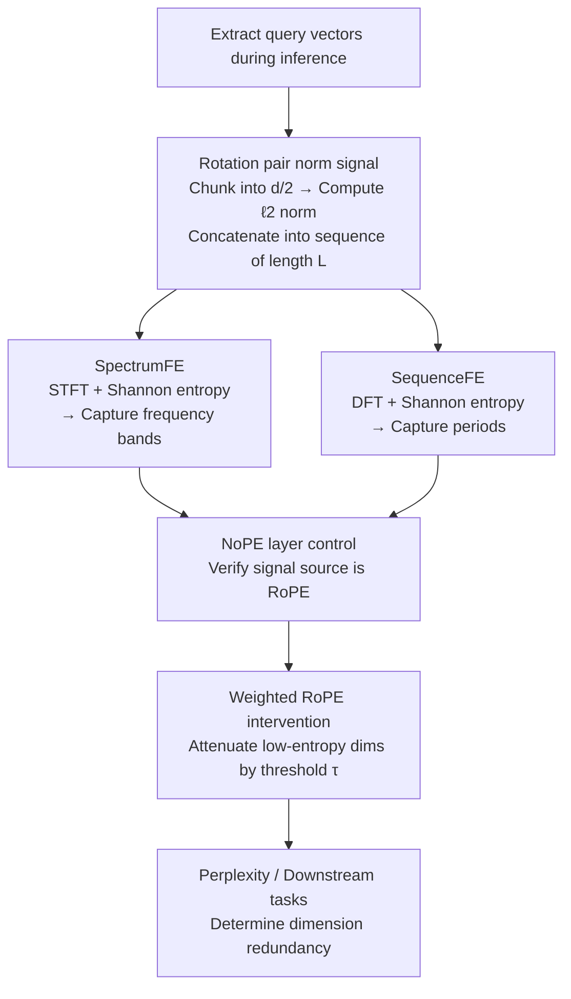

# Probing Rotary Position Embeddings through Frequency Entropy

**Conference**: ICLR 2026  
**OpenReview**: [https://openreview.net/forum?id=1JZuEDq62N](https://openreview.net/forum?id=1JZuEDq62N)  
**Code**: TBD  
**Area**: Interpretability / Positional Encoding Analysis  
**Keywords**: RoPE, Frequency Entropy, Positional Encoding, Interpretability, Dimensional Pruning

## TL;DR
This paper proposes **Frequency Entropy (FE)**, a training-free diagnostic metric that applies Fourier analysis to the query norm signals of RoPE rotation pairs along the sequence to calculate Shannon entropy. By decoupling signals into "frequency band structures" and "periodic oscillations," it provides a unified explanation for previous contradictory findings regarding high vs. low-frequency dimensions and discovers that periodic dimensions are largely redundant and can be attenuated during inference with minimal performance loss.

## Background & Motivation

**Background**: Rotary Position Embedding (RoPE) has become the de facto standard for mainstream LLMs such as Llama, Qwen, and Gemma. It applies a rotation matrix $R_{n,\theta}$ to query/key vector pairs, where the rotation angle $\theta_j = 10000^{-2j/d}$ decreases monotonically with the dimension pair index $j$, injecting positional information via relative offsets without introducing extra parameters.

**Limitations of Prior Work**: As an empirical design, the specific roles and utilization levels of different frequency dimensions in RoPE remain unclear. Worse, existing analyses provide conflicting conclusions: Hong et al. found low-frequency dimensions crucial for long-range dependencies ("positional heads"); Barbero et al. reported that low frequencies are more semantic and partially replaceable by NoPE; while Chiang & Yogatama suggested that high-frequency dimensions are barely used and can be safely removed.

**Key Challenge**: Previous analyses mostly rely on heatmaps and coarse "high/low frequency" binary splits, lacking a quantitative metric for consistent comparison across dimensions, layers, and models. Without a unified measure, these contradictory findings cannot be reconciled—they may simply be describing different facets of the same phenomenon.

**Goal**: (1) Mathematically formalize the contribution of each frequency dimension; (2) provide a model-agnostic, scale-invariant scalar metric for dimension-wise comparison; (3) verify which dimensions carry essential task signals and which are redundant.

**Key Insight**: The authors observe that under RoPE, a rotation pair oscillates along the token axis with a nearly constant phase step. This "narrow-band, RoPE-driven" periodicity exhibits a distinct spectral signature compared to "wide-band, content-driven" variations. Thus, **spectral entropy** from signal processing can quantify whether a dimension's spectrum is "peaked" (ordered, dominated by few frequencies) or "flat" (dispersed, noise-like).

**Core Idea**: Treat the $\ell_2$ norm sequence of each rotation pair's query as a discrete signal. Compute the normalized Shannon entropy after a Fourier transform—low entropy indicates concentrated energy (structured), while high entropy indicates dispersed energy (content-driven). Two variants (short-time vs. global spectra) capture "bands" and "periods," respectively.

## Method

### Overall Architecture

The core of FE is converting "invisible frequency utilization" into a per-rotation-pair scalar. For Llama-4 with a head dimension of 128, RoPE organizes dimensions into $d/2=64$ pairs. This work computes an entropy value for every pair, head, and layer (e.g., $64\times48\times40=122,880$ FE values for Llama-4-Scout). The workflow is: extract query vectors during inference → chunk by rotation pairs, compute $\ell_2$ norms, and concatenate along the token axis into a signal of length $L$ → apply two types of Fourier transforms and compute Shannon entropy to obtain **SpectrumFE** (short-time spectrum for bands) and **SequenceFE** (global spectrum for periods) → use NoPE layers as a control for signal source verification → finally, conduct **Weighted RoPE** intervention experiments to attenuate low-entropy dimensions by a coefficient $\alpha$ to verify their utility.

### Key Designs

**1. Rotary Pair Norm Signal: Converting frequency dimensions into analyzable time series**

To quantify frequency utilization, an analyzable signal is required. Following the Cauchy-Schwarz upper bound from Barbero et al., the contribution of the $j$-th frequency component to the attention activation $A_{n,m}$ is bounded by the norms of the query/key sub-vectors: $\langle q_n^{(j)}, k_m^{(j)}\rangle \le \|q_n^{(j)}\|_2\,\|k_m^{(j)}\|_2$. Thus, for a fixed rotation pair $j$, the query norms across the sequence are collected as a vector $s_j = (\|q_0^{(j)}\|_2, \|q_1^{(j)}\|_2, \dots, \|q_{L-1}^{(j)}\|_2)^\top \in \mathbb{R}^L$. Since rotation aligns representations into frequency blocks used by the logits and is norm-preserving, $\|q_n^{(j)}\|_2$ serves as a position-independent proxy for activation intensity.

**2. SpectrumFE: Capturing "Frequency Band Structure" via STFT Entropy**

SpectrumFE aims to identify which rotation pairs the model consistently allocates energy to. It applies a **Short-Time Fourier Transform (STFT)** to $s_j$ (window $F=1024$, stride $H=512$). The power spectra across frames are averaged and normalized into a probability distribution $p_k = S_k / \sum_{j} S_j$. The normalized Shannon entropy $\tilde H = (-\sum_k p_k\log_2 p_k) / \log_2 K$ is calculated for each of the 64 pairs. **Low SpectrumFE means local frequency content is concentrated in a few bins**: if adjacent indices show low entropy, they form a "frequency band." In experiments, RoPE layers show SpectrumFE between 0.2–0.6, with minima corresponding to visible band structures in norm plots.

**3. SequenceFE: Capturing "Periodic Oscillation" via Global DFT Entropy**

To distinguish "RoPE-driven periodicity" from "content-driven irregularities," SequenceFE uses a global **Discrete Fourier Transform (DFT)** on $s_j$: $S_k = |\sum_{n=0}^{L-1} s_j[n]\,e^{-i2\pi kn/L}|^2$. After removing the DC component and normalizing positive frequencies, Shannon entropy is computed. **Low SequenceFE indicates the signal is close to a pure tone oscillation**: RoPE forces rotation pairs to advance at a constant rate, causing queries to oscillate at fixed frequencies. Removing RoPE causes these oscillations to vanish and SequenceFE to rise. This numerically separates RoPE-imposed periodicity from content-modulated dynamics.

**4. Weighted RoPE: Training-free intervention via threshold-gated soft masks**

To determine if these structures are necessary or redundant, Weighted RoPE applies a weight to each $(l,h,j)$ rotation pair: if its entropy $\tilde H_{l,h,j} < \tau$, it is multiplied by $\alpha \in [0,0.9]$, otherwise it remains 1. This soft mask is applied to the rotated sub-vector: $q_m^{(j)\star} = \alpha_{l,h,j}\,R^{(l,h,j)}_{m,\theta}\,q_m^{(j)}$. This effectively "slows down" or weakens dimensions with specific entropy profiles during inference without fine-tuning, allowing for causal assessment of their impact on perplexity and downstream accuracy.

### Loss & Training
This is an analytical study and involves **no fine-tuning**. FE is computed directly from inference queries/keys, and Weighted RoPE serves as an inference-time multiplicative soft mask.

## Key Experimental Results

### Main Results (Downstream Tasks under Weighted RoPE)
With $\alpha=0.1$, attenuating SpectrumFE outliers ($\tau>0.4$) and SequenceFE periodic dimensions ($\tau<0.6$) simultaneously results in performance nearly identical to the original RoPE:

| Model | HellaSwag base / +W | TruthfulQA base / +W | MMLU base / +W |
|------|------|------|------|
| Llama-4 17B | 66.67 / 66.67 | 97.32 / **97.99** | 60.05 / **60.81** |
| Llama-3 8B | 60.16 / 60.16 | 84.85 / 84.85 | 34.21 / 34.21 |
| Qwen3 8B | 58.94 / 58.92 | 95.31 / 95.31 | 57.89 / 57.89 |
| Gemma-2 9B | 61.02 / **61.21** | 98.83 / 98.83 | 72.81 / 72.81 |

Attenuating these dimensions has negligible impact (and sometimes improves performance in Llama-4), suggesting they are redundant.

### Ablation Study (Perplexity Trends, WikiText-103)
Scanning $\alpha$ to observe perplexity (PPL) changes distinguishes "important" vs. "redundant" dimensions:

| Targeted Dims | PPL Trend as $\alpha \to 0$ | Conclusion |
|------|---------|------|
| SpectrumFE $\tau<0.2$ (Band core) | Significant Increase | Bands are **essential** |
| SpectrumFE $\tau>0.4$ (High-entropy outliers) | Slight decrease / Flat | Outliers are **redundant** |
| SequenceFE $\tau<0.6$ (Periodic dims) | Slight decrease | Periods are **redundant/harmful** |

### Key Findings
- **Low SpectrumFE (bands) = Task signal**; these are essential. High SpectrumFE outliers and low SequenceFE periodic dimensions are redundant and can be attenuated.
- **NoPE control is crucial**: Periodic behavior (SequenceFE 0.2–0.6) only appears in RoPE layers; NoPE layers show SequenceFE near 1.0. This proves the periodicity is RoPE-induced. However, NoPE can still exhibit bands (low SpectrumFE) due to architectural bias.
- **Band and periodic dimension locations are not fixed**; they vary by head and layer rather than being strictly "low" or "high" frequency. This explains contradictions in prior work that focused on fixed frequency indices.
- Band sharpness and periodicity weaken in deeper layers, with SpectrumFE distributions converging.

## Highlights & Insights
- **Transferring spectral entropy to RoPE diagnostics**: Unifies qualitative "heatmap viewing" into a scale-invariant scalar, representing a paradigm shift toward quantitative cross-model comparison.
- **Dual STFT/DFT Perspective**: STFT identifies "which frequencies are present" (bands), while DFT identifies "periodicity along the sequence" (periods). Decoupling these provides deep insight into position encoding structures.
- **Intervention as Causality**: Weighted RoPE uses minimal inference-time modifications to upgrade "correlation" into "causality," ensuring the methodology is clean and reproducible.
- **Practical Application**: Discovery of redundant low-SequenceFE dimensions can inform **RoPE-aware KV-cache compression and dimension pruning**, providing a principled selection criterion for lightweight models.

## Limitations & Future Work
- **Model Scope**: Analysis focuses primarily on Llama-4 (head 0, specific layers). While the appendix includes other models, the universality of some conclusions requires further verification.
- **Proxy Metric**: Query $\ell_2$ norm is an approximation of activation intensity based on the Cauchy-Schwarz bound; high norm does not strictly equate to high logit contribution.
- **Evaluation Context**: Perplexity is measured on WikiText-103. Whether periodic dimensions become essential in ultra-long context retrieval (beyond Needle-in-a-Haystack) needs systematic study.
- **Parameter Sensitivity**: Spectral parameters (window size/stride) and entropy thresholds $\tau$ are determined empirically.

## Related Work & Insights
- **vs. Barbero et al. 2025**: This work adopts their norm signal but adds entropy quantification to resolve shifts in frequency bands across models.
- **vs. Chiang & Yogatama 2025**: While they claim high frequencies are useless, this work provides a more granular view—only high-entropy outliers are redundant, not the entire high-frequency range.
- **vs. Hong et al. 2024**: While they emphasize low-frequency "positional heads," this work distinguishes between critical SpectrumFE bands and redundant SequenceFE periods within those frequencies.

## Rating
- Novelty: ⭐⭐⭐⭐⭐ First to introduce spectral entropy for dimension-wise RoPE diagnosis.
- Experimental Thoroughness: ⭐⭐⭐⭐ Good coverage across models, though main analysis is somewhat model-specific.
- Writing Quality: ⭐⭐⭐⭐ Clear explanations of the physical meaning of bands and periods.
- Value: ⭐⭐⭐⭐⭐ Provides actionable criteria for position encoding pruning and KV-cache optimization.

<!-- RELATED:START -->

## Related Papers

- [\[ICLR 2026\] Frequency Bands in RoPE: Base Frequency and Context Length Shape the Interpolation–Extrapolation Trade-off](frequency_bands_in_rope_base_frequency_and_context_length_shape_the_interpolatio.md)
- [\[ICLR 2026\] Attention, Please! Revisiting Attentive Probing Through the Lens of Efficiency](attention_please_revisiting_attentive_probing_through_the_lens_of_efficiency.md)
- [\[ICLR 2026\] Bridging Explainability and Embeddings: BEE Aware of Spuriousness](bridging_explainability_and_embeddings_bee_aware_of_spuriousness.md)
- [\[ICLR 2026\] Cross-Modal Redundancy and the Geometry of Vision-Language Embeddings](cross-modal_redundancy_and_the_geometry_of_vision-language_embeddings.md)
- [\[ICLR 2026\] Tokenizing Single-Channel EEG with Time-Frequency Motif Learning](tokenizing_single-channel_eeg_with_time-frequency_motif_learning.md)

<!-- RELATED:END -->
