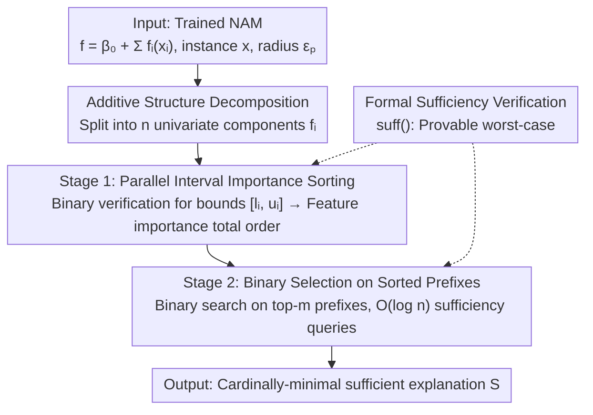

# Provably Explaining Neural Additive Models

**Conference**: ICLR 2026  
**arXiv**: [2602.17530](https://arxiv.org/abs/2602.17530)  
**Code**: None  
**Area**: Interpretability / Formal Verification  
**Keywords**: Neural Additive Models, Provable Explanations, Cardinally-minimal Explanations, Formal Verification, Explainable AI

## TL;DR

Specialized efficient explanation algorithms are designed for Neural Additive Models (NAMs). By requiring only logarithmic verification queries, these algorithms generate cardinally-minimal explanations that outperform existing general-purpose subset-minimal explanation algorithms in terms of both speed and explanation quality.

## Background & Motivation

The interpretability of neural networks is a core issue for AI safety and trustworthy deployment. Existing post-hoc explanation methods face several challenges:

**Background**: Most explanation methods (e.g., SHAP, LIME, Grad-CAM) are inherently heuristic and cannot guarantee the correctness of the explanations. For instance, the feature importance rankings provided by SHAP might not truly reflect the basis of the model's decision.

**Limitations of Prior Work**: The key to obtaining explanations with provable guarantees is finding a "cardinally-minimal subset"—the smallest number of input features sufficient to determine the model's prediction. For standard neural networks, this typically requires:
   - Exponential verification queries relative to the number of input features.
   - Each query itself being an NP-hard problem.
   - Thus, it is generally computationally infeasible.

**Key Insight**: Neural Additive Models are a family of inherently more interpretable neural networks. The core structure of a NAM is $f(\mathbf{x}) = h_1(x_1) + h_2(x_2) + \cdots + h_n(x_n)$, where each $h_i$ is an independent univariate neural network. This additive structure suggests that explanations should be easier to obtain, yet existing work has not fully exploited this structural property.

**Key Challenge**: Most existing algorithms can only find "subset-minimal" explanations (where no further features can be removed) but cannot guarantee finding "cardinally-minimal" explanations (the subset containing the minimum number of features). Cardinally-minimal explanations are more informative but significantly harder to compute.

**Core Problem**: Can the additive structure of NAMs be leveraged to efficiently generate provable cardinally-minimal explanations?

## Method

### Overall Architecture

The problem addressed is to find the smallest subset of features $S$ for a trained NAM, a specific input $\mathbf{x}$, and a perturbation radius $\epsilon_p$, such that fixing the features in $S$ keeps the model's prediction unchanged regardless of the values other features take within the perturbation ball $B_{\epsilon_p}(x_i)$. This is defined as a "cardinally-minimal sufficient explanation." While this requires exponential search for general networks, this paper utilizes the additive structure $f(\mathbf{x}) = \beta_0 + \sum_i f_i(x_i)$ to decompose the process into two stages: parallelizable **offline preprocessing** (Stage 1), which performs verification on small univariate components $f_i$ to derive an importance order; and **online selection** (Stage 2), which uses binary search over the "top-$m$ most important features" based on this order. This reduces the exponential search to $O(\log n)$ full-model verification queries.

### Key Designs

**1. Mechanism: Decomposing the global sufficiency problem into univariate analysis**

The difficulty in explaining general neural networks stems from feature entanglement; determining if a subset is sufficient requires treating the entire network as a black box. The structure of a NAM, $f(\mathbf{x}) = \beta_0 + \sum_i f_i(x_i)$, naturally breaks this entanglement—each feature $x_i$ contributes an independent term $f_i(x_i)$. Consequently, the impact of perturbing feature $i$ on the decision boundary can be analyzed independently for each component $f_i : \mathbb{R} \to \mathbb{R}$ and compared directly, without considering interactions. This is the root of the efficiency: reasoning occurs across $n$ one-dimensional functions instead of an $n$-dimensional joint space.

**2. Design Motivation: Stage 1 Parallel Interval Importance Sorting**

To determine which features to fix or discard, an importance ranking is required. Assuming a prediction $f(\mathbf{x}) = 1$ (i.e., $\beta_0 + \sum_i f_i(x_i) \ge 0$), the algorithm computes how much a perturbation pulls the prediction toward the decision boundary:

$$x_i^* = \arg\min_{\tilde{x}_i \in B_{\epsilon_p}(x_i)} f_i(\tilde{x}_i).$$

Instead of calculating exact values, the algorithm uses binary verification queries to refine interval bounds $[l_i, u_i]$ (where $l_i \le f_i(x_i^*) \le u_i$) until a total order is established based on relative deviations $\Delta l_i = f_i(x_i) - l_i$ and $\Delta u_i = f_i(x_i) - u_i$. This process is parallelizable and performed on small univariate networks, requiring only logarithmic queries relative to precision.

**3. Novelty: Stage 2 Binary Selection on $O(\log n)$ Queries**

Given the total order, the cardinally-minimal explanation must be a prefix of the "top-$m$ most important features" (Prop 1: replacing a feature in an explanation with a more important one remains sufficient). Thus, binary search is performed on the prefix length $m$: each step uses one sufficiency verification $\text{suff}(f, \mathbf{x}, \{F[1],\dots,F[m]\}, \epsilon_p)$ to check if the prefix is sufficient. This locates the shortest sufficient prefix in $O(\log n)$ queries, compared to $O(n)$ for naive greedy removal.

**4. Function: Provable Worst-case Sufficiency Verification**

"Sufficiency" is strictly defined here: once features in $S$ are fixed, **any values** taken by features outside $S$ within the perturbation ball will not change the prediction. This worst-case judgment is provided by neural network verifiers (using interval propagation or linear relaxation), yielding a provable yes/no answer. Unlike sampling methods like SHAP, this ensures no adversarial values can overturn the explanation.

### Loss & Training

Ours is a post-processing method and does not involve specific loss functions or training strategies. The complexity of Stage 1 is $O\!\big(\tfrac{n}{\rho}\log(\max_i \tfrac{\beta_i-\alpha_i}{\xi_i})\big)$ with $\rho$ processors, while Stage 2 requires $O(\log n)$ full-model verification queries.

## Key Experimental Results

### Main Results

Comparison with existing subset-minimal explanation algorithms:

| Method | Explanation Type | Verification Queries | Explanation Size | Computation Time |
|------|---------|-----------|---------|---------|
| Existing Universal Algorithms | Subset-minimal | Exponential | Larger | Slower |
| **Ours (NAM-specific)** | Cardinally-minimal | Logarithmic | **Minimum** | **Fastest** |

The results indicate that the proposed algorithm solves a harder task (cardinally-minimal vs. subset-minimal) while achieving better speed and explanation quality.

### Ablation Study

| Configuration | Key Metrics | Description |
|------|---------|------|
| No Preprocessing | Queries increase significantly | Significant contribution of preprocessing |
| Different Precision $\epsilon$ | High precision is slower but improves quality | Trade-off between precision and efficiency |
| Feature Count $n$ | Logarithmic growth in queries | Validates theoretical logarithmic complexity |
| Different NAM Architectures | Consistent performance | Generalizability of the algorithm |

### Key Findings

1. **Cardinal Minimality ≠ Subset Minimality**: Cardinally-minimal explanations can be significantly smaller than subset-minimal ones, providing more refined information.
2. **Formal Explanations vs. Sampling Explanations**: Sampling methods (e.g., permutation sampling in SHAP) can yield different (and potentially incorrect) conclusions in certain cases.
3. **NAM-specific Interpretability Advantage**: Beyond visualization, NAMs support efficient formally provable explanations.
4. **Practical Significance**: In safety-critical sectors (medical, finance), unreliable explanations can be more dangerous than no explanations.

## Highlights & Insights

1. **Qualitative Leap in Complexity**: Reducing complexity from exponential to logarithmic is a fundamental breakthrough made possible by the deep exploitation of NAM structures.
2. **"Solving Harder Problems Faster"**: Cardinally-minimal tasks are harder, yet leveraging problem structure makes them more efficient—exemplifying "structure as efficiency."
3. **Integration of Theory and Application**: Bridges formal verification tools (interval propagation, SMT solvers) with machine learning interpretability.
4. **New Value of NAMs**: NAMs are not just visually interpretable; they are computationally more interpretable in a formal sense.

## Limitations & Future Work

1. **Scope Limitation**: The algorithm relies heavily on the additive structure and cannot be directly extended to general neural networks or models with feature interactions (e.g., NAM-I).
2. **Expressivity Trade-off**: NAMs cannot model feature interactions, which may limit performance. The choice of NAM depends on the trade-offs between interpretability and performance.
3. **Precision Selection**: The choice of $\epsilon$ for preprocessing affects quality and cost, but no automated method for determining $\epsilon$ is provided.
4. **Extension to GA2M**: Extending the algorithm to Generalized Additive Models with interactions (GA2M) is a natural next step, though interactions will increase complexity.

## Related Work & Insights

- **Interpretability**: SHAP/LIME face reliability issues; provable explanations provide a necessary alternative.
- **Formal Verification**: NNV, Marabou, and $\alpha$-$\beta$-CROWN provide the technical foundation for this work.
- **Heuristic vs. Provable**: This work encourages a shift from heuristic sampling toward worst-case guarantees in XAI.

## Rating

- **Novelty**: ⭐⭐⭐⭐⭐ — First logarithmic complexity cardinally-minimal explanation algorithm for NAMs.
- **Experimental Thoroughness**: ⭐⭐⭐⭐ — Compares well against baselines, though datasets are of limited scale.
- **Writing Quality**: ⭐⭐⭐⭐ — Rigorous theory but high notation density.
- **Value**: ⭐⭐⭐⭐ — Important for safety-critical AI despite being restricted to NAMs.

<!-- RELATED:START -->

## Related Papers

- [\[CVPR 2026\] Hidden Monotonicity: Explaining Deep Neural Networks via their DC Decomposition](../../CVPR2026/interpretability/hidden_monotonicity_explaining_deep_neural_networks_via_their_dc_decomposition.md)
- [\[NeurIPS 2025\] Additive Models Explained: A Computational Complexity Approach](../../NeurIPS2025/interpretability/additive_models_explained_a_computational_complexity_approach.md)
- [\[NeurIPS 2025\] FaCT: Faithful Concept Traces for Explaining Neural Network Decisions](../../NeurIPS2025/interpretability/fact_faithful_concept_traces_for_explaining_neural_network_decisions.md)
- [\[ICML 2026\] Beyond Additive Decompositions: Interpretability Through Separability](../../ICML2026/interpretability/beyond_additive_decompositions_interpretability_through_separability.md)
- [\[ICLR 2026\] Estimating Dimensionality of Neural Representations from Finite Samples](estimating_dimensionality_of_neural_representations_from_finite_samples.md)

<!-- RELATED:END -->
