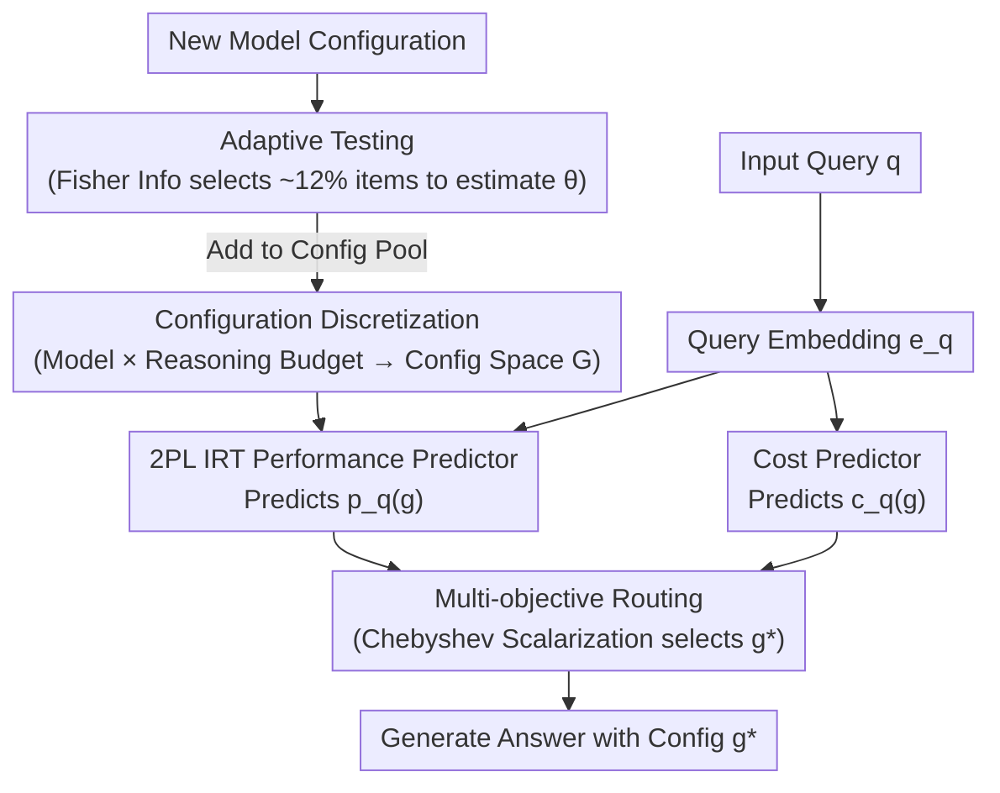

# RADAR: Reasoning-Ability and Difficulty-Aware Routing for Reasoning LLMs

**Conference**: ICLR 2026  
**arXiv**: [2509.25426](https://arxiv.org/abs/2509.25426)  
**Code**: None  
**Area**: Interpretability  
**Keywords**: Reasoning LLMs, Model Routing, Item Response Theory, Multi-objective Optimization, Adaptive Reasoning

## TL;DR

This paper proposes the Radar framework, which models the adaptive reasoning problem of Reasoning Large Language Models (RLMs) as a multi-objective optimization. By utilizing Item Response Theory (IRT) to jointly estimate interpretable query difficulty and model configuration capability parameters, Radar achieves lightweight and scalable query-level routing. It outperforms SOTA routing methods across 8 reasoning benchmarks with an added latency of only approximately 7ms.

## Background & Motivation

Recently, RLMs such as DeepSeek-R1, o4-mini, and Qwen3 have demonstrated exceptional capabilities in challenging tasks like mathematics, science, and programming. Selecting the appropriate RLM involves two key dimensions of the **performance-cost trade-off**: (1) Model size—larger models perform better but cost more; (2) Reasoning budget—more thinking tokens improve performance but increase latency and fees.

Key Finding: Over 50% of queries in MATH-500 can be correctly solved by Qwen3-0.6B with a minimal reasoning budget, while some difficult queries require stronger RLM configurations. Furthermore, stronger RLMs may "overthink" on simple problems, leading to performance degradation. This motivates a core problem: How can one select a RLM configuration that is "just enough" for each query to maximize cost-efficiency without sacrificing performance?

## Method

### Overall Architecture

Radar aims to select a RLM configuration for each query that is "just strong enough": preventing small models from being overwhelmed by difficult problems while avoiding overthinking and unnecessary costs from large models on simple tasks. The process follows two steps: first, it fits an interpretable performance predictor using Item Response Theory (IRT) to align "query difficulty" and "configuration capability" on the same scale; second, it performs multi-objective optimization for both performance and cost to select the Pareto-optimal configuration $g^*$ for answer generation. When a new model is introduced, its capability is estimated through adaptive testing on a small subset of informative queries, allowing it to be added to the configuration pool without retraining the entire IRT system.

### Key Designs

**1. Configuration Discretization: Compressing "Model Selection" and "Budget Selection" into Single Routing**

Neither model size nor reasoning budget alone is sufficient—large models may overthink simple tasks, while small models may not be cost-effective even with high budgets. The true degree of freedom lies in the combination of "which model × how much thinking budget." Radar discretizes each RLM $m \in \mathcal{M}$ along its available reasoning budget $u \in \mathcal{U}_m$ into configurations $g = (m, u) \in \mathcal{G}$. Thus, "selecting a model + selecting a budget" is unified into a single routing problem over the configuration space $\mathcal{G}$. For open-source RLMs, the budget is enforced by counting thinking tokens; if $u$ is exceeded, an interrupt message forces the model to conclude. This study constructs 35 configurations as the candidate pool for routing.

**2. 2PL IRT Performance Predictor: Treating Queries as Items and Configurations as Examinees**

For query-level routing, it is necessary to predict if a configuration can correctly answer a query. Radar implements a performance predictor $p_q(g)$ using a Two-Parameter Logistic (2PL) IRT model: the probability of configuration $g_i$ correctly answering query $q_j$ is $p_{ij} = \sigma(a_j(\theta_i - b_j))$, where $\theta_i$ is the scalar capability of configuration $g_i$, $b_j$ is the query difficulty, and $a_j$ is the discrimination. Scalar capability $\theta_i$ ranks all configurations on an interpretable strength axis with fewer parameters than Multidimensional IRT (MIRT). To generalize to unseen queries, difficulty and discrimination are modeled as linear transformations of the query embedding $\mathbf{e}_j$ ($b_j = \mathbf{w}_b^\top \mathbf{e}_j$, $a_j = \mathbf{w}_a^\top \mathbf{e}_j$). Thus, difficulty for new queries can be predicted directly from embeddings.

**3. Multi-objective Routing: Reaching Non-convex Pareto Fronts via Chebyshev Scalarization**

Performance and cost are inherently in conflict. Simple weighted sums (linear scalarization) fail to capture non-convex regions of the Pareto front—often where the most cost-effective "knees" reside. For each query $q$, Radar solves $g^* = \arg\max_{g \in \mathcal{G}} f(p_q(g), c_q(g))$, where $p_q(g)$ comes from the IRT predictor and $c_q(g)$ predicts cost. The study compares two scalarizations: Linear Scalarization (LSP) $\text{LSP}_q^{w_1} = \arg\max_{g} w_1 p_q(g) - (1-w_1) c_q(g)$, which only covers convex parts, and Chebyshev Scalarization (CSP) $\text{CSP}_q^{w_1} = \arg\min_{g} \max\{w_1|1-p_q(g)|, (1-w_1)c_q(g)\}$, which minimizes the maximum weighted deviation from the ideal point to discover non-convex regions. This represents the first introduction of MOO techniques beyond linear scalarization in LLM routing, proving particularly effective in Out-of-Distribution (OOD) scenarios.

**4. Adaptive Testing: Plug-and-play for New Configurations**

When adding a new model configuration, instead of evaluating it on the entire training set to estimate its capability $\theta$, it is more efficient to select items that best distinguish capability. Radar utilizes Fisher Information from educational assessment: at step $t$, it selects $j_t = \arg\max_{j \in \mathcal{Q} \setminus \mathcal{S}_{t-1}} I(\hat{\theta}_{t-1}, a_j, b_j)$, where information:

$$I(\theta, a_j, b_j) = a_j^2 \sigma(a_j(\theta-b_j))[1-\sigma(a_j(\theta-b_j))]$$

is maximized when $\theta$ is close to difficulty $b_j$. This prioritizes items where the difficulty matches the current capability estimate. Only about 12% of the training set is needed to accurately estimate new configuration capabilities and integrate them into the routing pool without retraining.

### Loss & Training

The IRT model is trained using Binary Cross Entropy on "configuration × query" response records:

$$\mathcal{L}_{2PL} = -\frac{1}{nk} \sum_{i=1}^n \sum_{j=1}^k [y_{ij} \log p_{ij} + (1-y_{ij}) \log(1-p_{ij})]$$

where $y_{ij} \in \{0,1\}$ indicates whether configuration $g_i$ correctly answered query $q_j$. The dataset comprises 1.75 million binary responses covering 35 configurations and 50,139 queries.

## Key Experimental Results

### Main Results (ID Setting, Hypervolume Metric, Higher is Better)

| Benchmark | Random-Pair | RouterBench | IRT-Router | Radar (Ours) | Gain |
|-----------|-------------|-------------|------------|-------------|------|
| GPQA-Diamond | 0.5545 | 0.6866 | 0.6942 | **0.7513** | +8% vs next best |
| MMLU | 0.6905 | 0.8592 | 0.8604 | **0.8720** | +1.3% |
| MMLU-Redux | 0.7281 | 0.9053 | 0.9117 | **0.9230** | +1.2% |
| LSAT | 0.6913 | 0.9125 | 0.9163 | **0.9188** | +0.3% |
| FRAMES | 0.6589 | 0.8325 | 0.8501 | **0.8762** | +3.1% |

### Ablation Study

| Configuration | Hypervolume | Description |
|------|-----------|------|
| Linear Scalarization (ID) | Marginally better | Lead in ID scenarios |
| Chebyshev Scalarization (OOD) | Better | Significant advantage in OOD scenarios |
| 20% Training Data | ~Similar | Achieves similar performance with only 20% data |
| Radar (35 Configs) | Baseline | Original 35 configurations |
| Radar++ (43 Configs) | Improved | Improvement after adding Qwen3-14B via adaptive testing |

### Key Findings

- On MATH-500, Radar achieves 90% of the performance of o4-mini (high budget) at only 1.31% of the cost.
- On FRAMES (Long-context multi-document QA), Radar reaches 90% performance at 10% cost, while the next best method requires 30% cost.
- Radar's routing latency is approximately 7ms, which is negligible compared to the ~870ms generation time of the smallest RLM configuration.
- Adaptive testing accurately estimates new configuration capabilities using only 12% of the training set (5k queries).
- Estimated query difficulty shows a moderate Pearson correlation (0.509) with the 5-level human-annotated difficulty in MATH-500.

## Highlights & Insights

- **Introduction of MOO (Beyond Linear Scalarization) to LLM Routing**: Chebyshev scalarization identifies non-convex portions of the Pareto front.
- **Psychometrics-inspired IRT Model**: Analogizing queries to test items and configurations to examinees provides a natural and interpretable framework.
- **Extreme Cost Savings**: Achieving 90% performance at 1.31% cost on MATH-500 is a significant result.
- **Plug-and-play Design**: Works as a black-box for RLMs without fine-tuning, allowing rapid integration of new models.
- **Strong OOD Generalization**: Particularly effective in generalizing to long-context multi-document QA tasks.

## Limitations & Future Work

- Cost prediction relies on simple heuristics (average tokens × unit price) without considering query-specific cost variations.
- Generalization on high-difficulty OOD benchmarks like AIME is slightly weaker, with a tendency to assign under-powered configurations.
- Restricted to text modality; multi-modal reasoning scenarios remain to be explored.
- The linear parameterization of 2PL IRT may not fully capture complex difficulty-ability interactions.
- Total budget constraints under batch query scenarios were not considered.

## Related Work & Insights

- IRT-Router (Song et al., 2025): Uses Multidimensional IRT (MIRT) with more parameters; Radar uses scalar ability for interpretable ranking.
- RouterBench (Hu et al., 2024): Conventional model routing; this work extends it to RLM configuration-level routing.
- Efficient reasoning methods (L1/S1): Complementary to Radar and can be added to the routing pool as additional configurations.
- Adaptive testing in education: Successful adaptation of the Fisher Information query selection strategy.

## Rating

- Novelty: ⭐⭐⭐⭐ The combination of IRT and MOO is novel, though individual components are established.
- Experimental Thoroughness: ⭐⭐⭐⭐⭐ Comprehensive and rigorous evaluation across 8 benchmarks, 35 configs, and 1.75M data points.
- Writing Quality: ⭐⭐⭐⭐⭐ Clear structure with complete mathematical derivations and intuitive visualizations.
- Value: ⭐⭐⭐⭐⭐ Directly addresses a core problem in practical RLM deployment with significant cost reduction.

<!-- RELATED:START -->

## Related Papers

- [\[ICLR 2026\] Reforming the Mechanism: Editing Reasoning Patterns in LLMs with Circuit Reshaping](reforming_the_mechanism_editing_reasoning_patterns_in_llms_with_circuit_reshapin.md)
- [\[ICLR 2026\] Understanding Cross-Layer Contributions to Mixture-of-Experts Routing in LLMs](understanding_cross-layer_contributions_to_mixture-of-experts_routing_in_llms.md)
- [\[ICLR 2026\] CoT Vectors: Transferring and Probing the Reasoning Mechanisms of LLMs](cot_vectors_transferring_and_probing_the_reasoning_mechanisms_of_llms.md)
- [\[ICLR 2026\] The Geometry of Reasoning: Flowing Logics in Representation Space](the_geometry_of_reasoning_flowing_logics_in_representation_space.md)
- [\[ICLR 2026\] Thought Branches: Interpreting LLM Reasoning Requires Resampling](thought_branches_interpreting_llm_reasoning_requires_resampling.md)

<!-- RELATED:END -->
