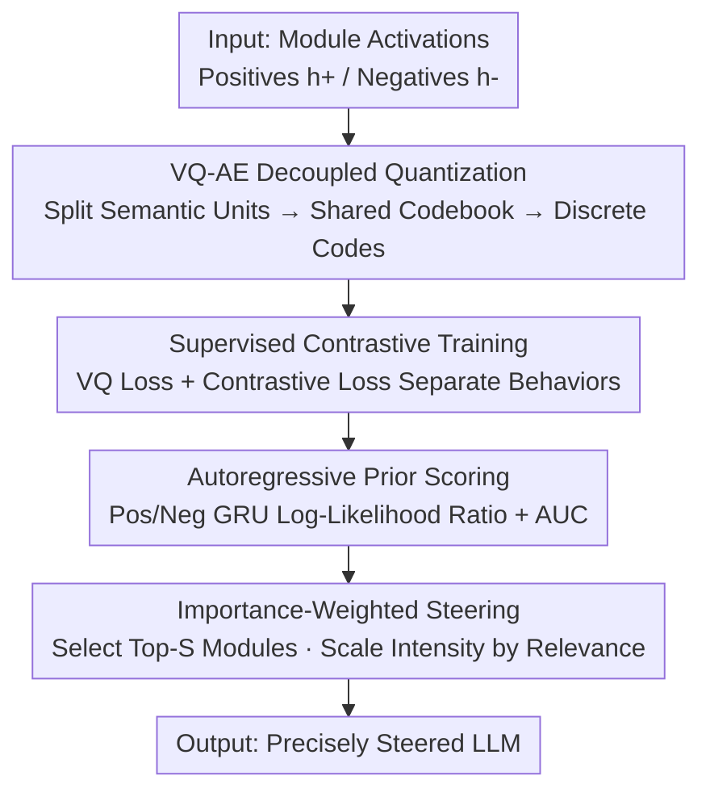

# REAL: Reading Out Transformer Activations for Precise Localization in Language Model Steering

**Conference**: ICLR 2026  
**OpenReview**: [https://openreview.net/forum?id=P38RYdkFLI](https://openreview.net/forum?id=P38RYdkFLI)  
**Code**: https://github.com/liam0949/REAL_ICLR  
**Area**: Interpretability / Activation Localization / Inference-time Steering  
**Keywords**: Activation Steering, Module Localization, Vector Quantized Autoencoder, Attention Head Selection, Truthfulness

## TL;DR
REAL trains a Vector Quantized Autoencoder (VQ-AE) for each attention head (or layer) of a Transformer to map highly entangled hidden activations into a separable discrete code space. It then uses the log-likelihood ratio of two autoregressive priors + AUC scoring to determine "how relevant this module is to the target behavior," thereby precisely selecting modules for intervention and adaptively adjusting steering strength based on relevance. This achieves an average improvement of 20% (up to 81.5%) in truthfulness steering compared to ITI.

## Background & Motivation

**Background**: Inference-time activation steering is a popular route for LLM alignment and safety—without modifying model parameters, it tilts model behavior toward goals like truthfulness, refusal, or long-term reasoning by adding a "steering vector" to certain intermediate activations during decoding. The process typically involves two steps: **module selection** (deciding which attention heads/layers to act upon) and **vector construction** (constructing and adding the steering vector).

**Limitations of Prior Work**: Most academic effort has focused on "how to build better steering vectors" (e.g., TruthFlow, SpARE, LoFiT), while "where to intervene" and "how much strength to use" have been severely underestimated. Existing module selection methods rely on simple **linear probes** (e.g., ITI trains a logistic regression probe to score each head), **empirical heuristics**, or **expensive cross-validation + manual layer selection**. The problem is that attention heads are polysemantic (managing both induction and long-range factual retrieval), and their behavior-relevant features are often **entangled** within hidden activations and not linearly separable, making them undetectable by linear probes.

**Key Challenge**: The paper highlights a critical point with a comparison plot—the top-48 heads selected by ITI using linear probes and those selected by REAL have almost no overlap. Guiding the same model with these two sets of heads results in vastly different outcomes. Choosing the wrong heads in ITI leads to unstable generation, unsubstantiated assertions, and even more hallucinations. Since truthfulness itself sits in a tension between "informativeness vs. truthfulness," selecting the wrong modules causes failure in this trade-off. In other words, **the precision of module selection directly determines the success of steering**, but existing tools lack sufficient resolution.

**Goal**: Propose a module (head or layer) selection method that is theoretically clear, effective, and efficient, capable of precisely locating modules most relevant to target behavior while simultaneously providing the intervention strength for each module.

**Key Insight**: Since activations are entangled and linearly inseparable, a **nonlinear, decouplable** representation should be used to "read out" behavioral signals from activations. Authors borrow the discrete encoding concept from VQ-AE, mature in vision/multimodal fields, and applied it to activation analysis—compressing activations into a discrete code space explicitly split into behavior-relevant and behavior-irrelevant subspaces.

**Core Idea**: Train a VQ-AE for each module to learn decoupled discrete codes, then quantify the module's behavioral discriminative power using the "log-likelihood ratio of two autoregressive priors (one for positive and one for negative behavior) + AUC." This score simultaneously guides **which modules to select** and **what intensity to use for each**.

## Method

### Overall Architecture

REAL (REading out transformer Activations for precise Localization) aims to: given a target behavior (e.g., truthfulness) and a contrastive dataset of "positive/negative" examples, assign a "behavior relevance score" $s^{(l,i)}$ to every candidate module of the model, then select the top-scoring modules for steering and link steering strength to the score. The process is a clear serial pipeline:

For a single attention head $(l,i)$, take the activation of its last token $h_T^{(l,i)}$ and feed it into a VQ-AE: the encoder projects it into a low-dimensional embedding, splits it into several "semantic units," and performs nearest-neighbor quantization for each unit in a **shared learnable codebook** to obtain a sequence of discrete codes. The VQ-AE is trained with reconstruction loss + supervised contrastive loss to separate codes of positive and negative behaviors. After training, two lightweight GRU autoregressive priors are fitted to the discrete code sequences collected from the positive and negative sets, respectively. The log-likelihood ratio of the two is used for scoring, and the AUC-ROC is calculated on a validation set to obtain the behavior relevance $s^{(l,i)}$. Finally, the top-$S$ heads are selected to form the intervention set $G$, and the steering vector for each head is scaled by its normalized relevance before being added back to the activations. This process is applicable to both head-level and layer-level (where units are replaced by layers).

### Key Designs

**1. VQ-AE Decoupled Quantization: Reading Entangled Activations as Separable Discrete Codes**

This step directly addresses the issue where "activations are entangled and linear probes cannot extract behavioral features." For activation $h_T^{(l,i)}\in\mathbb{R}^{d_h}$ of head $(l,i)$, the encoder first projects it to a low-dimensional embedding $z^{(l,i)}=E(h_T^{(l,i)})\in\mathbb{R}^{d_e}$, then **splits it into $U$ "semantic units"** $z^{(l,i)}=[z_1^{(l,i)};\dots;z_U^{(l,i)}]$, each with length $d_u=d_e/U$. Each semantic unit performs nearest-neighbor quantization in a **learnable codebook shared across all units** $\mathcal{C}=\{c_k\in\mathbb{R}^{d_u}\}_{k=1}^K$: $\kappa_u^{(l,i)}=\arg\min_k\lVert z_u^{(l,i)}-c_k\rVert_2^2$, resulting in a sequence of discrete codes $\kappa_{1:U}^{(l,i)}$. The decoder then reconstructs the activation using the corresponding codewords. The VQ loss is the standard triplet:

$$\mathcal{L}_{VQ}=\underbrace{\lVert h_T^{(l,i)}-D(\hat z)\rVert_2^2}_{\text{Reconstruction}}+\underbrace{\lVert \mathrm{sg}[z]-\hat z\rVert_2^2}_{\text{Codebook}}+\beta\underbrace{\lVert z-\mathrm{sg}[\hat z]\rVert_2^2}_{\text{Commitment}}$$

Splitting the activation into semantic units with a shared codebook allows different units to capture "promotion/inhibition" facets of behavior separately, naturally isolating behavior-relevant factors from irrelevant ones. This creates a representation space much more decoupled than linear probes, laying the foundation for identifying relevant heads.

**2. Supervised Contrastive Loss: Explicit Behavioral Classification of Discrete Codes**

Reconstruction alone is insufficient—it ensures codes can restore activations but doesn't guarantee they distinguish behaviors. Thus, a **supervised contrastive loss** $\mathcal{L}_{SC}$ is added to the quantized embeddings $\hat z$, pulling samples with the same behavioral label ($y_i$ same) closer in code space while pushing different labels apart:

$$\mathcal{L}_{SC}=-\frac{1}{N}\sum_{i=1}^{N}\frac{1}{|P(i)|}\sum_{j\in P(i)}\log\frac{\exp(s_{ij})}{\sum_{k\neq i}\exp(s_{ik})},\quad s_{ij}=\frac{\hat z_i^\top\hat z_j}{\tau}$$

where $P(i)$ is the set of positive samples with the same label as $i$, and $\tau$ is temperature. The total objective is $\mathcal{L}=\mathcal{L}_{VQ}+\alpha\mathcal{L}_{SC}$, with $\alpha$ balancing reconstruction and contrast. This term is key to REAL's ability to "read out behavior": it forces the model to automatically map "behavior-relevant/irrelevant" features to different codewords, allowing behavior discrimination based solely on discrete codes without relying on fragile linear separability assumptions.

**3. Autoregressive Prior Scoring: Quantifying Module Relevance via Log-Likelihood Ratio + AUC**

How to convert the discrete code sequence into a scalar score of "how relevant this head is"? Authors **fit a class-conditional autoregressive prior** to the positive set $D_+$ and negative set $D_-$ respectively (using lightweight GRUs trained with cross-entropy): $p_{\theta_c}(\kappa_{1:U}^{(l,i)})=\prod_u p_{\theta_c}(\kappa_u\mid\kappa_{1:u-1})$. For a validation sample $x$, the VQ-AE provides the code sequence for head $(l,i)$, and the **log-likelihood ratio** of positive and negative priors is calculated: $r(x)^{(l,i)}=\log p_{\theta_+}(x)-\log p_{\theta_-}(x)$. Finally, this ratio is treated as the positive class score to calculate the ROC-AUC on the validation set, yielding the module's relevance score:

$$s^{(l,i)}=\mathrm{AUC}\big(\{(r(x)^{(l,i)},y)\mid(x,y)\in D_{val}\}\big)$$

Autoregressive priors are used because they naturally fit discrete code sequences—modeling code-by-code captures compositional dependencies and provides a well-defined likelihood. The log-likelihood ratio provides calibrated evidence of "behavior relevance." A larger AUC indicates the head better separates positive/negative behaviors and is more worthy of intervention. This transforms "module selection" into a clean binary discrimination metric, which is more principled than ITI weights or LoFiT scalar magnitudes.

**4. Importance-Weighted Steering: Linking Steering Strength to Relevance**

The score $s^{(l,i)}$ determines both module selection and intensity. Top-$S$ heads are selected for intervention set $G$. During steering, instead of adding a uniform strength vector to each head as in standard ITI, intensity is scaled by **normalized relevance**:

$$\hat h_t^{(l,i)}=h_t^{(l,i)}+\frac{s^{(l,i)}}{s^{(l,i)}_{\max}}\,\epsilon\, v^{(l,i)},\quad (l,i)\in G$$

where $v^{(l,i)}$ is the steering vector (derived from ITI mean differences or LoFiT preference-tuning vectors) and $s^{(l,i)}_{\max}$ is the maximum score across all heads. This echoes LITO's observation—constant strength fails to capture polysemantic dynamics. REAL allows more relevant heads to be pushed harder while marginal heads are pushed lightly, reaching a more stable point in the "informativeness vs. truthfulness" tension. Note that REAL only manages "where and how much"; the steering vectors themselves reuse existing methods, allowing it to be plugged into frameworks like ITI or LoFiT.

### Loss & Training
The VQ-AE total objective is $\mathcal{L}=\mathcal{L}_{VQ}+\alpha\mathcal{L}_{SC}$; autoregressive priors are trained separately with cross-entropy. Training is extremely lightweight: training one head takes ~50 seconds and 758 MB VRAM, supporting parallel batch training. For layer-level (e.g., Llama3-8B's 32 layers), training one layer takes ~3 minutes and 1614 MB, with 20 layers trainable in parallel. Key hyperparameters include semantic unit count $U$, codebook size $K$, and contrastive weight $\alpha$, all explored in ablation studies.

## Key Experimental Results

Evaluation covers **8 LLMs** (LLAMA and QWEN families, including MHA and GQA) and **9 datasets**, spanning truthfulness enhancement, open-domain QA under knowledge conflict, and general alignment.

### Main Results

Truthfulness steering (TRUTHFULQA, MC1/MC2, improvement relative to IT/LoFiT):

| Model | Metric | No Steer | ITI | REAL_ITI | Gain |
|------|------|----------|-----|----------|----------|
| Qwen2.5-7B-Instruct | MC1 | 28.52 | 24.48 | 44.43 | +81.5% |
| Qwen2.5-7B-Instruct | MC2 | 43.40 | 40.51 | 64.21 | +58.5% |
| Llama-7B | MC1 | 25.46 | 27.42 | 34.27 | +25.0% |
| Llama2-7B | MC1 | 26.89 | 32.90 | 39.29 | +19.4% |
| Llama2-7B-Chat | MC1 | 28.52 | 32.80 | 36.97 | +12.7% |

When integrated with LoFiT, REAL_LoFiT also improves (Llama2-7B: MC1 58.14→59.61, MC2 75.83→77.48). In LLM-as-judge (gpt-5-mini) evaluations on Llama2-7B-Chat, REAL_ITI improved truth rate 54.59→77.64, informativeness 6.23→27.55, and Truth×Info 3.40→21.39.

Knowledge Conflict QA (NQSWAP / MACNOISE, Llama3-8B, EM):

| Dataset | Dimension | SPARE | REAL | Gain |
|--------|------|-------|------|------|
| NQSWAP | Contextual | 77.69 | 80.17 | +3.19% |
| NQSWAP | Parametric | 47.51 | 49.33 | +3.83% |
| MACNOISE | Parametric | 30.72 | 32.57 | +6.02% |

REAL also identified a broader set of useful layers than SPARE (5, 11, 12, 13–16 vs. only 13–16), indicating more precise layer localization.

### Ablation Study

| Configuration | Key Finding | Description |
|------|---------|------|
| Semantic Units $U$ | $U=1$ causes codebook collapse (no steering on Llama3.1-8B) | Splitting into multiple units is a prerequisite for decoupling |
| Codebook Size $K$ | MC1/MC2 varies with $K$, showing an optimal range | Too few codewords lead to insufficient expression |
| Contrastive weight $\alpha$ | Affects separation of pos/neg codes | $\alpha=0$ reduces to pure VQ |
| REAL Adaptive vs Fixed | Adaptive is much more stable for head count ≥50 (e.g., 1024 heads: 31.38 vs 17.82) | Importance weighting resists "over-intervention" |
| 50% Training Data | REAL(50%) at 40.27 still exceeds ITI(100%) at 30.72 | Much more robust to data volume than ITI |

### Key Findings
- **Module selection precision is the game-changer**: The top-48 heads selected by REAL and ITI barely overlap; the former leads to more faithful, calibrated outputs, while the latter often introduces hallucinations and unsubstantiated claims.
- **Importance weighting prevents "over-intervention"**: When intervening on a large number of heads (e.g., all 1024), fixed intensity collapses performance to 17.82, while adaptive scaling maintains it at 31.38, showing relevance-based adjustment is key to resisting noise from irrelevant heads.
- **Strong zero-shot cross-domain transfer**: Heads selected on TRUTHFULQA, when applied directly to MQUAKE / CLUTRR knowledge retrieval tasks without retuning, still outperform baselines in EM.
- **ITI fails easily on GQA**: On Qwen and Llama3.1, ITI fails when used alone, likely because Grouped-Query Attention (GQA) violates linear probe assumptions, while REAL remains stable.

## Highlights & Insights
- Upgrades "module selection" from heuristics/linear probes to a principled binary discrimination metric (log-likelihood ratio + AUC). The approach is clean and interpretable—scores directly reflect the code space's ability to separate behaviors.
- The combination of VQ discrete codes + autoregressive priors is clever: discretization naturally suits sequence priors, and the likelihood ratio from dual GRUs provides calibrated evidence, which is more robust than "probing weights."
- Using the same score for both selection and intensity is a concise and self-consistent design—standardizing localization and intensity scheduling into one quantity avoids extra hyperparameter tuning.
- Plug-and-play: Since REAL only handles "where and how much," it reuses steering vectors from ITI/LoFiT/SAE, allowing it to seamlessly enhance a wide range of existing steering methods with low migration cost.

## Limitations & Future Work
- Layer-level knowledge conflict experiments were only conducted on Llama3-8B because public SAE weights were only available for it; cross-model layer conclusions require further validation.
- Training a VQ-AE + two GRUs for every module is lightweight but the total cost becomes significant with large numbers of modules (thousands of heads × multiple layers); shared/amortized training could be explored.
- Behavior relevance relies on the quality of positive/negative contrastive datasets; scores may be distorted when target behaviors are hard to binary-partition (e.g., open-ended value alignment).
- Adaptive intensity scaling is linear normalization; whether this is the optimal intensity scheduling function remains an open question.

## Related Work & Insights
- **vs ITI**: ITI uses linear logistic regression probes for head selection and fixed-intensity steering; REAL uses nonlinearly decoupled VQ codes + AUC for selection and adaptive steering based on relevance. It is more precise in entangled/GQA scenarios, with a ~20% average gain in truthfulness.
- **vs LoFiT**: LoFiT estimates relevance via the magnitude of a preference-tuning scalar per head, which lacks robustness; REAL provides a more principled discriminative score and can in turn enhance LoFiT (REAL_LoFiT shows further gains).
- **vs SpARE**: SpARE uses Sparse Autoencoders to extract decoupled directions, focusing on "vector construction"; REAL focuses on "module/layer selection," and the two are complementary—REAL identifies broader and more accurate layer sets than SpARE.
- **vs LITO**: LITO notes that constant strength fails to capture polysemantic dynamics and advocates for dynamic intensity adjustment; REAL binds "intensity" directly to module relevance scores, providing a concrete scheduling basis.

## Rating
- Novelty: ⭐⭐⭐⭐⭐ Introducing VQ-AE + autoregressive priors to the overlooked "module selection" step is novel and principled.
- Experimental Thoroughness: ⭐⭐⭐⭐⭐ 8 models × 9 datasets × 3 task categories, including cross-domain transfer, data volume, intensity, and codebook ablations.
- Writing Quality: ⭐⭐⭐⭐ Method and motivation are clearly narrated with rich charts; some details (noise-OR aggregation, SAE integration) are moved to the appendix.
- Value: ⭐⭐⭐⭐⭐ Completes the missing puzzle pieces of "where to intervene and with what intensity" for inference-time steering; highly practical and plug-and-play.

<!-- RELATED:START -->

## Related Papers

- [\[ICLR 2026\] Fresh in Memory: Training-order Recency is Linearly Encoded in Language Model Activations](fresh_in_memory_training-order_recency_is_linearly_encoded_in_language_model_act.md)
- [\[ICLR 2026\] Precise and Interpretable Editing of Code Knowledge in Large Language Models](precise_and_interpretable_editing_of_code_knowledge_in_large_language_models.md)
- [\[ICLR 2026\] LatentQA: Teaching LLMs to Decode Activations Into Natural Language](latentqa_teaching_llms_to_decode_activations_into_natural_language.md)
- [\[ICML 2026\] Prototype Transformer: Towards Language Model Architectures Interpretable by Design](../../ICML2026/interpretability/prototype_transformer_towards_language_model_architectures_interpretable_by_desi.md)
- [\[ACL 2026\] From Weights to Activations: Is Steering the Next Frontier of Adaptation?](../../ACL2026/interpretability/from_weights_to_activations_is_steering_the_next_frontier_of_adaptation.md)

<!-- RELATED:END -->
