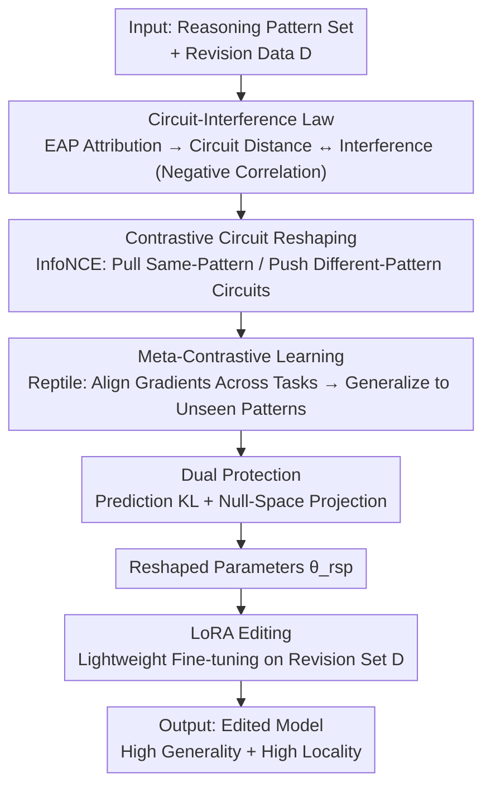

# Reforming the Mechanism: Editing Reasoning Patterns in LLMs with Circuit Reshaping

**Conference**: ICLR 2026  
**OpenReview**: [https://openreview.net/forum?id=Af16P0ODP6](https://openreview.net/forum?id=Af16P0ODP6)  
**Code**: https://github.com/LzyFischer/REdit  
**Area**: Interpretability / Model Editing / LLM Reasoning  
**Keywords**: Reasoning Editing, Neural Circuits, Contrastive Learning, Model Editing, Propositional Logic

## TL;DR
This paper proposes a new paradigm called "Reasoning Editing"—modifying a specific reasoning pattern in LLMs without affecting other reasoning capabilities. It identifies the "Circuit-Interference Law" (the more neural circuits of two reasoning patterns overlap, the stronger the editing interference). Based on this, it introduces REdit: actively "reshaping circuits" via contrastive learning to decouple overlapping circuits before editing. This simultaneously improves Generality and Locality, consistently outperforming editing baselines like LoRA, ROME, and AlphaEdit on propositional logic tasks using Qwen2.5-3B.

## Background & Motivation
**Background**: To enhance LLM reasoning, the prevailing approach treats reasoning as a "broad, holistic skill"—training on large-scale reasoning corpora, aligning with RLHF, or using sophisticated test-time prompting. These methods represent "blanket-style" holistic enhancements.

**Limitations of Prior Work**: Treating reasoning as a single capability has two major flaws. First, holistic enhancement is expensive and difficult, requiring massive manual annotation and compute. Second, increasing evidence suggests LLM reasoning is not monolithic but composed of **separable reasoning patterns** (e.g., syllogism, transitivity, modus tollens). Training patterns indiscriminately fails to distinguish between well-mastered patterns and genuine deficiencies, leads to resource waste, and results in imprecise correction of specific reasoning errors.

**Key Challenge**: Upon formalizing the objective of "modifying only one reasoning pattern" as a **Reasoning Editing** task, a fundamental trade-off immediately emerges—**Generality vs. Locality**. Generality requires that editing a specific rule (e.g., transitivity $A\to B, B\to C \Rightarrow A\to C$) generalizes across domains to all instances of that pattern (e.g., in both mathematics and medicine). Locality requires the edit to be "narrow," ensuring that correcting the target rule does not inadvertently damage other reasoning patterns the model already performs correctly. Preliminary experiments (Figure 1b) show that simply increasing the learning rate improves generality but degrades locality, creating a zero-sum struggle.

**Key Insight**: The authors attribute this issue to the mechanistic level—since mechanistic interpretability research indicates that different reasoning patterns are implemented by different **neural circuits** and tasks reuse shared modular circuits, "circuit overlap" is likely the key variable determining whether an edit generalizes or remains local.

**Core Idea**: First, verify a "Circuit-Interference Law" via attribution experiments (smaller circuit distance leads to greater cross-pattern interference). Then, do the opposite—**instead of passively analyzing circuits, actively reshape the circuits before editing**. Pull circuits of the same pattern closer and push different patterns apart to resolve the Generality-Locality trade-off at its source, followed by a lightweight LoRA edit.

## Method

### Overall Architecture
The core insight of REdit is that rather than editing "entangled" circuits and being forced to choose between Generality and Locality, it is better to **organize the circuit structure before editing**. The pipeline consists of two steps: first, reshaping the model parameters $\theta$ into $\theta_{rsp}$ using a dual-protected contrastive meta-learning objective (making circuits of the same reasoning pattern more compact and different patterns more distinct); then, performing standard LoRA editing on the reshaped model to obtain $\theta_{edit}$. The foundation for this design is the **Circuit-Interference Law** established by the authors through a four-step attribution experiment.

### Key Designs

**1. Circuit-Interference Law: Quantifying Editing Interference via Circuit Distance**

This is the theoretical cornerstone of the paper, addressing the question of where the "Generality-Locality trade-off" originates. The authors designed a four-step experiment to verify the hypothesis that "circuit similarity predicts cross-pattern editing effects": (i) Use **Edge Attribution Patching (EAP)** to extract attribution circuits for each reasoning pattern $\pi$. For every edge $e$ in the computational graph, a first-order approximation is made using the gradient and the difference in activations between clean and corrupted inputs: $\mathrm{EAP}_k(e)=\langle \nabla_{v_e} s_\theta(d^{clean}_k),\, v_e(d^{patch}_k)-v_e(d^{clean}_k)\rangle$. Averaging over $K$ instances gives edge weights $w_\pi(e)$, and taking the top-$\tau$ edges forms circuit $C^{(\tau)}_\pi$; (ii) Measure structural differences between circuits using three metrics (weighted edit distance, Jaccard, and Optimal Transport); (iii) Measure the accuracy perturbation $\Delta_{i\to j}=|\mathrm{Acc}_j(\theta_{edit(i)})-\mathrm{Acc}_j(\theta)|$ on pattern $j$ after editing pattern $i$; (iv) Fit $\Delta_{i\to j}\approx\alpha+\beta\, d(i,j)+\epsilon$. Results consistently show $\beta<0$ with negative Pearson correlation across all metrics and budgets—**smaller circuit distance leads to greater interference**. This law implies that achieving both Generality and Locality requires same-pattern circuits to be close and different-pattern circuits to be distant.

**2. Contrastive Circuit Reshaping: Differentiable Attribution Vectors as Circuit Surrogates for InfoNCE**

This step directly addresses the trade-off. The difficulty lies in the fact that circuit structures are discrete and lack closed-form expressions, making direct gradient optimization impossible. The authors treat the **attribution weights from Section 3.1 as differentiable surrogates for the circuits**. In each minibatch, $w_\pi$ is calculated for multiple instances of each pattern and normalized as $\tilde w_\pi=w_\pi/\|w_\pi\|_2$. Contrastive learning is then performed on these attribution vectors—for an anchor $i$, positive samples $i^+$ are drawn from the same pattern, while negative samples $N(i)$ are drawn from different patterns:

$$\mathcal{L}_{ctr}(\theta) = -\sum_i \log \frac{\exp(\langle \tilde w_i, \tilde w_{i^+}\rangle/\tau_t)}{\exp(\langle \tilde w_i, \tilde w_{i^+}\rangle/\tau_t) + \sum_{j\in N(i)} \exp(\langle \tilde w_i, \tilde w_j\rangle/\tau_t)}$$

Optimizing this objective **increases intra-pattern attribution similarity and decreases inter-pattern similarity**, implicitly clustering circuits by pattern. This realizes the ideal structure suggested by the "Circuit-Interference Law."

**3. Meta-Contrastive Learning: Enabling Transfer to Unseen Reasoning Patterns**

Performing contrastive learning only on observed patterns risks overfitting to specific relations between those patterns, leading to poor transfer to rare or unseen ones. The authors mitigate this using Reptile-style first-order meta-learning: treating each contrastive tuple batch $B$ as a task, an inner loop performs $s$ steps to get task parameters $\phi_i=\theta^s_i$, then an outer loop moves the weights toward the mean of these parameters:

$$\text{Inner: } \theta^{t+1}_i = \theta^t_i - \alpha \nabla_\theta \mathcal{L}^{(i)}_{ctr}(\theta^t_i), \qquad \text{Outer: } \theta \leftarrow \theta + \eta\cdot\frac{1}{|B|}\sum_{i\in B}(\phi_i-\theta)$$

By aligning gradients across tasks, this process **amplifies updates in shared directions and suppresses instance-specific directions**, avoiding overfitting to spurious relations between specific pattern pairs.

**4. Dual Protection: Safeguarding Original Capabilities at Prediction and Optimization Levels**

Reshaping circuits might inadvertently skew reasoning instances the model already handles correctly. The authors apply constraints at two levels. **(a) Prediction Distribution Preservation**: Using a frozen reference model $f_{\theta_{ref}}$ and the set of correctly answered instances $C$, a KL penalty minimizes drift: $\mathcal{L}_{pred}(\theta)=\mathbb{E}_{(P,G)\in C}\,\mathrm{KL}(f_{\theta_{ref}}(\cdot|P,G)\,\|\,f_\theta(\cdot|P,G))$. **(b) Null-Space Protection**: During inner loop steps, the gradient $g_{i,t}$ for prediction loss on anchor groups is used to construct a rank-1 projection $\Pi_g(u)=\frac{\langle u,g\rangle}{\langle g,g\rangle+\varepsilon}g$ and a soft null-space operator $P^{(i,t)}=I-\rho\,\Pi_{g_{i,t}}$. The contrastive gradient is projected into the (approximate) null space of the anchor loss: $\tilde\nabla_\theta\mathcal{L}^{(i)}_{ctr}=P^{(i,t)}\nabla_\theta\mathcal{L}^{(i)}_{ctr}$. When $\rho=1$, updates are strictly limited to the null space of $g_{i,t}$, preserving anchor loss in the first-order sense. These mechanisms ensure output consistency and constrain internal parameter updates.

### Loss & Training
The reshaping phase objective consists of the contrastive loss $\mathcal{L}_{ctr}$ and prediction preservation loss $\mathcal{L}_{pred}$, with null-space projection applied during the meta-learning inner loop. After obtaining $\theta_{rsp}$, the editing phase involves standard LoRA fine-tuning on the revision set $D$ by minimizing cross-entropy: $\theta_{edit}=\min_{\theta_{rsp}}\frac{1}{|D|}\sum_{(P,G,y^*)\in D}\mathrm{CE}(f_{\theta_{rsp}}(\cdot|P,G), y^*)$. Crucially, because the circuit structure has been reorganized, this "lightweight" edit is sufficient to achieve both high Generality and high Locality.

## Key Experimental Results

### Main Results
The backbone is Qwen2.5-3B-Instruct, with the ContextHub propositional logic benchmark used across three difficulty levels. Evaluation metrics are Generality and Locality.

| Difficulty | Metric | Raw | LoRA | ROME | AlphaEdit | REdit (Ours) |
|------|------|-----|------|------|-----------|------|
| Level 1 | Generality | 60.7 | 63.8 | 67.8 | 67.9 | **74.1** |
| Level 1 | Locality | N/A | 84.9 | 89.8 | 87.0 | **94.3** |
| Level 2 | Generality | 53.2 | 58.4 | 61.3 | 58.8 | **64.8** |
| Level 2 | Locality | N/A | 91.5 | 93.1 | 93.3 | **94.3** |
| Level 3 | Generality | 45.1 | 50.1 | 51.5 | 54.2 | **55.0** |
| Level 3 | Locality | N/A | 92.3 | 94.6 | 92.2 | **94.4** |

REdit achieves the best or tied-best performance across all metrics and difficulties. Compared to LoRA without reshaping, Generality increases by up to 16.1% and Locality by up to 12.2%.

### Ablation Study

| Configuration | Level 1 Gen / Loc | Level 3 Gen / Loc | Description |
|------|------|------|------|
| Full (Ours) | 74.1 / 94.3 | 55.0 / 94.4 | Full model |
| w/o MCL | 72.9 / 90.7 | 53.8 / 93.7 | No meta-contrastive learning |
| w/o NSP | 73.3 / 89.5 | 50.9 / 92.8 | No null-space protection |
| w/o PDP | 73.4 / 90.1 | 51.8 / 92.8 | No prediction distribution preservation |

### Key Findings
- All three components are necessary: MCL primarily supports Generality and cross-pattern transfer, while NSP/PDP support Locality.
- REdit's advantages are more pronounced as tasks become simpler, suggesting simpler reasoning circuits are more "plastic" and suitable for targeted reshaping.
- ROME performs poorly because reasoning is distributed across multiple architectural components, making mid-layer MLP localization insufficient.

## Highlights & Insights
- **"Reshape circuits before editing" is a brilliant conceptual reversal**: While mechanistic interpretability often focuses on "passive analysis" of circuits, this work turns it into an "active shaping" optimization goal. Circuits are transformed from observation objects into controllable variables.
- **Using EAP attribution vectors as differentiable surrogates is clever**: Circuits themselves are discrete and non-differentiable, but attribution weights are continuous. Performing InfoNCE on them implicitly shapes the discrete circuit structure.
- **Extending model editing from "knowledge correction" to "reasoning pattern correction"** and formalizing the Generality-Locality trade-off is a significant conceptual contribution.

## Limitations & Future Work
- Validation is primarily focused on Propositional Logic (ContextHub), a controlled and structurally simple setting. Effectiveness for open-ended natural language reasoning or multi-step chain-of-thought requires more evidence.
- Experiments were performed primarily on a single backbone (Qwen2.5-3B). Whether the Circuit-Interference Law holds across significantly larger scales or different architectures remains to be tested.
- The pipeline involves multiple stages and hyperparameters (e.g., $\tau_t$, $\rho$, $\tau$ thresholds, inner loop steps), which may increase engineering and tuning costs.
- Future directions include extending the law to hierarchical reasoning pattern partitions or exploring lightweight reshaping methods that do not rely on EAP computation.

## Related Work & Insights
- **vs. LoRA (Naive Editing)**: LoRA performs fine-tuning on primitive (entangled) circuits, forcing a compromise between Generality and Locality. REdit decouples circuits first, proving the bottleneck is the circuit structure, not the editor.
- **vs. ROME**: ROME localizes edits to mid-layer MLPs, but reasoning is distributed, leading to lower success rates and poor generality.
- **vs. AlphaEdit**: AlphaEdit uses null-space protection to reduce damage but restricts the edit direction, limiting generality. REdit uses protection for the reshaping phase and meta-learning for generality.
- **vs. BIMT**: BIMT encourages modularity during pre-training. When adapted to LLMs, it improves generality but significantly damages locality, highlighting the necessity of REdit’s dual protection.

## Rating
- Novelty: ⭐⭐⭐⭐⭐ 
- Experimental Thoroughness: ⭐⭐⭐⭐ 
- Writing Quality: ⭐⭐⭐⭐⭐ 
- Value: ⭐⭐⭐⭐ 

<!-- RELATED:START -->

## Related Papers

- [\[ICLR 2026\] LLMs are Single-threaded Reasoners: Demystifying the Working Mechanism of Soft Thinking](llms_are_single-threaded_reasoners_demystifying_the_working_mechanism_of_soft_th.md)
- [\[ICLR 2026\] RADAR: Reasoning-Ability and Difficulty-Aware Routing for Reasoning LLMs](radar_reasoning-ability_and_difficulty-aware_routing_for_reasoning_llms.md)
- [\[ICLR 2026\] Can LLMs Reason Soundly in Law? Auditing Inference Patterns for Legal Judgment](can_llms_reason_soundly_in_law_auditing_inference_patterns_for_legal_judgment.md)
- [\[ICLR 2026\] Precise and Interpretable Editing of Code Knowledge in Large Language Models](precise_and_interpretable_editing_of_code_knowledge_in_large_language_models.md)
- [\[ICLR 2026\] CoT Vectors: Transferring and Probing the Reasoning Mechanisms of LLMs](cot_vectors_transferring_and_probing_the_reasoning_mechanisms_of_llms.md)

<!-- RELATED:END -->
## Related Papers

- [\[ICLR 2026\] LLMs are Single-threaded Reasoners: Demystifying the Working Mechanism of Soft Thinking](llms_are_single-threaded_reasoners_demystifying_the_working_mechanism_of_soft_th.md)
- [\[ICLR 2026\] RADAR: Reasoning-Ability and Difficulty-Aware Routing for Reasoning LLMs](radar_reasoning-ability_and_difficulty-aware_routing_for_reasoning_llms.md)
- [\[ICLR 2026\] Can LLMs Reason Soundly in Law? Auditing Inference Patterns for Legal Judgment](can_llms_reason_soundly_in_law_auditing_inference_patterns_for_legal_judgment.md)
- [\[ICLR 2026\] Precise and Interpretable Editing of Code Knowledge in Large Language Models](precise_and_interpretable_editing_of_code_knowledge_in_large_language_models.md)
- [\[ICLR 2026\] CoT Vectors: Transferring and Probing the Reasoning Mechanisms of LLMs](cot_vectors_transferring_and_probing_the_reasoning_mechanisms_of_llms.md)

<!-- RELATED:END -->
