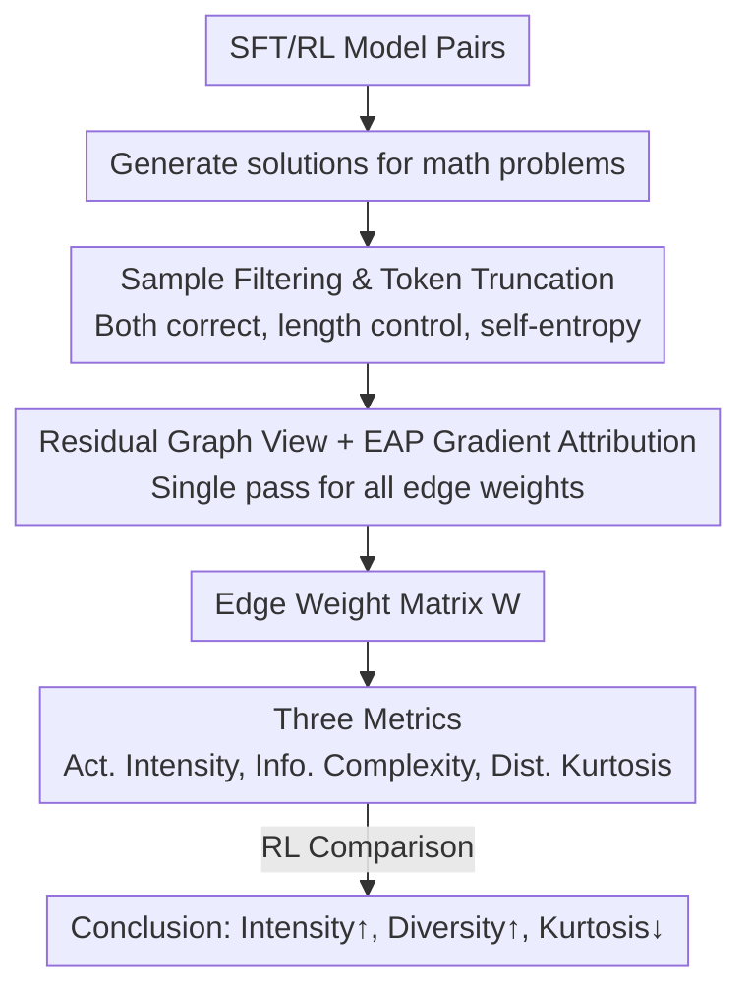

# Reinforcement Learning Fine-Tuning Enhances Activation Intensity and Diversity in the Internal Circuitry of LLMs

**Conference**: ICLR2026  
**OpenReview**: [https://openreview.net/forum?id=tzS9roOTdj](https://openreview.net/forum?id=tzS9roOTdj)  
**Code**: https://github.com/tsinghua-fib-lab/llm_rl_probing_analysis  
**Area**: Interpretability / Mechanistic Analysis / RL Post-training  
**Keywords**: Edge Attribution Patching (EAP), Internal Circuits, Activation Intensity, Activation Diversity, Online RL vs DPO

## TL;DR
The authors abstract LLM residual computation into a directed graph and use Edge Attribution Patching (EAP) to score the importance of all internal edges in a single forward-backward pass. By comparing edge weight distributions before and after RL fine-tuning, they find that online RL (PPO/GRPO) systematically **increases internal activation intensity and enhances activation diversity** (increased entropy, decreased kurtosis), whereas DPO shows almost no such changes—bridging the gap between "why RL post-training is stronger" and "how internal information pathways change."

## Background & Motivation
**Background**: The focus of LLM R&D has shifted from pre-training to post-training. RL fine-tuning (PPO, GRPO, various reward models) has been repeatedly verified to push capabilities in mathematical reasoning, writing, and coding beyond SFT. Simultaneously, mechanistic interpretability has developed tools like ACDC and EAP that view LLM residual pathways as "circuits" and score the importance of edges/sub-modules.

**Limitations of Prior Work**: These two lines of research run almost in parallel. Those studying RL effects focus only on **external behavior** (accuracy gains), while those studying internal mechanisms focus on **a given LLM** without considering the post-training method used. Consequently, while the superiority of RL is known, **no one has clearly explained how it reshapes the model's internal structures**.

**Key Challenge**: Applying interpretability tools directly to RL research is difficult. Methods like EAP/ACDC were originally designed for "circuit discovery" on toy tasks, whereas RL post-training targets real-world, long-chain mathematical reasoning tasks where analysis strategies cannot be directly transferred. Furthermore, ACDC-style edge-by-edge ablation requires an individual forward pass for every edge, which is computationally infeasible at scale.

**Goal**: Construct an analysis framework capable of running on 7B-scale real LLMs to systematically characterize "which statistical properties of internal circuits are changed by RL fine-tuning" and explain **why** online RL differs from SFT/DPO.

**Key Insight**: Leverage the gradient-based idea of EAP. Since edge-by-edge ablation is too expensive, first-order Taylor approximation is used to approximate the "change in loss after removing an edge" as the "inner product of gradient and activation." This allows **computing the importance of all edges simultaneously in a single forward-backward pass**, scaling circuit analysis to 7B models and real math problems.

**Core Idea**: Use EAP to calculate internal edge weight matrices for models before and after RL, quantify differences using three complementary statistics (intensity, diversity, distribution shape), and finally use a unified post-training gradient framework to explain the source of these differences as the "sampling distribution."

## Method

### Overall Architecture
The method is essentially a **measurement pipeline**: Given "SFT vs. RL" model pairs from the same base, both models generate solutions for math problems. After rigorous sample filtering and token truncation to ensure comparability, EAP is used to score all edges in the residual graph to obtain edge weight matrices. Finally, three statistical metrics characterize the changes in the distribution of these weights. This process does not involve training but is a "medical imaging" style comparative analysis of existing models.

After obtaining the conclusions, the authors provide a "unified gradient framework" to explain why these numerical changes occur (see Key Design 4), which serves as a mechanistic interpretation.

### Key Designs

**1. Abstracting Transformer Residual Flow as a DAG and using EAP for Gradient-based Attribution**

To "measure internal circuits," one must define edges. Using the property of residual connections, the input of any sub-module (Attention $A_\ell$ or FFN $F_\ell$) equals the sum of all previous sub-module outputs plus the original embedding: $H^{(2\ell)} = H^{(0)} + \sum_{i\le\ell} O^i_{\text{attn}} + \sum_{j\le\ell} O^j_{\text{ffn}}$. Thus, each sub-module is a node, residual flows are directed edges, and the LLM is a Directed Acyclic Graph (DAG) $G=(V,E)$.

To score edges, ACDC measures loss increase upon edge deletion: $I_{\text{ACDC}}(O,H) = \mathcal{L}(y; f_{\backslash(O,H)}(x)) - \mathcal{L}(y; f(x))$, which is too slow. EAP's key is the first-order Taylor approximation: viewing ablation as $H \mapsto H - O$, then

$$I_{\text{EAP}}(O,H) \approx -\big\langle \nabla_H \mathcal{L}(y; f(x)),\, O \big\rangle$$

Since forward activations $O$ and backward gradients $\nabla_H\mathcal{L}$ are obtained in **one forward + one backward pass**, all edge importance values can be computed at once. This makes circuit analysis feasible for 7B models on real reasoning tasks.

**2. Sample Filtering and Token Truncation for Fair Comparison**

Comparing edge weights directly across different generations is unfair. The authors keep only questions $Q$ where **both models answer correctly**. They then calculate the average length $\bar T$ and filter extreme samples using bounds $T_{\min}=\beta\bar T,\ T_{\max}=\gamma\bar T$. They also require the lengths to be similar: $\frac{|T^q_{\text{base}}-T^q_{\text{RL}}|}{(T^q_{\text{base}}+T^q_{\text{RL}})/2} < \delta$. Finally, they take only the first $T_{\text{cut}}=\alpha\bar T$ tokens and use the cross-entropy of the model's own output as the loss for attribution: $\mathcal{L}_{\text{trunc}} = -\frac{1}{T_{\text{cut}}}\sum_{t=1}^{T_{\text{cut}}} \log \frac{\exp(L_t[s_t])}{\sum_v \exp(L_t[v])}$. This isolates edge weight differences from confounding factors like correctness or length.

**3. Three Complementary Metrics for Intensity, Diversity, and Shape**

Given the edge weight matrix $W^{(k)}\in\mathbb{R}^{n_o\times n_i}$ for each sample, the authors define:

- **Activation Intensity (Act.Intens.)**: The average magnitude of all absolute edge weights, $\text{Act.Intens.}=\frac{1}{n\,n_o n_i}\sum_k\sum_o\sum_i |W^{(k)}_{oi}|$, measuring "how many pathways are lit up and how strong the signal is."
- **Information Complexity (Info.Complex.)**: The Shannon entropy of the flattened $|W^{(k)}_{oi}|$ histogram, $\text{Info.Complex.}=-\sum_b p_b\log(p_b+\epsilon)$, measuring the **diversity/unpredictability** of activation patterns—high entropy means pathways are less concentrated.
- **Distribution Kurtosis (Dist.Kurt.)**: The average kurtosis of the edge weight distribution (Eq.15 in the paper). High kurtosis = heavy tails (activations concentrated on a few outliers); Low kurtosis = more uniform/dispersed activations.

**4. Explaining differences in Online RL, SFT, and DPO via a Unified Gradient Framework**

To explain **why** RL increases intensity and diversity, the authors use a unified post-training gradient form $\nabla_\theta J_A(\theta)=\mathbb{E}_{(q,o)\sim D}\big[\frac{1}{|o|}\sum_t GC_A(\cdot)\,\nabla_\theta\log \pi_\theta(o_t|q,o_{<t})\big]$, attributing differences to the sampling distribution $D$ and the gradient coefficient $GC_A$.

- **SFT**: Data comes from a fixed human distribution with $GC=1$. The model is pressed into a low-entropy mode to mimic "correct" solutions, concentrating activations on few edges (high kurtosis, low intensity).
- **Online RL (PPO/GRPO)**: Uses on-policy sampling $D_{\text{RL}}=\{(q,\{o_i\})\mid o_i\sim\pi_\theta(\cdot|q)\}$, expanding the distribution support **beyond the SFT subspace**. This forces the network to activate "dormant" circuits. The dynamic $GC$ (e.g., GRPO's $\hat A_{i,t}$) mobilizes low-activity circuits for harder problems, leading to higher intensity and diversity.
- **DPO**: Although derived from RL objectives, it is offline. Data is static and lacks on-policy exploration. Consequently, intensity and complexity **do not consistently increase**. However, its soft-margin objective $GC_{\text{DPO}}$ relaxes the hard token-matching of SFT, which still suppresses high-intensity outliers, thus **kurtosis still decreases** (mitigating rote memorization).

## Key Experimental Results

### Main Results
Four pairs of ~7B models × Three math datasets (GSM8K / MATH / College Math) × Four truncation coefficients $\alpha\in\{0.03,0.1,0.3,0.5\}$. Pairs cover different paradigms: Deepseek-Math (GRPO), Mistral (Math-Shepherd PPO), Distilled-Qwen (GRPO-based distillation), and Qwen2.5 (DPO).

| Model Pair / Dataset | Post-training | Act.Intens.↑ | Info.Complex.↑ | Dist.Kurt.↓ |
|--------|------|------|------|------|
| Deepseek-Math / MATH (α=0.1) | SFT→GRPO | 1.10e-3 → 1.31e-3 | 1.72e-1 → 2.47e-1 | 357 → 223 |
| Mistral / MATH (α=0.3) | SFT→PPO | 4.49e-4 → 4.92e-4 | 4.13e-2 → 2.86e-1 | 335 → 265 |
| Distilled-Qwen / GSM8K (α=0.1) | SFT→GRPO | 6.71e-4 → 7.72e-4 | 1.60e-1 → 2.64e-1 | 766 → 560 |
| Qwen2.5 / College Math (α=0.3) | SFT→**DPO** | 4.76e-4 → 4.69e-4 | 1.23e-1 → **9.95e-2** | 751 → 651 |

The first three families (online RL/distillation) consistently show "intensity up, complexity up, kurtosis down." Qwen2.5 (DPO) shows no intensity increase and even lower complexity on College Math, though kurtosis decreases, aligning with the mechanistic explanation.

### Diversity & Robustness Analysis

| Analysis | Key Metric | Explanation |
|------|---------|------|
| Inter-sample diversity (Fig.3a, $1-\text{corr}$) | Average gain **7.6%** in **95.1%** of experiments | Internal activation structures vary more across samples after RL |
| Output edge entropy (Fig.3b) | Significant increase across combinations, up to **+1246%** | Edge patterns at the output side are more dispersed |
| Increasing $\alpha$ | Consistency improves | Conclusions are robust as the truncation window expands |
| Training Temp. Control (Appx. B) | Matches hypothesis | Validates "sampling process" as the core variable |

### Key Findings
- **High consistency across three families**: "Intensity up, Complexity up, Kurtosis down" is a robust phenomenon across models/datasets/hyperparameters.
- **DPO is a notable exception**: It fails to replicate the "intensity + diversity" gain of online RL but still reduces kurtosis—supporting the prediction that offline methods lack the pressure to "expand" the circuit capacity.
- **Diversity gain is nearly universal**: 95.1% of experiments show higher inter-sample diversity in RL models, providing direct evidence that RL makes information flows more redundant and flexible.

## Highlights & Insights
- **Repurposing EAP for Model Comparison**: While EAP was designed for "discovery," this work uses its gradient attribution to quantify statistical differences between model pairs, enabling circuit analysis on 7B models.
- **Ortho-metrics**: Intensity (magnitude), Complexity (entropy), and Kurtosis (tail) provide a multi-dimensional view, distinguishing between "stronger signals" and "more diverse signals."
- **Mechanistic grounding in "Sampling Distribution"**: Bridging "observations" to a "falsifiable hypothesis" via a unified gradient framework and temperature experiments is the most compelling aspect.
- **Transferable paradigm**: This "paired-model + EAP + distribution metrics" pipeline can be applied to analyze any post-training intervention (different rewards, algorithms, or alignment).

## Limitations & Future Work
- **Domain limitation**: Conclusions are currently restricted to mathematical reasoning; open-ended generated tasks like creative writing require further verification.
- **Model scale**: 7B models were analyzed; extrapolating to larger models is unknown due to VRAM constraints.
- **First-order approximation**: EAP is a Taylor first-order term. Deviations from true ablation under strong non-linearity were not quantified. ⚠️ These are relative trends, not absolute causal measures.
- **DPO sample "staleness"**: Attributing DPO's relative weakness to "offline/stale samples" is a compelling narrative but lacks a direct control experiment (e.g., varying refresh frequency).

## Related Work & Insights
- **vs ACDC (Conmy et al., 2023)**: ACDC is precise but requires a forward pass per edge. This work uses EAP's first-order approximation for scalability.
- **vs Probing (Kim et al., 2025; Zheng et al., 2025)**: Probing decodes "what knowledge is encoded"; this work analyzes "how information flows" and compares post-training methods.
- **vs Behavior Evaluation (Chu et al., 2025)**: While others show RL generalizes better than SFT, this work explains "why" internally—RL mobilizes dormant circuits and increases redundancy.
- **Insight**: If "online sampling-driven circuit expansion" is the cause of RL's superiority, post-training algorithms could explicitly target "redundancy activation" or "activation diversity" as regularization goals.

## Rating
- Novelty: ⭐⭐⭐⭐ Repurposing EAP for comparative analysis of post-training paradigms is fresh.
- Experimental Thoroughness: ⭐⭐⭐⭐ Wide coverage across models/datasets/hyperparams for math.
- Writing Quality: ⭐⭐⭐⭐ Clear progression from observation to metrics to mechanism.
- Value: ⭐⭐⭐⭐ Provides a testable mechanistic explanation for the "RL gain" with implications for algorithm design.

<!-- RELATED:START -->

## Related Papers

- [\[ICLR 2026\] Comparing the learning dynamics of in-context learning and fine-tuning in language models](comparing_the_learning_dynamics_of_in-context_learning_and_fine-tuning_in_langua.md)
- [\[ICLR 2026\] Learning Nonlinear Causal Reductions to Explain Reinforcement Learning Policies](learning_nonlinear_causal_reductions_to_explain_reinforcement_learning_policies.md)
- [\[ICLR 2026\] TokenSeek: Memory Efficient Fine Tuning via Instance-Aware Token Ditching](tokenseek_memory_efficient_fine_tuning_via_instance-aware_token_ditching.md)
- [\[ICLR 2026\] GEPA: Reflective Prompt Evolution Can Outperform Reinforcement Learning](gepa_reflective_prompt_evolution_can_outperform_reinforcement_learning.md)
- [\[ICLR 2026\] Watch the Weights: Unsupervised Monitoring and Control of Fine-tuned LLMs](watch_the_weights_unsupervised_monitoring_and_control_of_fine-tuned_llms.md)

<!-- RELATED:END -->
