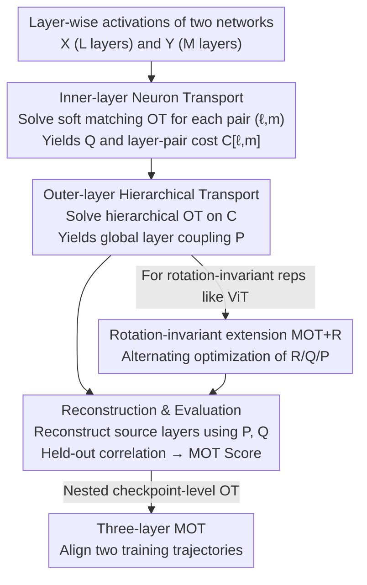

# Representational Alignment Across Model Layers and Brain Regions with Multi-Level Optimal Transport

**Conference**: ICLR 2026  
**OpenReview**: [https://openreview.net/forum?id=xz3hPommuG](https://openreview.net/forum?id=xz3hPommuG)  
**Code**: TBD  
**Area**: Interpretability / Representational Similarity / Optimal Transport  
**Keywords**: Representational Alignment, Optimal Transport, Hierarchical Correspondence, Brain-Model Comparison, Rotation Invariance

## TL;DR
This paper proposes Multi-Level Optimal Transport (MOT), a dual-layer optimal transport framework featuring "inner-layer neuron transport + outer-layer hierarchical transport." It upgrades representational alignment between two networks (or brain regions) from "layer-wise greedy matching" to "globally consistent soft coupling." This approach provides a single network-level alignment score, naturally handles depth inconsistencies, and spontaneously recovers hierarchical structures (e.g., early-to-early and deep-to-deep layer mappings).

## Background & Motivation
**Background**: A core problem in neuroscience and AI is comparing high-dimensional neural representations. Comparing brain responses across individuals reveals shared computations, while comparing internal representations of different models reveals how architectures or objectives shape features and whether "universal representations" exist. The dominant approach is **layer-wise matching**: given a similarity metric $S(\cdot,\cdot)$ (such as RSA, CKA, Procrustes, linear predictability, or Soft Matching), each layer $\ell$ of a source network greedily selects the best-scoring layer $m^*(\ell)=\arg\max_m S(X_\ell, Y_m)$ in the target network.

**Limitations of Prior Work**: This "independent, one-to-one rigid matching" has several structural flaws. First, when networks have different depths ($L\neq M$) or when features of a source layer are distributed across multiple target layers, rigid one-to-one matching fails. Second, matching is **asymmetric**—the correspondences chosen from A to B differ from B to A. Third, it only provides layer-wise scores, lacking a **single global alignment score**. Fourth, independent optimization ignores global activation structures and is prone to overfitting noise in single-layer responses.

**Key Challenge**: The fundamental cause is that greedy layer-wise matching **ignores the global activation structure** and restricts the mapping to rigid one-to-one correspondences. While Optimal Transport (OT)-based Soft Matching relaxes rigid permutations at the neuron level and handles varying widths, it remains limited to **pairwise comparisons between two layers**, failing to capture the global hierarchical structure across networks.

**Goal**: To design an alignment framework that is globally consistent (symmetric, avoids over-weighting certain layers while ignoring others), handles depth inconsistencies, provides a single network-level score, and identifies rotation-equivalent representations.

**Key Insight**: The authors observe that OT is inherently a tool for "allocating mass under marginal constraints," and "distributing representations from one layer across multiple layers" is precisely a form of mass allocation. Thus, alignment can be partitioned into two nested OT levels: inner-layer soft matching of neurons and outer-layer soft coupling of layers.

**Core Idea**: Replace "layer-wise greedy one-to-one matching" with "hierarchical dual-level optimal transport," allowing source layers to soft-allocate representational mass to multiple target layers under marginal constraints. This results in globally consistent, symmetric alignment that handles depth differences.

## Method

### Overall Architecture
Given two networks with $L$ and $M$ layers probed by $T$ stimuli, let the activations be $X_\ell\in\mathbb{R}^{T\times n_\ell}$ and $Y_m\in\mathbb{R}^{T\times n_m}$ (rows are stimuli, columns are units). MOT solves OT at two levels simultaneously: the **inner level** computes a soft transport plan $Q_{\ell m}$ and an alignment cost $C_{\ell m}$ at neuron granularity for every layer pair $(\ell,m)$; these costs form a layer-to-layer cost matrix $C\in\mathbb{R}^{L\times M}$. The **outer level** then solves a hierarchical OT on this matrix to obtain the layer coupling $P$. Using $(P, \{Q_{\ell m}\})$, the source layers are **reconstructed**, and correlations are calculated on held-out data to obtain a single network-level MOT score.

The pipeline follows a serial structure: "Neuron Transport → Hierarchical Transport → Reconstruction Evaluation." The outer OT can also incorporate rotation optimization (MOT+R) or be nested into checkpoint-level OT (three-layer MOT).

### Key Designs

**1. Dual-level Nested Optimal Transport: Solving Neuron and Layer Matching Together**

To address the flaw where greedy matching only looks at two layers and ignores global structure, MOT decomposes alignment into two OT levels. The **inner level** constructs a neuron-wise dissimilarity matrix $C^{\text{inner}}_{\ell m}[i,j]=c(X_\ell[:,i], Y_m[:,j])$ for each layer pair $(\ell,m)$ using correlation distances and solves the soft matching OT:

$$C_{\ell m}=\min_{Q_{\ell m}\in T(n_\ell, n'_m)}\langle C^{\text{inner}}_{\ell m}, Q_{\ell m}\rangle,$$

where $Q_{\ell m}$ indicates the correspondence strength between individual neurons. For equal-width layers, $Q$ degrades to a permutation; for different widths, it naturally provides soft allocation. The **outer level** assembles all inner costs $C_{\ell m}$ into $C\in\mathbb{R}^{L\times M}$ and solves hierarchical OT $P=\arg\min_{P\in T(L,M)}\langle C, P\rangle$, where $P_{\ell m}$ represents the proportion of layer $\ell$ explained by layer $m$.

**2. Mass Conservation under Marginal Constraints: Ensuring Symmetry and Handling Depth**

The transport polytope of the outer OT imposes two conservation constraints:

$$\sum_\ell P_{\ell m}=\tfrac{1}{M},\qquad \sum_m P_{\ell m}=\tfrac{1}{L},\qquad P_{\ell m}\ge 0.$$

Each source layer must allocate 100% of its mass (no information loss), and the total mass received by each target layer is balanced (no over-utilization). This leads to three benefits: the alignment is **symmetric**, every layer **participates meaningfully**, and when $L\neq M$, soft coupling allows "many-to-many" correspondence. For $L=M$, the solution automatically degrades to one-to-one matching due to the properties of linear programming on the constraint polytope. The global score is defined by reconstructing source layers $\hat X_\ell=L\sum_m P_{\ell m} Y_m Q_{\ell m}^\top$ and computing average correlation on held-out data.

**3. Rotation-invariant Extension MOT+R: Identifying Equivalent Representations**

OT methods are typically sensitive to rotation, whereas metrics like RSA/CKA are rotation-invariant. To address this, MOT+R introduces an orthogonal rotation matrix $R_{\ell m}\in O(n_\ell)$ for each layer pair, modifying the inner cost to minimize reconstruction error: $C_{\ell m}=\min_{Q_{\ell m}, R_{\ell m}}\|X_\ell R_{\ell m}-Y_m Q_{\ell m}^\top\|_F^2$. This is solved via **alternating minimization** between $Q$ and $R$. This extension significantly improves alignment quality and interpretability in Vision Transformers (ViT), where representations lack privileged axes and are rotation-invariant.

**4. Three-layer MOT: Aligning Complete Training Trajectories**

MOT is used as a recursive building block. Given two sequences of model checkpoints $c=1,\dots,C_A$ and $d=1,\dots,C_B$, a scalar cost $C^{\text{chkpt}}_{cd}=\text{MOT}(X^{(c)}_\ell; Y^{(d)}_m)$ is computed for every pair. A third OT level $R=\arg\min_{R\in T(C_A,C_B)}\langle C^{\text{chkpt}}, R\rangle$ then finds the soft correspondence across training trajectories.

## Key Experimental Results

Evaluations were conducted on LLMs of different scales, fMRI data from 4 subjects, ViTs, and brain-model comparisons, using "reconstruction correlation" as the primary metric.

### Main Results

LLM Alignment (Reconstruction Correlation, higher is better):

| Model 1 | Model 2 | MOT | Random (Perm-P) | Single-Best OT | Pairwise Best OT |
|---------|---------|------|------|------|------|
| Llama-3.2 1B | Llama-3.2 3B | **0.558** | 0.510 | 0.502 | 0.505 |
| Qwen-2.5 0.5B | Qwen-2.5 3B | **0.510** | 0.494 | 0.467 | 0.477 |
| Qwen-2.5 0.5B | Llama-3.2 3B | **0.531** | 0.513 | 0.498 | 0.524 |

In LLMs, MOT achieved the highest reconstruction correlation and revealed a clear diagonal structure (early-to-early, deep-to-deep layer mappings).

Vision Model Alignment (Standard vs. MOT+R):

| Model 1 | Model 2 | MOT | Pairwise Best OT | MOT+R | Pairwise Best+R |
|---------|---------|------|------|------|------|
| DINOv2 Small | DINOv2 Large | 0.353 | 0.340 | **0.778** | 0.394 |
| ViT-MAE Base | ViT-MAE Huge | 0.149 | 0.417 | **0.788** | 0.571 |

On ViTs, **vanilla MOT was inconsistent**, but MOT+R significantly outperformed all baselines, confirming that ViT representations are rotation-invariant.

### Ablation Study

Ablation on fMRI data (Subject A↔B):

| Configuration | Description | Correlation |
|------|------|------|
| MOT | Full Dual-layer OT | 0.244 |
| Random (Perm-P) | Scrambled outer $P$, kept neuron OT | 0.135 |
| Pairwise Best OT | Standard greedy layer matching | 0.245 |

### Key Findings
- **Hierarchical coupling $P$ is essential**: Scrambling $P$ (Perm-P) caused performance to drop from 0.24 to 0.11–0.14, proving the importance of global structural alignment.
- **MOT's value lies in structure, not just scores**: In brain data, MOT reconstruction scores were similar to pairwise OT, but **only MOT recovered region-to-region correspondences** (e.g., V1 to V1).
- **Natural handling of depth**: When comparing shallow and deep models, MOT revealed how mass from one shallow layer is distributed across several deep layers.
- **Rotation is vital for ViT**: MOT+R significantly improved stability and scores for Vision Transformers compared to vanilla MOT.

## Highlights & Insights
- **Reinterpreting "one-to-many" as "mass allocation"**: This perspective shift makes depth inconsistency a natural outcome of OT constraints rather than a special case.
- **Recursivity of nested OT**: The extension from two to three layers (including checkpoints) demonstrates the framework's flexibility as a "building block."
- **Structure counts even if scores are tied**: The ability to reveal brain region correspondences where baselines fail highlights that the transport plan itself is a valuable output.

## Limitations & Future Work
- **Computational Cost**: Inner OT is $O(n^3 \log n)$, making it expensive for very wide or deep models. MOT+R is even more costly due to alternating optimization.
- **Scope**: Evaluations were limited to certain subsets of models and brain data.
- **Theoretical Gap**: The work measures alignment but does not explain *why* different systems converge to similar representations.

## Related Work & Insights
- **vs. Layer-wise Greedy Matching**: RSA, CKA, and Procrustes are often asymmetric and fail to handle depth differences globally. MOT provides a symmetric, single-score global framework.
- **vs. Soft Matching distance**: While Soft Matching handles unequal widths, it is restricted to pairs of layers. MOT incorporates this into a global hierarchical structure.

## Rating
- Novelty: ⭐⭐⭐⭐⭐ Upgrading alignment to nested OT and unifying depth handling and rotation invariance is a significant conceptual step.
- Experimental Thoroughness: ⭐⭐⭐⭐ Covers various domains (LLM, Vision, Brain), but limited by computational costs for the largest scales.
- Writing Quality: ⭐⭐⭐⭐⭐ Clear motivations and logic.
- Value: ⭐⭐⭐⭐ Provides a more interpretable tool for brain-model comparison and representational studies.

<!-- RELATED:START -->

## Related Papers

- [\[ACL 2026\] Dual Alignment Between Language Model Layers and Human Sentence Processing](../../ACL2026/interpretability/dual_alignment_between_language_model_layers_and_human_sentence_processing.md)
- [\[ICLR 2026\] Partial Soft-Matching Distance for Neural Representational Comparison with Partial Unit Correspondence](partial_soft-matching_distance_for_neural_representational_comparison_with_parti.md)
- [\[ICLR 2026\] Mixture of Cognitive Reasoners: Modular Reasoning with Brain-Like Specialization](mixture_of_cognitive_reasoners_modular_reasoning_with_brain-like_specialization.md)
- [\[ICLR 2026\] Certified Evaluation of Model-Level Explanations for Graph Neural Networks](certified_evaluation_of_model-level_explanations_for_graph_neural_networks.md)
- [\[ICLR 2026\] Diagnosing Generalization Failures from Representational Geometry Markers](diagnosing_generalization_failures_from_representational_geometry_markers.md)

<!-- RELATED:END -->
