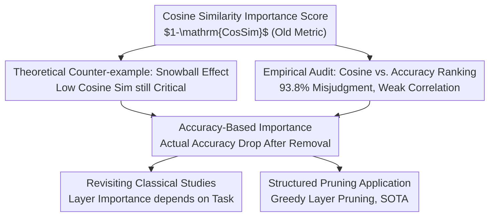

# Rethinking Layer Relevance in Large Language Models Beyond Cosine Similarity

**Conference**: ICLR 2026  
**OpenReview**: [https://openreview.net/forum?id=mRLnS8jQWt](https://openreview.net/forum?id=mRLnS8jQWt)  
**Code**: TBD  
**Area**: Interpretability / Mechanistic Interpretability / LLM Layer Importance / Structured Pruning  
**Keywords**: Layer Importance, Cosine Similarity, Mechanistic Interpretability, Snowball Effect, Accuracy-Driven Pruning

## TL;DR
This paper demonstrates both theoretically and experimentally that "cosine similarity" is not a reliable proxy for measuring the importance of Transformer layers—a layer can have extremely low cosine similarity yet be critical to model performance. The authors advocate for using the "actual drop in model accuracy after removing the layer" as a more faithful measure of layer relevance. This approach revises several interpretability conclusions previously based on cosine similarity and yields superior structured pruning results.

## Background & Motivation
**Background**: Mechanistic interpretability aims to understand "what each layer does and which layers are important" within pretrained LLMs. A widely adopted tool is **cosine similarity**: by comparing the input and output vectors of a specific layer, if the two are nearly identical (cosine similarity close to 1), the layer is considered to have "hardly changed the representation" and is thus deemed "unimportant." Layer importance is specifically defined as $1 - \mathrm{CosineSim}(\text{input}, \text{output})$, averaged across all tokens and samples. Numerous works (Sajjad, He, Men, Gromov, Zhang, etc.) rely on this score for layer analysis and pruning.

**Limitations of Prior Work**: This metric relies on an untested implicit assumption—that "small change to the input" equals "unimportance." The authors challenge this directly. An intuitive counter-example: Layer 16 of OLMo appears "unimportant" by cosine similarity (output varies little from input), yet removing it results in a 66% average accuracy crash across ten datasets, effectively reducing OLMo to random performance on ARC-C. In other words, cosine similarity can **severely misjudge** the true importance of a layer.

**Key Challenge**: Cosine similarity measures "geometric change in the representation space," whereas the true concern is "change in downstream task performance after layer removal." No reliable correspondence exists between the two because of complex inter-layer dependencies: a tiny modification by one layer may be amplified by subsequent layers (the snowball effect), eventually altering the model output entirely. Conversely, a layer might make large changes in "representation dimensions irrelevant to prediction," making it appear "important" via cosine similarity despite contributing nothing to performance.

**Goal**: (1) Strictly prove theoretically that "low cosine similarity $\neq$ low importance"; (2) Quantify how weak the correlation is between cosine similarity and actual performance drops across multiple real-world LLMs; (3) Propose a more faithful alternative metric and verify its ability to correct old conclusions and improve structured pruning.

**Key Insight**: Instead of using a proxy metric, one should **directly measure the core objective**—the actual drop in model accuracy on a task after a layer is removed. Although this requires layer-by-layer removal and repeated evaluation (computationally expensive), it inherently captures inter-layer dependencies.

**Core Idea**: Replace "input-output cosine similarity" with "actual accuracy drop caused by layer removal" (accuracy-based relevance) as the gold standard for measuring layer importance.

## Method
The paper does not propose a new model but rather a new **measurement and evaluation paradigm**: debunking the old metric (cosine similarity), establishing a new one (accuracy-driven importance), and using the new metric to redo classical experiments and implement pruning. The logic is divided into "why the old metric fails," "how the new metric is defined," and "how it yields different conclusions."

### Overall Architecture
The logical chain of the work is: **Define old metric $\rightarrow$ Construct counter-examples proving failure $\rightarrow$ Empirically audit unreliability in real models $\rightarrow$ Propose new metric $\rightarrow$ Redo classical interpretability studies $\rightarrow$ Apply new metric to structured pruning**. This follows a "deconstruct, reconstruct, and verify" argumentative structure rather than a serial data pipeline, as illustrated below.

### Key Designs

**1. Snowball Effect: Proving "Low Cosine Similarity can be Performance-Critical" via a Constructible Transformer**

This is the theoretical foundation addressing the pain point that "low cosine similarity implies unimportance." The authors prove **Theorem 1**: For any dataset $D$ and any $\epsilon>0$, a decoder-only Transformer with $L\ge 3$ layers can be constructed such that there exists an intermediate layer $l$ whose cosine similarity score equals $\epsilon$ (making it the most "irrelevant" layer), yet the model achieves a perfect score on $D$, while removing layer $l$ drops accuracy to zero. Essentially, the "most prunable" layer is actually the most indispensable.

The construction relies on two mechanisms. First, the **snowball effect**: the target layer applies a microscopic perturbation to the input vector (resulting in cosine similarity near 1), which is amplified by subsequent layers until it dominates the output—small input, large consequence. Second, the **existence of prediction-irrelevant embedding dimensions**: since model predictions only depend on certain dimensions, other layers can extensively rewrite representations in "irrelevant dimensions," inflating their cosine similarity scores to appear "important" while contributing nothing to performance. Their combination creates a worst-case scenario where cosine similarity ranking is the inverse of true importance. Such phenomena occur naturally in pretrained LLMs, particularly in task-specific settings—OLMo's Layer 16 is a real-world example of the snowball effect.

**2. Empirical Audit: Quantifying Unreliability in Three Real LLMs**

While theory speaks to "worst-case scenarios," this design answers "how bad it is in reality." The authors calculated cosine similarity scores and measured actual accuracy drops for every layer across three models (Pythia, Mistral, OLMo) and ten datasets (C4, CodeAlpaca, LIMA, MathInstruct, BoolQ, ARC-C/E, HellaSwag, PIQA, Winogrande).

The findings show that correlations are weak and model-dependent: moderate for Pythia ($R=-0.46$), weak for Mistral ($R=-0.23$), and extremely weak for OLMo ($R=-0.15$). More direct evidence comes from the **ranking confusion matrix**: comparing the "j-th least important" rank by cosine similarity with the "i-th least important" rank by actual drop. Cosine similarity misjudged relative layer importance in **93.8%** of cases; even focusing only on major misjudgments, **53.6%** were still incorrect. This elevates the status of "cosine similarity as a noisy proxy" from an anecdote to a statistical fact, warning that interpretability work relying on it may reach erroneous conclusions.

**3. Accuracy-Based Relevance Score: Directly Measuring the Core Objective**

Defining the new metric. Given dataset $D$ and an $L$-layer model $f^L$, the importance of layer $l$ is defined as:

$$\mathrm{AccBasedRelevance}(f^L, l, D) = 1 - \frac{\max(\mathrm{Accuracy}(f^L_{-l}, D) - r(D),\, 0)}{\max(\mathrm{Accuracy}(f^L, D) - r(D),\, 0)},$$

where $f^L_{-l}$ is the model without layer $l$, and $r(D)$ is the expected accuracy of a random predictor on the dataset (used for normalization by subtracting "guessing" scores). The score ranges from $-\infty$ to $+1$: **positive values indicate importance (performance drops after removal)**, zero indicates no change, and **negative values indicate the layer is harmful (performance improves after removal)**. Note this range is only meaningful if the total model performs better than random.

The advantage is that it directly uses the "actual accuracy drop," bypassing geometric proxy flaws and naturally incorporating inter-layer dependencies (snowball effects and irrelevant dimensions are reflected in the final accuracy). The cost is calculation—cosine similarity requires $T$ forward passes (where $T$ is the number of calibration samples), while this metric requires $N\times T$ passes (where $N$ is the number of layers). This score can be applied to any component (weights, heads, MLPs, blocks), though this paper focuses on Transformer blocks.

### A Complete Example
Consider the classical conclusion by Gromov et al.: "deeper layers are more indispensable for reasoning tasks but less important for fact retrieval." Using cosine similarity-based pruning on LLaMA 2-70B, they observed that as the pruning ratio increased, MMLU (knowledge) remained stable while GSM8K and HellaSwag (reasoning) dropped immediately, leading to the inference that "reasoning tasks require all layers."

The authors revisited this on LLaMA 3-8B using the accuracy-driven metric: layers were ranked by "actual accuracy drop on the training set" and pruned accordingly. A different picture emerged—using the more informative metric, HellaSwag maintained strong performance even after removing several blocks, and GSM8K barely dropped after removing two blocks. In other words, it is possible to "remove 22% of layers while maintaining over 75% accuracy," challenging the conclusion that reasoning requires every layer. The root cause is that cosine similarity underestimates certain blocks critical for reasoning (causing the sharp drop in original studies when they were pruned too early) and fails to distinguish which layers are truly irrelevant to reasoning.

## Key Experimental Results

### Main Results: Task-Specific Structured Pruning (LLaMA3-8B, 25% Removal)
Each method used the corresponding task's training set for calibration, removed 25% of the model, and evaluated on the test set. The accuracy-driven metric (Ours) outperformed all baselines in nearly all tasks, with average scores approaching the unpruned original model.

| Method | ARC-C | ARC-E | BoolQ | HS | OBQA | PIQA | WG | MMLU | Average |
|------|-------|-------|-------|-----|------|------|-----|------|------|
| Original (Unpruned) | 53.16 | 81.02 | 82.02 | 78.94 | 44.8 | 81.28 | 73.56 | 65.11 | 69.99 |
| Taylor | 31.48 | 67.97 | 61.31 | 62.73 | 38.4 | 76.55 | 55.64 | 25.03 | 52.39 |
| Cosine Similarity | 45.73 | 67.8 | 66.33 | 69.52 | 38.6 | 72.91 | 71.35 | 44.05 | 59.54 |
| Perplexity | 38.14 | 53.11 | 62.14 | 58.92 | 38.4 | 67.19 | 62.12 | 59.04 | 54.88 |
| Slice-GPT | 41.64 | 73.27 | 75.75 | 67.35 | 39.6 | 77.15 | 70.56 | 48.74 | 61.76 |
| **Accuracy (Ours)** | **49.57** | **74.96** | **84.04** | **71.53** | **44** | **79.06** | **73.8** | **62.97** | **67.49** |

Notably, on tasks like BoolQ and WG, accuracy after pruning was **slightly higher than the original model**, as harmful or irrelevant layers for those specific tasks were removed.

### Task-Agnostic Pruning and Calibration Sensitivity (LLaMA3-8B, 25% Removal)
In task-agnostic settings, the model is pruned once for use across all tasks. Using a calibration set mixed from 10% of training data from eight benchmarks, Ours achieved the highest average (65.04). However, restricting the calibration set to a single benchmark caused significant performance swings, whereas cosine similarity remained stable at ~60% regardless of the calibration set.

| Configuration | Average Score | Description |
|------|--------|------|
| Original | 69.99 | Unpruned |
| Cosine Similarity | 60.1 | Stable but low, insensitive to calibration set |
| **Accuracy (Ours, 10% Mixed)** | **65.04** | Optimal with diverse calibration data |
| Accuracy (ARC-E Calibration) | 63.18 | Generalizes well even with single-task calibration |
| Accuracy (C4 Calibration) | 50.23 | Severe degradation with wrong calibration set |

### Key Findings
- **93.8% Misjudgment Rate for Cosine Similarity**: The most impactful figure, proving that cosine similarity's unreliability is a statistical reality. Even major misjudgments occurred 53.6% of the time.
- **Layer Importance is Highly Task-Dependent**: Using z-score normalized accuracy-driven metrics, the variance of blocks across datasets was significantly higher than with cosine similarity (significant via Wilcoxon test). For example, removing OLMo block 14 dropped accuracy by ~41% on MathInstruct but only ~1% on CodeAlpaca. This refutes the view that layer importance is task-independent.
- **Computational Cost is the Main Weakness**: Pruning 25% of LLaMA3-8B takes minutes with cosine similarity but ~4.6 hours with this method (comparable to Taylor or output-based baselines but with better results). Pruning 50% of LLaMA3-70B is estimated to take 1.1–8.5 days on two H100s.
- **Greedy Pruning is Sub-optimal**: The current layer-by-layer greedy approach (calculate importance $\rightarrow$ remove least important $\rightarrow$ recalculate) is not globally optimal. Finding the optimal combination theoretically requires backtraceable search (like A*), which remains too costly.

## Highlights & Insights
- **Caution on "Metrics Defining Conclusions"**: The "aha" moment is that many conclusions regarding Transformer mechanics (layer importance, reasoning vs. fact dependencies) are actually artifacts of the chosen metric. Switching to a more faithful metric can reverse these conclusions, warning researchers to audit their measures first.
- **Dual Attack (Theory + Empirical)**: The paper doesn't just provide a theoretical counter-example (Theorem 1's snowball effect); it quantifies the failure rate in three real models, proving that worst-case scenarios manifest in reality.
- **Simple yet SOTA Pruning**: The accuracy-driven approach is conceptually naive (remove layer, measure accuracy), yet it outperforms complex proxies like Taylor expansion, Perplexity, or Slice-GPT, proving that "directly optimizing the true goal" often beats sophisticated proxies.
- **Transferable Insight**: The idea of defining importance by downstream performance drop rather than geometric representation change can be extended to any granularity (heads, MLPs, neurons), providing a more reliable tool for mechanistic interpretability.

## Limitations & Future Work
- **High Computational Cost**: The $N\times T$ forward passes make it difficult to apply to ultra-large models; accelerating the calculation of accuracy-based relevance is a key future direction.
- **Greedy Sub-Optimality**: Greedy pruning cannot guarantee the optimal layer combination; search algorithms with backtracking are needed but currently computationally infeasible.
- **Calibration Sensitivity**: In task-agnostic settings, results depend heavily on calibration data (e.g., C4 calibration led to 50.23). The characteristics of a good task-agnostic calibration set remain unclear.
- **Lower Bound Issue**: The score is undefined when the model performs worse than a random baseline, making it inapplicable to very weak models or extremely difficult tasks.

## Related Work & Insights
- **vs. Cosine Similarity (Local Metric)**: He, Men, Gromov, etc., use $1-\mathrm{CosSim}$ to see if layers "change representations." This work proves weak correlation with actual performance and a 93.8% misjudgment rate.
- **vs. Consistency-Based Global Metrics** (Sieberling, Zhang, etc.): These look at output distribution shifts. While they capture change, they focus on invariance rather than prediction accuracy, potentially missing layers with subtle performance impacts.
- **vs. Performance-Based Global Metrics** (Taylor approximation / Perplexity, Ma, Kim, Zhong, etc.): These are closest in motivation. However, experimental results show that the accuracy-driven score consistently outperforms them in structured pruning.
- **Insight**: This work effectively places a question mark over a large body of interpretability conclusions based on cosine similarity. Future work can use accuracy-based relevance to re-examine "functional attribution of specific layers/heads," potentially discovering new conclusions.

## Rating
- Novelty: ⭐⭐⭐⭐⭐ First work to systematically debunk cosine similarity via both theory and empirical evidence and provide a viable alternative.
- Experimental Thoroughness: ⭐⭐⭐⭐ Covers 3 models, 10 datasets, 2 classical study replications, and 8 benchmark pruning comparisons, though ultra-large models are only estimated.
- Writing Quality: ⭐⭐⭐⭐⭐ Clear argumentative chain (deconstruct $\rightarrow$ reconstruct $\rightarrow$ verify); theoretical counter-examples and statistical evidence reinforce each other.
- Value: ⭐⭐⭐⭐⭐ Corrects mechanistic interpretability methodologies and delivers superior structured pruning.

<!-- RELATED:START -->

## Related Papers

- [\[ICLR 2026\] Beyond Linear Probes: Dynamic Safety Monitoring for Language Models](beyond_linear_probes_dynamic_safety_monitoring_for_language_models.md)
- [\[ICLR 2026\] Medical Interpretability and Knowledge Maps of Large Language Models](medical_interpretability_and_knowledge_maps_of_large_language_models.md)
- [\[ICLR 2026\] Spilled Energy in Large Language Models](spilled_energy_in_large_language_models.md)
- [\[ICLR 2026\] What Do Large Language Models Know About Opinions?](what_do_large_language_models_know_about_opinions.md)
- [\[ICLR 2026\] Precise and Interpretable Editing of Code Knowledge in Large Language Models](precise_and_interpretable_editing_of_code_knowledge_in_large_language_models.md)

<!-- RELATED:END -->
