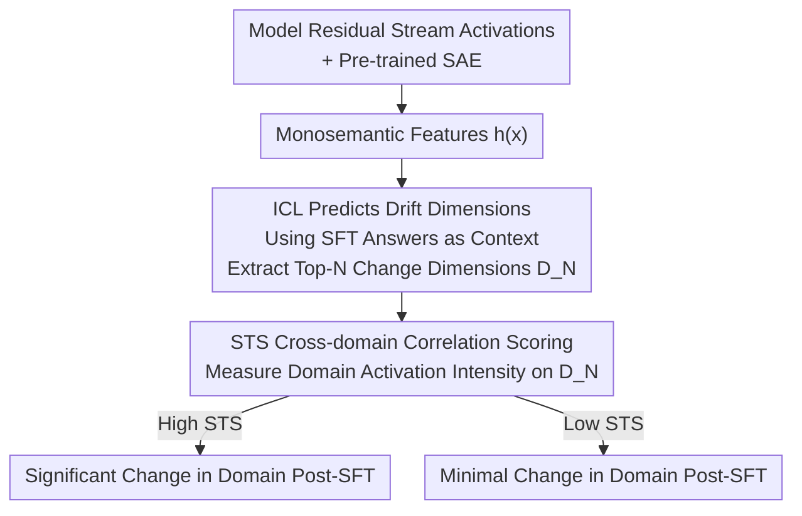

# SAE as a Crystal Ball: Interpretable Features Predict Cross-domain Transferability of LLMs without Training

**Conference**: ICLR 2026  
**OpenReview**: [https://openreview.net/forum?id=KQYnfeBNjl](https://openreview.net/forum?id=KQYnfeBNjl)  
**Code**: https://github.com/PKU-ML/STS  
**Area**: Interpretability / Post-training Analysis  
**Keywords**: Sparse Autoencoders, Monosemantic Features, Post-training Transferability, Supervised Fine-tuning, In-context Learning

## TL;DR
This paper proposes STS (SAE-based Transferability Score): it predicts which Sparse Autoencoder (SAE) dimensions will be modified by Supervised Fine-Tuning (SFT) using In-Context Learning (ICL) **without fine-tuning**, and then measures the relevance of these dimensions to various downstream domains to predict performance changes prior to training, achieving Pearson correlation coefficients generally exceeding 0.7.

## Background & Motivation
**Background**: To exert power in specific tasks, pre-trained large models must undergo post-training, primarily Supervised Fine-Tuning (SFT) and Reinforcement Learning (RL). Post-training aligns general models to specific tasks and objectives, serving as a critical step from general capability to specialized expertise.

**Limitations of Prior Work**: Post-training has a well-known side effect: performance gains in target tasks often come at the expense of performance in other domains (e.g., strengthening mathematical reasoning may degrade robustness or other capabilities). However, there is currently no way to predict **in advance** "which domains will benefit, which will degrade, and by how much." Existing research is almost entirely post-hoc: analyzing transfer effects after the model is trained, which has limited practical value as computational resources have already been expended.

**Key Challenge**: How internal model features correlate and transfer during post-training remains a black box. In the raw activation space, features are highly **polysemantic and entangled** (one capability is scattered across many dimensions, and one dimension mixes multiple concepts), making it impossible to see exactly "what SFT modified," thus preventing prediction.

**Goal**: To establish a method for predicting cross-domain transferability **without actual fine-tuning** that is also interpretable—explaining *why* a specific domain is affected.

**Key Insight**: The authors leverage **monosemanticity** provided by Sparse Autoencoders (SAEs), where each dimension in the SAE encoding is activated only by a specific natural concept (e.g., a mathematical definition or a linguistic pattern). A key observation is that SFT only modifies a **small subset** of dimensions in the SAE representation (the top 100 dimensions account for 25% of the total change), and these dimensions correspond precisely to the capabilities being trained (zeroing these dimensions causes mathematical capability to collapse, while zeroing random dimensions has almost no effect).

**Core Idea**: Since SFT only modifies a few interpretable dimensions, one can "identify these modified dimensions and measure their relevance to downstream domains" to predict transferity. The identification can be replaced by ICL before training, as the dimensions modified by ICL and SFT overlap significantly.

## Method

### Overall Architecture
STS decomposes "predicting post-training transferability" into two steps, **without touching the fine-tuned model**, making it a pure prediction rather than a post-hoc analysis. The input consists of an SFT training set (e.g., mathematical data LIMO) and several downstream domain datasets to be evaluated (e.g., MMLU-Pro sub-domains like engineering, physics, or law); the output is a scalar score, STS, for each domain, where higher scores represent larger performance changes after SFT.

The pipeline is: first, feed the residual stream activations of a model layer into a pre-trained SAE to obtain monosemantic features. The first step uses ICL (using SFT ground truth as context examples) to identify the Top-N dimensions that "will be modified by SFT." The second step measures how strongly a downstream domain's data activates or modulates these dimensions to obtain the domain's STS score. Finally, the scores are correlated with actual performance changes to verify prediction reliability.

### Key Designs

**1. Predicting SFT Drift Dimensions via ICL: Transforming Post-hoc into Prediction**

Predicting transferability requires knowing which dimensions SFT will modify, but conventional methods require comparing features before and after training. The authors utilize the known phenomenon that ICL and SFT achieve similar effects and behaviors in LLMs. They feed the ground truth used for SFT (e.g., LIMO's chain-of-thought) as ICL context to the **un-tuned** model and compare the change in SAE features with and without context, selecting the N dimensions with the largest changes as predicted drift dimensions:

$$D_N = \text{Top}_N\left(\mathbb{E}_{x_i}\lVert h_j(x_i;\Theta) - h_j(x_0,y_0,\cdots,x_t,y_t,x_i;\Theta)\rVert^2\right)$$

Where $h_j$ is the $j$-th dimension of the SAE feature and $\Theta$ represents the pre-trained model parameters. Experiments show this prediction is accurate: the Top-100 dimensions predicted by ICL have a 57% overlap with the actual SFT drift Top-100 for code tasks (62%) and health tasks (57%). This step is the foundation for the "training-free" nature of the method.

**2. SAE Monosemantic Space as a Necessary Condition: Raw Dimensions Fail**

Why use SAEs? In the raw activation space, features are polysemantic and entangled; SFT's influence is **uniformly** spread across many dimensions, making it impossible to select a "critical few." Repeating the selection process on raw features reveals two issues: the drift distribution of raw dimensions is far flatter than SAE (Figure 2b), and the overlap between ICL and SFT drift dimensions drops significantly (Figure 2a). In other words, monosemanticity provided by SAEs allows the "drift concentrated in few dimensions" phenomenon to emerge, enabling the method.

**3. STS Score: Measuring Domain Relevance on Drift Dimensions with Two Estimations**

After obtaining the drift dimension set $D_N$, the correlation between "a downstream domain and these dimensions" must be quantified. Higher correlation implies a greater impact from SFT. The authors provide two scoring methods. The first looks directly at the average activation of domain data on these dimensions:

$$\text{STS}_{\text{act}}(\tilde{T}) = \mathbb{E}_{\tilde{x}_i}\sum_{j\in D_N} h_j(\tilde{x}_i;\Theta)$$

The second leverages ICL again: using real Q&A pairs within the domain as context, it compares the feature changes on drift dimensions with and without domain examples to isolate the modulation intensity of domain knowledge:

$$\text{STS}_{\text{ICL}}(\tilde{T}) = \mathbb{E}_{\tilde{x}_i}\sum_{j\in D_N}\lVert h_j(\tilde{x}_0,\tilde{y}_0,\cdots,\tilde{x}_m,\tilde{y}_m,\tilde{x}_i;\Theta) - h_j(\tilde{x}_i;\Theta)\rVert^2$$

Experiments show $\text{STS}_{\text{ICL}}$ is more stable than $\text{STS}_{\text{act}}$ (correlation coefficient consistently above 0.75), as ICL actively injects signals into the representation, reflecting true relevance better than static activations.

### A Complete Example
Using Qwen2.5-7B-Instruct fine-tuned on LIMO math data and evaluating its transfer to MMLU-Pro: ① Use two LIMO CoT examples as ICL context to find the Top-100 dimensions $D_N$ in the 25th layer SAE features (these dimensions correspond to "mathematical reasoning"); ② For an MMLU-Pro domain (e.g., engineering), calculate $\text{STS}_{\text{ICL}}$ using 5 CoT examples from that domain; ③ Engineering shows high STS → predict large change after SFT; law shows low STS → predict minimal change. Post-hoc verification shows the actual performance change ranking aligns closely with the STS ranking ($\rho=0.90$ for $\text{STS}_{\text{act}}$ on Qwen).

## Key Experimental Results

### Main Results
Pearson correlation $\rho$ between STS and actual performance changes across MMLU-Pro domains after fine-tuning on LIMO (817 high-quality math samples):

| Model | $\text{STS}_{\text{act}}$ | $\text{STS}_{\text{ICL}}$ |
|------|------|------|
| Llama3-8B-Instruct | 0.71 ± 0.01 | 0.81 ± 0.01 |
| Qwen2.5-7B-Instruct | 0.90 ± 0.02 | 0.78 ± 0.01 |
| Gemma2-9B-Instruct | 0.60 ± 0.03 | 0.77 ± 0.01 |

Further validation across training domains (Qwen2.5-7B-Instruct, $\text{STS}_{\text{ICL}}$):

| Training Domain | Correlation (STS vs. Performance) | Top-100 Predicted/Actual Overlap |
|----------|------|------|
| Code | 0.77 ± 0.01 | 62 |
| Health | 0.71 ± 0.02 | 57 |

### Ablation Study

| Configuration | Key Metric Trend | Description |
|------|---------|------|
| Full (SAE Monosemantic Features) | Highest Correlation | Complete method |
| SAE Hidden Dim 16k → 131k | Significant Decrease | Weaker monosemanticity leads to worse prediction |
| Selecting Low-Drift Dimensions | Decrease In Correlation | Noise introduced by non-impacted dimensions |
| Raw Activation / SAE Activation Probing | Nearly Zero Correlation | Probing without selecting drift dimensions fails |
| Different Layers (15/20/25) | Stable Correlation | Robust across layers |

### Key Findings
- **Drift is Highly Concentrated**: SFT modifies only a few SAE dimensions; the Top-100 dimensions account for 25% of total change. Zeroing these dimensions collapses math capability, while zeroing random ones has no effect.
- **Monosemanticity is Critical**: Prediction accuracy drops when increasing SAE hidden dimensions from 16k to 131k (reducing monosemanticity); higher sparsity (stronger monosemanticity) yields better predictions.
- **STS Beats Probes**: Training an optimized probe on raw or SAE activations to predict performance changes yields almost no meaningful correlation; identifying SFT drift dimensions is essential.
- **Data Mixing Application**: Allocating additional training data based on STS proportions balances domains like engineering (large drops) and law (minimal change), improving overall outcomes.

## Highlights & Insights
- **ICL as an SFT "Crystal Ball"**: The core trick is predicting "drift dimensions visible only after training" using training-free ICL. An overlap of 57%~62% in Top-100 dimensions is sufficient to support 0.7+ transfer prediction—shifting post-hoc analysis to pre-training prediction.
- **Practical Value of Monosemanticity**: While previous SAE work focused on "understanding what concepts a dimension represents," this work converts monosemanticity into an actionable metric for post-training data mixing.
- **Transferable Methodology**: The two-step process of "locating a few key modified dimensions, then measuring their target relevance" can be generalized to predict impacts of other post-training interventions (e.g., pruning, model editing, different alignment methods).

## Limitations & Future Work
- **Failure on RL**: Directly applying STS to RL (GRPO training Qwen on Math-LightEval) yields low correlation. The root cause is the lack of ground-truth answers in RL, making it difficult to select appropriate ICL examples for drift estimation. If replaced with **actual** post-RL drift dimensions, STS correlation becomes strong. The bottleneck is predicting RL drift dimensions before training.
- **Dependency on Existing SAEs**: The method requires a pre-trained SAE with sufficient monosemanticity for the target model. SAE quality (width, sparsity, layer) directly determines prediction accuracy.
- **Scope of Evaluation**: Experiments focus on MMLU-Pro sub-domains and math/code/health training domains; generalization across more diverse capability combinations and larger models requires further validation.
- **Predicting Magnitude vs. Direction**: STS measures the **absolute magnitude** of performance change. Further refinement is needed to distinguish the direction (gain vs. loss) and quantify exact numeric changes.

## Related Work & Insights
- **vs. Post-hoc Studies on Transferability (Huan et al. 2025 / Chu et al. 2025)**: These studies analyze capacity transfer or SFT/RL generalization differences after training. This work differs by providing **pre-training prediction**, which is more practical.
- **vs. Probing**: Probing raw or SAE activations directly to predict performance change is largely ineffective. This work proves the intermediate step of "identifying SFT drift dimensions" is indispensable.
- **vs. Standard SAE Interpretability (Cunningham et al. 2023 / Gao et al. 2024)**: While those established the foundation of monosemanticity, this work advances it from "explaining single features" to "predicting transfer + guiding data mixing."

## Rating
- Novelty: ⭐⭐⭐⭐⭐ Using ICL to predict SFT drift dimensions for transferability prediction is a novel perspective for SAE utility.
- Experimental Thoroughness: ⭐⭐⭐⭐ Solid validation across three models, multiple training domains, and data mixing applications; however, RL remains under-explored.
- Writing Quality: ⭐⭐⭐⭐ Clear logical chain (phenomenon → prediction → scoring → application).
- Value: ⭐⭐⭐⭐ Provides an interpretable, training-free tool for post-training data allocation with high practical potential.

<!-- RELATED:START -->

## Related Papers

- [\[ICLR 2026\] Evaluating SAE Interpretability Without Generating Explanations](evaluating_sae_interpretability_without_generating_explanations.md)
- [\[ICLR 2026\] Understanding Cross-Layer Contributions to Mixture-of-Experts Routing in LLMs](understanding_cross-layer_contributions_to_mixture-of-experts_routing_in_llms.md)
- [\[ICLR 2026\] Cross-Modal Redundancy and the Geometry of Vision-Language Embeddings](cross-modal_redundancy_and_the_geometry_of_vision-language_embeddings.md)
- [\[ICLR 2026\] ZeroTuning: Unlocking the Initial Token's Power to Enhance Large Language Models Without Training](zerotuning_unlocking_the_initial_tokens_power_to_enhance_large_language_models_w.md)
- [\[ICLR 2026\] Persona Features Control Emergent Misalignment](persona_features_control_emergent_misalignment.md)

<!-- RELATED:END -->
