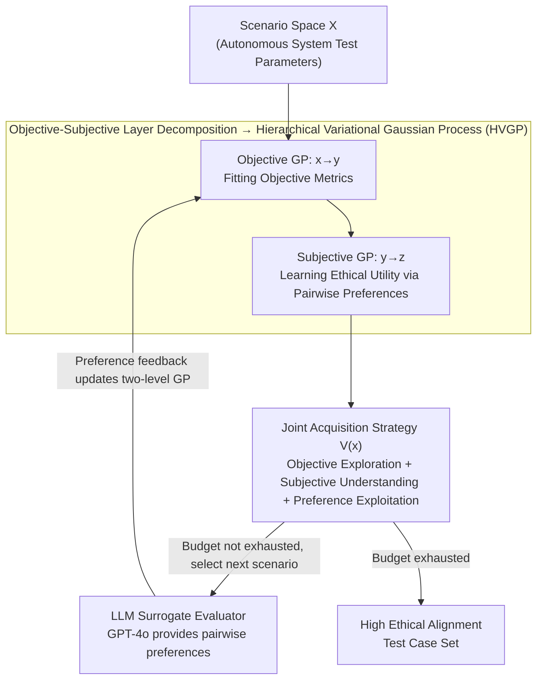

# SEED-SET: Scalable Evolving Experimental Design for System-level Ethical Testing

## Basic Information

- **Conference**: ICLR 2026
- **arXiv**: [2603.01630](https://arxiv.org/abs/2603.01630)
- **Code**: [Project Page](https://anjaliparashar.github.io/seed-site/)
- **Area**: AI Safety / Autonomous Systems Evaluation
- **Keywords**: Ethical Testing, Bayesian Experimental Design, Gaussian Process, LLM Evaluator, Autonomous Systems

## TL;DR

The SEED-SET framework is proposed to model the ethical evaluation of autonomous systems as a hierarchical Bayesian experimental design problem. By integrating objective metrics and subjective value judgments, it efficiently generates test cases with high ethical alignment under a limited budget.

## Background & Motivation

### Problem Background
The increasing deployment of autonomous systems (UAVs, power grid allocation, etc.) in high-risk domains makes ethical alignment evaluation critical. However, ethical evaluation faces three major challenges:

**Measurement Difficulty**: Ethical behaviors (fairness, social acceptance) lack ground-truth labels;

**Subjective Dependence**: Value alignment varies by stakeholder and evolves over time; static benchmarks require constant revision;

**Costly Evaluation**: Evaluation of real-world systems is budget-constrained, making large-scale human feedback collection infeasible.

### Limitations of Prior Work
- Rule-based ethical benchmarks rely on established guidelines and lack specificity;
- Methods based on RL/RLHF assume sufficient simulation or expert annotation, requiring large sample sizes;
- Preference-based methods and large-scale human studies focus only on a single dimension.

### Mechanism
Objective metrics (e.g., fire loss, power grid costs) and subjective preferences (stakeholder ethical judgments) are modeled simultaneously. Test scenarios are efficiently generated using hierarchical Gaussian Processes and Bayesian experimental design.

## Method

### Overall Architecture

SEED-SET addresses the problem of "how to automatically generate test scenarios that best expose ethical alignment issues for an autonomous system (UAV, power grid scheduling, etc.) without ground-truth ethical labels under a finite budget." It decomposes this ambiguous problem into a closed loop: first, a Hierarchical Variational Gaussian Process (HVGP) splits the ethical compliance function into "objective metrics" and "subjective preferences" layers, fitting surrogate models for each. Then, a joint acquisition function, which balances exploration and exploitation in a single expression, selects the next most valuable scenario from the scenario space. An LLM acts as a stakeholder to provide pairwise preference judgments between the chosen scenario and the current best scenario. The resulting preference feedback is used to update the two-level Gaussian Processes. This loop iterates until the evaluation budget is exhausted, gradually evolving a set of test cases with high ethical alignment.

### Key Designs

**1. Objective-Subjective Two-Layer Decomposition: Anchoring Ground-Truth-Free Ethical Judgments to Observable Behaviors**

Ethical behavior itself has no ground-truth; learning an end-to-end mapping $f(x)\to z$ directly is neither interpretable nor sample-efficient. SEED-SET decomposes the ethical compliance function of a black-box system $\mathcal{S}_\pi$ over scenario space $\mathcal{X}$ into two layers: the objective layer $f_{\text{obj}}:\mathcal{X}\to\mathcal{Y}$ maps scenario parameters to measurable metrics (fire loss, grid cost, resilience, etc.), and the subjective layer $f_{\text{subj}}:\mathcal{Y}\to\mathbb{R}$ derives ethical utility scores from these observable metrics. Consequently, ethical preferences are always grounded in "what the system actually did," achieving interpretability and compressing the required number of evaluations by leveraging the dependency of subjective utility on objective metrics.

**2. Hierarchical Variational Gaussian Process (HVGP): Employing Two-Stage VGPs to Model Dual-Level Mappings**

Corresponding to the above decomposition, HVGP links two Variational Gaussian Processes to implement the two-layer mapping as a learnable model. The Objective GP learns the surrogate model $g:x\to y$ to predict objective metrics, with a posterior of the form $p(f(x)\mid\mathcal{D})=\mathcal{N}(\mu(x),k(x,x'))$. The Subjective GP learns the preference model $h:y\to z$, mapping objective metrics to subjective scores. Since absolute ground-truth for subjective scores is unavailable, this stage is trained using pairwise preferences—an oracle $\mathcal{T}:(y,y')\to\{1,2\}$ only needs to compare which of two scenarios is better, converting "inability to score" into "ability to compare," thus making the Subjective GP learnable without explicit labels.

**3. Joint Acquisition Strategy: A Single Expression Driving Objective Exploration, Subjective Understanding, and Preference Exploitation**

Given a limited testing budget, the most valuable scenarios must be selected at each step. The acquisition function designed for SEED-SET integrates three requirements into one formula:

$$
V(x) = \underbrace{I(g_x; y\mid\mathcal{D})}_{\text{Objective Information Gain}} + \mathbb{E}_{q_\phi(y\mid x)}\left[\underbrace{I(h_y; z\mid\mathcal{D})}_{\text{Subjective Information Gain}} + \underbrace{\mathbb{E}_{q_\psi(h_y)}[h_y]}_{\text{Preference Exploitation}}\right]
$$

The first term is the Objective Information Gain, reducing uncertainty in the objective metric space and encouraging the testing of unseen scenarios. The second term is the Subjective Information Gain, improving the estimation of the subjective utility function to help the model "understand" preferences. The third term is Preference Exploitation, pushing sampling toward regions with known high ethical utility to capitalize on learned preferences. All three are essential—exploration alone wastes budget on irrelevant regions, while exploitation alone leads to premature convergence. Integrating them allows for continuous approximation of optimal test cases while covering the design space.

**4. LLM Surrogate Evaluator: Replacing Costly Human Preference Annotation with GPT-4o**

Collecting large-scale human feedback for real systems is expensive. SEED-SET uses GPT-4o as a stakeholder proxy to complete pairwise preference evaluations, closing the feedback loop. The prompt consists of three parts: a task description providing domain context, objective metrics showing measurable outcomes of the two scenarios being compared, and subjective criteria encoding the stakeholder's ethical preferences in natural language. By simply replacing the subjective criteria in the prompt, the system can quickly adapt to different ethical standards or stakeholders without retraining.

### A Complete Example: One Iteration of Firefighting UAVs

Taking a firefighting rescue UAV as an example: data $\mathcal{D}$ from a small number of test scenarios is already available. The Objective GP can roughly predict objective metrics $y$ (e.g., fire loss, coverage) for each candidate scenario, and the Subjective GP provides the corresponding ethical utility $z$. In this iteration, the joint acquisition function $V(x)$ scores each candidate in the scenario space—biasing toward regions with high GP posterior variance that haven't been tested (exploration) and regions with high estimated ethical utility (exploitation)—to select the highest-scoring new scenario. This new scenario and the current best scenario are presented to GPT-4o, which judges which is more ethical based on the subjective criteria. This pairwise preference result is added to $\mathcal{D}$, updating both GP levels. $V(x)$ shifts in the next round, and the selected scenarios evolve. When the budget is exhausted, the evolved scenarios constitute the test case set with high ethical alignment; ablations show that the ratio of optimal tests generated is approximately 2x that of random sampling.

## Main Results

### Case Study 1: Power Grid Resource Allocation (IEEE 5/30-Bus)

| Method | 5-Bus Preference Score (↑) | 30-Bus Preference Score (↑) |
|------|-------------------|-------------------|
| Random | Low | Low |
| Single GP | Medium | Failed |
| VS-AL-1 | Failed | Failed |
| VS-AL-2 | Failed | Failed |
| **HVGP (Ours)** | **Highest** | **Highest** |

### Case Study 2: Firefighting Rescue (UAV Navigation)

| Method | Preference Score (↑) | Coverage (↑) |
|------|-------------|-----------|
| Random | Low | Low |
| Single GP | Medium | Medium |
| HVGP (MI1+MI2 Exploration only) | Medium-High | Medium-High |
| HVGP (Pref Exploitation only) | High | Medium |
| **HVGP (Full Acquisition)** | **Highest** | **Highest** |

### Ablation Study: Acquisition Strategy Components

| Acquisition Strategy | Optimal Test Generation Ratio (↑) | Space Coverage (↑) |
|---------|-------------------|------------|
| Random Sampling | 1× | 1× |
| MI1+MI2 Only | 1.4× | 1.1× |
| Pref Only | 1.6× | 0.9× |
| **Full V(x)** | **2×** | **1.25×** |

### Key Findings

1. **SEED-SET generates twice as many optimal test cases as the baseline**, with search space coverage increased by 1.25x.
2. **Significant advantage in high-dimensional scenarios**: In the 30-Bus case (40-dimensional design space), Single GP fails completely, while HVGP remains efficient.
3. **Hierarchical modeling is critical**: Decomposing $f$ into $f_{\text{obj}} + f_{\text{subj}}$ is more accurate than direct modeling of $f(x) \to z$.
4. **All three acquisition terms are necessary**: Removing any term leads to a performance drop.
5. **LLM surrogates are reliable**: TrueSkill scores verify that GPT-4o's preference judgments align with manual preference function trends.
6. **Adaptable to different stakeholders**: Changing the subjective criteria in the prompt allows rapid adaptation to different ethical standards.

## Highlights & Insights

- First framework for ethical testing of autonomous systems to simultaneously consider objective metrics and subjective value judgments.
- Hierarchical HVGP design anchors subjective preferences to observable behaviors, enhancing interpretability.
- Joint acquisition strategy elegantly balances exploration and exploitation with clearly defined functions for each of its three components.
- Utilizing an LLM as a surrogate evaluator reduces reliance on human experts.
- The framework is domain-agnostic and applicable to various scenarios such as power grids, firefighting, and transportation.

## Limitations & Future Work

- Assumes stakeholders report preferences honestly (Assumption A2); strategic misreporting is not addressed.
- Assumes the set of objective metrics is fully known and fixed (Assumption A3); extensions for dynamic metrics are not explored.
- LLM surrogates might inherit biases from GPT-4o; preference consistency across different LLMs requires further verification.
- Scalability of VGP in extremely high-dimensional scenarios is still limited by the number of inducing points.
- The design of manual preference scoring functions relies on domain expertise.

## Related Work & Insights

- **AI Ethical Frameworks**: NIST AI RMF 1.0 (2023), IEEE Standards
- **Bayesian Experimental Design**: Rainforth et al. (2024), Chaloner & Verdinelli (1995)
- **Preference Learning**: RLHF (Christiano et al., 2017), Pairwise Comparison GP (Chu & Ghahramani, 2005)
- **Active Learning**: Preference Elicitation (Keswani et al., 2024)
- **LLM Evaluator**: Huang et al. (2025) using LLMs for preference evaluation

## Rating

- Novelty: ⭐⭐⭐⭐⭐ — First application of hierarchical Bayesian experimental design to ethical testing.
- Technical Depth: ⭐⭐⭐⭐ — Integration of HVGP, joint acquisition, and LLM evaluation.
- Experimental Thoroughness: ⭐⭐⭐⭐ — Three case studies, multi-dimensional ablation, and stakeholder analysis.
- Value: ⭐⭐⭐⭐ — Domain-agnostic framework, though deployment requires validation with actual stakeholders.

<!-- RELATED:START -->

## Related Papers

- [\[ICLR 2026\] ZeroTuning: Unlocking the Initial Token's Power to Enhance Large Language Models Without Training](zerotuning_unlocking_the_initial_tokens_power_to_enhance_large_language_models_w.md)
- [\[ACL 2025\] A Dual-Perspective NLG Meta-Evaluation Framework with Automatic Benchmark and Better Interpretability](../../ACL2025/interpretability/a_dual-perspective_nlg_meta-evaluation_framework_with_automatic_benchmark_and_be.md)
- [\[ACL 2025\] Enhancing Automated Interpretability with Output-Centric Feature Descriptions](../../ACL2025/interpretability/output_centric_interpretability.md)
- [\[ICML 2025\] DeltaSHAP: Explaining Prediction Evolutions in Online Patient Monitoring with Shapley Values](../../ICML2025/interpretability/deltashap_explaining_prediction_evolutions_in_online_patient_monitoring_with_sha.md)
- [\[ICML 2026\] ShaplEIG: Bayesian Experimental Design for Shapley Value Estimation](../../ICML2026/interpretability/shapleig_bayesian_experimental_design_for_shapley_value_estimation.md)

<!-- RELATED:END -->
