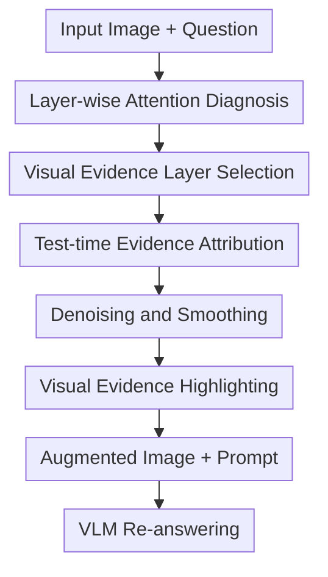

# Seeing but Not Believing: Probing the Disconnect Between Visual Attention and Answer Correctness in VLMs

**Conference**: ICLR 2026  
**OpenReview**: [https://openreview.net/forum?id=JAI7afWA9e](https://openreview.net/forum?id=JAI7afWA9e)  
**Paper**: [OpenReview](https://openreview.net/forum?id=JAI7afWA9e)  
**Code**: To be confirmed  
**Area**: Multimodal VLM Interpretability / Visual Evidence Utilization  
**Keywords**: VLM Interpretability, Visual Attention, Visual Evidence Augmentation, VQA, Test-time Intervention  

## TL;DR

This paper systematically analyzes the phenomenon of VLMs "seeing evidence but answering incorrectly" in VQA. It finds that deep-layer attention often successfully locates the correct visual evidence, but this information is not fully utilized during the generation stage. Accordingly, the authors propose Visual Evidence Augmentation (VEA), a training-free test-time visual evidence highlighting method, which consistently improves accuracy across various models including LLaVA, Qwen, Gemma, and InternVL on multiple evidence-based VQA tasks.

## Background & Motivation

**Background**: VLMs have achieved strong results in tasks such as VQA, document understanding, and scene text question answering. However, the core capability behind these tasks is not merely "seeing the image" but aligning linguistic constraints from the question with local evidence in the image and effectively using that evidence for answer generation. Many recent VLM failure cases show that even when the answer is clearly present in the image, the model may still refuse to answer, hallucinate, or provide only partially correct responses.

**Limitations of Prior Work**: Past explanations often attributed such errors to insufficient overall attention of the VLM to image tokens or a heavy reliance on language priors. However, "low image attention mass" is not equivalent to "the model not seeing the evidence." If certain internal layers of the model have already aggregated attention on the correct evidence region, then the error is no longer a failure of perception, but rather a failure of evidence transmission—where internal representations are suppressed by language priors, contextual noise, or the decoding process during final generation.

**Key Challenge**: This paper focuses on the inconsistency between visual perception and answer correctness. Deep layers of a VLM may have already formed local visual grounding but fail to translate this grounding into a credible basis for the answer. In other words, what the model "sees" internally is not "believed" by the final generation. This contradiction is more nuanced than simply comparing the total attention of text tokens versus image tokens, as it requires answering two questions: when does attention shift to the image, and does it actually serve the answer after shifting?

**Goal**: The authors decompose the problem into four diagnostic questions: First, how does the model shift attention between text and images across layers? Second, which image regions do different layers focus on? Third, does the model still look at the correct visual evidence when it answers incorrectly? Fourth, if "seeing but not believing" indeed exists, can internal evidence signals be made explicit to help the model better utilize the image?

**Key Insight**: The paper chooses layer-wise attention as the entry point because Transformer-based VLMs access both question tokens and image tokens simultaneously when generating the first answer token, providing a window to observe internal evidence allocation. Rather than looking only at the final output, the authors decompose attention by layer and use manual evidence boxes from VisualCoT to categorize visual tokens into evidence vs. non-evidence, enabling quantification of whether a layer's attention is truly aligned with the required region.

**Core Idea**: If deep-layer attention can reliably mark visual evidence, these regions can be highlighted on the input image. This makes it harder for the model to ignore the evidence it has already "seen" during a second inference pass.

## Method

### Overall Architecture

The proposed method consists of two interconnected parts: first, using attention probing to prove the disconnect between "deep visual evidence localization" and "answer correctness," and then transforming this localization capability into Visual Evidence Augmentation (VEA). VEA requires no model training or weight modification. During inference, it uses internal attention to generate an evidence mask, preserves high-evidence regions while dimming low-evidence regions, and finally prompts the VLM to answer the question based on the augmented image.

The diagnostic part answers "Did the model see it?": The authors calculate attention for text tokens, image tokens, and evidence tokens per layer, aligning them with human-annotated evidence regions. The intervention part answers "Can we make the model believe it?": The authors select layers with the strongest visual grounding capabilities, aggregate their image attention, apply sink-token denoising and Gaussian smoothing to obtain a visualization mask, and overlay this mask back onto the original image as a new input.

### Key Designs

**1. Layer-wise Attention Diagnosis: Decoupling "looking at the image" into cross-layer transition and local evidence localization**

The paper defines Relative Attention per Token (RAPT), which is the ratio of average attention per token in a specific input segment to the global average, to observe the relative focus on text vs. image tokens. RAPT avoids being misled by token counts; since image tokens are numerous, their total attention mass might be large even if the attention per individual image token is lower than that of text tokens. In models like LLaVA-1.5-7B, a stable trend is observed: shallow layers favor the question text, while deep layers gradually increase focus on image tokens, suggesting the model does not process modalities in parallel from the start but rather reads the question first before turning to the image.

Crucially, the authors map image attention back to patch space to see if it falls within manual evidence boxes. Shallow layers typically perform weak, scattered global scans, while middle-to-late layers exhibit sparse, concentrated local attention that often aligns with ground-truth evidence. This observation shifts the discussion of VLM errors from "whether the model looks at the image" to "at what layer and granularity the model sees what."

**2. Seeing but Not Believing: Proving evidence perception does not equal answer correctness via contrastive analysis**

The most valuable finding is that even when the model answers incorrectly, deep-layer attention often still focuses on the correct evidence region. By grouping samples from VisualCoT based on correctness and comparing attention on evidence vs. non-evidence tokens, results show that deep attention in incorrect answers still skews toward evidence, albeit usually with lower intensity than in correct answers. This proves that errors do not always stem from "not seeing" but rather from "failing to prioritize evidence over language priors after seeing it."

This explains several typical errors: a model might see the required text region but hallucinate due to strong language priors, or locate evidence but refuse to answer, or ground the local evidence but only use partial information. The paper terms this "seeing but not believing," emphasizing that the bottleneck involves not just the vision encoder's information capture, but also the decoder's willingness to treat visual evidence as the definitive basis for the answer.

**3. Visual Evidence Layer Selection: Profiling the best grounding layers with a small diagnostic set**

The first step of VEA is not to take arbitrary layers but to perform lightweight profiling for each model. Given a small diagnostic set from VisualCoT with evidence bounding boxes, the image is divided into $m$ patches with binary evidence labels $y_I \in \{0,1\}^m$. For layer $\ell$, the attention vector $\bar{a}^{(\ell)}_I$ for image patches is used to calculate $\mathrm{AUROC}(y_I, \bar{a}^{(\ell)}_I)$, measuring the layer's ability to rank evidence tokens above non-evidence ones. The top 10% of layers with the highest average AUROC are selected as visual-grounding layers $L_{VG}$.

This design addresses the inconsistency of grounding layer positions across different models. Selecting fixed layers (like the last layer) might introduce decoding bias or attention sinks. Profiling results show, for instance, LLaVA-1.5-7B selects layers 14, 15, 17, and 19, while Qwen2.5-VL-7B selects 18, 22, and 24. VEA thus transforms layer selection into a quantifiable choice rather than a manual assumption.

**4. Test-time Visual Evidence Augmentation: Turning internal attention into input-level highlighting**

During actual inference, VEA requires only a single-token forward pass to extract attention when generating the first answer token. For each patch $p_i$, it aggregates normalized attention from visual-grounding layers:

$$
e_i = \frac{1}{|L_{VG}|}\sum_{\ell \in L_{VG}} \bar{a}^{(\ell)}_i, \quad i=1,\ldots,m.
$$

After obtaining patch-level scores, neighborhood denoising is applied to handle isolated high-value points caused by attention sinks. If a patch score is an order of magnitude higher than all neighbors in a $3\times3$ neighborhood, i.e., $e_{i,j} > \lambda \cdot \max_{(p,q)\in N(i,j)} e_{p,q}$ (with $\lambda=10$), it is replaced by the neighborhood average. The intuition is that true evidence is usually a spatially continuous region, whereas sink tokens are typically isolated anomalies.

Following denoising, Gaussian smoothing is applied to the mask to avoid pixel-level artifacts. Finally, the smooth mask $\tilde{e}$ modulates the original pixels:

$$
\hat{I}_{i,j,c}=\bigl(\alpha+(1-\alpha)\tilde{e}_{i,j}\bigr)I_{i,j,c}.
$$

High-evidence regions remain close to the original image as $\tilde{e}_{i,j}$ is large, while low-evidence regions are dimmed to a background intensity controlled by $\alpha$. Default values are $\alpha=0.5$ and smoothing strength $\sigma=0.5$. The prompt then instructs the model to pay particular attention to the highlighted regions. The key is not creating new information but returning the model's own internal grounding signals to the input level to reduce the probability of the decoder ignoring evidence.

### Mechanism Example

Consider a TextVQA question: "What is the invoice number at the top right of the receipt?" In the first pass, the VLM reads the image and question. Shallow layers process text constraints like "invoice number," while deep layers aggregate attention on the local text region containing the number. However, if language priors are too strong, the model might output a generic number format or claim the information is missing.

VEA extracts patch attention for this local region from $L_{VG}$, removes outliers, and produces a smoothed highlight around the number. The augmented image preserves the original number region while dimming irrelevant text and backgrounds. In the second pass, the model sees the "question-relevant region" as more prominent; if the original error was due to under-utilization, this input-level emphasis pulls the answer back toward the actual visual content.

### Loss & Training

VEA is a pure test-time method with no training loss or weight updates. The only pre-requisite is the one-time profiling of $L_{VG}$ for each model using approximately 100 diagnostic samples. The inference stage consists only of single-token attention extraction, mask post-processing, image highlighting, and a second VQA generation.

Key hyperparameters include the denoising threshold $\lambda=10$, highlighting intensity $\alpha=0.5$, and smoothing strength $\sigma=0.5$. Analysis shows that excessive highlighting loses global context, while omitting smoothing creates unnatural artifacts; moderate dimming and adaptive smoothing are most robust.

## Key Experimental Results

### Main Results

VEA was evaluated on four evidence-based VQA datasets from VisualCoT: InfoVQA, DocVQA, SROIE, and TextVQA. These tasks require extracting answers from local text or visual regions. Models included LLaVA-NeXT (7B/13B), Qwen2.5-VL (7B/32B), Gemma3 (4B/27B), and InternVL3.5 (8B/14B). Metrics used were Exact Match (EM), Token F1, and evidence attribution metrics (AUROC/NDCG).

| Method | Avg Rank (EM) | Avg Rank (F1) | Mean Gain vs Base | Conclusion |
| :--- | :--- | :--- | :--- | :--- |
| BASE | 5.38 | 5.53 | 0 | Baseline models under-utilize evidence |
| INST | 5.47 | 5.28 | Close to 0 EM gain | Prompting "focus on evidence" is unstable |
| CGR | 3.09 | 3.44 | Improvements on many models | "Describe then answer" helps but depends on text quality |
| VAR | 3.44 | 3.22 | Improvements on many models | Last-layer attention is helpful but noisy |
| AGLA | 2.50 | 2.31 | Strong baseline | GradCAM + ensemble is competitive |
| VEA | **1.12** | **1.22** | **Avg EM +5.67 (max +11.1); Avg F1 +6.83 (max +17.3)** | Most stable test-time augmentation |

VEA shows particularly significant gains for smaller models. For LLaVA-NeXT-7B, average EM rose from 38.5 to 49.6, and Token F1 from 33.3 to 50.6. Large models also benefited consistently; e.g., InternVL3.5-8B EM rose from 79.3 to 83.2. This supports the idea that VEA compensates for weaker evidence utilization capabilities.

| Model / Task Example | Base | VEA | Gain | Metric |
| :--- | :--- | :--- | :--- | :--- |
| LLaVA-NeXT-7B / TextVQA | 48.44 | 75.32 | +26.88 | EM |
| LLaVA-NeXT-7B / TextVQA | 27.78 | 69.36 | +41.58 | Token F1 |
| Qwen2.5-VL-7B / TextVQA | 85.94 | 90.33 | +4.39 | EM |
| Qwen2.5-VL-7B / SROIE | 92.53 | 94.38 | +1.85 | Token F1 |
| Gemma3-4B / DocVQA | 54.34 | 63.24 | +8.90 | Token F1 |
| InternVL3.5-14B / DocVQA | 88.28 | 90.24 | +1.96 | EM |

### Ablation Study

The authors evaluated attribution quality, showing that VEA layer selection outperforms fixed layer ranges and other attribution methods in terms of AUROC and NDCG rankings.

| Attribution Method | LLaVA-7B AUROC/NDCG | Qwen-7B AUROC/NDCG | Gemma-4B AUROC/NDCG | Avg Rank | Explanation |
| :--- | :--- | :--- | :--- | :--- | :--- |
| L0%-100% | 75.9 / 47.2 | 68.5 / 41.7 | 59.5 / 35.5 | 4.33 / 4.42 | Averaging all layers dilutes evidence signals |
| L0%-50% | 68.2 / 43.2 | 59.4 / 34.2 | 56.5 / 34.3 | 5.67 / 5.67 | Shallow layers focus on text or coarse scans |
| L50%-100% | 78.0 / 54.5 | 79.5 / 58.1 | 65.9 / 43.7 | 2.88 / 2.83 | Latter half is closer to visual grounding |
| VAR | 70.8 / 45.1 | 75.2 / 54.1 | 51.2 / 33.3 | 4.92 / 4.88 | Last-layer attention is unstable |
| AGLA | 80.2 / 57.2 | 77.7 / 55.4 | 68.3 / 44.5 | 2.21 / 2.21 | Strong GradCAM baseline |
| VEA | **83.6 / 63.5** | **85.2 / 68.6** | **80.0 / 59.9** | **1.00 / 1.00** | Profiling + post-processing is best |

Component ablation shows that VEA's success comes from the combination of its parts. The most significant drop occurred when removing smoothing, indicating that visual naturalness and spatial continuity are vital for VLM comprehension.

| Configuration | Exact Match | Token F1 | Change vs Full VEA | Explanation |
| :--- | :--- | :--- | :--- | :--- |
| VEA | 73.4 | 68.1 | 0 | Full process |
| w/o Denoise | 70.9 | 64.9 | -2.52 / -3.12 | Sink tokens mislead highlighting |
| w/o Profiling | 71.0 | 65.3 | -2.42 / -2.78 | Adaptive selection is better than fixed |
| w/o Smoothing | 68.3 | 62.8 | -5.12 / -5.27 | Pixel-level masks disrupt readability |

### Key Findings

- Deep attention's evidence localization capability exists in both correct and incorrect samples; evidence attention remains higher than non-evidence attention in wrong answers, just with weaker signals.
- Simple explicit prompts (INST) to focus on evidence are insufficient and yield inconsistent gains.
- VEA's advantage stems from identifying the correct grounding layers and transforming their attention into spatially continuous, natural-looking image highlights.
- Robustness tests on TextVQA with Gaussian noise and random masking show that VEA still significantly improves LLaVA-NeXT-7B, with gains of +16.4 and +25.8 EM respectively under 60% noise and 30% masking.
- Appendix experiments on VisDial and BLINK show benefits beyond single-turn VQA, with Qwen2.5-VL-7B F1 rising from 27.5 to 47.8 on VisDial.
- On global tasks (AI2D/MMStar), VEA still offers small gains. A version that retains the original image alongside the highlighted one (VEA*) is stronger here, suggesting moderate highlighting doesn't destroy global context but a dual-input approach is safer.

## Highlights & Insights

- The paper's main contribution is refining the vague notion of "VLMs being blind." It demonstrates that models often ground correct evidence internally but fail to use it during generation, moving failure analysis from perception problems to evidence utilization problems.
- The combination of RAPT and evidence AUROC is highly effective: the former tracks modality-level attention shifts while the latter tracks patch-level grounding, avoiding over-generalized conclusions from total attention mass.
- VEA's intervention is restrained—no new modules, no external detectors, and no chain-of-thought requirements. This "self-bootstrapping grounding" is transferable to agentic pipelines like local cropping or zooming.
- The authors address attention reliability honestly. Appendix analysis of cases with AUROC < 0.5 (where attention fails) shows they account for only 1.42% to 7.34% of samples, often due to incomplete manual annotations, making the findings highly credible.

## Limitations & Future Work

- VEA requires access to internal Transformer attention, making it difficult to apply to closed-source VLMs via API. For such models, alternative signals like gradient-based saliency or delegate model outputs would be needed.
- The focus is on evidence-based VQA where labels are local. For tasks requiring global layout or complex spatial reasoning, local highlighting might be less suitable.
- Attention is not equivalent to causality. Future work could integrate activation patching or causal tracing to verify if the highlighted regions are true causal drivers of the answer.
- Profiling requires a small annotated diagnostic set. While 100 samples are stable, the cost of these annotations in specialized domains (e.g., medical, robotics) remains an evaluation factor.

## Related Work & Insights

- **vs. Tong et al. / Eyes Wide Shut**: While related work argues VLMs miss details, this paper argues the "miss" often occurs during the transition from internal grounding to final generation.
- **vs. Liu et al. / Seeing Clearly, Answering Incorrectly**: Both address seeing without answering correctly; the difference lies in this paper’s use of layer-wise attention profiling and its direct translation into a test-time intervention (VEA).
- **vs. VAR**: VAR uses binary masks from the last layer, which is prone to noise and sinks. VEA uses profiling and smoothing for more stable evidence attribution.
- **vs. RAG Context Under-utilization**: The problem parallels "retrieved but not used" in RAG. The insight is that multimodal systems can perform "visual context highlighting" to amplify critical regions rather than relying solely on the model's inherent utilization.

## Rating

- Novelty: ⭐⭐⭐⭐☆ Excellent framing of the "seeing but not believing" phenomenon and connecting interpretability to test-time intervention.
- Experimental Thoroughness: ⭐⭐⭐⭐⭐ Comprehensive coverage of four model families, eight sizes, and many datasets, including robustness and multiple modality scenarios.
- Writing Quality: ⭐⭐⭐⭐☆ Clear flow and well-organized research questions.
- Value: ⭐⭐⭐⭐⭐ Directly benefits VLM interpretability, grounding evaluation, and training-free enhancement, particularly for multimodal agent workflows.

<!-- RELATED:START -->

## Related Papers

- [\[ICLR 2026\] Learning to See Before Seeing: Demystifying LLM Visual Priors from Language Pre-training](learning_to_see_before_seeing_demystifying_llm_visual_priors_from_language_pre-t.md)
- [\[ICLR 2026\] Attention, Please! Revisiting Attentive Probing Through the Lens of Efficiency](attention_please_revisiting_attentive_probing_through_the_lens_of_efficiency.md)
- [\[ICLR 2026\] To Sink or Not to Sink: Visual Information Pathways in Large Vision-Language Models](to_sink_or_not_to_sink_visual_information_pathways_in_large_vision-language_mode.md)
- [\[ICLR 2026\] An Information-Theoretic Parameter-Free Bayesian Framework for Probing Labeled Dependency Trees from Attention Score](an_information-theoretic_parameter-free_bayesian_framework_for_probing_labeled_d.md)
- [\[ICLR 2026\] Probing Rotary Position Embeddings through Frequency Entropy](probing_rotary_position_embeddings_through_frequency_entropy.md)

<!-- RELATED:END -->
