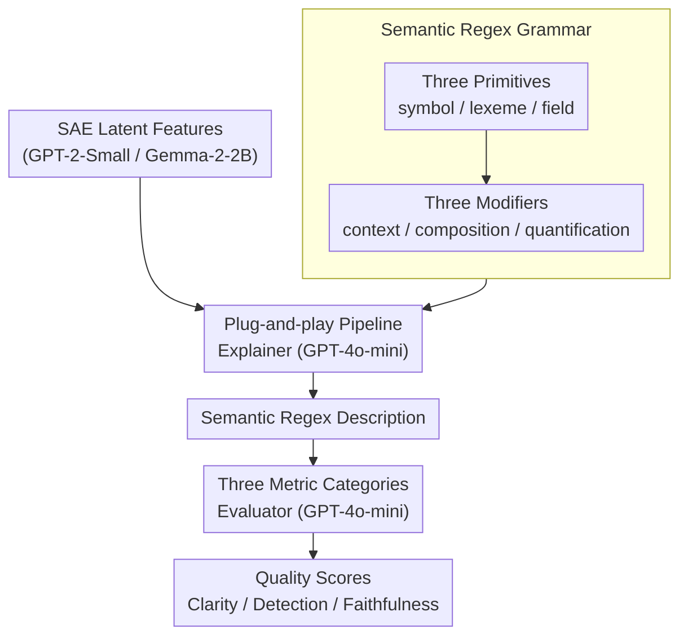

# Semantic Regexes: Auto-Interpreting LLM Features with a Structured Language

**Conference**: ICLR 2026  
**arXiv**: [2510.06378](https://arxiv.org/abs/2510.06378)  
**Code**: [apple/ml-semantic-regex](https://github.com/apple/ml-semantic-regex)  
**Area**: LLM NLP / Mechanistic Interpretability  
**Keywords**: mechanistic_interpretability, automated_interpretability, sparse_autoencoders, structured_language, feature_description  

## TL;DR

This paper proposes **Semantic Regexes**, a structured language for automated description of LLM features. By combining primitives (symbol/lexeme/field) and modifiers (context/composition/quantification), it achieves feature descriptions that are as accurate as natural language but more concise, consistent, and analyzable.

## Background & Motivation

**Background**:
- Methods like Sparse Autoencoders (SAE) can extract monosemantic features from LLMs.
- Automated interpretability uses LLMs to translate these features into human-readable descriptions.
- These descriptions help researchers understand the concepts encoded by the model and track feature circuits.

**Limitations of Prior Work** (Natural Language Descriptions):
- **Verbosity**: Descriptions are often overly wordy (e.g., "The presence of the sequence 54 indicating a year, time, or numeric reference frequently associated with events").
- **Inconsistency**: Features with the same function may receive completely different descriptions.
- **Ambiguity**: Natural language is inherently polysemous, which is detrimental to analysis tasks requiring compositional reasoning.
- **Need for Manual Relabeling**: Even in recent feature circuit work, researchers still need to manually relabel features.

**Key Insight** (Advantages of Structured Language):
- Well-defined syntax and semantics reduce ambiguity.
- Compositional rules support precise expression from simple to complex concepts.
- Consistent representation facilitates comparison and aggregation.

## Method

### Overall Architecture

This work addresses the representation problem of "feature description" in automated interpretability. While SAEs extract monosemantic features, current methods use natural language to describe them, resulting in verbosity and inconsistency. Semantic Regex replaces this step with a structured language. Using grounded theory, a set of **primitives** (handling matching granularity) and **modifiers** (handling composition) are induced from thousands of real features. This allows feature semantics to be precisely assembled like a regular expression. The system maintains the existing pipeline: SAEs extract features, an explainer reads activation data and outputs a Semantic Regex description, and an evaluator checks the description against feature behavior using various metrics.

### Key Designs

**1. Three Primitives: Capturing "What the Feature Matches" at Different Granularities**

A major issue with natural language is vague granularity. Semantic Regex explicitly splits matching granularity into three primitives, progressing from strict to loose. `[:symbol X:]` exactly matches the string X, corresponding to features activating only on specific tokens (e.g., `[:symbol color:]` matches only "color"). `[:lexeme X:]` relaxes this to syntactic variants (tenses, plurals), where `[:lexeme color:]` includes "color", "colors", and "coloring". `[:field X:]` further broadens to semantic variants within the same conceptual domain, where `[:field color:]` matches "red", "blue", and "green". Choosing a primitive explicitly answers "at what level is the feature abstracting."

**2. Three Modifiers: Precisely Composing Simple Matches into Complex Behaviors**

Primitives alone describe isolated points. Modifiers are layered on top to handle context and composition. **Context** uses `@{:context X:}(regex)` to restrict matches to a specific context; e.g., `@{:context politics:}([:symbol color:])` means "color" is only matched in political contexts. **Composition** uses sequence concatenation and the alternation operator `|` to link primitives; e.g., `[:field color:]([:symbol and:]|[:symbol or:])[:field color:]` describes two color words joined by "and/or". **Quantification** borrows the regex quantifier `?` (zero or one) for optional components.

**3. Plug-and-play Pipeline: Changing the Language, Not the Architecture**

The method is integrated into existing explainer + evaluator pipelines. The base models are GPT-2-Small and Gemma-2-2B, with features from their SAE latents. Both explainer and evaluator use GPT-4o-mini. Changes occur only at the prompt level—injecting Semantic Regex grammar rules and few-shot examples into the standard max-acts prompt. This allows any system running automated interpretability to adopt the new language with low overhead.

**4. Three Metric Categories: Cross-Validating Accuracy via Generation, Discrimination, and Causality**

To prove structured descriptions are not inferior to natural language, three categories of metrics are used. **Clarity** (Generation) measures if the description can generate high-activation examples (similar to precision). **Detection** (Discrimination) measures if the description can identify known activation examples (similar to recall). **Faithfulness** measures causal intervention—evaluating whether the description matches text continuations when the feature is steered (amplified) or ablated.

## Key Experimental Results

### Main Results: Accuracy Comparison (100 Features per Layer)

| Metric | Semantic Regex | max-acts (NL) | token-act-pair (NL) |
|------|---------------|---------------|---------------------|
| Clarity (GPT-2) | **Significantly Superior** | Baseline | Lowest |
| Detection (GPT-2) | **Significantly Superior** to tap | Parity with SR | Lowest |
| Fuzzing (GPT-2) | **Significantly Superior** to tap | Parity with SR | Lowest |
| Clarity (Gemma-16k) | Non-inferior | Baseline | Lowest |
| Clarity (Gemma-65k) | **Significantly Superior** to tap | Baseline | Lowest |

Core Conclusion: **Semantic Regex performs at least as well as natural language across all models and is significantly superior to token-act-pair on multiple metrics**, proving that structured constraints do not reduce descriptive power.

### Ablation Study: Conciseness and Consistency

| Metric | Semantic Regex | max-acts | token-act-pair |
|------|---------------|----------|----------------|
| Median Length (chars) | **41** (IQR: 19-59) | 139 (IQR: 119-166) | 55 (IQR: 46-66) |
| Identical Description Rate | **33.6%** | 0.0% | 12.2% |

- Semantic regex is **3.4x shorter** than max-acts.
- Across different samplings of the same feature, Semantic Regex produces identical descriptions 33.6% of the time (vs. 0% for max-acts).

### Key Findings

1.  **Structure $\neq$ Reduced Expressivity**: Semantic Regex matches or exceeds natural language accuracy.
2.  **3.4x Conciseness Improvement**: Significantly reduces the cognitive load of interpretation.
3.  **Consistency Gain (0% to 33.6%)**: Facilitates redundant feature detection and circuit analysis.
4.  **Readable Complexity**: The description format directly reflects the abstraction level and complexity of the feature (e.g., later layers use more `field` primitives and modifiers).
5.  **Human-Friendly**: A user study with 24 participants confirmed that Semantic Regex helps build more accurate mental models of feature decision boundaries.

## Highlights & Insights

- **Methodological Innovation**: Extends the concept of regular expressions to the semantic domain, balancing formalization and readability.
- **Grounded Theory Driven**: The language design is induced from thousands of real features rather than being constructed in a vacuum.
- **Plug-and-play**: Integration only requires modifying the prompt specification in existing pipelines.
- **Scalable Analysis**: While natural language is fine for individual features, the structured nature of Semantic Regex enables macro-analysis across models and layers.

## Limitations & Future Work

1.  **Non-unique Mapping**: A single feature may have multiple equivalent Semantic Regex descriptions; lacks a standardized style guide.
2.  **Risk of Over-conciseness**: `[:field musician:]` might incorrectly imply "guitarist" activates strongly, even if the feature only hits specific musician names.
3.  **Polysemy Issues**: Highly polysemous features result in incoherent Semantic Regexes.
4.  **LLM Constraints**: LLMs occasionally make grammatical errors when learning the language from few-shot prompts.

## Related Work & Insights

- **SAE / Transcoders (Bricken et al., 2023)**: Extracting monosemantic features.
- **Bills et al. (2023)**: Pioneering automated interpretability pipelines.
- **Ameisen et al. (2025)**: Feature circuit tracing, which often requires manual relabeling—a need reduced by more consistent auto-descriptions.
- **Insight**: Interpretability is not just about generating descriptions; the **language of the description itself** is a design space worth optimizing.

## Rating

- **Innovation**: ⭐⭐⭐⭐ — Novel combination of structured language and auto-interpretability.
- **Experimental Design**: ⭐⭐⭐⭐ — Comprehensive metrics across multiple models and a user study.
- **Practicality**: ⭐⭐⭐⭐⭐ — Plug-and-play with high-quality open-source implementation from Apple.
- **Writing Quality**: ⭐⭐⭐⭐⭐ — Clear arguments and excellent visualizations.
- **Overall Rating**: ⭐⭐⭐⭐ (4/5)

<!-- RELATED:START -->

## Related Papers

- [\[ICLR 2026\] Thought Branches: Interpreting LLM Reasoning Requires Resampling](thought_branches_interpreting_llm_reasoning_requires_resampling.md)
- [\[ACL 2026\] Style over Story: Measuring LLM Narrative Preferences via Structured Selection](../../ACL2026/interpretability/style_over_story_measuring_llm_narrative_preferences_via_structured_selection.md)
- [\[ICML 2026\] Query Lens: Interpreting Sparse Key-Value Features with Indirect Effects](../../ICML2026/interpretability/query_lens_interpreting_sparse_key-value_features_with_indirect_effects.md)
- [\[ICLR 2026\] Conjuring Semantic Similarity](conjuring_semantic_similarity.md)
- [\[ICLR 2026\] Persona Features Control Emergent Misalignment](persona_features_control_emergent_misalignment.md)

<!-- RELATED:END -->
