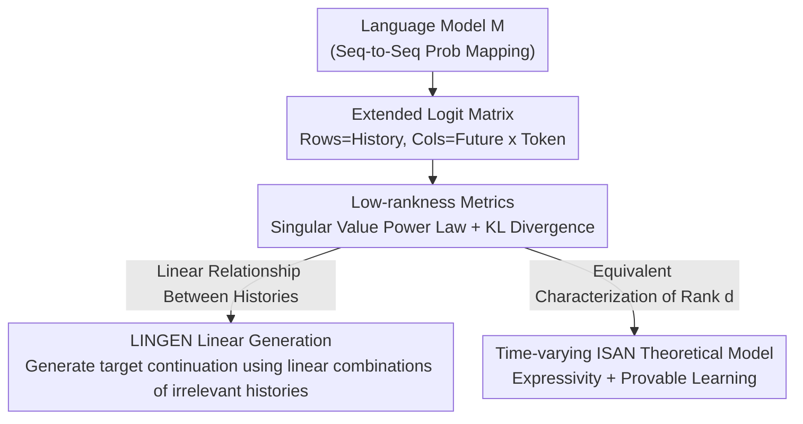

# Sequences of Logits Reveal the Low Rank Structure of Language Models

**Conference**: ICLR 2026  
**OpenReview**: [https://openreview.net/forum?id=gdZ6J5hZzF](https://openreview.net/forum?id=gdZ6J5hZzF)  
**Code**: To be confirmed  
**Area**: Interpretability / Theory of Language Models  
**Keywords**: Low-rank structure, extended logit matrix, linear representation, ISAN, model interpretability

## TL;DR
This paper proposes the "extended logit matrix" as a model-agnostic object of study. It empirically finds that the logit matrices of modern autoregressive LLMs remain approximately low-rank on long sequence scales (with a singular value power law exponent $\alpha$ slightly greater than $1/2$). Based on this, the authors design the LINGEN program, which generates target continuations using linear combinations of irrelevant or nonsense histories. Finally, a provable learning theory equivalent to this low-rankness is provided via "time-varying ISAN."

## Background & Motivation

**Background**: Understanding the intrinsic structure of language is a long-standing goal in computer science. Abstractions ranging from HMMs and finite state automata to formal grammars have attempted to model language mathematically. In the LLM era, researchers seek "simple universal abstractions" that are both mathematically tractable and capable of making testable predictions for real-world models. Existing attempts include simplified Transformers and low-depth circuits.

**Limitations of Prior Work**: Most abstractions are restricted by the model types they can represent (e.g., Transformers of a certain depth) or specific tasks (e.g., RL fine-tuning), making it difficult to precisely predict the behavior of modern LLMs. Meanwhile, the belief in an "intrinsic low-dimensional structure" of LLMs has long remained at the level of folklore, lacking a unified, measurable vehicle verifiable across architectures.

**Key Challenge**: Previous evidence for low-dimensionality primarily stems from the **softmax bottleneck**—due to the structure of the unembedding matrix, the probability of a single next token $y$ given history $h$ is proportional to $\exp(\langle\phi(h),\psi(y)\rangle)$, resulting in a low-rank single-token logit matrix. However, this only explains "the next token" and does not clarify whether the model maintains a low-dimensional structure over **longer sequences**.

**Goal**: Generalize low-dimensionality from single tokens to sequences of arbitrary length, creating a unified framework that is ① model-agnostic, ② measurable on real LLMs, and ③ capable of supporting provable guarantees.

**Key Insight**: The authors treat the language model purely as a "sequence-to-sequence probability mapping." Bypassing architectural details, they define a matrix where "histories" are rows and "future $\times$ token" pairs are columns. The question of whether $\log\Pr_M[f\mid h]$ can be written as $\langle\phi(h),\psi(f)\rangle$ is converted into whether this matrix is approximately low-rank.

**Core Idea**: Use the **approximate rank of the extended logit matrix** as a universal metric for the low-dimensional structure of language models. This can be measured in real models, utilized for generation, and is equivalent to a learnable generative model.

## Method

### Overall Architecture

The paper does not train a new model but centers on a **new research object** via a four-step loop: "Definition $\to$ Empirical Verification $\to$ Utilization $\to$ Theory." First, the language model $M$ is abstracted as a sequence probability mapping to construct the extended logit matrix $L_M(H,F)$. Second, its low-rankness is measured as $H$ and $F$ scale (using singular value decay and KL divergence). Third, the linear relationships between histories derived from low-rankness are used to design the LINGEN generation program. Finally, it is proven that "low logit rank" is equivalent to the "time-varying ISAN generative model," providing a provable learning algorithm.

### Key Designs

**1. Extended Logit Matrix: Generalizing Single-token Low-dimensionality to Long Sequences**

The softmax bottleneck only characterizes the low-dimensionality of the "next token." The authors' core insight is that this low-dimensionality persists over **longer token sequences**. They define the extended logit matrix $L_M(H,F)$, where rows are indexed by histories $H\subset\Sigma^\star$ and columns by $F\times\Sigma$ ($F$ is the set of futures, $\Sigma$ is the alphabet). For history $h$ and $(f,z)$, the matrix element is the mean-centered logit:

$$L_M(H,F)_{(h,(f,z))} = L_M[z\mid h\circ f] = \log\Pr_M[z\mid h\circ f] - \frac{1}{|\Sigma|}\sum_{z'\in\Sigma}\log\Pr_M[z'\mid h\circ f],$$

where $\circ$ denotes concatenation. Intuitively, for $F=\Sigma^{\le T}$, a single row $L_M(\{h\},F)$ contains all information needed to sample any continuation up to length $T$ from $h$. The key proposition is: $\log\Pr_M[f\mid h]\approx\langle\phi(h),\psi(f)\rangle$ is **equivalent** to the "extended logit matrix being approximately low-rank." Since the full matrix is exponentially large, sub-matrices $L_{M,k}(H,F)$ are sampled—retaining only the columns corresponding to the top-$k$ tokens for each future $f$ ($k=50$ in experiments).

**2. Dual Low-rank Metrics: Singular Value Power Law and KL Divergence**

To quantify "approximate low-rankness," two metrics are used. **Metric 1** examines singular value decay: the $i$-th singular value satisfies a power law $\sigma_i\approx C\cdot i^{-\alpha}$. Most models show $\alpha$ slightly above $1/2$. The point $\alpha=1/2$ is a **phase transition**: if $\alpha>1/2$, an $\varepsilon$-approximation exists with a constant rank $r_\varepsilon$; if $\alpha<1/2$, the rank must be linear with the dimension. Since matrix dimensions grow exponentially with sequence length, $\alpha>1/2$ implies a **constant rank** is sufficient. **Metric 2** provides a probabilistic interpretation via average KL divergence:

$$D^{\mathrm{avg}}_{\mathrm{KL}}(L,A) = \frac{1}{|H||F|}\sum_{h\in H,\,f\in F} D_{\mathrm{KL}}\big(\mathrm{softmax}(L_{h,f})\,\|\,\mathrm{softmax}(A_{h,f})\big),$$

with the bound $D^{\mathrm{avg}}_{\mathrm{KL}}(L_M(H,F),A)\le \frac{1}{|H||F|}\|L_M(H,F)-A\|_F^2$. Experiments show that the average KL divergence of rank-$r$ approximations decays according to a power law, which remains consistent even as dimensions scale or extrapolate.

**3. LINGEN: Generation via Linear Combinations of Irrelevant Histories**

A low-rank matrix has a non-trivial row kernel—there exist vectors $v\in\mathbb{R}^H$ such that $v^\top L_M(H,F)\approx 0$. These $v$ encode **linear relationships between histories**. The authors demonstrate that these relationships transfer **across future sets** and even **across models**. By randomly permuting tokens in $F$ to create "nonsense futures" $F_{\text{nonsense}}$, the principal angles between the column spaces of the respective rank-$r$ approximations are found to be near 1, suggesting linear relationships are intrinsic to the histories. LINGEN expresses a target history $h_{\text{targ}}$ as a linear combination $L_M(h_{\text{targ}},F)\approx v^\top L_M(H,F)$ and generates continuations by **only querying histories in $H$**:

$$z_t \sim \mathrm{softmax}\Big(\sum_{h\in H} v_h\cdot L_{h,t}\Big)$$

where $L_{h,t}=L_M[\cdot\mid h\circ z_{1:t-1}]$. This works in both In-distribution (Wiki) and OOD (nonsense) settings.

**4. Time-varying ISAN: Equivalence and Provable Learning**

The authors define **low logit rank**: if $\operatorname{rank}L_M(H,F)\le d$ for all $H,F$, the model has logit rank $d$. They introduce **time-varying ISAN**—a linear dynamical system with softmax non-linearity: $z_t\sim\mathrm{softmax}(B_t x_{t-1})$ and $x_t=A_{z_t,t}x_{t-1}$. Theorem 4.3: $M$ is representable as a time-varying ISAN with hidden dimension $d$ **if and only if** $\operatorname{rank}L_M(\Sigma^t,\Sigma^{\le T-t})\le d$ for all $t$. Theorem 4.4 proves that under a **logit query model**, there exists a $\mathrm{poly}(d,|\Sigma|,T,1/\epsilon)$ algorithm to learn a time-varying ISAN approximating $M$.

## Key Experimental Results

### Main Results

| Experiment | Model/Setting | Metric | Result |
|-----------|---------------|--------|--------|
| Singular Value Decay | OLMo-7b, Wiki | Power law $\alpha$ | $\alpha\approx0.536$ ($>1/2$, constant rank approx) |
| KL Approx | OLMo-7b, Rank 5–500 | Avg KL vs Rank | Power law; consistent across matrix scales |
| Training Evolution | OLMo-1b, Step 0 | $\alpha$ | $\approx0.374$ (**Not** low-rank before training) |
| LINGEN (In-dist) | OLMo-1b, 50 targets | 15-step Cumulative KL | LINGEN Total $=2.85$ |

### LINGEN vs. Baselines (Cumulative KL, lower is better)

| Method | In-distribution | OOD/Nonsense | Description |
|--------|-----------------|--------------|-------------|
| **LINGEN** | **2.85** | **4.95** | Linear combination of histories |
| Single-token Variant | 10.79 | 14.41 | Uses only empty future $L_M(H,\{\emptyset\})$ |
| Short History (Len 5)| 17.77 | 17.56 | Limited context window |
| Stage-1 Mid-ckpt | 6.46 | 6.55 | Earlier training checkpoint |

### Key Findings
- **Low-rankness is emergent**: Untrained checkpoints are not low-rank ($\alpha < 1/2$). The structure emerges rapidly during the early stages of pre-training.
- **Robustness to scale**: The power law exponent remains stable even as $H,F$ are scaled by factors of up to 16.
- **Transferability**: Linear relationships between histories persist across different future types and models, enabling LINGEN.
- **Extended vs. Single-token**: The single-token variant fails after the first token, proving that the extended logit matrix captures essential sequence information.

## Highlights & Insights
- **Measurable low-dimensional structure**: The extended logit matrix is model-agnostic, and the $\alpha=1/2$ phase transition provides a clean boundary for constant vs. linear rank.
- **Unification of empirical and theoretical**: Theorem 4.3 links empirical "low logit rank" directly to a learnable theoretical surrogate (time-varying ISAN).
- **Generation from irrelevant history**: LINGEN provides strong evidence for the existence of linear relationships in row spaces by generating coherent text from unrelated sources.

## Limitations & Future Work
- **LINGEN as Proof-of-Concept**: It currently requires querying the target history to compute coefficients $v$, making it more of a theoretical demonstration than a practical generation tool.
- **Theory-Practice Gap**: Time-varying ISAN assumes strictly low logit rank, whereas real LLMs exhibit approximate low-rankness (power law tails).
- **Security Implications**: Potential for jailbreaking/filtering bypass via linear combinations is discussed but not yet evaluated against production-grade defenses.

## Related Work & Insights
- **vs Softmax Bottleneck**: Generalizes single-token rank investigation to arbitrary sequence lengths.
- **vs Restricted Architecture Abstractions**: Unlike depth-limited Transformer theories, this framework is model-agnostic and verifiable on real-scale LLMs.
- **vs Model Stealing**: The learning algorithm for ISAN operates in a logit-query setting identical to API-based model stealing, bridging interpretability and security.

## Rating
- Novelty: ⭐⭐⭐⭐⭐ 
- Experimental Thoroughness: ⭐⭐⭐⭐ 
- Writing Quality: ⭐⭐⭐⭐⭐ 
- Value: ⭐⭐⭐⭐⭐ 

<!-- RELATED:START -->

## Related Papers

- [\[ICLR 2026\] Towards Understanding the Nature of Attention with Low-Rank Sparse Decomposition](towards_understanding_the_nature_of_attention_with_low-rank_sparse_decomposition.md)
- [\[ICLR 2026\] Escaping Low-Rank Traps: Interpretable Visual Concept Learning via Implicit Vector Quantization](escaping_low-rank_traps_interpretable_visual_concept_learning_via_implicit_vecto.md)
- [\[ICLR 2026\] Low-Pass Filtering Improves Behavioral Alignment of Vision Models](low-pass_filtering_improves_behavioral_alignment_of_vision_models.md)
- [\[ICLR 2026\] LORE: Jointly Learning the Intrinsic Dimensionality and Relative Similarity Structure from Ordinal Data](lore_jointly_learning_the_intrinsic_dimensionality_and_relative_similarity_struc.md)
- [\[ICLR 2026\] Language Models are Injective and Hence Invertible](language_models_are_injective_and_hence_invertible.md)

<!-- RELATED:END -->
