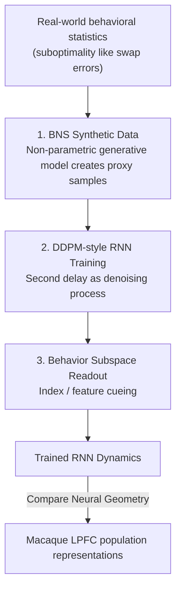

# Setting Up for Failure: Automatic Discovery of the Neural Mechanisms of Cognitive Errors

**Conference**: ICLR 2026  
**OpenReview**: [https://openreview.net/forum?id=NGThArVrD3](https://openreview.net/forum?id=NGThArVrD3)  
**Area**: Computational Neuroscience / Interpretability  
**Keywords**: Recurrent Neural Networks, Working Memory, Diffusion Models, swap error, neural mechanism discovery

## TL;DR
Instead of training RNNs to perform cognitive tasks "correctly," this paper trains them to "make human-like errors." By using a non-parametric generative model (BNS) to create synthetic behavioral data with swap errors and a diffusion model (DDPM) objective to treat the second delay period as a denoising process, the authors automatically discover neural dynamics underlying visual working memory. The resulting neural geometry aligns highly with recordings from the macaque lateral prefrontal cortex.

## Background & Motivation

**Background**: Computational neuroscience seeks to infer neural network mechanisms supporting cognition from behavioral data. The ideal approach involves implementing hypotheses as RNNs (to study dynamics), quantitatively fitting behavior (as mechanisms are often hidden in response variability rather than means), and automating the fitting process to avoid manual architectural refinement.

**Limitations of Prior Work**: Existing methods fail to satisfy all three criteria. Abstract cognitive models (drift-diffusion, Bayesian, symbolic, LLMs) fit behavior accurately but are too abstract and decoupled from RNNs to serve as dynamical hypotheses. Population coding models link behavior to neural responses but remain silent on the network dynamics behind them and rarely involve quantitative fitting or automated construction. RNN models are either handcrafted or trained for "task optimality," which reproduces "general performance" but misses fine-grained behavioral patterns; reproducing non-trivial behaviors often requires manual task-specific designs or ablations.

**Key Challenge**: There are two main obstacles to making RNNs reproduce realistic human/animal **behavior with errors**. First, RNNs are data-hungry, while behavioral data collection is extremely expensive and insufficient for training. Second, the training objectives are mismatched—task-optimal training using MSE/cross-entropy encourages unimodal, near-normal responses. Even when explicitly training for specific distributions, moment-matching or score-matching only captures a few hand-picked low-order moments, failing to scale to complex distributions.

**Goal**: To create an **automated** pipeline that allows bio-plausible RNNs to directly reproduce behavioral sub-optimality observed in experiments (especially multimodal response distributions) and discover their neural mechanisms.

**Key Insight**: The authors select the multi-item delayed estimation task in visual working memory (VWM) as a testbed. The signature error of this task is the **swap error**, where subjects erroneously recall a distractor color instead of the target color after a cue, resulting in a strongly multimodal response distribution. Existing RNNs fail to capture swap errors, while population coding models that do capture them lack circuit mechanisms, creating an ideal research gap.

**Core Idea**: Instead of optimizing task performance, "generating a behavioral response" is viewed as "sampling in Euclidean space." Thus, the denoising objective of diffusion models is borrowed to train RNNs to reproduce full (including swap errors) multimodal behavioral distributions. Data scarcity is addressed by using the BNS generative model to create proxy data.

## Method

### Overall Architecture

The entire methodology can be summarized in one sentence: **Use synthetic behavioral data + diffusion-style training to train a bio-plausible RNN into a "subject prone to swap errors," then examine whether its internal neural geometry matches the real brain.**

Specifically, a non-parametric generative model (BNS) samples synthetic behavioral samples according to set swap laws (creating a multimodal distribution of target and distractor colors). The "second delay period after the cue" is equated to the denoising step sequence of a DDPM. During this period, the RNN progressively removes noise to sample a color estimate in a two-dimensional behavioral subspace. After training, the memory representations in the behavioral null space of the network are compared with the population geometry of the macaque lateral prefrontal cortex (LPFC). The process is a unidirectional pipeline:

### Key Designs

**1. BNS Synthetic Data: Filling the data gap with non-parametric generative models**

RNNs are data-hungry, but collecting human/animal behavioral data is prohibitively expensive. This is the first hurdle for direct behavioral fitting. The solution is to use **BNS (Bayesian Non-parametric model of Swap errors)**, a descriptive generative model, to mass-produce synthetic behavioral data. BNS models the probability of swap errors as a function of the distance in feature space between the "probe feature of the distractor" and the "cued item." The closer they are, the more likely a swap occurs. As long as the generative model is sufficiently flexible, the synthetic data precisely characterizes the desired statistics and sub-optimality. The authors generated three control datasets: i) no swap errors, ii) constant swap frequency for any distractor, iii) higher swap frequency for more similar probes (consistent with experimental evidence). Only the third type—closest to real behavior—allows the RNN to develop neural geometry consistent with macaques.

**2. DDPM-style RNN Training: Treating the second delay as a denoising process to generate multimodal distributions**

Task-optimal MSE training only yields unimodal responses. The authors reframe "producing a behavioral response" as "generating a sample in $\mathbb{R}^2$" and introduce the training objective of DDPM. DDPM generates samples by learning to reverse a fixed Gaussian diffusion process $q(x_{\tau-1}\mid x_\tau)=\mathcal{N}(x_\tau;\sqrt{1-\beta_\tau}\,x_\tau,\beta_\tau I)$. The key innovation is **equating intra-trial time steps with DDPM denoising steps**: the DDPM criterion is applied only during the $T$ time steps after cue offset (the second delay) and only on the behavioral subspace output $x$, rather than the full activity vector $r$. The target distribution for each trial is a mixture of two Gaussians in $\mathbb{R}^2$, with mode means determined by stimulus colors and weights predicted by BNS. The mean of the transition kernel is projected from discretized continuous noise-free RNN dynamics into the behavioral subspace:

$$\hat{\mu}_{\theta_r}(r_t,t)=W_x\left[\left(1-\frac{dt}{\lambda}\right)r_t+\frac{dt}{\lambda}F(r_t,s_t;\theta_r)\right]$$

Since denoising only occurs in the second delay when sensory input $s_t$ is absent, information about all stimuli must reside in the behavioral null space activity $m_t$—the focus for analyzing memory representation.

**3. Behavior Subspace Readout and Two Cueing Methods: Reading estimates and predicting memory geometry**

RNNs simulate $n$ densely connected cortical pyramidal neurons with leaky continuous dynamics $\Lambda\dot{r}=-r+F(r,s,\eta;\theta_r)$. The firing rates are projected via a fixed orthogonal projection $x=G(r)=W_x r$ ($W_x\in\mathbb{R}^{2\times n}$, $W_x^\top W_x=I$) onto a 2D plane. Activity is split into two orthogonal subspaces: the **behavioral subspace** $x=W_x r$ (network output) and the **behavioral null space** $m=W_x^\perp r$ (stores memory without direct output). Two architectures were designed: **index-cued** networks use indices as cues (matching macaque tasks) to replicate biological phenomena; **feature-cued** networks encode labels via combinations of position and color, forcing the network to store conjunctive relationships and allowing for testable predictions.

### Loss & Training

The core training objective is the regularized DDPM criterion applied only to the behavioral subspace $x$ during the $T$ denoising steps post-cue offset. The training loop consists of: generating stimulus sets, selecting cued items $\to$ sampling $x^*_T$ from the target distribution via BNS and adding noise to get $x^*_{0:T-1}$ $\to$ initializing activity $\to$ running dynamics through stimulus and delay phases $\to$ applying **teacher forcing** during the second delay period and updating on the DDPM criterion until convergence.

## Key Experimental Results

### Main Results

The testbed is a two-item delayed estimation task compared with LPFC data from two macaques (Panichello & Buschman, 2021).

| Comparison | Task-optimal RNN | Ours (DDPM-style with distance-dependent swap) | Conclusion |
|-----------|------------------|-----------------------------------------------|------------|
| Response Distribution | Unimodal, no swaps | Multimodal, replicates swap rate vs. probe distance | Only ours yields multimodal swaps |
| Plane Alignment (Cosine Similarity) | No rapid alignment during cue | Sharp rise during cue, sustained in second delay | Matches macaque geometry |
| Post-hoc Swap Induction (Shrink probe distance/increase noise) | Cannot induce second mode | Swaps occur naturally due to training | Task-optimal nets require manual ablation |

### Ablation Study

| Training Data/Method | Bio-matching Neural Geometry | Description |
|----------------------|------------------------------|-------------|
| DDPM + Dist-dependent Swap | Yes | Index-cued net replicates cue-period alignment rise |
| DDPM + No Swap Target | No | Lacks rapid alignment in cue-period representation |
| DDPM + Flat Swap Rate | No | Fails to capture correct alignment pattern in feature-cued version |
| Task-optimal (MSE) | No | Fails to replicate full stimulus representation alignment |

### Key Findings

- **"Doing errors right" yields the right mechanism**: RNN memory representations match macaque LPFC only when training data includes realistic, distance-dependent swap rates. This suggests fine-grained behavioral sub-optimality carries information about neural mechanisms.
- **New Mechanism Prediction**: The authors predict that distractors physically closer to the target (more likely to swap) lead to higher pre-cue color representation alignment.
- **Misselection Geometry**: Swap errors in the network occur during the second delay (item misselection) rather than misbinding during encoding. Feature-cued networks exhibit a "double-ring" geometry in the report subspace, suggesting a toroidal structure.

## Highlights & Insights

- **Paradigm Inversion**: While the classical approach is "setting up for success" (task optimality), this paper uses "setting up for failure" by training networks to replicate full behavioral distributions (including errors), bypassing manual iterative ablation.
- **DDPM-RNN Time Alignment**: Mapping intra-trial steps to diffusion denoising steps only post-cue and only in the output subspace is a clean engineering mapping that offloads the difficulty of multimodal generation to the diffusion framework.
- **Subspace Division**: Fixed orthogonal projections separating output (denoising) and memory (retention) allow memory geometry to be compared directly with neural data without interference.

## Limitations & Future Work

- **Dependence on Generative Models**: Requires a behavioral generative model, which might not exist for all tasks; however, many paradigms already have such models.
- **Unverified Predictions**: Neural predictions like "higher pre-cue alignment $\to$ easier swap" remain inferences requiring experimental validation.
- **Single Testbed**: The primary conclusions are based on a two-item VWM task. Extension to other tasks like multi-sensory integration has been demonstrated for flexibility but not yet for mechanism generation.

## Related Work & Insights

- **vs. Task-optimal RNNs (Yang et al. 2019)**: These fail to capture multi-item behavioral patterns and multimodal swap error distributions.
- **vs. Population Coding Models (Schneegans & Bays 2017)**: These characterize swap errors but do not predict neural circuit dynamics.
- **vs. Moment-matching (Echeveste et al. 2020)**: These are limited to hand-picked moments; DDPM fits the entire continuous distribution.
- **vs. Tiny RNN Behavioral Fitting (Ji-An et al. 2025)**: While philosophy is similar, those models handle discrete choices; this work provides a principled method for continuous dimensions.

## Rating
- Novelty: ⭐⭐⭐⭐⭐ Combines "reproducing errors" with diffusion training for automated discovery.
- Experimental Thoroughness: ⭐⭐⭐⭐ Multi-angle matching with macaque data, though limited to VWM.
- Writing Quality: ⭐⭐⭐⭐ Clear motivation and mechanism description.
- Value: ⭐⭐⭐⭐⭐ Provides a scalable, verifiable methodology for inferring neural mechanisms from behavior.

<!-- RELATED:START -->

## Related Papers

- [\[ACL 2025\] Position-aware Automatic Circuit Discovery](../../ACL2025/interpretability/position-aware_automatic_circuit_discovery.md)
- [\[ICLR 2026\] Linear Mechanisms for Spatiotemporal Reasoning in Vision Language Models](linear_mechanisms_for_spatiotemporal_reasoning_in_vision_language_models.md)
- [\[ICLR 2026\] Mixture of Cognitive Reasoners: Modular Reasoning with Brain-Like Specialization](mixture_of_cognitive_reasoners_modular_reasoning_with_brain-like_specialization.md)
- [\[ICLR 2026\] Mixing Mechanisms: How Language Models Retrieve Bound Entities In-Context](mixing_mechanisms_how_language_models_retrieve_bound_entities_in-context.md)
- [\[ICLR 2026\] Provably Explaining Neural Additive Models](provably_explaining_neural_additive_models.md)

<!-- RELATED:END -->
