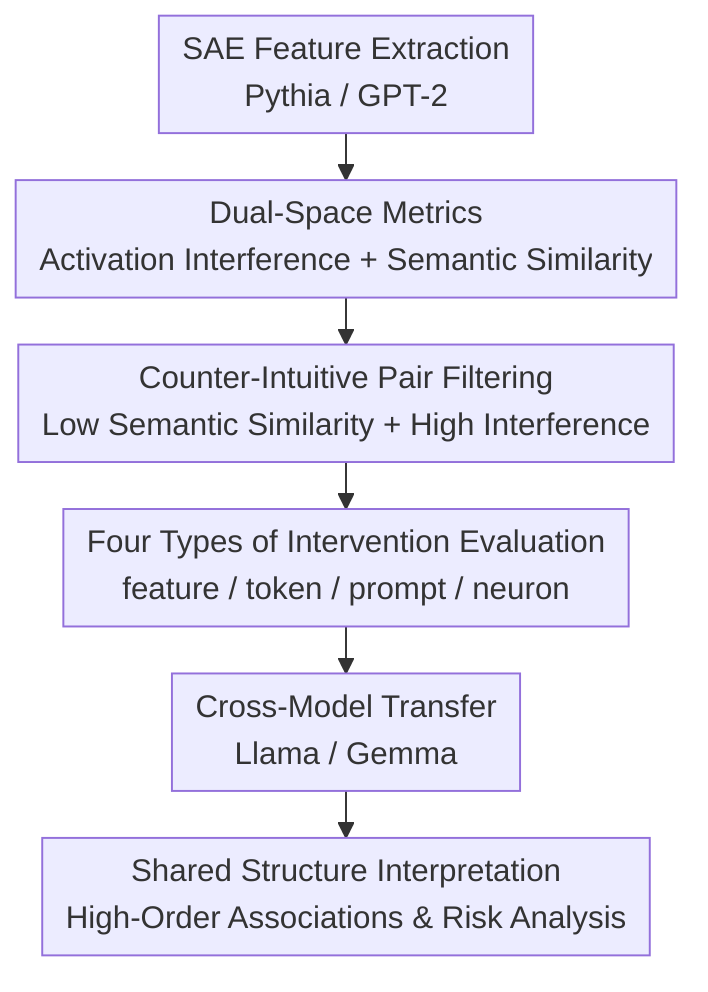

# Signal in the Noise: Polysemantic Interference Transfers and Predicts Cross-Model Influence

**Conference**: ICLR 2026  
**OpenReview**: [https://openreview.net/forum?id=tYeuz2LwVU](https://openreview.net/forum?id=tYeuz2LwVU)  
**Code**: The authors state that the code and data have been released; refer to the paper page for the repository link.  
**Area**: Interpretability / Mechanistic Interpretability  
**Keywords**: polysemantic interference, Sparse Autoencoders (SAE), representation space, model intervention, cross-model transfer  

## TL;DR
This paper maps polysemantic interference structures in small language models using SAEs, discovering that certain features—semantically unrelated but mutually interfering in activation space—can consistently alter the next-token distribution of target semantics. Furthermore, these intervention signals transfer to larger instruction-tuned models, suggesting that polysemanticity is not mere random noise but likely contains latent structures shared across models.

## Background & Motivation

**Background**: A core problem in mechanistic interpretability is that neurons and directions in language models often do not represent a "one neuron, one concept" mapping. Instead, they encode a vast number of features by superimposing them in a finite-dimensional activation space. Anthropic’s work on superposition and subsequent SAE research provides a common perspective: models use overcomplete sparse features to explain activations. A single neuron or activation direction can carry multiple semantics simultaneously, and SAEs attempt to decompose these superimposed features into more human-readable "features."

**Limitations of Prior Work**: Existing research mostly treats polysemanticity as an interpretive hurdle: it makes it difficult to declare exactly what a neuron represents and causes crosstalk during operations like feature editing, unlearning, or steering. However, this paper focuses on a less systematically studied question: if multiple semantically unrelated features share directions or neurons in the model's activation space, could this "interference" itself become a leverageable entry point for behavioral control?

**Key Challenge**: "Unrelatedness" in human semantic space does not equate to "independence" in the model's activation space. The natural language explanations of two SAE features might be nearly orthogonal (e.g., one representing geographical locations and another representing programming data types); yet, as long as they are close in a model’s decoder direction or shared neurons, manipulating one may push the model's output towards the other target semantic. In other words, the internal geometry of the model may harbor high-order associative structures that do not fully align with human intuition.

**Goal**: The authors aim to answer three questions: first, whether manipulating a feature that is semantically unrelated to the target but exhibits interference in the activation space can shift the output closer to the target; second, whether the degree of polysemanticity in a neuron predicts the behavioral change caused by its intervention; and third, whether the interference structures discovered in small models can transfer to larger black-box or semi-black-box instruction models like Llama or Gemma.

**Key Insight**: The paper selects Pythia-70M and GPT-2-Small as objects for structural measurement because Neuronpedia provides relatively complete SAEs for them. The authors first establish feature pairs that have "low semantic similarity but high activation interference" in these two small models, and then distill these pairs into four types of interventions: feature steering, token-gradient steering, prompt injection, and neuron manipulation.

**Core Idea**: Instead of viewing polysemanticity merely as interpretative noise, consider feature pairs that are "semantically unrelated but activation-interfering" as signals. These signals can both predict internal intervention effects in small models and serve as cues for behavioral influence in cross-model or even black-box scenarios.

## Method

### Overall Architecture

The method proposed is not a new model but an analytical pipeline from SAE feature topology to model behavioral intervention. It first extracts SAE features from Pythia-70M and GPT-2-Small, estimating the activation space interference $I_\ell(i,j)$ and natural language semantic similarity $S(i,j)$ between features. Subsequently, it filters for "low semantic similarity, high interference" feature pairs and measures whether model next-token distributions shift toward the target feature using various interventions. Finally, shared interference patterns between the two small models are converted into token or prompt signals to test transferability to Llama-3.1 and Gemma-2.

The key to the entire process lies in measuring two spaces simultaneously: the model's own activation space and the human symbolic manifold approximated by feature-explanation text. A signal only becomes a polysemantic interference signal of interest when a pair of features is distant in the latter but close in the former.

### Key Designs

**1. Dual-Space Metrics: Quantifying "Semantic Unrelatedness" and "Activation Interference" Separately**

The paper uses SAEs from Neuronpedia to represent the activation structure of small models. For an SAE feature $f_{i,\ell}$ at layer $\ell$, the authors project the SAE decoder back into the activation space to obtain the direction $d_{i,\ell}\in A_\ell$, then normalize it as $\hat d_{i,\ell}$. Activation interference between two features is defined as the cosine similarity of their directions: $I_\ell(i,j)=\cos(\hat d_{i,\ell},\hat d_{j,\ell})$. A higher value indicates that although the two SAE features may be interpreted as different concepts, they share similar directions inside the model.

To avoid misidentifying "inherently semantically similar" features as interference, the authors use SAE feature glosses generated by GPT-4o-mini and encode them with text-embedding-3-large to approximate the human symbolic semantic space $M$. Surface semantic similarity is defined as $S(i,j)=\cos(m_i,m_j)$. Feature pairs are selected only if $S(i,j)$ is below a threshold while $I_\ell(i,j)$ falls into high-interference intervals. The value of this approach is in decoupling "apparent correlation" from "internal coupling."

**2. Semantic Granularity Alignment: Using Clustering to Avoid False Differences from Overly Granular SAE Features**

SAE features do not always decompose at the same semantic granularity. Some neurons might be split into coarse concepts like "dog, cat, car," while others are split into specific dog breeds or affix patterns. Comparing features directly might show "unrelatedness" that is merely an artifact of inconsistent explanation granularity. To mitigate this, the authors perform agglomerative clustering on the explanation text of SAE features at each layer and repeat experiments across semantic similarity thresholds of $0.40, 0.30, 0.20, 0.15$.

**3. Four Types of Interventions: Gradual Reduction of Access Requirements**

Four intervention focal points were designed. The first is **feature-direction steering**: adding a steering vector directly along the SAE decoder direction of the interference feature. The second is **token-gradient steering**: taking the strongest activating token from the interference feature's top-activating text and calculating the gradient direction of that token relative to a specific layer's activation. The third is **prompt injection**: placing high-activation text snippets of the interference feature before the prompt without direct internal access. The fourth is **neuron intervention**: defining polysemanticity based on how many aggregated features a neuron connects to, then performing amplification or ablation.

**4. Unified Behavioral Metrics: Measuring Intervention Effect via Next-Token Distribution Shifts**

To quantify whether the output is "closer to the target feature," the authors identify a relevant token set $T_f$ for target SAE feature $f$. Given the output distributions $O$ and $\tilde O$, the primary metric is weighted cosine similarity:

$$
c(O,T_f)=\sum_{t\in V}O(t)\cdot \max_{\bar t\in T_f}\cos(E_t,E_{\bar t}).
$$

The intervention effect is expressed as the relative change $\Delta c=\frac{c(\tilde O,T_f)-c(O,T_f)}{c(O,T_f)}$. The authors also use weighted overlap $w(O,T_f)=\sum_{t\in T_f}O(t)$ as an alternative metric to capture whether probability mass specifically falls onto the target token set.

### Loss & Training

This study does not train new language models but relies on existing SAEs and models. The basic form of an SAE encodes an activation $a\in\mathbb{R}^{d_{embed}}$ into sparse high-dimensional features $f\in\mathbb{R}^{d_{sae}}$ and reconstructs it as $\bar a$: $f=Act(W_{enc}a+b_{enc})$, $\bar a=W_{dec}f+b_{dec}$. The training objective consists of reconstruction error and sparsity regularization:

$$
L=\|a-\bar a\|_2^2+\lambda\sum_i f_i\|W_{dec[:,i]}\|_2.
$$

During intervention, steering scales are chosen via a coarse search within ranges like $[-20, 20]$ to maximize the target feature metric without significantly degrading overall output coherence.

## Key Experimental Results

### Main Results

| Intervention Setting | Access Requirement | Primary Subject | Trend | Explanation |
|----------|----------|----------|----------|------|
| SAE feature-direction steering | Requires target SAE / Activation access | Pythia-70M, GPT-2-Small, Gemma-2-2B | High-interference, low-similarity features significantly increase target output; Regression coef positive ($p<0.001$) | Semantic unrelatedness does not imply activation independence. |
| Token-gradient steering | Requires gradients or internal activations | Pythia-70M, GPT-2-Small, transferred to Llama-3.1-8B | Effect approx. one order of magnitude larger than SAE feature steering | Top-activating token gradients are closer to operational behavioral directions. |
| Prompt injection | Black-box, input only | Small models + Llama-3.1-8B/70B + Gemma-2-9B | weighted cosine change moderate, but weighted overlap can increase $10\times$ to $1000\times$ | Prompt snippets concentrate probability on a few target tokens. |
| Neuron manipulation | White-box activation access | Pythia-70M, GPT-2-Small | Higher polysemanticity leads to larger semantic shifts; super-neuron amplification is particularly strong | Polysemantic hubs aggregate interference risks. |

Quantitative results for cross-model prompt injection show that certain target categories possess shared interference structures. The table below represents the success rate of pushing target type tokens into the top-30 (results for three categories showing significant generalization).

| Target Category | Model | Baseline Target Prompt | High Interference Token | Low Interference Token | Random Baseline |
|----------|------|------------|--------------|--------------|----------|
| Locations | Llama-3.1-8B-Instruct | 33.84%*** | 20.78%*** | 19.63%* | 18.24% |
| Locations | Llama-3.1-70B-Instruct | 37.23%*** | 28.21%*** | 23.09%** | 24.48% |
| Science | Llama-3.1-70B-Instruct | 67.26%*** | 48.22%*** | 43.57% | 42.24% |

### Ablation Study

| Configuration / Analysis | Key Metric | Description |
|---------------|----------|------|
| Feature-pair interference regression | Interference coef ~ $0.05$ or $0.003$ ($p<0.001$) | After controlling for semantic similarity and layer type, activation interference still predicts intervention success. |
| Token-gradient vs. feature steering | Token-gradient ~ $10\times$ stronger | Gradient directions more effectively alter output probabilities than SAE decoder directions. |
| Super-neuron manipulation | Neurons connected to >500 features | Amplification causes massive semantic shifts compared to suppression; polysemantic hubs act as semantic transit stations. |

### Key Findings

- Interference intensity is an effective predictor across multiple settings. Even when controlling for gloss similarity, high activation interference leads to stronger target semantic shifts.
- Token-gradient steering is the most powerful intervention interface.
- Prompt injection, while weaker, is the most concerning from a security perspective as it requires no internal access.
- Not all semantic categories generalize strongly. Categories like `locations`, `number`, and `science` show clearer cross-model effects than `person` or `emotion`.
- Neuron polysemanticity correlates with vulnerability. Neurons connected to more features are more likely to cause semantic shifts when manipulated.

## Highlights & Insights

- The paper's most intriguing contribution is flipping "interpretive noise" into a "predictable signal." While many SAE works seek to eliminate polysemanticity, this paper proves its interference topology can predict behavioral changes.
- The dual-space measurement design is crucial for isolating counter-intuitive pairings where human intuition fails but model activations are coupled.
- Cross-model transferability suggests different models may learn certain shared representational topologies that do not vanish with scaling or instruction tuning.
- From a security standpoint, black-box attacks do not necessarily require explicit semantic triggers; semantically unrelated snippets can influence outputs by hitting internal polysemantic interference channels.

## Limitations & Future Work

- **SAE Instability**: SAEs are the current tool of choice but are not perfect sources of truth; interference topology needs validation across more hyperparameter settings.
- **Single-Layer/Single-Feature Focus**: Real-world control might involve multi-layer or multi-feature combinations, which could yield stronger effects or unpredictable side effects.
- **Immediate Behavioral Metrics**: Shifts in next-token probability do not necessarily equate to changes in complex task behavior.
- **Inhomogeneous Transfer**: Shared polysemantic topology might only exist stably for specific semantic types or model levels.

## Related Work & Insights

- **vs. Toy Models of Superposition**: Moves from theoretical/toy model explanations of superposition to measuring actionable intervention channels in real LLMs.
- **vs. Anthropic / Neuronpedia SAEs**: Uses SAEs not just for explanation but as a basis for constructing interference topologies.
- **vs. Activation Steering / CAA**: Unlike traditional steering that uses semantically relevant directions, this uses semantically *irrelevant* but interfering directions, which is more covert.
- **vs. Jailbreak / Prompt Injection**: Suggests a mechanistic origin for why certain unrelated prompt snippets might influence the model.

## Rating

- Novelty: ⭐⭐⭐⭐⭐ 
- Experimental Thoroughness: ⭐⭐⭐⭐☆ 
- Writing Quality: ⭐⭐⭐⭐☆ 
- Value: ⭐⭐⭐⭐⭐ 

<!-- RELATED:START -->

## Related Papers

- [\[ICLR 2026\] Noise Stability of Transformer Models](noise_stability_of_transformer_models.md)
- [\[ICLR 2026\] Influence Dynamics and Stagewise Data Attribution](influence_dynamics_and_stagewise_data_attribution.md)
- [\[ICLR 2026\] Cross-Modal Redundancy and the Geometry of Vision-Language Embeddings](cross-modal_redundancy_and_the_geometry_of_vision-language_embeddings.md)
- [\[ICLR 2026\] Exploring Interpretability for Visual Prompt Tuning with Cross-layer Concepts](exploring_interpretability_for_visual_prompt_tuning_with_cross-layer_concepts.md)
- [\[ICLR 2026\] Understanding Cross-Layer Contributions to Mixture-of-Experts Routing in LLMs](understanding_cross-layer_contributions_to_mixture-of-experts_routing_in_llms.md)

<!-- RELATED:END -->
