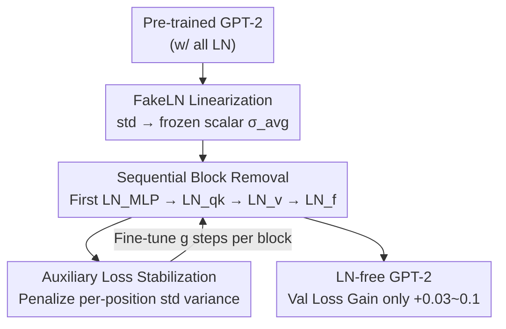

# Small Transformers Don't Need LayerNorm at Inference Time: Scaling LayerNorm Removal to GPT-2 XL and Implications for Mechanistic Interpretability

**Conference**: ICLR 2026  
**OpenReview**: [https://openreview.net/forum?id=VPtHqcafIY](https://openreview.net/forum?id=VPtHqcafIY)  
**Code**: Models released on Hugging Face (LN-free GPT-2 family)  
**Area**: Mechanistic Interpretability / Transformer Architecture Analysis  
**Keywords**: LayerNorm removal, Mechanistic Interpretability, GPT-2, Direct Logit Attribution, Confidence Neurons

## TL;DR
By layer-wise fine-tuning, all LayerNorm layers in the GPT-2 family (up to the 1.5B parameter GPT-2 XL) are replaced with pure linear transformations. The validation loss increases by only $+0.03 \sim 0.1$ cross-entropy, proving that LN is non-essential during inference. Removing LN reduces Direct Logit Attribution error from 50% to 0%, enabling precise mechanistic interpretability analysis.

## Background & Motivation
**Background**: LayerNorm (LN) is a standard component in nearly all Transformer models. Originally introduced for training stability (similar to BatchNorm in CNNs), it is defined by subtracting the mean, dividing by the standard deviation, and applying a learnable gain $\gamma$ and bias $\beta$ to the residual stream. While its role during training is well-understood, its **necessity and function during inference** remain unclear.

**Limitations of Prior Work**: Unlike BatchNorm, LN **cannot be folded into a linear transformation** during inference. While mean-centering, $\gamma$, and $\beta$ can be folded into adjacent layers (`fold_ln`), the non-linear division by the standard deviation of the residual stream must be executed in real-time. This introduces two major issues for mechanistic interpretability: (1) The output of a single component depends on the activation of the entire residual stream, preventing clean attribution; (2) LN scaling causes every component to affect nearly all downstream components, entangling interactions. Researchers often approximate LN as a constant scale ("freezing LayerNorm"), but this compromise introduces errors.

**Key Challenge**: Accurate mechanistic interpretability requires decomposing the model into independently analyzable components; however, the non-linearity of LN binds these components together. One must either tolerate approximation errors or train a toy model without LN from scratch—but the latter is only feasible for small models, while SOTA models still rely on LN for stable training.

**Goal**: Is it possible to completely remove the non-linear LN from a **pre-trained** large model while maintaining performance? If successful, this would provide surrogate models that are "highly similar internally to the original but lack LN non-linearity" specifically for interpretability research.

**Key Insight**: LN is needed for optimization stability during training, but during inference, the standard deviation of the residual stream is relatively concentrated across different tokens. Given this, could one approximate the standard deviation with a **fixed scalar** at the end of fine-tuning, replacing non-linear division with linear scaling?

**Core Idea**: Replace the per-token real-time standard deviation in LN with a frozen average standard deviation $\sigma_{\text{avg}}$, transforming every LN into a linear "FakeLN." Combined with auxiliary losses and sequential fine-tuning, the model is "weaned" from LN dependence.

## Method

### Overall Architecture
The method addresses how to remove all LNs from a pre-trained GPT-2 without causing collapse. The core involves "linearization + sequential removal + auxiliary stabilization." Each LN is first replaced by a "FakeLN," a linear block that approximates the original LN using a fixed scalar. Since removing all LNs simultaneously causes irreversible damage, they are removed block by block, followed by short fine-tuning steps to re-stabilize the loss—similar to progressive weaning. An auxiliary loss encouraging consistent standard deviation across tokens is added to absorb gradient shocks during removal.

### Key Designs

**1. FakeLN: Replacing Non-linear Division with a Frozen Scalar**

The non-linearity of LN lies entirely in the division by the per-token standard deviation. This is replaced by division by a **fixed scalar** $\sigma_{\text{avg}}$ to obtain FakeLN:

$$\text{FakeLN}(x) = \frac{x - \mu}{\sigma_{\text{avg}}} \odot \gamma + \beta$$

Here $\sigma_{b,s}$ is the standard deviation at batch index $b$ and sequence position $s$, and $\sigma_{\text{avg}} = \frac{1}{BS}\sum_{b}\sum_{s}\sigma_{b,s}$ is the mean standard deviation across all tokens in a batch. Upon replacement, this scalar is **frozen**. Mean subtraction, multiplication by $\gamma$, and addition of $\beta$ are all linear, making FakeLN a pure linear transformation foldably into adjacent weights. Since $\sigma_{\text{avg}}$ drifts during fine-tuning, it is recomputed for each batch and locked at the moment of removal; for Large and XL models, an exponential moving average is used for stable estimation. This is the foundation: turning "un-linearizable LN" into "linearizable FakeLN."

**2. Fine-grained Sequential Removal: One LN at a time along specific paths**

Replacing all LNs with FakeLN simultaneously causes irreversible collapse because components were trained assuming normalized inputs. Thus, **sequential removal** is used: remove one LN block → fine-tune for fixed steps to recover → remove the next. Crucially, LNs are categorized by path—$\text{LN}^l_{qk}$ (query/key), $\text{LN}^l_v$ (value), $\text{LN}^l_{\text{MLP}}$ (MLP input), and $\text{LN}_f$ (final pre-unembedding)—allowing for more stable, fine-grained removal. The removal order matters: $\text{LN}_{\text{MLP}}$ for all layers first, then $\text{LN}_{qk}$ and $\text{LN}_v$, and finally $\text{LN}_f$. Removing $\text{LN}_{\text{MLP}}$ before $\text{LN}_{qk}$ is more stable as sudden changes to the attention path normalization significantly impact the mechanism. The fine-tuning steps ($g_{\text{mlp}}/g_{qk}/g_v$) between removals are key hyperparameters.

**3. Auxiliary Loss: Forcing the model to flatten standard deviation variance**

Under LN, residual stream vectors are scaled by their own standard deviations. Without LN, large norm differences between positions can trigger gradient spikes. An auxiliary loss is introduced to encourage cross-token standard deviation consistency:

$$\mathcal{L}_{\text{aux}} = \lambda \cdot \mathbb{E}_{b,s}\big[(\sigma_{b,s} - \hat\sigma)^2\big], \quad \hat\sigma = \frac{1}{|M|}\sum_{(b,s)\in M}\sigma_{b,s}$$

The target $\hat\sigma$ is calculated over a subset $M$ that **deliberely excludes** the first token (position 0) and end-of-text tokens (ID 50256), which have naturally high variance in GPT-2. The loss itself is computed across all positions. Applied to $\text{LN}_f$, this acts as a global normalization anchor. This loss results in smoother fine-tuning curves and forces the model to equalize norms, notably reducing the "specialness" of the first token.

### Loss & Training
Total loss = standard language modeling cross-entropy + $\lambda \cdot \mathcal{L}_{\text{aux}}$. The process starts with standard fine-tuning followed by the sequential removal phase. OpenWebText is used, with **data requirements growing sub-linearly with model size**—a key indicator of scalability. GPT-2 Small/Medium/Large/XL were fine-tuned for 300, 500, 600, and 800 steps respectively. Success was also replicated on Pythia-70M.

## Key Experimental Results

### Main Results
Evaluated using cross-entropy on OpenWebText validation, The Pile, and The Pile-filtered. LN-free models typically lag behind original models by only $+0.03 \sim 0.1$, with accuracy on benchmarks dropping by only 1–2 percentage points.

| Model | OWT (val) | The Pile | The Pile-filtered |
|------|-----------|----------|-------------------|
| GPT-2 Small original | 3.1006 | 2.8450 | 2.7899 |
| GPT-2 Small LN-free | 3.0797 [Gain: +0.0671] | 2.8852 [Gain: +0.0402] | 2.8757 [Gain: +0.0858] |
| GPT-2 Medium original | 2.8145 | 2.5163 | 2.5390 |
| GPT-2 Medium LN-free | 2.7642 [Gain: +0.0252] | 2.6579 [Gain: +0.1416] | 2.6352 [Gain: +0.0962] |
| GPT-2 XL original | 2.5567 | 2.4436 | 2.3739 |
| GPT-2 XL LN-free | 2.5052 [Gain: +0.0253] | 130.22 ⚠️ | 2.3992 [Gain: +0.0253] |

> ⚠️ The high mean of 130.22 for GPT-2 XL LN-free on The Pile is due to extreme overconfidence on a few specific sequences unique to The Pile; the 99.9th percentile remains consistent with the original model.

### Interpretability Analysis

| Analysis | Original | LN-free | Finding |
|------|--------|---------|------|
| DLA vs DE NMAE | 49.07% | **0.00%** | DLA equals exact direct effect after LN removal |
| Attribution patching error | — | $\mu=-0.026,\sigma=0.082$ | Almost no improvement (even slightly negative) |
| Attention sink rate | 55.3% | 45.3% | Decreased but not proportionally |
| Output entropy (Medium) | 2.86 | 2.53 | LN-free is more overconfident |
| Confidence neuron ablation ΔCE | Significant | ≈0 | Completely disabled |

### Key Findings
- **Precise DLA**: In original models, Normalized Mean Absolute Error between Direct Logit Attribution and the true Direct Effect is 49% due to LN linearization approximations. In LN-free models, they are mathematically equivalent (0% error).
- **Attribution Patching Paradox**: While LN was thought to be the main source of patching error, removing it yields almost no improvement. This suggests the true error source is more **fundamental non-linearities** like Softmax and MLP activations.
- **Normalization of the first token**: The L2 norm of the first token, which is nearly an order of magnitude higher in original models (the basis for "attention sinks"), is compressed to be comparable to other positions (approx. 300–500) in LN-free models.
- **Disabling of Confidence Neurons**: Top-3 confidence neurons in GPT-2 Medium, which significantly increase CE loss when ablated in the original model, have **zero effect** in LN-free models. This confirms these "entropy neurons" rely on LN non-linearity.
- **Persistent Performance Gap**: Prolonged fine-tuning does not bridge the gap between LN-free and vanilla models, indicating LN provides a "small but persistent" benefit.

## Highlights & Insights
- **Linearizing the "Un-linearizable"**: The core insight is that LN non-linearity exists only in the standard deviation division. Frozen scalar approximation collapses LN into a linear transformation.
- **Sequential Weaning**: Fine-grained removal (qk/v/MLP/final) and empirical ordering (MLP before Attention) are engineering keys to scaling to larger models.
- **Scalability**: Sub-linear data growth for LN removal suggests feasibility for even larger models.
- **Value of Negative Results**: The discovery that removing LN does not fix attribution patching shifts focus toward Softmax and MLP activations.
- **Portability**: This "linearize + sequential fine-tune + auxiliary anchor" strategy could be applied to remove other non-linear components for interpretability.

## Limitations & Future Work
- **Training Instability**: Removing LNs can cause loss spikes or irreversible collapse, particularly gradient explosions during $\text{LN}_v$ removal.
- **Overconfidence**: LN-free models are more overconfident than originals, potentially because the model must handle larger input fluctuations without normalization.
- **Quantization**: LN-free models are less amenable to quantization, though this is less critical for interpretability research.
- **Scope**: Primarily validated on GPT-2; modern architectures require further verification.
- **Future Directions**: Parameter-efficient fine-tuning (PEFT), optimized removal schedules, and applying LN-free models to circuit-level interpretability.

## Related Work & Insights
- **vs Dynamic Tanh (DyT)**: DyT replaces normalization with $\tanh(\alpha x)$, proving LN isn't strictly necessary but introducing a different non-linearity. Ours uses **pure linear** transformations, which is better for interpretability.
- **vs Training from scratch without normalization**: Training from scratch is only feasible for tiny models. We remove LN from **pre-trained** SOTA-scale models.
- **vs "freezing LayerNorm" approximation**: Previous works approximated LN effects; we provide truly LN-free models where methods like DLA are exact rather than approximate.

## Rating
- Novelty: ⭐⭐⭐⭐ Scaling LN removal to 1.5B parameters and analyzing interpretability impact is a solid contribution.
- Experimental Thoroughness: ⭐⭐⭐⭐⭐ Comprehensive coverage across GPT-2 scales and Pythia, including detailed DLA, patching, and neuron analysis.
- Writing Quality: ⭐⭐⭐⭐ Clear logic, honest reporting of negative results.
- Value: ⭐⭐⭐⭐⭐ Provides the mechanistic interpretability community with a precise, "no-approximation-needed" testbed.

<!-- RELATED:START -->

## Related Papers

- [\[ICLR 2026\] Formal Mechanistic Interpretability: Automated Circuit Discovery with Provable Guarantees](formal_mechanistic_interpretability_automated_circuit_discovery_with_provable_gu.md)
- [\[ACL 2025\] Mechanistic Interpretability of Emotion Inference in Large Language Models](../../ACL2025/interpretability/mechanistic_interpretability_of_emotion_inference_in_large_language_models.md)
- [\[ICLR 2026\] PERSONA: Dynamic and Compositional Inference-Time Personality Control via Activation Vector Algebra](persona_dynamic_and_compositional_inference-time_personality_control_via_activat.md)
- [\[ICLR 2026\] Priors in Time: Missing Inductive Biases for Language Model Interpretability](priors_in_time_missing_inductive_biases_for_language_model_interpretability.md)
- [\[NeurIPS 2025\] nnterp: A Standardized Interface for Mechanistic Interpretability of Transformers](../../NeurIPS2025/interpretability/nnterp_a_standardized_interface_for_mechanistic_interpretability_of_transformers.md)

<!-- RELATED:END -->
